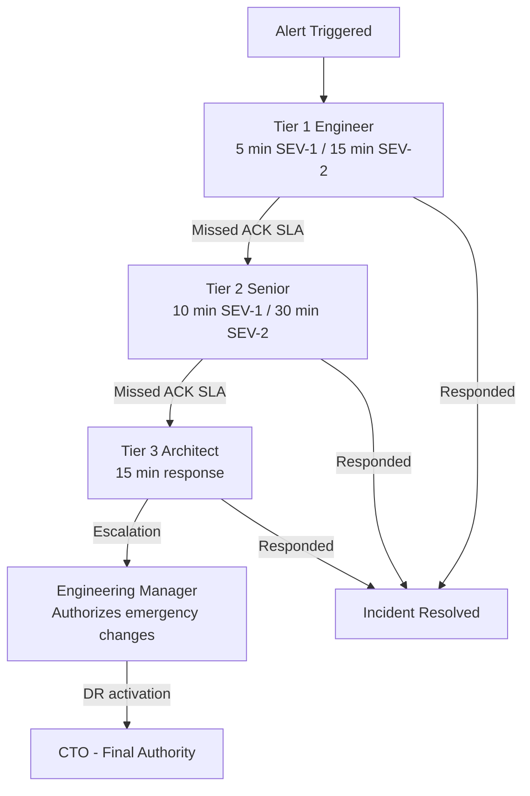
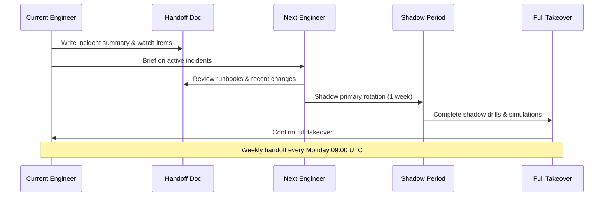

# On-Call Schedule — 24/7 Incident Coverage

> **Document:** `on-call-schedule.md` | **Version:** 1.0 | **Last Updated:** July 2026
> **Status:** Active | **Owner:** DevOps Lead | **Review Cadence:** Quarterly
> **Related:** [incident-response-playbook.md](./incident-response-playbook.md) | [incident-severity-criteria.md](./incident-severity-criteria.md) | [56-SLA-SLO.md](./56-SLA-SLO.md)

---

## 1. Purpose

The on-call schedule ensures **24/7 coverage** for production incidents across the Portfolio platform (Web, API, AI, Database). Every incident must have a human responder within the SLA timeframes defined in the severity criteria.

**Coverage scope:**
- **Web** — Next.js frontend (Vercel-hosted)
- **API** — NestJS backend (Vercel-hosted)
- **AI** — FastAPI assistant service (Railway-hosted)
- **Database** — Supabase PostgreSQL
- **Infrastructure** — Cloudflare DNS/CDN/WAF, Sentry, logging

---

## 2. Rotation Structure

### 2.1 Roles

| Role | Count | Rotation | Responsibility |
|------|-------|----------|----------------|
| **Primary on-call** | 1 person | 1 week (Mon–Mon) | First responder for all alerts. Acknowledge, triage, mitigate. |
| **Secondary on-call** | 1 person | 1 week (Mon–Mon, offset) | Backup responder. Handles alerts if primary misses SLA. Steps in during primary's out-of-office. |
| **Engineering Manager** | 1 person | Always available | Escalation point for complex incidents. Authorizes emergency changes. |
| **CTO** | 1 person | Always available | Final escalation. Authorizes disaster recovery, breach disclosure, customer communication. |

### 2.2 Escalation Ladder

```
Alert Triggered
    │
    â–¼
Primary On-Call ─── ACK within SLA ───► Triage & Respond
    │ (no response within SLA)
    â–¼
Secondary On-Call ─── ACK within 2× SLA ───► Triage & Respond
    │ (no response within 2× SLA)
    â–¼
Engineering Manager ─── Assess severity ───► Authorize escalation
    │ (if SEV-1 or ongoing data loss)
    â–¼
CTO ─── Final decision ───► DR activation, breach disclosure, customer comms
```

### 2.3 Team Composition

The on-call pool consists of 4–6 rotating engineers from the DevOps, Backend, and Infrastructure teams. Each engineer completes a shadow week before taking primary rotation.

| Engineer | Role | Primary Skills |
|----------|------|----------------|
| TBD | DevOps Lead | Full stack, infra, DB |
| TBD | Backend Engineer | API, auth, AI service |
| TBD | Platform Engineer | Vercel, Railway, Cloudflare |
| TBD | SRE | Monitoring, perf, incident management |
| TBD (shadow) | Staff Engineer | Architecture, escalations |

---

## 3. Rotation Schedule — Q3 2026

Shifts run **Monday 09:00 UTC → Monday 09:00 UTC**. Handoff occurs at shift start.

| Week | Dates | Primary | Secondary |
|------|-------|---------|-----------|
| W1 | Jun 29 – Jul 6 | TBD | TBD |
| W2 | Jul 6 – Jul 13 | TBD | TBD |
| W3 | Jul 13 – Jul 20 | TBD | TBD |
| W4 | Jul 20 – Jul 27 | TBD | TBD |
| W5 | Jul 27 – Aug 3 | TBD | TBD |
| W6 | Aug 3 – Aug 10 | TBD | TBD |
| W7 | Aug 10 – Aug 17 | TBD | TBD |
| W8 | Aug 17 – Aug 24 | TBD | TBD |
| W9 | Aug 24 – Aug 31 | TBD | TBD |
| W10 | Aug 31 – Sep 7 | TBD | TBD |
| W11 | Sep 7 – Sep 14 | TBD | TBD |
| W12 | Sep 14 – Sep 21 | TBD | TBD |
| W13 | Sep 21 – Sep 28 | TBD | TBD |

### 3.1 Holiday & Exception Calendar

| Date | Holiday | Coverage Note |
|------|---------|---------------|
| Jul 4 | US Independence Day | Secondary becomes primary for US-based engineers |
| Sep 7 | Labor Day (US) | Swap rotation if needed |

---

## 4. Responsibilities

### 4.1 Alert Response SLAs

| Severity | Acknowledge Time | First Update | Fix SLA |
|----------|-----------------|--------------|---------|
| SEV-1 (Critical) | 5 minutes | 15 minutes | 4 hours |
| SEV-2 (High) | 15 minutes | 30 minutes | 8 hours |
| SEV-3 (Medium) | 1 hour | 2 hours | 48 hours |
| SEV-4 (Low) | 4 hours | Next business day | Next sprint |

### 4.2 Primary On-Call Duties

1. **Monitor alerts** — Keep PagerDuty/Slack open during shift. Respond to all notifications within SLA.
2. **Acknowledge alerts** — Click ACK in PagerDuty or respond in Slack within the required timeframe.
3. **Triage incidents** — Follow the [incident-response-playbook.md](./incident-response-playbook.md) to classify severity, assess impact, and begin mitigation.
4. **Communicate status** — Post updates in #ops-incident at the required cadence (every 30 min for SEV-1, every 60 min for SEV-2).
5. **Document timeline** — Record all actions, timestamps, and findings in the incident channel or postmortem doc.
6. **Handoff** — At end of shift, brief the incoming on-call on active incidents, ongoing issues, and watch items.
7. **Postmortem draft** — For SEV-1 and SEV-2 incidents, draft the postmortem within 48 hours of resolution.

### 4.3 Secondary On-Call Duties

1. **Standby** — Be available to respond within 10 minutes if primary misses acknowledge SLA.
2. **Backup** — Handle alerts during primary's lunch, meetings, or known out-of-office blocks.
3. **Assist** — Join the incident channel when primary escalates or requests help.
4. **Coverage** — Take over as primary if the primary on-call becomes unavailable for an extended period.

### 4.4 Golden Rules of On-Call

- **Respond first, ask questions later.** If an alert fires, acknowledge it. You can always de-escalate.
- **Never silence an alert without investigation.** Every alert represents a real or potential issue.
- **Escalate early, escalate often.** If you're stuck for 15 minutes on a SEV-1, escalate to secondary. If 30 minutes, escalate to management.
- **Document as you go.** Write timestamps, commands run, findings, and decisions in the incident channel. Future-you (and the postmortem) will thank you.
- **Rest is not optional.** If you're fatigued, hand off. Incidents handled while exhausted create more incidents.

---

## 5. Handoff Process

### 5.1 Daily Handoff (09:00 UTC / 21:00 UTC)

A lightweight status check between outgoing and incoming on-call engineers:

**Checklist:**
- [ ] Any active incidents? Share status, timeline, and next steps.
- [ ] Any ongoing investigations? Share context and open questions.
- [ ] Any maintenance windows or planned changes during incoming shift?
- [ ] Any known issues or watch items (e.g., elevated error rate, upcoming deploy)?
- [ ] Handoff acknowledged in #ops-handoff channel.

**Handoff template (post in #ops-handoff):**
```
========== ON-CALL HANDOFF ==========
From: @primary-outgoing
To: @primary-incoming
Date: YYYY-MM-DD HH:MM UTC

Active incidents: None / [list with status]
Ongoing investigations: None / [brief]
Planned changes: None / [list]
Watch items: None / [e.g. elevated API latency since deploy v2.3.1]
======================================
```

### 5.2 Weekly Handoff (Monday 09:00 UTC)

Occurs at the beginning of the new on-call rotation. Includes everything from daily handoff plus:

- Review of previous week's incidents (count, severity, resolution times)
- Review of open action items from recent postmortems
- Refresh on any new runbooks or process changes
- Confirm contact info and escalation paths

---

## 6. Communication Channels

| Channel | Purpose | Primary/Secondary |
|---------|---------|-------------------|
| `#ops-alerts` | Automated alert notifications from monitoring tools | All alerts |
| `#ops-incident` | Active incident coordination and timeline | Per-incident thread |
| `#ops-escalation` | Escalation notifications when SLA is missed | Missed-ACK alerts |
| `#ops-handoff` | Daily and weekly handoff summaries | Shift transitions |
| `#ops-maintenance` | Scheduled maintenance announcements | Planned changes |
| Phone tree | Emergency contact for SEV-1 after-hours | Private list |

### 6.1 Phone Tree (For SEV-1 After-Hours Only)

Used when Slack alerts are not acknowledged within 5 minutes. Maintained in 1Password as "On-Call Phone Tree."

| Order | Role | Contact Method |
|-------|------|----------------|
| 1 | Primary on-call | Phone call + SMS |
| 2 | Secondary on-call | Phone call + SMS |
| 3 | Engineering Manager | Phone call |
| 4 | CTO | Phone call |

---

## 7. Tools

| Tool | Purpose | Access |
|------|---------|--------|
| **PagerDuty** | Primary alerting, on-call schedule management, escalation policies | All on-call engineers |
| **Slack** | Alert notifications, incident channels, handoff communication | All team members |
| **Sentry** | Error tracking, performance monitoring, alert rules | All engineers |
| **Better Uptime** | External health checking, status page | DevOps team |
| **Vercel Dashboard** | Deployment management, logs, analytics | All engineers |
| **Railway Dashboard** | AI service management, logs | Platform team |
| **Supabase Dashboard** | Database monitoring, query performance, backups | DevOps team |
| **Cloudflare Dashboard** | DNS, CDN, WAF, DDoS protection | DevOps team |
| **1Password** | Credential storage, phone tree, runbook secrets | All team members |

### 7.1 PagerDuty Configuration

- **Notification methods:** Push (mobile app), SMS, phone call (SEV-1 only)
- **Escalation delay:** 5 minutes (SEV-1), 15 minutes (SEV-2)
- **Auto-escalate:** After 1 missed ACK, route to secondary; after 2 missed, route to EM
- **Schedule export:** Calendar feed available for personal calendar integration

---

## 8. After-Hours Protocol

### 8.1 Sleep Mode

- **Allowed:** 23:00 – 07:00 local time (on-call engineer's timezone)
- **During sleep mode:** Only SEV-1 incidents require acknowledgment. SEV-2/3/4 can wait until morning.
- **Mechanism:** PagerDuty quiet hours configuration. Calls only for SEV-1; all other alerts delayed until 07:00.
- **Override:** If the engineer is actively working an incident past 23:00, sleep mode begins after the incident is resolved or handed off.

### 8.2 Compensation

- Time off equal to time spent on after-hours incidents (rounded up to nearest hour).
- Any after-hours incident that exceeds 2 hours of work = automatic half-day comp day.
- Overnight SEV-1 that keeps engineer awake for 3+ hours = full comp day.
- Comp days must be taken within 30 days. No payout — use it or lose it.

### 8.3 Out-of-Office Coverage

If the primary on-call has planned PTO:
1. Notify the DevOps Lead at least 1 week in advance.
2. The secondary on-call becomes primary for that week.
3. A volunteer from the pool becomes secondary.
4. If no volunteer, the DevOps Lead covers secondary.

---

## 9. Training & Readiness

### 9.1 On-Call Shadow Week

Every engineer must complete a shadow rotation before taking primary on-call:

| Day | Activity |
|-----|----------|
| Mon | Platform walkthrough: dashboards, tools, access |
| Tue | Runbook review: service restart, database failover, rollback |
| Wed | Simulated incident: guided SEV-2 drill with mentor |
| Thu | Real incident shadow: observe primary, assist with triage |
| Fri | Simulated incident: independent SEV-3 drill, reviewed by mentor |

### 9.2 Simulation Drills

Quarterly tabletop exercises covering failure scenarios:

| Drill | Scenario | Frequency |
|-------|----------|-----------|
| DB Failover | Primary database unreachable, promote standby | Quarterly |
| Auth Outage | OAuth provider down, fallback to backup IdP | Quarterly |
| AI Service Down | OpenAI API returning 5xx, degrade gracefully | Semi-annual |
| Full DR | Complete region failure, activate DR plan | Annual |
| Security Breach | Unauthorized access detected, containment drill | Semi-annual |

### 9.3 Runbook Review

- New runbooks are reviewed in the weekly on-call handoff.
- Existing runbooks are exercised during simulation drills.
- Outdated runbooks are flagged for update as postmortem action items.

---

## 10. Continuous Improvement

### 10.1 On-Call Retrospective

After each rotation, the outgoing primary completes a brief survey:

1. How many incidents did you handle? (SEV-1 / SEV-2 / SEV-3 / SEV-4)
2. Average time to ACK? Average time to resolve?
3. Were any runbooks missing or incorrect? Which ones?
4. Was there any alert fatigue? Which alerts fired unnecessarily?
5. One thing to improve about the on-call experience.

### 10.2 Quarterly Review

The DevOps Lead reviews on-call metrics quarterly:
- Average time to acknowledge (by severity)
- Average time to resolve (by severity)
- Missed SLA incidents
- Alert volume trends
- PagerDuty fatigue score
- Action item closure rate

---

*Document Version: 1.0 — On-Call Schedule*
*Last Updated: July 2026*
*Next Review Date: October 2026*

---

## Diagrams

### Escalation Tree



### Rotation Handoff



## Cross-References
- [MASTER-INDEX.md](../MASTER-INDEX.md) — Documentation master index
- [CROSS-REFERENCE-INDEX.md](../26-reference/CROSS-REFERENCE-INDEX.md) — Cross-reference system

