# Release Readiness Checklist

## 1. Code Freeze & Quality Checks
- [ ] All code changes merged into `main` branch.
- [ ] No P0 (Blocker) or P1 (Critical) bugs open.
- [ ] All automated tests passed in CI (Unit, Integration, E2E).
- [ ] Test coverage meets the 80% threshold across Web, API, and AI modules.
- [ ] Code formatting and linting (`npm run format`, `npm run lint`, `npm run typecheck`) pass cleanly.

## 2. Database & Infrastructure
- [ ] Prisma migrations successfully tested and applied to the staging database (`npm run prisma:migrate:deploy`).
- [ ] Supabase Row-Level Security (RLS) policies reviewed and validated.
- [ ] Vector database (pgvector) indexes optimized and verified.
- [ ] Environment variables configured correctly in Production (Vercel, Cloud Run, Supabase).

## 3. Security & Compliance
- [ ] No high or critical vulnerabilities found in Snyk / npm audit.
- [ ] Secrets scanned; no credentials hardcoded in the codebase.
- [ ] Rate limits and CORS policies verified for the production domain.
- [ ] API keys for third-party services (OpenAI, LangChain, Analytics) are valid and have spending limits set.

## 4. Performance & Accessibility
- [ ] Lighthouse score > 90 for Performance, Accessibility, Best Practices, and SEO on critical public pages.
- [ ] React Three Fiber 3D scenes audited for memory leaks and frame drops.
- [ ] Manual accessibility spot-check completed (keyboard navigation, VoiceOver/NVDA).

## 5. Final Smoke Test (Staging/Production)
- [ ] Verify frontend deployment (Vercel).
- [ ] Verify API deployment (NestJS on Cloud Run or similar). Swagger UI available if enabled.
- [ ] Verify AI Service deployment (FastAPI).
- [ ] Perform manual end-to-end user journey:
  - Load portfolio landing page (verify 3D scene).
  - Interact with AI chatbot (verify streaming response and RAG accuracy).
  - Login to Admin dashboard.
  - Create and publish a test project.

## 6. Post-Release
- [ ] Monitor Sentry for new error spikes.
- [ ] Monitor Vercel Analytics for Core Web Vitals drops.
- [ ] Announce release to stakeholders.

---

## Diagram

### Release Checklist Workflow

```mermaid
flowchart TD
    Pre[Pre-release Checks] --> Deploy
    subgraph Pre[Pre-release Checks]
        P1[Code freeze & merged]
        P2[Tests passing]
        P3[Security audit clean]
        P4[Lighthouse > 90]
    end

    Pre --> Deploy[Deploy to Production]
    Deploy --> Post[Post-deploy Checks]
    
    subgraph Post[Post-deploy Checks]
        D1[Frontend loads]
        D2[API responds]
        D3[AI service up]
        D4[E2E smoke test]
    end

    Post --> Monitor[Monitor Window<br/>30 min]
    Monitor --> Gate{Anomalies?}

    Gate -->|No| SignOff[✅ Sign-off]
    Gate -->|Yes| Rollback[🔄 Rollback]
    Rollback --> Postmortem[Post-mortem]
    SignOff --> Announce[📢 Announce to stakeholders]
```

## Cross-References
- [MASTER-INDEX.md](../MASTER-INDEX.md) — Documentation master index
- [CROSS-REFERENCE-INDEX.md](../26-reference/CROSS-REFERENCE-INDEX.md) — Cross-reference system

