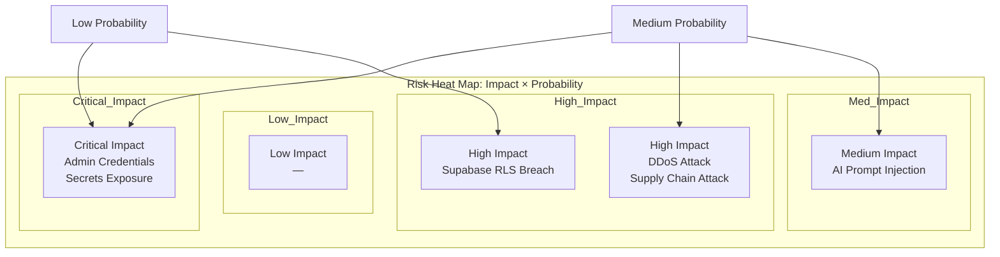

# Enterprise Risk Register — FAANG Security & Operations

> **Document:** `RiskRegister.md` | **Version:** 5.0 (Enterprise Upgrade) | **Last Updated:** July 2026  
> **Status:** ✅ Active | **Owner:** Principal Security Architect | **Review Cadence:** Monthly  
> **Classification:** Enterprise Security

## 1. Executive Summary

The Enterprise Risk Register is a living document used to identify, evaluate, and track potential security and operational risks for the Ultimate Portfolio project. Risks are strictly evaluated based on FAANG threat-modeling matrices, resulting in automated alerting and mandated mitigation paths.

## 2. Risk Matrix Reference

| Likelihood \ Impact | Low (1) | Medium (2) | High (3) | Critical (4) |
| ------------------- | ------- | ---------- | -------- | ------------ |
| **High (3)**        | Medium  | High       | Critical | Critical     |
| **Medium (2)**      | Low     | Medium     | High     | Critical     |
| **Low (1)**         | Low     | Low        | Medium   | High         |

## 3. Registered Risks

### SEC-RSK-001: Compromise of Admin Credentials

- **Description:** An attacker gains access to the Admin dashboard through phishing, brute force, or credential reuse.
- **Likelihood:** Medium
- **Impact:** Critical (Full control over portfolio content and configurations)
- **Risk Level:** **Critical**
- **Mitigation Strategy:** Enforce strong password policies, mandate Multi-Factor Authentication (MFA), and implement aggressive rate limiting on login endpoints.
- **Owner:** Identity & Access Management Lead
- **Status:** Active / Monitored

### SEC-RSK-002: AI Prompt Injection

- **Description:** Malicious users exploit the interactive AI chatbot to leak system instructions, hallucinatory responses, or attempt to extract non-public data.
- **Likelihood:** High
- **Impact:** Medium (Reputational damage, mostly isolated to the chat interface)
- **Risk Level:** **High**
- **Mitigation Strategy:** Implement LangChain moderation, strict prompt templates, and input sanitization. Regularly review chat logs for anomalous patterns.
- **Owner:** AI Engineering Team
- **Status:** Mitigated / Ongoing Tuning

### SEC-RSK-003: Exposure of Environment Variables / Secrets

- **Description:** API keys (Supabase, OpenAI, AWS) are accidentally committed to version control or leaked through application errors.
- **Likelihood:** Low
- **Impact:** Critical (Full system compromise, significant financial cost)
- **Risk Level:** **High**
- **Mitigation Strategy:** Use automated pre-commit hooks (e.g., git-secrets, Talisman) to block secrets. Use a centralized Secrets Manager. Rotate keys periodically.
- **Owner:** DevOps / DevSecOps
- **Status:** Mitigated

### SEC-RSK-004: Volumetric DDoS Attack

- **Description:** The Next.js frontend or NestJS API is targeted by a Distributed Denial of Service attack, rendering the portfolio inaccessible.
- **Likelihood:** Medium
- **Impact:** High (Loss of availability)
- **Risk Level:** **High**
- **Mitigation Strategy:** Leverage CDN (Vercel/Cloudflare) caching and WAF. Implement API rate limiting and configure infrastructure auto-scaling.
- **Owner:** Infrastructure Team
- **Status:** Active

### SEC-RSK-005: Supabase Data Breach via Misconfigured RLS

- **Description:** Row Level Security (RLS) policies in PostgreSQL are misconfigured, allowing public users to read draft posts or admin data.
- **Likelihood:** Low
- **Impact:** High (Confidentiality breach)
- **Risk Level:** **Medium**
- **Mitigation Strategy:** Implement infrastructure-as-code for DB schemas. Mandate peer review for all Prisma schema and SQL policy changes. Write integration tests specifically asserting RLS constraints.
- **Owner:** Backend Engineering / DBA
- **Status:** Active

### SEC-RSK-006: Supply Chain Attack via NPM Dependencies

- **Description:** A compromised third-party NPM package (frontend or backend) executes malicious code during build or runtime.
- **Likelihood:** Medium
- **Impact:** High
- **Risk Level:** **High**
- **Mitigation Strategy:** Use `npm audit`, Dependabot, and lockfiles. Pin dependency versions. Avoid using obscure or unmaintained packages.
- **Owner:** Lead Developer
- **Status:** Monitored

## 4. Review Cycle

This Risk Register must be reviewed and updated quarterly, or immediately following any significant architectural change or security incident.

---

## Diagram

### Risk Heat Map

## Cross-References

- [MASTER-INDEX.md](../MASTER-INDEX.md) � Documentation master index
- [CROSS-REFERENCE-INDEX.md](../26-reference/CROSS-REFERENCE-INDEX.md) � Cross-reference system
