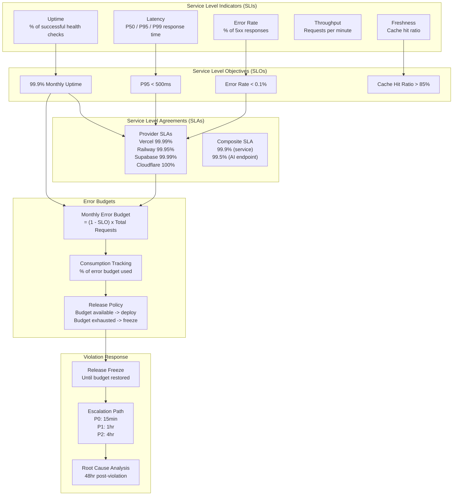
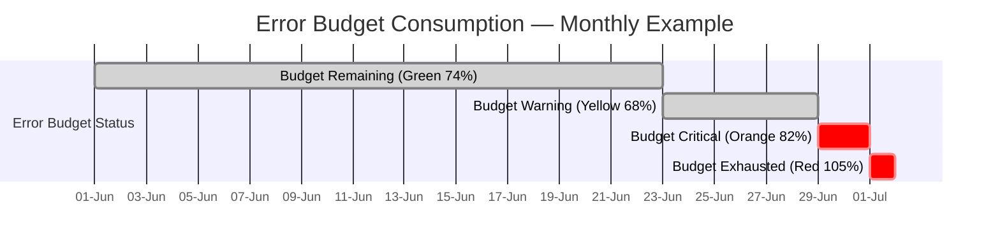
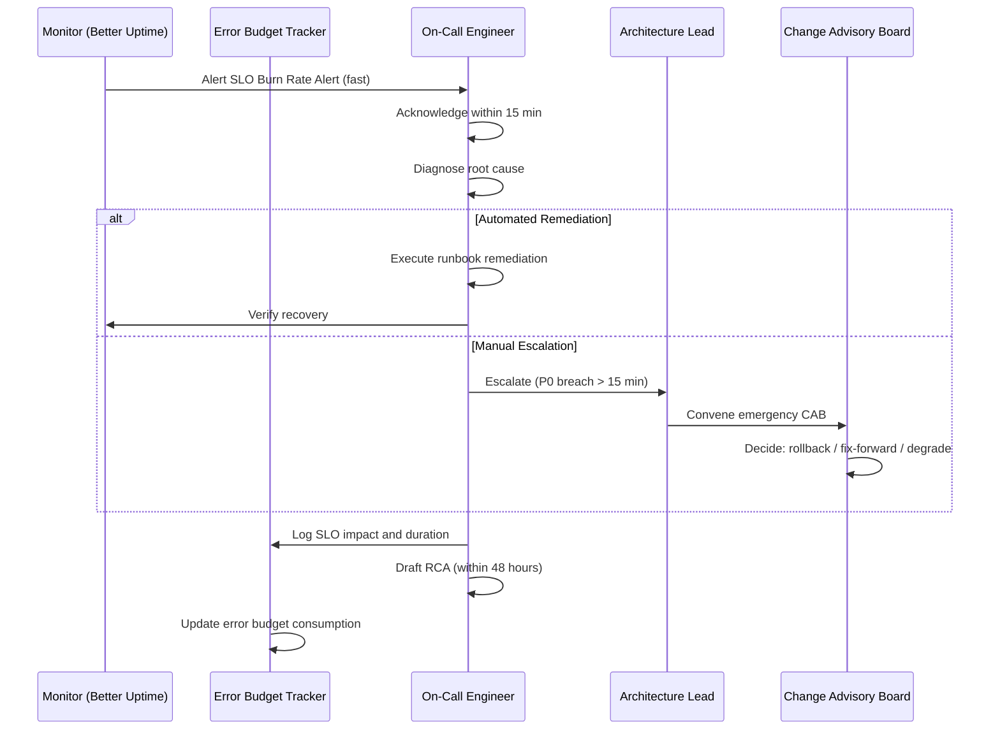

# Service Level Agreement, Objectives & Indicators — Enterprise SRE Framework

> **Document:** `56-SLA-SLO.md` | **Version:** 1.0 | **Last Updated:** June 2026  
> **Status:** ✅ Active | **Owner:** Architecture Lead | **Review Cadence:** Quarterly  
> **Related:** [21-MONITORING.md](./21-MONITORING.md) | [22-OBSERVABILITY.md](./22-OBSERVABILITY.md) | [DeploymentGuide.md](./DeploymentGuide.md) | [54-INFRASTRUCTURE.md](./54-INFRASTRUCTURE.md)

---

## Executive Summary

Defines service level agreements and objectives - uptime targets (99.5%), response time SLAs, error budgets, measurement methodology, reporting cadence, and penalty structures.

---

## Table of Contents

1. [Executive Summary](#1-executive-summary)
2. [Service Level Indicators (SLIs)](#2-service-level-indicators-slis)
3. [Service Level Objectives (SLOs)](#3-service-level-objectives-slos)
4. [Service Level Agreements (SLAs)](#4-service-level-agreements-slas)
5. [Error Budgets](#5-error-budgets)
6. [Monitoring & Measurement](#6-monitoring--measurement)
7. [Reporting Cadence](#7-reporting-cadence)
8. [SLO Violation Response](#8-slo-violation-response)
9. [Enterprise Standards Alignment](#9-enterprise-standards-alignment)
10. [Change Log](#10-change-log)

---

## 1. Executive Summary

This document defines the **Service Level Agreement (SLA)**, **Service Level Objectives (SLOs)**, and **Service Level Indicators (SLIs)** for the portfolio platform. The framework covers all 5 service domains — Frontend (Next.js/Vercel), API (NestJS/Vercel), AI (FastAPI/Railway), Database (PostgreSQL/Supabase), and Edge Network (Cloudflare) — with a target composite availability of **99.9%** and error budgets that inform release velocity.

The SLO hierarchy follows an **SLI → SLO → SLA → Error Budget → Violation Response** cascade, where each layer feeds the next. Monthly SLO reviews drive continuous reliability improvements.

### 1.1 SLO Hierarchy



---

## 2. Service Level Indicators (SLIs)

### 2.1 SLI Definitions per Service

All metrics collected at 60-second granularity, aggregated over a 30-day rolling window.

| SLI Category | Definition | Collection Method | Aggregation |
|-------------|------------|-------------------|-------------|
| **Uptime** | % successful health check probes | Better Uptime (1-min intervals) | Monthly avg |
| **P50/P95/P99 Latency** | Percentile response times | Sentry Performance / Vercel Analytics | 30-day rolling |
| **Error Rate** | % of 5xx responses | Sentry Error Tracking | 30-day rolling |
| **Throughput** | Requests per minute | Vercel Analytics / Railway Metrics | 15-min avg |
| **Cache Hit Ratio** | % served from cache | Cloudflare / Vercel Analytics | 30-day rolling |

### 2.2 Per-Service SLI Baselines

| Service | Uptime | P50 Latency | P95 Latency | P99 Latency | Error Rate | Throughput |
|---------|--------|-------------|-------------|-------------|------------|------------|
| **Frontend (Next.js)** | 99.95% | < 50ms | < 200ms | < 500ms | < 0.05% | 500 RPM |
| **API (NestJS)** | 99.95% | < 80ms | < 300ms | < 800ms | < 0.1% | 300 RPM |
| **AI (FastAPI)** | 99.8% | < 500ms | < 2000ms | < 5000ms | < 0.5% | 50 RPM |
| **Database (PostgreSQL)** | 99.99% | < 5ms | < 20ms | < 50ms | < 0.01% | 1000 QPM |
| **DNS + CDN (Cloudflare)** | 100% | < 10ms | < 30ms | < 100ms | < 0.001% | 2000 RPM |


---

## 3. Service Level Objectives (SLOs)

### 3.1 Service SLO Targets

SLOs are internal targets set more aggressively than provider SLAs to provide a safety margin. All SLOs are measured on a **30-day rolling window**.

| Service | Uptime SLO | Latency P95 SLO | Error Rate SLO | Cache Hit SLO | Composite SLO |
|---------|-----------|-----------------|----------------|---------------|---------------|
| **Frontend (Next.js)** | 99.95% | < 200ms | < 0.05% | > 90% | 99.9% |
| **API (NestJS)** | 99.95% | < 300ms | < 0.1% | N/A (dynamic) | 99.9% |
| **AI (FastAPI)** | 99.5% | < 2000ms | < 0.5% | N/A (real-time) | 99.0% |
| **Database (PostgreSQL)** | 99.99% | < 20ms | < 0.01% | N/A | 99.95% |
| **Edge (Cloudflare)** | 99.999% | < 30ms | < 0.001% | > 95% | 99.99% |

### 3.2 Composite SLO Calculation

```
Composite = 1 - Sigma(weight_i x (1 - SLO_i))
Weights: Frontend 0.25, API 0.25, Database 0.25, AI 0.15, Edge 0.10

= 1 - (0.25x0.0005 + 0.25x0.0005 + 0.25x0.0001 + 0.15x0.005 + 0.10x0.00001)
= 1 - 0.001026 = 99.897% ~= 99.9%
```

### 3.3 SLO Tier Classification

| Tier | SLO Range | Services | Engineering Response | Monitoring Level |
|------|-----------|----------|---------------------|-----------------|
| **Critical** | >= 99.99% | Database, Edge | P0 on-call, 15-min response | 1-min probes, Telegram + SMS |
| **High** | >= 99.9% | Frontend, API | P1 on-call, 30-min response | 1-min probes, Telegram |
| **Standard** | >= 99.5% | AI Service | P2 business hours, 2-hr response | 5-min probes, Telegram |
| **Best Effort** | < 99.5% | Non-critical integrations | P3 next business day | 15-min probes, email |

---

## 4. Service Level Agreements (SLAs)

### 4.1 Provider SLAs

The following are the **external SLAs** provided by our infrastructure vendors.

| Provider | SLA Commitment | Financial Remedy | Measurement |
|----------|---------------|-----------------|-------------|
| **Vercel** | 99.99% uptime (Pro plan) | 5% credit per 30 min below, max 100% | Monthly uptime % |
| **Railway** | 99.95% uptime (Starter plan) | Service credits per incident | Monthly uptime % |
| **Supabase** | 99.99% uptime (Pro plan) | 5% credit per hour below (max 100%) | Monthly uptime % |
| **Cloudflare** | 100% uptime (Enterprise) | N/A (free plan - best effort SLA) | Monthly uptime % |
| **OpenAI / Anthropic** | 99.9% API uptime | No SLA (best effort) | API error rates |

### 4.2 Composite End-to-End SLA

The composite SLA accounts for the dependency chain between services.

| User Journey | Path | Composite SLA | Effective Uptime |
|-------------|------|---------------|-----------------|
| **Page Load** | CF > Vercel FE > Vercel API > Supabase | 99.97% | ~43 min/mo downtime |
| **AI Chat** | CF > Vercel FE > Railway AI > OpenAI | 99.85% | ~108 min/mo downtime |
| **Form Submit** | CF > Vercel API > Supabase | 99.97% | ~13 min/mo downtime |
| **Asset Load** | CF CDN (cached) | 100% (estimated) | ~0 min/mo downtime |

### 4.3 Promised SLA to End Users

| Metric | Promised SLA | Measurement | Remedy |
|--------|-------------|-------------|--------|
| **Website Availability** | 99.9% monthly | Better Uptime global checks | Report via status page |
| **API Availability** | 99.9% monthly | Health endpoint monitoring | Service credits on request |
| **Support Response Time** | P0 < 1hr, P1 < 4hr | Ticket system SLA | N/A (best effort) |
| **Data Durability** | 99.999% monthly | Backup validation | Restore guarantee |

---

## 5. Error Budgets

### 5.1 Error Budget Calculation

Error budget = (1 - SLO) x Total eligible requests per month. The budget represents the maximum allowable "unreliable" time or errors.

| Service | SLO | Total Monthly Requests | Error Budget (failures) | Error Budget (time) |
|---------|-----|----------------------|------------------------|---------------------|
| **Frontend** | 99.95% | ~12,960,000 (300 RPM avg) | 6,480 requests | 21.6 min |
| **API** | 99.95% | ~12,960,000 (300 RPM avg) | 6,480 requests | 21.6 min |
| **AI** | 99.5% | ~2,160,000 (50 RPM avg) | 10,800 requests | 216 min |
| **Database** | 99.99% | ~43,200,000 (1K QPM avg) | 4,320 queries | 4.32 min |
| **Edge** | 99.999% | ~86,400,000 (2K RPM avg) | 864 requests | 0.43 min |

### 5.2 Error Budget Consumption Policy

| Consumption Level | Action | Gate |
|-------------------|--------|------|
| **< 50%** (Green) | Normal deployments, all features | Standard PR + CI gates |
| **50-80%** (Yellow) | Slow down: no feature releases, bug fixes + patches only | DevOps Lead approval |
| **80-100%** (Orange) | Release freeze: hotfixes only, all deploys require CAB | CAB + Architecture Lead |
| **> 100%** (Red) | Mandatory incident response: rollback unstable services, RCA in progress | Emergency CAB only |

### 5.3 Monthly Error Budget Example



### 5.4 Error Budget Adjustments

| Scenario | Adjustment | Rationale |
|----------|-----------|-----------|
| **Major feature launch** | +20% budget for launch week | Expected instability from traffic spike |
| **Infrastructure migration** | +50% budget for migration period | Expected transition errors |
| **Known provider outage** | Budget exempted (time excluded) | External dependency not in our control |
| **Planned maintenance** | Budget excluded (window declared) | Pre-notified downtime not counted |

---

## 6. Monitoring & Measurement

### 6.1 SLI Collection by Service

| Service | Uptime Monitoring | Latency Monitoring | Error Monitoring | Tooling |
|---------|------------------|-------------------|-----------------|---------|
| **Frontend (Next.js)** | Better Uptime (1-min) | Vercel Analytics, Sentry | Sentry Error Tracking | Better Uptime + Sentry |
| **API (NestJS)** | Better Uptime (1-min) | Sentry Performance | Sentry Error Tracking | Sentry + NestJS Logger |
| **AI (FastAPI)** | Better Uptime (5-min) | Custom middleware timing | Sentry + Logfire | Logfire + Sentry |
| **Database (Supabase)** | Supabase Dashboard | pg_stat_activity monitoring | Supabase error logs | Supabase Observability |
| **Edge (Cloudflare)** | Cloudflare Analytics | Cloudflare Analytics | Cloudflare WAF logs | Cloudflare Dashboard |

### 6.2 Measurement Methodology

| SLI | Tool | Collection Method | Frequency |
|-----|------|-------------------|-----------|
| **Uptime** | Better Uptime | COUNT(successful_pings) / COUNT(total_pings) | 1-min |
| **P50/P95/P99** | Sentry | PERCENTILE_CONT(n) WITHIN GROUP(ORDER BY duration) | Per-request |
| **Error Rate** | Sentry | COUNT(5xx) / COUNT(total_requests) x 100 | Per-request |
| **Throughput** | Vercel Analytics | COUNT(requests) / time_window | 1-min |
| **Cache Hit Ratio** | Cloudflare | (cache_hits / total_requests) x 100 | Daily |

### 6.3 Alerting Thresholds

| Alert | Condition | Severity | Channel | Response Time |
|-------|-----------|----------|---------|--------------|
| **Service Down** | 3 consecutive failed health checks | P0 | Telegram + SMS | 15 min |
| **SLO Burn Rate (fast)** | 10% budget consumed in 1 hour | P0 | Telegram | 15 min |
| **SLO Burn Rate (medium)** | 25% budget consumed in 6 hours | P1 | Telegram | 30 min |
| **SLO Burn Rate (slow)** | 75% budget consumed in 30 days | P2 | Telegram | 4 hours |
| **Latency Spike** | P95 > 2x baseline for 5 min | P1 | Telegram | 30 min |
| **Error Rate Spike** | Error rate > 0.5% for 5 min | P0 | Telegram | 15 min |
| **Certificate Expiry** | < 30 days before expiry | P2 | Email + Telegram | 7 days |
| **Disk/Storage** | > 80% database capacity | P2 | Telegram | 4 hours |

---

## 7. Reporting Cadence

### 7.1 Reporting Schedule

| Report | Frequency | Audience | Content | Owner |
|--------|-----------|----------|---------|-------|
| **SLO Snapshot** | Weekly (Mon 0900 UTC) | Engineering team | Current SLO compliance %, burn rate, top violations | DevOps Lead |
| **Error Budget Report** | Weekly (Mon 0900 UTC) | Engineering + DevOps | Budget consumed, projects at risk, recommended actions | DevOps Lead |
| **Monthly SLO Review** | Monthly (1st business day) | Architecture Lead + CTO | Full SLO compliance by service, trend analysis, SLA credit exposure | Architecture Lead |
| **Quarterly Business Review** | Quarterly | All stakeholders | SLO trends, capacity planning, provider SLA compliance audit | Architecture Lead |
| **Incident Retrospective** | Per-incident (48hr post-resolution) | Engineering team | RCA, timeline, SLO impact, preventive measures | On-call engineer |


---

## 8. SLO Violation Response

### 8.1 Violation Severity Classification

| Severity | SLO Deviation | Response Time | Escalation Path |
|----------|--------------|--------------|-----------------|
| **P0 — Critical** | SLO breached for > 15 min | Immediate (15 min) | DevOps Lead -> Architecture Lead -> CTO |
| **P1 — High** | SLO warning threshold exceeded | 30 min | DevOps Lead -> Architecture Lead |
| **P2 — Medium** | SLO trend worsening > 2 days | 4 hours (business hours) | DevOps Lead |
| **P3 — Low** | SLO at-risk but not breached | 24 hours | Assigned engineer |

### 8.2 Violation Response Flow



### 8.3 Release Freeze Policy

| Condition | Action | Duration |
|-----------|--------|----------|
| **Error budget consumed > 80%** | No feature deploys; hotfixes + patches only | Until budget restored below 50% |
| **Error budget consumed > 100%** | Full release freeze; rollback unstable services | Until RCA complete + budget positive |
| **Any P0 SLO violation** | Immediate freeze on affected service | 24 hours minimum |
| **Provider outage affecting SLA** | Freeze exempted (external dependency) | Duration of outage + 2h verification |

### 8.4 Post-Violation Remediation

| Step | Owner | Timeline |
|------|-------|----------|
| **Identify root cause** | On-call engineer | Within 48 hours |
| **Draft RCA document** | On-call engineer | Within 48 hours |
| **Implement preventive measures** | Engineering team | Within 5 business days |
| **Adjust SLO targets if needed** | Architecture Lead | Next monthly review |
| **Update monitoring/alerting** | DevOps Lead | Within 48 hours |
| **Conduct blameless post-mortem** | Engineering team | Within 1 week |

---

## 9. Enterprise Standards Alignment

### 9.1 Standards Mapping

| Standard | SLO/SLA Alignment | Relevant Section |
|----------|------------------|-----------------|
| **ISO 27001 (A.12.1)** | Operational procedures and responsibilities | Sec 2 SLIs, Sec 6 Monitoring |
| **ISO 27001 (A.17.1)** | Information security continuity (availability) | Sec 3 SLOs, Sec 4 SLAs |
| **SOC 2 (Availability)** | System availability meets commitments | Sec 4.2 Composite SLA |
| **SOC 2 (Performance)** | Capacity planning and monitoring | Sec 5 Error Budgets, Sec 6 Monitoring |
| **PCI DSS (if applicable)** | Service availability for cardholder data | Sec 3 SLOs |
| **GDPR — Right to Access** | Data availability within SLA | Sec 4.3 Promised SLA |
| **NIST SP 800-53 (CP-7)** | Alternate processing site | Sec 4.1 Provider SLAs |
| **ITIL — Service Design** | SLA framework, OLAs, UCs | Sec 1 through Sec 8 |
| **SRE Workbook (Google)** | Error budget methodology | Sec 5 Error Budgets |
| **DORA Metrics Alignment** | Change failure rate < 5%, MTTR < 1hr | Sec 3 SLOs, Sec 8 Violation Response |

### 9.2 Operational Level Agreements (OLAs)

Internal OLAs support the external SLAs and define cross-team accountability:

| OLA | Service | Target | Owner | Supported SLA |
|-----|---------|--------|-------|---------------|
| **Incident Triage** | All services | < 15 min for P0 | DevOps Lead | 99.9% uptime |
| **Bug Fix Turnaround** | P0 bugs | < 4 hours | Engineering Lead | 99.9% uptime |
| **Database Query Optimization** | Performance degradation | < 2 hours | Backend Lead | P95 < 300ms |
| **Deploy Pipeline Health** | CI/CD availability | < 30 min fix | DevOps Lead | All SLOs |
| **Security Patch** | Critical CVEs | < 24 hours | Security Lead | 99.9% uptime |

### 9.3 Underpinning Contracts (UCs)

| Provider | Contract Type | Contact | SLA Remedy Process |
|----------|--------------|---------|-------------------|
| **Vercel** | Pro Plan (monthly) | support@vercel.com | Dashboard -> Support ticket |
| **Railway** | Starter Plan (monthly) | Railway Discord + Email | Status page + ticket |
| **Supabase** | Pro Plan (monthly) | support@supabase.com | Dashboard -> Support |
| **Cloudflare** | Free Plan | community.cloudflare.com | Community forum |
| **OpenAI** | Pay-as-you-go | help.openai.com | Support ticket |

---

## Decision Log

| ID | Decision | Rationale | Alternatives | Date | Approver |
|----|----------|-----------|--------------|------|----------|
| SLO-001 | Set composite SLA at 99.9% with individual service SLOs ranging from 99.5% to 99.999% | 99.9% is achievable on free-tier infrastructure; provides ~43 min/month allowable downtime which is reasonable for a portfolio | 99.99% would require paid HA tiers ($20+/mo); 99% would mean ~7h downtime/month, unacceptable for professional presence | Jun 2026 | Architecture Lead |
| SLO-002 | Implement 4-tier error budget policy (Green/Yellow/Orange/Red) with release gates | Error budgets directly tie release velocity to reliability; graduated response prevents both over-caution and recklessness | Binary (pass/fail) would cause unnecessary freezes; no error budget would ignore reliability degradation | Jun 2026 | Architecture Lead |
| SLO-003 | Use 30-day rolling window for all SLO measurements | Provides statistically significant sample size; smooths daily traffic variance; aligns with monthly reporting cadence | 7-day window would be too noisy; 90-day would obscure recent degradation | Jun 2026 | Architecture Lead |
| SLO-004 | Weight composite SLO calculation by service criticality (Frontend .25, API .25, DB .25, AI .15, Edge .10) | Reflects real user impact — frontend and API have highest user-facing impact; AI is non-critical | Equal weighting would overstate AI impact; arbitrary weighting would be non-transparent | Jun 2026 | Architecture Lead |
| SLO-005 | Implement SLO burn rate alerts at three speeds (fast/medium/slow) | Catches both sudden outages (fast burn) and gradual degradation (slow burn); enables proportional response | Single threshold would either miss slow burns or generate false positives for fast burns | Jun 2026 | DevOps Lead |

---

## 10. Change Log

| Version | Date | Changes | Author |
|---------|------|---------|--------|
| **1.0** | Jun 2026 | Initial release — SLI/SLO/SLA framework for 5 service domains, error budget methodology, monitoring and measurement, violation response, enterprise standards alignment, reporting cadence | Architecture Lead |

---

---

## Glossary

| Term | Definition |
|------|-----------|
| **Availability** | The percentage of time a service is operational and accessible, calculated as (total time − downtime) / total time |
| **Burn Rate** | The rate at which an error budget is consumed, expressed as a percentage of the budget per time unit |
| **Burn Rate Alert** | An alert triggered when error budget consumption exceeds defined thresholds over a sliding window |
| **Composite SLO** | An aggregated SLO calculated by weighting individual service SLOs by their business criticality |
| **Error Budget** | The acceptable amount of service unreliability, defined as 100% − SLO target (e.g., 0.1% for a 99.9% SLO) |
| **Fast Burn** | Rapid error budget consumption indicating a severe outage, typically detected within minutes |
| **MTBF** | Mean Time Between Failures — the average time between service incidents |
| **MTTR** | Mean Time to Recovery — the average time required to restore service after an incident |
| **Reliability** | The probability that a system will operate without failure for a specified period under stated conditions |
| **SLA** | Service Level Agreement — a contractual commitment between provider and customer specifying minimum service levels |
| **SLO** | Service Level Objective — an internal target for service reliability, typically more stringent than the SLA |
| **SLI** | Service Level Indicator — a specific, quantifiable measurement of service performance (e.g., request latency P95) |
| **Slow Burn** | Gradual error budget consumption indicating progressive degradation, detected over hours or days |
| **Steady-State Error Budget** | The error budget consumption rate expected under normal operating conditions, used as a baseline for burn rate calculation |
| **Time-Windowed SLO** | An SLO measured over a rolling window of time (e.g., 30 days) rather than a calendar period |

*Document Version: 1.0 — Enterprise SRE Framework*  
*Supersedes: N/A (new document)*  
*Next Review Date: September 2026*

---

## Cross-References

| Reference | Description |
|-----------|-------------|
| See MASTER-INDEX.md | Full document dependency graph and cross-reference map |

---

## Cross-References

| Reference | Description |
|-----------|-------------|
| See MASTER-INDEX.md | Full document dependency graph and cross-reference map |

---

## Cross-References

| Reference | Description |
|-----------|-------------|
| docs/MASTER-INDEX.md | Full document dependency graph and cross-reference map |
