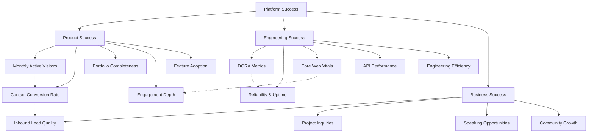

# Success Metrics

> **Document:** `SuccessMetrics.md` | **Version:** 2.0 | **Last Updated:** July 2026  
> **Status:** ✅ Active | **Owner:** Product Lead | **Review Cadence:** Monthly  
> **Related:** [KPIs.md](./KPIs.md) | [MetricsStrategy.md](./MetricsStrategy.md)

---

## 1. Overview

Success metrics define what "good" looks like for the portfolio across three dimensions: product, engineering, and business. Unlike KPIs (which track current performance against target), these metrics define the thresholds and milestones that indicate the portfolio is succeeding as a platform.

## 2. Product Success Metrics

### 2.1 Monthly Active Visitors (MAV)

| Metric | Value |
|--------|-------|
| Current | 850 unique visitors/month |
| Q3 Target | 1,500 |
| Q4 Target | 3,000 |
| Year-End Target | 5,000 |

### 2.2 Contact Conversion Rate

| Metric | Value |
|--------|-------|
| Current | 1.8% |
| Q3 Target | 2.2% |
| Q4 Target | 2.5% |
| Year-End Target | 3.0% |

### 2.3 Portfolio Completeness

| Dimension | Target | Measured By |
|-----------|--------|-------------|
| Projects | 6+ published | Admin dashboard content count |
| Skills | All key competencies listed | Admin dashboard |
| Blog posts | 4+ published | Admin dashboard |
| Testimonials | 3+ endorsements | Admin dashboard |
| Resume/CV | Always up-to-date | Last updated < 30 days |
| AI knowledge base | Coverage on all projects | Ingestion service validation |

### 2.4 Blog Readership Growth

| Metric | Current | Q3 Target | Q4 Target |
|--------|---------|-----------|-----------|
| Blog page views/month | 200 | 500 | 1,000 |
| Avg time on blog post | 1:45 | 2:30 | 3:00 |
| Blog → Contact conversion | 0.5% | 1.0% | 1.5% |

### 2.5 Feature Adoption Targets

| Feature | Current Adoption | Target Adoption |
|---------|-----------------|-----------------|
| AI Chat assistant | 22% of visitors | 40% |
| 3D scene interaction | 15% of visitors | 30% |
| Project detail views | 35% of visitors | 50% |
| Resume download | 5% of visitors | 10% |
| Contact form start | 4% of visitors | 8% |

### 2.6 Engagement Depth Targets

| Metric | Current | Target | Measurement |
|--------|---------|--------|-------------|
| Pages per session | 3.2 | 4.0+ | PostHog |
| Session duration | 2:10 | 3:00+ | PostHog |
| Returning visitor rate | 18% | 30% | Vercel Analytics |
| AI chat depth | 3.2 turns | 4+ turns | AI Service |

## 3. Engineering Success Metrics

### 3.1 DORA Metrics

| Metric | Current | Target | Elite Benchmark |
|--------|---------|--------|-----------------|
| Deployment frequency | ~8/week | 10+/week | On-demand (multiple/day) |
| Lead time for change | 6 hours | < 24 hours | < 1 hour |
| Mean Time to Recover (MTTR) | 45 min | < 1 hour | < 1 hour |
| Change failure rate | 4% | < 5% | < 5% |

### 3.2 Reliability & Uptime

| Service | Current Uptime | Target (SLO) | Measurement |
|---------|---------------|--------------|-------------|
| Web (Next.js) | 99.97% | 99.99% | Vercel status |
| API (NestJS) | 99.95% | 99.99% | Sentry + uptime checks |
| AI (FastAPI) | 99.90% | 99.95% | Uptime checks |
| Database (Supabase) | 99.99% | 99.99% | Supabase status |

### 3.3 Core Web Vitals Pass Rate

| Metric | Current | Target | Measurement |
|--------|---------|--------|-------------|
| LCP < 2.5s | 78% of pages | 95% | Sentry |
| INP < 100ms | 85% of pages | 95% | Sentry |
| CLS < 0.1 | 90% of pages | 95% | Sentry |
| **Overall pass rate** | **82%** | **95%** | Sentry |

### 3.4 API Performance

| Metric | Current p95 | Target p95 |
|--------|-------------|------------|
| Public endpoints | 180ms | < 200ms |
| Admin endpoints | 350ms | < 300ms |
| AI inference (TTFT) | 1.2s | < 1.0s |
| Vector search | 120ms | < 150ms |

### 3.5 Engineering Efficiency

| Metric | Current | Target |
|--------|---------|--------|
| CI pipeline duration | 4:30 | < 3:00 |
| Test coverage (API) | 72% | > 80% |
| Test coverage (Web) | 45% | > 70% |
| Dependency freshness | 60% up-to-date | > 80% |

## 4. Business Success Metrics

### 4.1 Inbound Lead Quality

| Metric | Current | Target |
|--------|---------|--------|
| Job opportunities / month | 1 | 3 |
| Freelance project inquiries / month | 1 | 3 |
| Consulting requests / quarter | 0 | 1 |
| Lead-to-contract rate | 50% | 60% |

### 4.2 Project Inquiries

| Source | Current | Target |
|--------|---------|--------|
| Inbound via contact form | 2/month | 5/month |
| LinkedIn referrals | 1/month | 3/month |
| Portfolio link in applications | N/A | 50% of apps include portfolio link |

### 4.3 Speaking / Guest Appearance Opportunities

| Metric | Current | Target (Annual) |
|--------|---------|-----------------|
| Conference talk submissions | 0 | 2 |
| Podcast guest invitations | 0 | 3 |
| Guest blog post requests | 0 | 2 |
| Newsletter features | 0 | 2 |

### 4.4 Community & Network Growth

| Metric | Current | Target (Annual) |
|--------|---------|-----------------|
| LinkedIn connections | 500 | 1,000 |
| GitHub stars on portfolio | 5 | 50 |
| Newsletter subscribers | 0 | 200 |
| Portfolio social shares | 10/month | 50/month |

## 5. Quarterly Success Milestones

### Q3 2026 (Jul–Sep)
- [ ] 1,500 MAV achieved
- [ ] 2.2% conversion rate
- [ ] 95% Core Web Vitals pass rate
- [ ] AI chat adoption > 30%
- [ ] 3 blog posts published
- [ ] CI pipeline < 3 minutes

### Q4 2026 (Oct–Dec)
- [ ] 3,000 MAV achieved
- [ ] 2.5% conversion rate
- [ ] 99.99% uptime all services
- [ ] AI satisfaction > 80%
- [ ] 6 projects published
- [ ] 1 conference talk submitted

### Q1 2027 (Jan–Mar)
- [ ] 5,000 MAV achieved
- [ ] 3.0% conversion rate
- [ ] 10+ deployments/week
- [ ] 4+ AI chat turns average
- [ ] Test coverage > 80%
- [ ] 1 podcast guest appearance

## 6. Metric Review Process

1. **Data collection**: Automated via PostHog, Sentry, Vercel Analytics
2. **Monthly review**: Full metrics review on 1st Wednesday of each month
3. **Quarterly deep-dive**: Compare against milestones, adjust targets
4. **Annual retrospective**: Year-over-year growth, strategic re-alignment

Metrics that miss targets for two consecutive quarters are escalated for root-cause analysis and may trigger a goals reset.

---

## Diagram

### Success Metrics Hierarchy

## Cross-References
- [MASTER-INDEX.md](../MASTER-INDEX.md) — Documentation master index
- [CROSS-REFERENCE-INDEX.md](../26-reference/CROSS-REFERENCE-INDEX.md) — Cross-reference system

