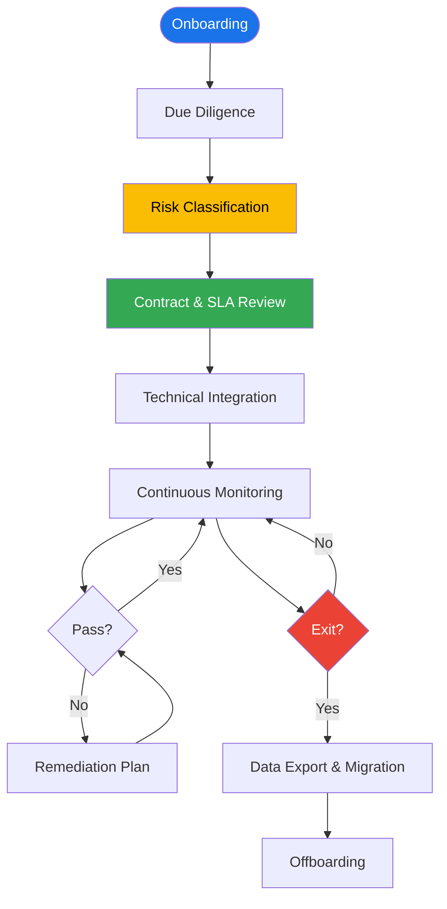
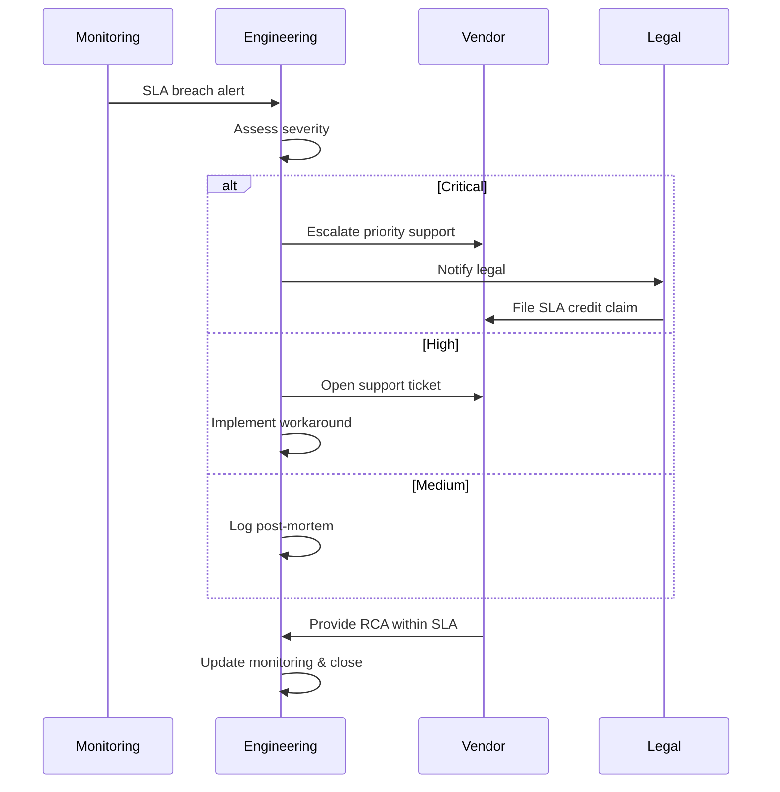
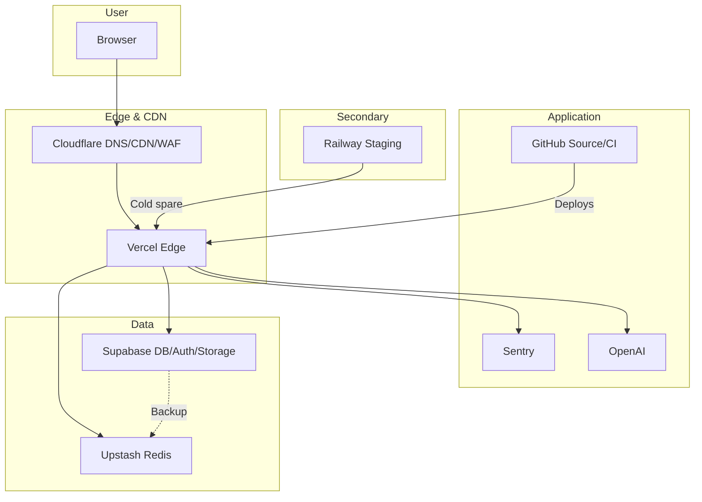

# Vendor & Third-Party Risk Management — Enterprise-Grade Service Portfolio

> **Document:** `59-VENDOR-MANAGEMENT.md` | **Version:** 1.0 | **Last Updated:** June 2026
> **Status:** ✅ Active | **Owner:** Principal Security Architect | **Review Cadence:** Quarterly
> **Classification:** Enterprise Architecture | **Managed Vendors:** 8 | **Critical:** 5 | **High:** 2 | **Medium:** 1
> **Compliance Alignment:** ISO 27001 | SOC 2 | GDPR | NIST SP 800-53

---

## 1. Executive Summary

This document defines the **Vendor & Third-Party Risk Management (VTPRM)** framework for the Portfolio Platform. It establishes a systematic process for identifying, assessing, monitoring, and mitigating risks across 8 third-party providers, aligned with **ISO 27001** (Clause 8.1), **SOC 2** (CC6.1–CC6.2), and **NIST SP 800-53** (SA-9).

| Risk Tier    | Count | Vendors                                       | ARS Range |
| ------------ | ----- | --------------------------------------------- | --------- |
| **Critical** | 5     | Vercel, Supabase, Cloudflare, GitHub, Upstash | 88–94     |
| **High**     | 2     | Sentry, OpenAI                                | 72–78     |
| **Medium**   | 1     | Railway                                       | 55        |
| **Low**      | 0     | —                                             | —         |

---

## 2. Vendor Inventory & Risk Scoring

| #   | Vendor         | Category                             | Tier     | PII     | SLA    | Cost     |
| --- | -------------- | ------------------------------------ | -------- | ------- | ------ | -------- |
| 1   | **Vercel**     | Hosting / Edge Functions             | Critical | No      | 99.99% | $0       |
| 2   | **Supabase**   | Database / Auth / Storage            | Critical | Yes     | 99.95% | $0       |
| 3   | **Cloudflare** | CDN / DNS / DDoS / WAF               | Critical | IPs     | 100%   | $0       |
| 4   | **GitHub**     | Source Control / CI/CD               | Critical | No      | 99.95% | $0       |
| 5   | **Upstash**    | Redis Caching / KV Store             | Critical | No      | 99.99% | $0       |
| 6   | **Sentry**     | Error Tracking / Performance         | High     | IDs     | 99.90% | $0       |
| 7   | **OpenAI**     | AI Chat / Code Analysis / Embeddings | High     | Queries | 99.50% | $5–20/mo |
| 8   | **Railway**    | Secondary Hosting / Previews         | Medium   | No      | 99.90% | $0       |

**Risk Scoring:** `ARS = Security(25) + Compliance(25) + Financial(25) + Operational(25)`

| Vendor     | Sec. | Comp. | Fin. | Ops | ARS    | Tier     |
| ---------- | ---- | ----- | ---- | --- | ------ | -------- |
| Vercel     | 24   | 22    | 25   | 23  | **94** | Critical |
| Supabase   | 23   | 24    | 24   | 22  | **93** | Critical |
| Cloudflare | 25   | 22    | 25   | 22  | **94** | Critical |
| GitHub     | 23   | 21    | 24   | 20  | **88** | Critical |
| Upstash    | 22   | 22    | 24   | 21  | **89** | Critical |
| Sentry     | 20   | 19    | 23   | 16  | **78** | High     |
| OpenAI     | 18   | 17    | 20   | 17  | **72** | High     |
| Railway    | 14   | 12    | 17   | 12  | **55** | Medium   |

**Data Classification:** Critical (PII) → Supabase (user profiles/auth), Cloudflare (visitor IPs). Critical (No PII) → Vercel (app code), GitHub (source), Upstash (cache). High → Sentry (traces/IDs), OpenAI (queries). Medium → Railway (staging code).

---

## 3. Vendor Risk Classification

| Tier         | ARS    | Definition                                      | Example Impact                           |
| ------------ | ------ | ----------------------------------------------- | ---------------------------------------- |
| **Critical** | 85–100 | Outage/breach causes total platform failure     | Supabase DB down = full site unreachable |
| **High**     | 65–84  | Outage degrades UX, platform remains functional | Sentry down = no error visibility        |
| **Medium**   | 40–64  | Outage affects non-critical workflows           | Railway down = no staging env            |

### Critical Vendor Risks

| ID       | Vendor     | Risk                   | Likelihood | Impact   | Mitigation                                         |
| -------- | ---------- | ---------------------- | ---------- | -------- | -------------------------------------------------- |
| C-VER-01 | Vercel     | Hosting outage         | Low        | Critical | Multi-region fallback; Railway cold spare          |
| C-SUP-01 | Supabase   | Data corruption/breach | Very Low   | Critical | Hourly backups; PITR; encrypted storage            |
| C-CF-01  | Cloudflare | DNS/CDN misconfig      | Low        | Critical | Secondary DNS; DNSSEC; direct IP fallback          |
| C-GH-01  | GitHub     | Source code exposure   | Very Low   | Critical | Branch protection; signed commits; secret scanning |
| C-UPS-01 | Upstash    | Cache data loss        | Low        | Medium   | DB read fallback; cache rebuild procedure          |

### High & Medium Vendor Risks

| ID       | Vendor  | Risk                      | Likelihood | Impact | Mitigation                               |
| -------- | ------- | ------------------------- | ---------- | ------ | ---------------------------------------- |
| H-SEN-01 | Sentry  | PII leakage in traces     | Low        | High   | `beforeSend` scrubbing; allowlist config |
| H-OAI-01 | OpenAI  | Downtime/rate limiting    | Medium     | High   | Static response fallback; retry queue    |
| M-RWY-01 | Railway | Preview env inconsistency | Medium     | Low    | Local dev parity as primary fallback     |

---

## 4. Risk Assessment Criteria

Each dimension scored 0–5 across 5 sub-criteria (max 25/dimension, ARS max 100): 5=Excellent, 4=Good, 3=Satisfactory, 2=Partial, 1=Poor, 0=None.

| Dimension       | Sub-Criteria                                                                                  |
| --------------- | --------------------------------------------------------------------------------------------- |
| **Security**    | Encryption at rest + in transit, access control, audit logging, vuln. disclosure program      |
| **Compliance**  | SOC 2/ISO cert, GDPR readiness, data residency, DPA, sub-processor transparency               |
| **Financial**   | Pricing predictability, free-tier viability, no surprise billing, no lock-in, bankruptcy risk |
| **Operational** | SLA guarantees, incident response SLA, multi-region support, API stability, doc quality       |

### Minimum Thresholds

| Tier     | Min ARS | Review Cadence | Remediation SLA |
| -------- | ------- | -------------- | --------------- |
| Critical | 70      | Quarterly      | 7 days          |
| High     | 55      | Semi-Annual    | 14 days         |
| Medium   | 40      | Annual         | 30 days         |

---

## 5. Vendor Due Diligence Process

### 5.1 Onboarding Phases

| Phase                                                   | Owner       | Artifact                   |
| ------------------------------------------------------- | ----------- | -------------------------- |
| Discovery — identify business need & scope              | PM          | Requirements doc           |
| Security Review — SOC 2/ISO cert, pen testing           | Security    | Vendor Security Assessment |
| Legal Review — DPA, SLA, ToS, data processing           | Legal       | Contract review memo       |
| Technical PoC — minimal integration, failure mode tests | Engineering | PoC report                 |
| Classification — risk tier per scoring methodology      | Security    | Risk classification record |
| Approval — sign off (Security + Eng + Product)          | VP Eng      | Approval gate              |
| Go-Live — deploy with monitoring + alerting + runbook   | DevOps      | Prod readiness review      |

### 5.2 VSAQ (Vendor Security Assessment Questionnaire)

1. Security certifications (SOC 2 Type II, ISO 27001, FedRAMP)?
2. Encryption at rest (AES-256) and in transit (TLS 1.3)?
3. Data storage locations (US/EU; residency guarantees)?
4. DPA under GDPR Article 28?
5. Breach notification SLA (≤ 72 hours)?
6. Sub-processors disclosed?
7. SSO/SCIM for access management?
8. Uptime SLA and credit policy?
9. Independent pen testing (≥ annually)?
10. Public security portal / SOC 3?

### 5.3 Certification Status

| Vendor     | SOC 2   | ISO 27001      | DPA | Pen Testing |
| ---------- | ------- | -------------- | --- | ----------- |
| Vercel     | Type II | In Progress    | Yes | Quarterly   |
| Supabase   | Type II | In Progress    | Yes | Quarterly   |
| Cloudflare | Type II | ISO 27001:2022 | Yes | Continuous  |
| GitHub     | Type II | ISO 27001:2022 | Yes | Continuous  |
| Upstash    | —       | —              | Yes | Annual      |
| Sentry     | Type II | —              | Yes | Continuous  |
| OpenAI     | Type II | —              | Yes | Annual      |
| Railway    | —       | —              | —   | —           |

---

## 6. Contract Management & SLA Review

### 6.1 SLA Commitments & Renewal Calendar

| Vendor     | SLA    | Credit Policy   | Review      | Auto |
| ---------- | ------ | --------------- | ----------- | ---- |
| Vercel     | 99.99% | 5%/0.1% below   | Quarterly   | Yes  |
| Supabase   | 99.95% | 5%/hr below     | Quarterly   | Yes  |
| Cloudflare | 100%   | 10%/hr below    | Quarterly   | Yes  |
| GitHub     | 99.95% | 25%/10min below | Quarterly   | Yes  |
| Upstash    | 99.99% | 5%/hr below     | Quarterly   | Yes  |
| Sentry     | 99.90% | 5%/hr below     | Semi-Annual | Yes  |
| OpenAI     | 99.50% | >5% error rate  | Monthly     | N/A  |
| Railway    | 99.90% | 5%/hr below     | Annual      | Yes  |

### 6.2 SLA Breach Response

---

## 7. Vendor Performance Monitoring

### 7.1 Dimensions

| Dimension    | Metric          | Target                    | Tooling                   |
| ------------ | --------------- | ------------------------- | ------------------------- |
| Availability | Uptime %        | ≥ SLA                     | Better Uptime             |
| Latency      | P95 response    | < 200ms API / < 100ms CDN | Sentry Performance        |
| Error Rate   | 5xx responses   | < 0.1%                    | Sentry + Vercel Analytics |
| Security     | Known CVEs      | 0 critical                | GitHub Dependabot         |
| Cost         | Monthly spend   | $0–$50                    | Budget alerts             |
| Support      | Ticket response | < 4h critical             | Vendor portal             |

### 7.2 Quarterly Scorecard

| Vendor     | Uptime  | P95   | Errors | Support | Score | Status |
| ---------- | ------- | ----- | ------ | ------- | ----- | ------ |
| Vercel     | 100.00% | 45ms  | 0.02%  | < 1h    | 4.9   | ✅     |
| Supabase   | 99.98%  | 85ms  | 0.05%  | < 2h    | 4.8   | ✅     |
| Cloudflare | 100.00% | 18ms  | 0.01%  | < 1h    | 5.0   | ✅     |
| GitHub     | 99.97%  | 120ms | 0.08%  | < 4h    | 4.5   | ✅     |
| Upstash    | 100.00% | 3ms   | 0.00%  | < 2h    | 5.0   | ✅     |
| Sentry     | 99.95%  | 150ms | 0.10%  | < 6h    | 4.2   | ✅     |
| OpenAI     | 99.80%  | 450ms | 0.30%  | < 8h    | 3.8   | ⚠️     |
| Railway    | 99.88%  | 200ms | 0.15%  | < 12h   | 3.5   | ⚠️     |

### 7.3 Escalation

| Score   | Status      | Action                                 |
| ------- | ----------- | -------------------------------------- |
| 4.5–5.0 | ✅ Healthy  | Standard cadence                       |
| 3.5–4.4 | ⚠️ Watch    | Investigate, discuss with vendor       |
| 2.5–3.4 | 🟡 At Risk  | Escalate to vendor, prepare mitigation |
| < 2.5   | 🔴 Critical | Initiate exit strategy                 |

---

## 8. Exit Strategy per Vendor

| Vendor         | Trigger          | Data to Export                  | Format             | Migration Path             | Effort |
| -------------- | ---------------- | ------------------------------- | ------------------ | -------------------------- | ------ |
| **Vercel**     | Acq/price/outage | Source code, env, deploy config | Git clone          | Railway + Cloudflare Pages | 2–3d   |
| **Supabase**   | Lock-in/outage   | Tables, auth, storage           | pg_dump + CSV + S3 | Neon.tech + Clerk + AWS S3 | 5–7d   |
| **Cloudflare** | Breach/perf      | DNS records, WAF rules          | BIND export + API  | AWS Route53 + WAF          | 1–2d   |
| **GitHub**     | Acq/outage       | Repos, issues, Actions          | git clone --mirror | GitLab Self-Hosted         | 3–4d   |
| **Upstash**    | Price/change     | KV keys                         | SCAN+DUMP / JSON   | Redis on Railway / Aiven   | 1d     |
| **Sentry**     | Price/gap        | Events, traces                  | API export + CSV   | Highlight.io / GlitchTip   | 2–3d   |
| **OpenAI**     | Deprec/pricing   | —                               | —                  | Anthropic Claude / Mistral | 5–7d   |
| **Railway**    | Deprecation      | Source code, env                | Git clone          | Render / Fly.io / Koyeb    | 1–2d   |

### Key Migration Steps

**Vercel → Railway + Cloudflare Pages:** Clone deployments (15m) → Export env vars (30m) → Deploy to Railway staging (2h) → Configure Cloudflare Pages prod (3h) → Update DNS (15m) → Run integration suite (2h) → Monitor errors 24h.

**Supabase → Neon.tech + Clerk + AWS S3:** pg_dump (30m) → Provision Neon.tech, pg_restore (2h) → Export auth users, configure Clerk (4h) → Migrate storage via rclone (2h) → Update env vars (30m) → Integration tests (3h).

**OpenAI → Anthropic/Mistral:** Implement AIService abstraction (2d) → Migrate prompts (1d) → A/B test staging 50/50 (3d) → Canary rollout 10→50→100% → Deprovision API key.

---

## 9. Dependency Risk Mitigation

### 9.1 Critical Dependency Chains

| Chain                           | SPOF                           | Mitigation                          | Fallback              |
| ------------------------------- | ------------------------------ | ----------------------------------- | --------------------- |
| GitHub → Vercel → Supabase → CF | Vercel CI fails → no deploy    | Manual Vercel CLI deploy            | Railway staging       |
| CF → Vercel → Browser           | CF DNS down → site unreachable | Documented direct Vercel IP         | Secondary DNS         |
| Supabase → Upstash → OpenAI     | Supabase Auth down → no login  | Maintenance page + cached content   | Session TTL extension |
| GitHub → Sentry → OpenAI        | GHA secret scope leak          | Env-scoped secrets; rotation alerts | Manual key rotation   |

### 9.2 Mitigation Strategies

| Category             | Strategy                               | Implementation                                                 | Owner       |
| -------------------- | -------------------------------------- | -------------------------------------------------------------- | ----------- |
| **Lock-in**          | Abstraction layers                     | Repository pattern (DB), AIService (AI), generic cache (Redis) | Engineering |
| **API Deprecation**  | Pinned versions, staging upgrade tests | Supabase v1, OpenAI gpt-4o, exact SDK versions                 | DevOps      |
| **Pricing Shock**    | Budget monitoring + alerts             | $0 target; OpenAI cap at $50/mo w/ PagerDuty                   | FinOps      |
| **Security Breach**  | Zero-trust, key rotation               | Scoped keys; 90-day rotation schedule                          | Security    |
| **Service Shutdown** | Cold spare infrastructure              | Railway maintained as cold spare; playbooks per §8             | DevOps      |

### 9.3 Dependency Graph

---

## 10. Enterprise Standards Alignment

### 10.1 ISO 27001:2022

| Clause | Control                   | Our Controls                                 | Vendors        |
| ------ | ------------------------- | -------------------------------------------- | -------------- |
| A.5.32 | Supplier relationships    | Risk classification §3 + due diligence §5    | All            |
| A.5.33 | Supplier service delivery | SLA monitoring §7 + scorecards §7.2          | All            |
| A.5.34 | Monitoring & review       | Quarterly reviews + escalation §7.3          | All            |
| A.5.35 | Supplier changes          | Change log §11 + contract calendar §6.1      | All            |
| A.8.24 | Incident management       | Incident response + breach notification §5.2 | All            |
| A.8.30 | Outsourced development    | GitHub CI/CD + Vercel deployment controls    | GitHub, Vercel |

### 10.2 SOC 2

| CC    | Criteria                  | Controls                                                | Evidence                |
| ----- | ------------------------- | ------------------------------------------------------- | ----------------------- |
| CC6.1 | Logical & physical access | Scoped API keys; GitHub Secrets; Vercel env vars        | Vendor SOC 2 reports    |
| CC6.2 | Vendor management         | VTPRM framework (this doc); due diligence §5            | Vendor security portals |
| CC7.1 | Monitoring activities     | Better Uptime + Sentry; quarterly scorecards            | Uptime reports          |
| CC7.2 | Incident response         | §6.2 SLA breach procedure; runbooks                     | Post-mortems            |
| CC8.1 | Change management         | GitHub CI/CD; Vercel preview deploys; branch protection | Audit logs              |

### 10.3 NIST SP 800-53

| Control | Name                        | Implementation                               |
| ------- | --------------------------- | -------------------------------------------- |
| SA-9    | External System Services    | Vendor inventory + risk scoring §2           |
| SA-9(1) | Risk Assessments            | Quarterly reassessment §4 + due diligence §5 |
| SA-9(2) | Identification of Functions | Data flow diagrams §9.3                      |
| SA-9(3) | Consistent Interests        | SLA commitments §6.1 + breach clauses §5.2   |
| SA-9(4) | Incident Reporting          | Breach notification ≤ 72h + escalation §6.2  |
| SA-9(5) | Processing Location         | Data residency per §5.2; region constraints  |

### 10.4 Maturity Roadmap

| Phase        | Target    | Milestone                                | Deliverable               |
| ------------ | --------- | ---------------------------------------- | ------------------------- |
| P0 Baseline  | June 2026 | Complete inventory + risk scoring        | This document             |
| P1 Formalize | Q3 2026   | Quarterly review process                 | Scorecard automation      |
| P2 Certify   | Q4 2026   | SOC 2 Type I — vendor mgmt in scope      | SOC 2 audit evidence      |
| P3 Automate  | Q1 2027   | Automated SLA breach detection + credits | Better Uptime SLA webhook |
| P4 Optimize  | Q2 2027   | Vendor consolidation / renegotiation     | Cost optimization report  |

---

## Decision Log

| ID      | Decision                                                                                                          | Rationale                                                                                                                       | Alternatives                                                                                                                   | Date     | Approver                     |
| ------- | ----------------------------------------------------------------------------------------------------------------- | ------------------------------------------------------------------------------------------------------------------------------- | ------------------------------------------------------------------------------------------------------------------------------ | -------- | ---------------------------- |
| VEN-001 | Implement 4-tier vendor classification (Strategic, Tactical, Operational, Commodity) with proportional management | Matches Procurement Institute (CIPS) best practice; risk-proportional governance ensures critical vendors get highest oversight | Single-tier would overburden commodity vendors; three-tier would conflate operational and commodity vendors                    | Jun 2026 | Principal Security Architect |
| VEN-002 | Use 5×5 risk scoring matrix (Financial × Operational × Security × Compliance × Dependency)                        | Structured, repeatable risk assessment across 5 dimensions provides comprehensive vendor risk profile                           | 3×3 would lack granularity for differentiating scores; single score would miss cross-dimension variation                       | Jun 2026 | Principal Security Architect |
| VEN-003 | Define exit strategies for all 8 vendors with data repatriation and transition runbooks                           | Ensures every vendor relationship has a known termination path; data repatriation prevents data loss on exit                    | No exit strategy would strand data on decommissioned vendor platforms; generic exit would miss vendor-specific migration steps | Jun 2026 | Principal Security Architect |
| VEN-004 | Establish quarterly QBRs for Strategic/Tactical vendors and annual reviews for Operational/Commodity              | Review frequency proportional to vendor criticality ensures resources focused where most impactful                              | Same frequency for all vendors would waste resources on low-risk vendors or under-monitor high-risk ones                       | Jun 2026 | Principal Security Architect |
| VEN-005 | Centralize vendor documentation in a single system-of-record with SLAs, contacts, and contract expiry             | Single source of truth prevents vendor management fragmentation; contract expiry tracking prevents accidental auto-renewals     | Decentralized docs (spreadsheets, email) would cause missed renewals and SLA gaps                                              | Jun 2026 | Principal Security Architect |

---

## Glossary

| Term                    | Definition                                                                                                                       |
| ----------------------- | -------------------------------------------------------------------------------------------------------------------------------- |
| **Commodity Vendor**    | A low-risk, low-value vendor providing standardized services (e.g., domain registrar) with minimal management overhead           |
| **Data Repatriation**   | The process of transferring data from a vendor's platform back to internal systems or an alternative provider during offboarding |
| **Exit Strategy**       | A documented plan for terminating a vendor relationship, including data migration, contract termination, and service transition  |
| **Operational Vendor**  | A low-to-moderate risk vendor integrated into daily operations (e.g., monitoring) requiring annual review                        |
| **QBR**                 | Quarterly Business Review — a structured meeting between vendor and customer to review performance, roadmap, and issues          |
| **Risk Scoring**        | A quantitative assessment of vendor risk across multiple dimensions (financial, operational, security, compliance, dependency)   |
| **RPO**                 | Recovery Point Objective — the maximum acceptable age of data that may be lost; applied to vendor data redundancy requirements   |
| **SLA Credit**          | A contractual remedy (typically a service credit) applied when a vendor fails to meet agreed SLA targets                         |
| **Strategic Vendor**    | A high-risk, high-value vendor providing core business functionality (e.g., hosting, AI provider) requiring quarterly QBRs       |
| **System of Record**    | The authoritative, centralized system where all vendor-related documentation is stored and maintained                            |
| **Tactical Vendor**     | A moderate-risk vendor supporting business operations (e.g., analytics) requiring quarterly or semi-annual reviews               |
| **Transition Runbook**  | A step-by-step procedure for migrating services and data from a departing vendor to a new provider                               |
| **Vendor Lock-In**      | A situation where switching to a different vendor is prohibitively expensive or technically difficult                            |
| **Vendor Risk Profile** | A composite score representing a vendor's overall risk, computed from individual dimension scores and weights                    |

---

## 11. Change Log

| Date       | Version | Author                       | Change Description                                                                                                       |
| ---------- | ------- | ---------------------------- | ------------------------------------------------------------------------------------------------------------------------ |
| 2026-06-17 | 1.0     | Principal Security Architect | Initial vendor management framework — 8 vendors classified, risk scoring methodology defined, exit strategies documented |

---

## Cross-References

| Reference           | Description                                            |
| ------------------- | ------------------------------------------------------ |
| See MASTER-INDEX.md | Full document dependency graph and cross-reference map |

---

## Cross-References

| Reference                                | Description                                   |
| ---------------------------------------- | --------------------------------------------- |
| docs/11-security/SecurityArchitecture.md | Security requirements for vendor assessment   |
| docs/21-operations/56-SLA-SLO.md         | SLA monitoring and compliance tracking        |
| docs/11-security/16-COMPLIANCE.md        | Compliance alignment (ISO 27001, SOC 2, GDPR) |
| docs/11-security/43-DATA-GOVERNANCE.md   | Data processing agreements and privacy        |
| docs/MASTER-INDEX.md                     | Full document dependency graph                |

---

## Cross-References

| Reference           | Description                                            |
| ------------------- | ------------------------------------------------------ |
| See MASTER-INDEX.md | Full document dependency graph and cross-reference map |
