# 📜 Constitution Ratification Ceremony — Agenda

> **Document:** `docs/ceremony/AGENDA.md` | **Version:** 1.1 | **Last Updated:** June 2026  
> **Status:** ✅ Active | **Owner:** Chief Architect | **Review Cadence:** One-time event  
> **Classification:** Internal — Engineering Team  
> **Event Date:** Wednesday, June 24, 2026 | **Time:** 10:00 AM – 2:30 PM IST (UTC+5:30)  
> **Location:** Virtual — Zoom / Google Meet (link to be shared)  
> **Duration:** ~4 hours (with lunch break)  
> **Facilitator:** Chief Architect

---

## Table of Contents

1. [Preparation Checklist](#1-preparation-checklist)
2. [Timeline Overview](#2-timeline-overview)
3. [Reading Assignments](#3-reading-assignments)
4. [Step-by-Step Agenda](#4-step-by-step-agenda)
5. [Proxy Voting & Absentee Policy](#5-proxy-voting--absentee-policy)
6. [Post-Ceremony Actions](#6-post-ceremony-actions)
7. [Calendar Event Description](#7-calendar-event-description)

---

## 1. Preparation Checklist

### 1.1 Facilitator (Chief Architect) — 5 Days Before

| ☐ | Task | Due | Est. Time |
|---|------|-----|-----------|
| ☐ | Send calendar invite using description in §6 | Jun 19 (Fri) | 10 min |
| ☐ | Assign reading sections per §3 | Jun 19 (Fri) | 15 min |
| ☐ | Share Constitution PDF with all attendees | Jun 19 (Fri) | 5 min |
| ☐ | Prepare slide deck (optional — see §4.1) | Jun 22 (Mon) | 2 hours |
| ☐ | Print signature sheets from `docs/ceremony/MATERIALS.md` | Jun 23 (Tue) | 10 min |
| ☐ | Print reservation log sheets | Jun 23 (Tue) | 5 min |
| ☐ | Print oath cards for all attendees | Jun 23 (Tue) | 5 min |
| ☐ | Prepare digital signing environment (Git ready for commit) | Jun 23 (Tue) | 15 min |
| ☐ | Test video/audio/recording setup | Jun 23 (Tue) | 15 min |
| ☐ | Share ceremony agenda with all attendees | Jun 23 (Tue) | 5 min |

### 1.2 Attendees — 3 Days Before

| ☐ | Task | Est. Time |
|---|------|-----------|
| ☐ | Read the [Executive Summary](../32-SKILL.md#1-executive-summary) (1 page) | 5 min |
| ☐ | Read your assigned section(s) in full | 15-30 min |
| ☐ | Prepare 2-3 questions or comments on your assigned section | 10 min |
| ☐ | Review the [Forbidden Practices](../32-SKILL.md#21-forbidden-practices) (FP-001 to FP-015) | 5 min |
| ☐ | Review the [Definition of Done](../32-SKILL.md#23-definition-of-done) (DoD-001 to DoD-026) | 5 min |
| ☐ | Think about any reservations you may want to log | 5 min |
| ☐ | Ensure reliable internet connection for video call | 5 min |

### 1.3 Materials to Print

| Item | Copies | Location |
|------|--------|----------|
| Signature sheets (Engineering Leadership) | 1 | `docs/ceremony/MATERIALS.md §2` |
| Signature sheets (Engineering Team) | 1 | `docs/ceremony/MATERIALS.md §3` |
| Signature sheets (Witnesses) | 1 | `docs/ceremony/MATERIALS.md §4` |
| Reservation log | 1 | `docs/ceremony/MATERIALS.md §5` |
| Oath cards | 1 per attendee | `docs/ceremony/MATERIALS.md §6` |
| Voting scorecards | 1 per attendee | `docs/ceremony/MATERIALS.md §7` |

---

## 2. Timeline Overview

```mermaid
gantt
    title Ratification Ceremony — Wednesday, June 24, 2026
    dateFormat  HH:mm
    axisFormat  %H:%M
    
    section Session 1
    Opening & Context       :a1, 10:00, 15min
    Abbreviated Reading     :a2, after a1, 115min
    Q&A                     :a3, after a2, 30min
    
    section Break
    Lunch Break             :l1, after a3, 30min
    
    section Session 2
    Voting                  :b1, after l1, 30min
    Reservations            :b2, after b1, 15min
    Signing                 :b3, after b2, 15min
    Oath & Commit           :b4, after b3, 10min
    Closing                 :b5, after b4, 10min
```



### Time Budget

| Phase | Start | End | Duration |
|-------|-------|-----|----------|
| **Session 1: Reading & Q&A** | 10:00 AM | 12:20 PM | 2h 20min |
| **Lunch Break** | 12:20 PM | 12:50 PM | 30 min |
| **Session 2: Voting & Signing** | 12:50 PM | 2:00 PM | 1h 10min |
| **Total** | 10:00 AM | 2:00 PM | **4h** |

---

## 3. Reading Assignments

### 3.1 Section Allocation

Each section of the Constitution is read aloud by a designated team member. The reader is responsible for:
1. Reading the section title and **3-5 key rules** aloud (~3-5 min max per group)
2. Highlighting 1-2 rules they find most important or impactful
3. Asking if there are any immediate questions before moving to the next section

> **Note:** This is an *abbreviated* ceremonial reading. The full text is pre-read by attendees. Sections are grouped into reader blocks. Focus on the section's purpose and the rules that matter most.

| Reader | Sections | Ceremony Time | Key Takeaway to Highlight |
|--------|----------|---------------|--------------------------|
| **Chief Architect** | 📜 Preamble + §1 Vision + §2 Architecture + §24 Enforcement | 15 min | 8 immutable laws — ARC-001 (dep direction) is non-negotiable |
| **Senior Engineer 1** | §3 Coding + §4 Folders + §5 Naming | 12 min | COD-001 (no any type) is the single most impactful rule |
| **AI Lead** | §6 TypeScript + §20 AI Development | 10 min | TS-001 through TS-010 + 10 AI safety rules |
| **Frontend Lead** | §7 React + §8 Next.js + §15 Design | 12 min | REACT-012 (server components by default) + DSG-001 (no hardcoded colors) |
| **Backend Lead** | §9 Database + §10 API | 10 min | DB-001 (UUID PKs) + API response envelope format |
| **Security Lead** | §11 Security + §21 🚫 Forbidden Practices | 10 min | OWASP Top 10:2025 + 15 absolute prohibitions |
| **QA Lead** | §12 A11y + §16 Testing + §22 Quality Gates + §23 DoD | 15 min | 18 WCAG 2.2 AA criteria + 24 quality gates + 26 DoD criteria |
| **Senior Engineer 2** | §13 Performance + §14 Animation | 8 min | 12 budget targets — LCP < 1.8s + ANIM-008 (reduced motion) |
| **Engineering Manager** | §17 Docs + §18 Code Review + §19 Deployment | 10 min | CR-002 (400 line limit) + rollback procedure |
| — | **Slack buffer** (transitions, tech issues, overflow) | 13 min | — |
| | **Total Reading** | **~115 min** | |

### 3.2 Reading Order & Alternation

To keep energy high, alternate reader roles in this order:
```
Architect → Sr Engineer 1 → AI Lead → Frontend Lead → 
Backend Lead → Security Lead → QA Lead → Sr Engineer 2 → 
Engineering Manager
```

---

## 4. Step-by-Step Agenda

### 🟢 STEP 1 — Opening & Context (10:00 – 10:15 AM)

**Facilitator:** Chief Architect  
**Format:** All cameras on. No slides yet — just talking.

| Time | Action | Speaker Notes |
|------|--------|---------------|
| 10:00 | **Welcome & Introductions** | "Welcome everyone to the ratification ceremony for the AI Engineering Constitution. This is a significant moment for our project — we are formally establishing the standards that will govern every line of code we write." |
| 10:03 | **Why a Constitution?** | Share the story: we're building a portfolio platform that itself demonstrates engineering excellence. The Constitution ensures consistency, quality, and shared understanding. Reference the [Executive Summary](../32-SKILL.md#1-executive-summary). |
| 10:07 | **What Ratification Means** | "By signing, you personally commit to upholding these standards. Not just agreeing — committing. This means reviewing PRs against these rules, writing tests to these thresholds, and holding each other accountable." |
| 10:10 | **Ceremony Overview** | Walk through the 7 steps: Reading → Q&A → Voting → Reservations → Signing → Oath → Commit. |
| 10:13 | **Ground Rules** | 1) Cameras on for signing 2) One person speaks at a time 3) Questions during reading go in chat — answered in Q&A 4) This is a safe space for concerns |
| 10:15 | Transition to reading | |

---

### 🟢 STEP 2 — Section-by-Section Reading (10:15 AM – 12:10 PM)

**Facilitator:** Chief Architect (calls on readers)  
**Format:** Screen share with Constitution PDF. Reader reads their assigned section.

**Reading Protocol:**
1. Facilitator calls on reader by name
2. Reader reads **only: section title + 2-3 key rules + key takeaway** (~3-5 min max)
3. Attendees type questions in chat (answered in Q&A)
4. Facilitator thanks reader and calls next

> **Note:** This is an *abbreviated* ceremonial reading. Attendees have pre-read their sections. The goal is acknowledgment, not teaching.

**Time Tracking:**
| Time | Interval | Reader | Sections | Est. Time |
|------|----------|--------|----------|-----------|
| 10:15 | 0:00 | Architect | Preamble + §1 Vision + §2 Architecture + §24 Enforcement | 15 min |
| 10:30 | 0:15 | Sr Engineer 1 | §3 Coding + §4 Folders + §5 Naming | 12 min |
| 10:42 | 0:27 | AI Lead | §6 TypeScript + §20 AI Development | 10 min |
| 10:52 | 0:37 | Frontend Lead | §7 React + §8 Next.js + §15 Design | 12 min |
| 11:04 | 0:49 | Backend Lead | §9 Database + §10 API | 10 min |
| 11:14 | 0:59 | Security Lead | §11 Security + §21 Forbidden Practices | 10 min |
| 11:24 | 1:09 | QA Lead | §12 A11y + §16 Testing + §22 Quality Gates + §23 DoD | 15 min |
| 11:39 | 1:24 | Sr Engineer 2 | §13 Performance + §14 Animation | 8 min |
| 11:47 | 1:32 | Eng Manager | §17 Docs + §18 Code Review + §19 Deployment | 10 min |
| 11:57 | 1:42 | — | **Slack buffer** (transitions, tech issues, overflow) | 13 min |
| **12:10** | **1:55** | — | **End reading** | **~115 min** |

---

### 🟢 STEP 3 — Q&A Session (12:10 – 12:40 PM)

**Facilitator:** Chief Architect  
**Format:** Open floor. Chat questions addressed first, then live questions.

| Time | Activity |
|------|----------|
| 12:10 | Read aloud chat questions collected during reading |
| 12:15 | Address each question with discussion |
| 12:25 | Open floor for live questions |
| 12:40 | Wrap Q&A — unresolved items go to Reservation Log |

> **Note:** The RATIFICATION.md protocol specifies 1 hour for Q&A. For this ceremony, Q&A is abbreviated to 30 minutes due to time constraints. Any unresolved questions or concerns beyond 30 minutes are logged as reservations for follow-up within 7 days.

**Q&A Principles:**
- Every question is valid. No judgement.
- If a concern is raised, discuss it openly.
- If consensus cannot be reached, log it as a reservation.
- The Constitution is about raising the bar — not creating bureaucracy.

---

### 🥪 LUNCH BREAK (12:40 – 1:10 PM)

**30 minutes.** Recommend stepping away from screen.

---

### 🟢 STEP 4 — Voting (1:10 – 1:40 PM)

**Facilitator:** Chief Architect  
**Format:** Each section voted on. Unanimous consent required.

**Voting Protocol:**
1. Facilitator reads each section title
2. Attendees vote: ✅ (I consent), ❌ (I do not consent), ⏸️ (I have reservations)
3. If any ❌: Section is discussed. Vote again. If ❌ persists, log as reservation and proceed.
4. If ⏸️: Log reservation details immediately.

| Section | Vote | Notes |
|---------|------|-------|
| §1 Project Vision | __ / __ | |
| §2 Architecture Rules | __ / __ | |
| §3 Coding Standards | __ / __ | |
| §4 Folder Standards | __ / __ | |
| §5 Naming Standards | __ / __ | |
| §6 TypeScript Standards | __ / __ | |
| §7 React Standards | __ / __ | |
| §8 Next.js Standards | __ / __ | |
| §9 Database Standards | __ / __ | |
| §10 API Standards | __ / __ | |
| §11 Security Standards | __ / __ | |
| §12 Accessibility Standards | __ / __ | |
| §13 Performance Standards | __ / __ | |
| §14 Animation Standards | __ / __ | |
| §15 Design Standards | __ / __ | |
| §16 Testing Standards | __ / __ | |
| §17 Documentation Standards | __ / __ | |
| §18 Code Review Standards | __ / __ | |
| §19 Deployment Standards | __ / __ | |
| §20 AI Development Standards | __ / __ | |
| §21 Forbidden Practices | __ / __ | |
| §22 Quality Gates | __ / __ | |
| §23 Definition of Done | __ / __ | |
| §24 Enforcement | __ / __ | |

---

### 🟢 STEP 5 — Reservation Log (1:40 – 1:55 PM)

**Facilitator:** Chief Architect  
**Format:** Any attendee may log a formal reservation.

**Reservation Form:** (from `docs/ceremony/MATERIALS.md §5`)

```
Reservation #: ____
Team Member: _______________
Section: §____
Concern: _______________________________________________
Suggested Resolution: __________________________________
Status: [ ] Open [ ] Addressed
```

Each reservation is read aloud, acknowledged, and assigned an owner for resolution within 90 days.

---

### 🟢 STEP 6 — Signing Ceremony (1:55 – 2:10 PM)

**Facilitator:** Chief Architect  
**Format:** Each attendee signs the physical or digital signature sheet.

**Digital Signing Option:**
1. Facilitator shares screen with signature PDF
2. Each attendee types their name in the chat as their signature
3. Facilitator records on the signature sheet
4. Saves as committed record

**Physical Signing Option:**
1. Pass around printed signature sheets
2. Each person signs with pen
3. Designated person scans and uploads to `docs/archive/`

**Signing Order:**
1. Chief Architect
2. Frontend Lead
3. Backend Lead
4. AI Lead
5. QA Lead
6. Security Lead
7. Senior Engineers
8. Software Engineers
9. DevOps Engineer
10. Design Engineer
11. Product Owner (Witness)
12. Engineering Manager (Witness)

---

### 🟢 STEP 7 — Oath (2:10 – 2:15 PM)

**Facilitator:** Chief Architect (leads the oath)  
**Format:** All attendees read the oath aloud together.

> **THE ENGINEER'S OATH**
>
> *I commit to uphold the AI Engineering Constitution in every line of code I write,*
> *every pull request I review, and every deployment I make.*
>
> *I will prioritize quality over speed, clarity over cleverness,*
> *and accessibility over exclusion.*
>
> *I will hold myself and my teammates to these standards,*
> *not as a burden, but as a demonstration of our craft.*
>
> *This I affirm, freely and without reservation.*

---

### 🟢 STEP 8 — Commemoration Commit (2:15 – 2:20 PM)

**Facilitator:** Chief Architect (or Tech Lead)  
**Format:** Final commit of the ratified Constitution to `main`.

**Commit Message:**
```
🏛️ RATIFY: AI Engineering Constitution v5.0

Ratified by the Portfolio Engineering Team on June 24, 2026.
Signatories: [all names]

This commit establishes the Constitution as the supreme governing
document for all engineering activity.

Closes: #ratification
```

**After Commit:**
- Tag the commit: `git tag -a constitution-v5.0-ratified -m "AI Engineering Constitution v5.0 — Ratified June 24, 2026"`
- Push tag: `git push origin constitution-v5.0-ratified`
- Generate PDF archive and save to `docs/archive/constitution-v5.0-ratified.pdf`
- Share announcement in team channel

---

### 🟢 STEP 9 — Closing (2:20 – 2:30 PM)

**Facilitator:** Chief Architect  
**Format:** Final words.

| Time | Action | Speaker Notes |
|------|--------|---------------|
| 2:20 | **Closing Remarks** | "This Constitution is now the supreme governing law of our project. But a constitution on paper means nothing without practice. The real work begins Monday — every PR, every commit, every review is an opportunity to live these standards." |
| 2:23 | **Next Steps** | 1) Placeholder names filled within 14 days 2) Phase 1 remediation begins (security headers + test infra) 3) Onboarding modules for any absent team members |
| 2:25 | **Celebration** | "Thank you all for your commitment to engineering excellence. Let's build something remarkable." |
| 2:30 | **End** | |

---

## 5. Proxy Voting & Absentee Policy

### 5.1 Absence Procedure

If a team member cannot attend the ceremony, they may still participate in ratification:

| Scenario | Process | Deadline |
|----------|---------|----------|
| **Known absence** (planned ahead) | Complete proxy signature form (§5.3) + send voting preferences via email to Chief Architect | June 23 (day before ceremony) |
| **Emergency absence** (day of) | Text Chief Architect with: 1) Voting preferences (consent/reservations per section) 2) Authorization for Architect to sign on their behalf | Before voting begins (1:10 PM) |
| **Extended absence** (vacation, leave) | Onboard via CONST-101 through CONST-106 training modules + ratify individually upon return (documented in RATIFICATION.md addendum) | Within 14 days of return |

### 5.2 Quorum & Voting Rules

| Rule | Detail |
|------|--------|
| **Minimum quorum** | 60% of engineering team must be present (including at least 1 lead from each discipline) |
| **Voting threshold** | Unanimous consent required from all **present** attendees |
| **Absentee votes** | Count as **abstentions** — do not block ratification |
| **If quorum not met** | Ceremony rescheduled within 7 days |
| **Proxy authorization** | Must be in writing (email or text) to Chief Architect before voting begins |

### 5.3 Proxy Signature Form

```
CONSTITUTION RATIFICATION — PROXY SIGNATURE

I, _________________________, unable to attend the ratification
ceremony on June 24, 2026, hereby authorize
_________________________ to sign on my behalf.

My voting preferences are:
  ☐ I consent to all sections (no reservations)
  ☐ I consent with the following reservations:
    ─ Section §____: ________________________________
    ─ Section §____: ________________________________

Signed: _________________________  Date: _______________
```

---

## 6. Post-Ceremony Actions

| ☐ | Action | Owner | Deadline |
|---|--------|-------|----------|
| ☐ | Fill placeholder names in `docs/governance/33-RATIFICATION.md` | Chief Architect | +14 days (Jul 8) |
| ☐ | Generate PDF archive of signed Constitution | Tech Lead | +3 days (Jun 27) |
| ☐ | Store PDF in `docs/archive/constitution-v5.0-ratified.pdf` | Tech Lead | +3 days (Jun 27) |
| ☐ | Share ratified Constitution announcement in team channel | Chief Architect | +1 day (Jun 25) |
| ☐ | Schedule Constitutional Council inaugural meeting | Chief Architect | +7 days (Jul 1) |
| ☐ | Begin Phase 1 remediation (security headers + test infra) | Tech Lead | +7 days (Jul 1) |
| ☐ | Schedule onboarding for any absent team members | Engineering Manager | +5 days (Jun 29) |
| ☐ | Upload signed materials to `docs/archive/` | Chief Architect | +3 days (Jun 27) |

---

## 7. Calendar Event Description

### 6.1 Invite Text

```
📜 CONSTITUTION RATIFICATION CEREMONY
─────────────────────────────────────
Date: Wednesday, June 24, 2026
Time: 10:00 AM – 2:30 PM IST (UTC+5:30)
Location: [Zoom/Google Meet Link]
Duration: ~4 hours

━━━ WHAT THIS IS ━━━━━━━━━━━━━━━━━━━━━━━━━━━━━━━

We are formally ratifying the AI Engineering Constitution 
(docs/governance/32-SKILL.md) as the supreme governing document for 
all engineering work on the Portfolio Platform.

━━━ WHY YOUR ATTENDANCE MATTERS ━━━━━━━━━━━━━━━━━

This Constitution defines the standards every engineer 
commits to — from architecture rules to coding standards,
from accessibility to performance budgets. Your voice in 
the reading, Q&A, and voting ensures these standards 
reflect the collective wisdom of the team.

━━━ AGENDA ━━━━━━━━━━━━━━━━━━━━━━━━━━━━━━━━━━━━━

10:00 – 10:15  Opening & Context
10:15 – 12:10  Section-by-Section Reading (abbreviated — titles + key rules)
12:10 – 12:40  Q&A Session
12:40 – 1:10   🥪 Lunch Break
1:10 – 1:40    Voting (unanimous consent required)
1:40 – 1:55    Reservation Log
1:55 – 2:10    Signing Ceremony
2:10 – 2:15    Engineer's Oath
2:15 – 2:20    Commemoration Commit
2:20 – 2:30    Closing

━━━ PREPARATION ━━━━━━━━━━━━━━━━━━━━━━━━━━━━━━━━━

Before the ceremony, please:
1. Read the Executive Summary (docs/governance/32-SKILL.md §1)
2. Read your assigned section (you'll receive this separately)
3. Review the Forbidden Practices (§21) and DoD (§23)
4. Prepare any questions or reservations

━━━ WHAT TO BRING ━━━━━━━━━━━━━━━━━━━━━━━━━━━━━━━

- Your full attention
- Questions and an open mind
- Commitment to engineering excellence

━━━ OUTCOME ━━━━━━━━━━━━━━━━━━━━━━━━━━━━━━━━━━━━━

A ratified Constitution that governs all engineering work,
signed by every team member, committed to the repository
as a permanent record of our collective commitment to quality.
```

### 6.2 Video Conferencing Settings

| Setting | Value |
|---------|-------|
| Platform | Zoom / Google Meet |
| Camera | Recommended on (especially for signing) |
| Recording | Optional — deleted after ratification committed |
| Breakout rooms | Not needed |
| Waiting room | Enable for security |
| Q&A tools | Chat for questions, Raise Hand for live Q&A |

---

## Change Log

| Version | Date | Changes | Author |
|---------|------|---------|--------|
| 1.0 | Jun 16, 2026 | **Initial ceremony agenda** — Full 4-hour timeline, reading assignments for 10 attendees, preparation checklists, voting protocol, reservation log procedure, signing ceremony format, oath text, commemoration commit process, calendar invite template, and video conference settings. Scheduled for June 24, 2026, 10:00 AM IST. | Chief Architect |

---

## Document References

| Reference | Description |
|-----------|-------------|
| `docs/governance/33-RATIFICATION.md` (v1.0) | Ratification process and governance framework |
| `docs/governance/32-SKILL.md` (v5.0) | The AI Engineering Constitution being ratified |
| `docs/ceremony/MATERIALS.md` | Printable ceremony materials (signature sheets, oath cards, etc.) |
| `docs/MASTER-INDEX.md` | Document inventory |

## Cross-References
- [MASTER-INDEX.md](../MASTER-INDEX.md) — Documentation master index
- [CROSS-REFERENCE-INDEX.md](../26-reference/CROSS-REFERENCE-INDEX.md) — Cross-reference system
