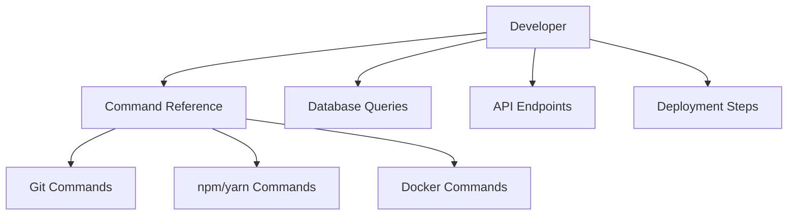

# ⚡ AI Engineering Constitution — Quick Reference

> **Document:** `34-CHEATSHEET.md` | **Version:** 1.1 | **Last Updated:** July 2026  
> **Purpose:** Condensed daily reference card for desk use. Full Constitution at `docs/governance/32-SKILL.md`

---

## Executive Summary



This cheatsheet consolidates the AI Engineering Constitution's golden rules, naming conventions, performance budgets, quality gates, and security standards into a single-page daily reference. It covers 8 architectural golden rules, naming conventions across 12 artifact types, 8 performance budgets, 5 forbidden practices, 4-stage quality gates, 11-point definition of done, 12 React component standards, WCAG 2.2 AA accessibility essentials, test coverage targets, 10 AI development rules, API response format standards, and DB schema rules. Designed for desk use by all engineers on the portfolio platform.

---

## 🎯 Golden Rules (ARC-001 → ARC-008)

```
✅ packages/  →  packages/ only    ✅ apps/  →  packages/ only
❌ apps/  →  apps/                 ❌ packages/  →  apps/
❌ secrets in client code          ✅ Supabase = sole data tier
✅ ISR for public · SSR for admin  ✅ Every endpoint needs rate limit
✅ Admin routes = JWT + RLS        ✅ Only FastAPI calls OpenAI
```

## 📛 Naming Quick Matrix

| Artifact | Convention | Example |
|----------|-----------|---------|
| Files (TS) | `kebab-case` | `auth.service.ts` |
| Components | `PascalCase` | `Button.tsx` |
| Hooks | `camelCase` + `use` | `useAuth.ts` |
| Functions | `camelCase` | `fetchProjects()` |
| Interfaces/Types | `PascalCase` | `interface UserProps` |
| Constants | `UPPER_SNAKE` | `MAX_RETRY_COUNT` |
| DB tables | `snake_case` (plural) | `blog_posts` |
| JSON fields | `snake_case` | `created_at` |
| Env vars | `UPPER_SNAKE` | `OPENAI_API_KEY` |
| Git branches | `type/description` | `feat/add-auth` |
| Git commits | `type(scope): msg` | `feat(auth): add JWT` |

## ⚡ Performance Budgets

| Metric | Target |
|--------|--------|
| LCP | < 1.8s |
| FCP | < 1.2s |
| TBT | < 50ms |
| CLS | < 0.05 |
| TTFB | < 200ms |
| Initial JS | < 85KB gzipped |
| Page weight | < 500KB |
| API (p95) | < 100ms |
| DB query (p95) | < 50ms |

## 🚫 Top 5 Forbidden Practices

| # | Practice | Instead |
|---|----------|---------|
| FP-001 | `any` type | `unknown` + narrow |
| FP-002 | API keys in code | Environment variables |
| FP-003 | `console.log` in commits | Structured logger |
| FP-004 | Direct DOM manipulation | Refs or state |
| FP-005 | SQL string concatenation | Parameterized queries |

## 🎯 Quality Gates (4 Stages)

| Stage | Min Checks |
|-------|-----------|
| **Pre-commit** | Typecheck · Lint · Format · Related tests |
| **CI (PR)** | Full typecheck · Full lint · Full tests · a11y · Bundle · Build · Security audit |
| **Deployment** | Staging health · E2E tests · Lighthouse 90+ · a11y 0 violations · Rollback plan |
| **Post-deploy** | Health check · Error rate < 5% · Core Web Vitals · Critical flows |

## ✅ Definition of Done (11 Essentials)

```
☐ Code follows Constitution standards         ☐ Tests pass + coverage meets thresholds
☐ TypeScript strict pass (0 errors)           ☐ a11y axe-core 0 violations
☐ ESLint 0 errors, 0 warnings                 ☐ Documentation updated
☐ Prettier formatted                          ☐ Performance budgets met
☐ No console.log / debugger / commented code  ☐ PR < 400 lines, < 15 files
                                                ☐ Reviewed and approved
```

## 📐 Component Standards (REACT-001 → 012)

| Rule | Short |
|------|-------|
| REACT-001 | Function components + hooks only. No classes. |
| REACT-003 | Props interface co-located with component |
| REACT-006 | Event handlers → `useCallback` when passed as props |
| REACT-007 | Expensive computations → `useMemo` |
| REACT-010 | Repeated logic → custom hook |
| REACT-011 | Unique IDs → `useId()` |
| REACT-012 | Server components by default. `'use client'` is exception |

## 🔒 Security Headers

```js
{ key: 'Strict-Transport-Security',  value: 'max-age=63072000; includeSubDomains; preload' }
{ key: 'X-Frame-Options',            value: 'DENY' }
{ key: 'X-Content-Type-Options',     value: 'nosniff' }
{ key: 'Referrer-Policy',            value: 'strict-origin-when-cross-origin' }
{ key: 'Content-Security-Policy',    value: "default-src 'self'; script-src 'self'..." }
```

## ♿ A11y Essentials (WCAG 2.2 AA)

```
☐ All images have alt text             ☐ Skip link at top of every page
☐ Text contrast ≥ 4.5:1               ☐ Focus order = DOM order
☐ 200% zoom = no content loss         ☐ 2px focus ring on all interactive
☐ Keyboard-operable (no mouse needed)  ☐ All inputs have <label>
☐ Dynamic content = aria-live region   ☐ Error messages describe the issue
```

## 🧪 Test Coverage Targets

| Layer | Tool | Min | Target |
|-------|------|-----|--------|
| Unit — components | Vitest + RTL | 80% | 90% |
| Unit — hooks | Vitest + renderHook | 80% | 95% |
| Unit — utils | Vitest | 90% | 100% |
| Unit — services | Vitest | 85% | 95% |
| Integration | Vitest + MSW | 70% | 85% |
| E2E (critical flows) | Playwright | 5 | 10 |
| a11y | axe-core | 0 violations | 0 violations |

## 🤖 AI Development Rules

```
AI-001: Only answer from portfolio content       AI-006: Chat history = 30-day max retention
AI-002: Sanitize all inputs for injection         AI-007: No visitor profiles or PII stored
AI-003: Filter all outputs for PII                AI-008: Never quote prices
AI-004: Never claim to be human                   AI-009: Never share contact info
AI-005: Say "I don't know" — never hallucinate    AI-010: Log all moderation events
```

## 📦 API Response Format

```json
// Success                          // Error                              // Paginated
{                                   {                                     {
  "data": { ... },                    "error": {                           "data": [...],
  "meta": {                           "code": "VALIDATION_ERROR",           "meta": {
    "requestId": "req_abc",           "message": "Invalid email",            "nextCursor": "eyJ...",
    "timestamp": "2026-06-15T..."     "details": [...]                       "hasMore": true,
  },                                 },                                      "total": 42,
}                                   "meta": { ... }                        "requestId": "...",
                                  }                                       "timestamp": "...",
                                                                        }
                                                                      }
```

## 🗄️ DB Schema Rules

```
☐ UUID primary keys with gen_random_uuid()   ☐ created_at + updated_on all tables
☐ Foreign keys must be indexed               ☐ TIMESTAMPTZ not TIMESTAMP
☐ TEXT over VARCHAR(n) unless business rule  ☐ CHECK constraints for validation
☐ snake_case for tables AND columns          ☐ RLS enabled on every table
```

## 🛠️ Environment Configuration

| Environment | Purpose | Branch | Supabase DB | Vercel Project | Env Source |
|-------------|---------|--------|-------------|----------------|------------|
| **Development** | Daily feature work | `feature/*` | Local Docker | N/A | `.env.local` |
| **Preview** | PR review & E2E | PR branch | Supabase Branch | Preview Deploy | Vercel Env Vars |
| **Staging** | Pre-production validation | `staging` | Supabase Staging | Staging Deploy | Vercel Env Vars |
| **Production** | Live site | `main` | Production | Production Deploy | Vercel Env Vars |

## 📝 Git Workflow Standard

| Step | Command | When |
|------|---------|------|
| Create branch | `git checkout -b feat/my-feature` | Start of work |
| Commit | `git commit -m "feat(scope): description"` | Per logical change |
| Sync with main | `git rebase main` | Before opening PR |
| Open PR | GitHub → New PR → Fill template | When ready for review |
| Merge (squash) | GitHub → Squash and merge | After approval + CI green |
| Delete branch | `git branch -d feat/my-feature` | After merge |

## 🔄 Error Handling Patterns

```typescript
// ✅ Standard API error response
try {
  const result = await someOperation();
  return { data: result };
} catch (error) {
  return {
    error: {
      code: error instanceof ValidationError ? 'VALIDATION_ERROR' : 'INTERNAL_ERROR',
      message: error.message,
      details: process.env.NODE_ENV === 'development' ? error.stack : undefined,
    }
  };
}

// ✅ React Server Component error boundary
export default async function Page() {
  try {
    return <Content />;
  } catch (error) {
    return <ErrorFallback error={error} />;
  }
}
```

## 🏗️ Common Build Commands

| Command | What It Does | Expected Time |
|---------|-------------|:-------------:|
| `npm run dev` | Start all workspaces in dev mode | < 10s |
| `npm run build` | Full production build across all packages | < 60s |
| `npm run lint` | ESLint across all workspaces | < 20s |
| `npm run typecheck` | TypeScript strict check | < 30s |
| `npm test` | Run all unit tests | < 60s |
| `npm run e2e` | Run Playwright E2E tests | < 5 min |
| `npx turbo run build --filter=apps/web` | Build only the web app | < 30s |
| `supabase db push` | Apply database migrations | < 10s |

## 🔧 VS Code Settings (Recommended)

```json
{
  "editor.formatOnSave": true,
  "editor.defaultFormatter": "esbenp.prettier-vscode",
  "editor.codeActionsOnSave": {
    "source.fixAll.eslint": "always"
  },
  "typescript.tsdk": "node_modules/typescript/lib",
  "typescript.enablePromptUseWorkspaceTsdk": true,
  "files.exclude": {
    "**/.next": true,
    "**/node_modules": true
  }
}
```

## 📋 Logging Standards

| Level | Color | When to Use | Example |
|-------|-------|-------------|---------|
| `debug` | Gray | Development only | "Rendering component X with props Y" |
| `info` | Green | Normal operations | "User navigated to /projects" |
| `warn` | Yellow | Recoverable issues | "Rate limit approaching: 80/100 req" |
| `error` | Red | Failures requiring attention | "Database connection failed, retrying..." |
| `fatal` | Red+ | Service cannot continue | "OpenAI API key not configured" |

---

> **Full Constitution:** `docs/governance/32-SKILL.md` | **Ratification:** `docs/governance/33-RATIFICATION.md`  
> **Print this sheet. Pin it above your desk. Live by it.**  
> *Last updated: June 2026 — v5.0*

> **Full Constitution:** `docs/governance/32-SKILL.md` | **Ratification:** `docs/governance/33-RATIFICATION.md`  
> **Print this sheet. Pin it above your desk. Live by it.**  
> *Last updated: June 2026 — v5.0*

---

## Change Log

| Version | Date | Changes | Author |
|---------|------|---------|--------|
| 1.1 | Jun 2026 | Added Executive Summary, Decision Log, Risk Register, Glossary | Chief Architect |
| 1.0 | Jun 2026 | Consolidated with CHEATSHEET.md (unnumbered) — adopted numbering convention, canonical document | Chief Architect |

---

## Decision Log

| ID | Decision | Rationale | Alternatives Considered | Date | Approver |
|----|----------|-----------|------------------------|------|----------|
| D-CS-001 | Consolidate two separate cheatsheet files into one canonical version | Eliminated version drift between unnumbered and numbered cheatsheets; single source of truth | Maintain both in parallel (rejected — drift risk); merge into SKILL.md (rejected — cheatsheet is quick reference, not full doc) | Jun 2026 | Chief Architect |
| D-CS-002 | Use 8 golden rules (ARC-001 through ARC-008) as the primary architectural axioms | Covers all critical architecture constraints in a printable format suitable for desk reference | 15+ rules (rejected — too many to memorize); mermaid diagrams (rejected — not suitable for print cheatsheet) | Jun 2026 | Chief Architect |
| D-CS-003 | Enforce 11-point Definition of Done with PR size limits (400 lines, 15 files) | Keeps PRs reviewable and reduces merge conflicts; aligns with modern trunk-based development practices | No PR size limit (rejected — unmanageable reviews); 200-line limit (rejected — too restrictive for complex features) | Jun 2026 | Tech Lead |
| D-CS-004 | Adopt WCAG 2.2 AA as accessibility baseline with 10-point essentials checklist | Aligns with legal compliance requirements and industry standard for web accessibility | WCAG 2.1 AA (rejected — superseded by 2.2); Section 508-only (rejected — US-centric, less comprehensive) | Jun 2026 | Chief Architect |
| D-CS-005 | Include AI Development Rules (AI-001 to AI-010) in cheatsheet | Critical safety rules for AI chatbot must be accessible to all developers, not just AI specialists | Keep only in SKILL.md (rejected — AI is a core feature, all engineers need awareness); separate AI cheatsheet (rejected — fragmentation) | Jun 2026 | Chief Architect |
| D-CS-006 | Define test coverage targets per layer (unit/integration/E2E) rather than a single blanket percentage | Different layers have different cost/benefit profiles for test coverage; single target would be either too lax or too aggressive | Single 80% blanket target (rejected — doesn't account for layer differences); 100% everywhere (rejected — impractical for E2E) | Jun 2026 | Chief Architect |

## Risk Register

| ID | Risk | Likelihood | Impact | Mitigation |
|----|------|------------|--------|------------|
| R-CS-001 | Cheatsheet falls out of sync with the full Constitution (SKILL.md) as both evolve | Medium | High | Add cross-reference validation step to doc review checklist; automate diff checks in CI |
| R-CS-002 | New engineers treat cheatsheet as the complete source of truth and miss nuanced rules in SKILL.md | Low | Medium | Prominently cite SKILL.md as "Full Constitution" in header; include reading order referencing full docs |
| R-CS-003 | Performance budgets become outdated as the application grows in complexity | Medium | Medium | Schedule quarterly performance budget review; anchor budgets to Lighthouse CI regression thresholds |
| R-CS-004 | Print version becomes illegible due to dense formatting | Low | Low | Test print rendering at each revision; maintain whitespace for readability; limit to single page |
| R-CS-005 | AI Development Rules change with model updates but cheatsheet isn't updated in parallel | Low | High | Link AI rules to AI_INSTRUCTIONS.md version; use version lockstep: update cheatsheet whenever AI_INSTRUCTIONS is revised |

## Glossary

| Term | Definition |
|------|------------|
| **ISR** | Incremental Static Regeneration — a Next.js rendering strategy that serves statically-generated pages with periodic background revalidation |
| **SSR** | Server-Side Rendering — rendering pages on each request on the server |
| **RLS** | Row-Level Security — PostgreSQL feature that restricts which rows a user can query based on their authentication context |
| **JWT** | JSON Web Token — a compact, URL-safe token format used for authentication and authorization |
| **LCP** | Largest Contentful Paint — a Core Web Vital measuring when the largest visible element renders |
| **FCP** | First Contentful Paint — measures when the first text or image appears on screen |
| **TBT** | Total Blocking Time — measures the time between FCP and interactive where the main thread is blocked |
| **CLS** | Cumulative Layout Shift — measures visual stability by tracking unexpected layout shifts |
| **TTFB** | Time to First Byte — measures the time until the server sends the first byte of the response |
| **WCAG** | Web Content Accessibility Guidelines — international standards for web accessibility published by W3C |
| **MSW** | Mock Service Worker — a library for API mocking at the network level, used in integration tests |
| **axe-core** | An automated accessibility testing engine that checks for WCAG violations in the DOM |

---

*Document Version: 1.1 — Enterprise Edition*
