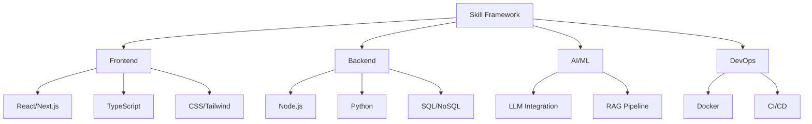

# ⚖️ AI Engineering Constitution — Supreme Governing Law

> **Document:** `32-SKILL.md` | **Version:** 5.0 | **Last Updated:** June 2026  
> **Status:** ✅ Active | **Owner:** Chief Architect | **Review Cadence:** Monthly  
> **Classification:** **SUPREME GOVERNING DOCUMENT** — All engineering work must comply  
> **Scope:** `apps/web`, `apps/api`, `apps/ai`, `packages/*`, `infrastructure/*`, `docs/*`

---

## 📜 Preamble

This Constitution establishes the **supreme governing law** for all engineering activity within the Portfolio Platform. Every line of code, every architectural decision, every pull request, and every deployment must adhere to the standards defined herein. No exception shall be granted without formal override documented in the [Override Log](#appendix-a-override-log).

> **"Quality is not an act. It is a habit."** — Every standard in this document exists to produce software that is secure, maintainable, performant, accessible, and delightful.

---

## Table of Contents

| § | Section | Purpose |
|---|---------|---------|
| **§1** | [Project Vision](#1-project-vision) | North Star and strategic objectives |
| **§2** | [Architecture Rules](#2-architecture-rules) | Immutable architectural constraints |
| **§3** | [Coding Standards](#3-coding-standards) | Universal code quality rules |
| **§4** | [Folder Standards](#4-folder-standards) | Directory structure conventions |
| **§5** | [Naming Standards](#5-naming-standards) | Naming conventions across all artifacts |
| **§6** | [TypeScript Standards](#6-typescript-standards) | Type system strictness and patterns |
| **§7** | [React Standards](#7-react-standards) | Component architecture and patterns |
| **§8** | [Next.js Standards](#8-nextjs-standards) | App Router, rendering, data fetching |
| **§9** | [Database Standards](#9-database-standards) | Schema, RLS, migrations, indexing |
| **§10** | [API Standards](#10-api-standards) | RESTful design, contracts, versioning |
| **§11** | [Security Standards](#11-security-standards) | OWASP compliance, threat prevention |
| **§12** | [Accessibility Standards](#12-accessibility-standards) | WCAG 2.2 AA+ compliance |
| **§13** | [Performance Standards](#13-performance-standards) | Budgets, metrics, optimization rules |
| **§14** | [Animation Standards](#14-animation-standards) | Motion design, performance, accessibility |
| **§15** | [Design Standards](#15-design-standards) | Visual consistency, theme enforcement |
| **§16** | [Testing Standards](#16-testing-standards) | Coverage, types, quality gates |
| **§17** | [Documentation Standards](#17-documentation-standards) | Doc quality, cross-references, maintenance |
| **§18** | [Code Review Standards](#18-code-review-standards) | Review process, SLAs, enforcement |
| **§19** | [Deployment Standards](#19-deployment-standards) | Pipeline, environments, rollback |
| **§20** | [AI Development Standards](#20-ai-development-standards) | AI safety, cost control, evaluation |
| **§21** | [🚫 Forbidden Practices](#21-forbidden-practices) | Absolute prohibitions |
| **§22** | [🎯 Quality Gates](#22-quality-gates) | Mandatory checks before merge/deploy |
| **§23** | [✅ Definition of Done](#23-definition-of-done) | Completion criteria for all work |
| **§24** | [🔧 Enforcement & Escalation](#24-enforcement--escalation) | How standards are upheld |
| **§25** | [Decision Log](#25-decision-log) | Key architectural & policy decisions |
| **Appx** | [Appendices](#appendices) | Override log, glossary, signatures |

---

## 1. Project Vision

### 1.1 North Star Statement

> **To build the definitive enterprise-grade personal portfolio platform — a showcase of technical excellence that itself demonstrates the highest standards of software engineering, accessibility, performance, and design.**

The portfolio is not merely a website. It is a **living artifact** of engineering craftsmanship, a **reference architecture** for modern full-stack development, and a **testament** to the principle that the medium is the message.

### 1.2 Strategic Pillars

| Pillar | Statement | Measured By |
|--------|-----------|-------------|
| **🎨 Design Excellence** | Every pixel intentional. Every interaction delightful. Every transition fluid. | Lighthouse Design score ≥ 95 |
| **⚡ Performance Obsession** | Instant load, zero jank, minimal budget. | LCP < 1.8s, TBT < 50ms, bundle < 150KB |
| **♿ Universal Access** | No user left behind. WCAG 2.2 AA+ mandatory, AAA aspirational. | axe-core 0 violations, keyboard-only navigable |
| **🔒 Security by Default** | Every layer hardened. Every threat modeled. Zero trust at the data tier. | OWASP Top 10:2025 compliant, no critical findings |
| **🧠 AI-Augmented** | AI serves humans. Accuracy > breadth. Cost is controlled. Safety is absolute. | Hallucination rate < 1%, monthly cost < $10 |
| **📐 Architectural Integrity** | Monorepo discipline. Module boundaries respected. Dependency direction enforced. | No circular deps, no cross-app imports |
| **🧪 Quality as Habit** | Test before merge. Review every PR. Measure everything. | 90%+ coverage, 0 critical bugs in production |

### 1.3 Core Tenets

| Tenet | Meaning |
|-------|---------|
| **Convention over Configuration** | Use established patterns. Don't reinvent unless necessary. |
| **Explicit over Implicit** | Clear code > clever code. Name things. No magic. |
| **Fail Fast, Fail Safe** | Validate early. Never swallow errors silently. |
| **Defense in Depth** | Every layer assumes the layer below it is compromised. |
| **Document as You Build** | If it's not documented, it doesn't exist. |
| **Measure Everything** | If you can't measure it, you can't improve it. |
| **Accessibility is Not Optional** | a11y is a requirement, not a feature. |

---

## 2. Architecture Rules

### 2.1 Immutable Laws

| # | Rule | Rationale | Violation Consequence |
|---|------|-----------|----------------------|
| **ARC-001** | **Monorepo dependency direction: `packages/` → nothing outside `packages/`. `apps/` → `packages/` only. NEVER `apps/` → `apps/`.** | Prevents circular dependencies, enforces modularity | PR rejected |
| **ARC-002** | **Three-tier separation: Presentation (Next.js) → Business Logic (NestJS) → Data (Supabase). No tier skips.** | Maintains security boundaries, enables independent scaling | PR rejected |
| **ARC-003** | **AI service (FastAPI) is the ONLY service that calls OpenAI/Anthropic APIs.** | Centralizes AI cost, safety, and monitoring | Rollback required |
| **ARC-004** | **Supabase is the ONLY data tier. No filesystem storage, no in-memory caches for persisting state.** | Data durability, backup consistency, single source of truth | PR rejected |
| **ARC-005** | **Every API endpoint must have a rate limit tier assigned.** | Prevents abuse, controls cost, ensures fair use | Deployment blocked |
| **ARC-006** | **Admin routes must be behind JWT auth + RLS. No admin data accessible to unauthenticated users.** | Zero-trust data access | Critical incident |
| **ARC-007** | **ISR for public content, SSR for admin, CSR for interactions only.** | Performance optimization, SEO requirements | Performance review required |
| **ARC-008** | **No secrets in client code. All API keys, tokens, and credentials server-side only.** | Prevents credential exposure | Security incident |

### 2.2 Module Boundaries

```
┌─────────────────────────────────────────────────┐
│                  apps/web                        │
│  (Next.js 14 — Presentation Layer)              │
│  Can import: packages/ui, packages/shared,      │
│              packages/config                     │
│  Cannot import: apps/api, apps/ai               │
└────────────────────┬────────────────────────────┘
                     │ HTTPS (REST/SSE)
┌────────────────────▼────────────────────────────┐
│                  apps/api                        │
│  (NestJS 10 — Business Logic Layer)             │
│  Can import: packages/shared, packages/config   │
│  Cannot import: apps/web, apps/ai               │
└────────────────────┬────────────────────────────┘
                     │ Supabase SDK
┌────────────────────▼────────────────────────────┐
│              Supabase (Data Layer)               │
│  PostgreSQL 15 + Auth + Storage + Realtime      │
└─────────────────────────────────────────────────┘

┌─────────────────────────────────────────────────┐
│                 apps/ai                          │
│  (FastAPI — AI/ML Layer)                       │
│  Isolated service. Communicates via HTTPS only. │
│  Only service with access to OpenAI/Anthropic.  │
└─────────────────────────────────────────────────┘
```

### 2.3 Architecture Decision Records (ADR) Policy

| Rule | Detail |
|------|--------|
| **When required** | Any change affecting system boundaries, data flow, dependencies, or external services |
| **Format** | `ADR-NNN.md` in `docs/adr/` directory. See `docs/architecture/SystemArchitecture.md §14` for template |
| **Approval** | Minimum: Architecture Lead + 1 senior engineer. Critical ADRs require full team |
| **Retroactive ADRs** | Existing undocumented decisions must be captured within 30 days of discovery |

---

## 3. Coding Standards

### 3.1 Universal Rules

| # | Rule | Applies To | Enforcement |
|---|------|-----------|-------------|
| COD-001 | **No `any` type.** Use `unknown` and narrow. If `any` is absolutely necessary, document with `// eslint-disable-next-line @typescript-eslint/no-explicit-any -- <reason>` | TypeScript | ESLint error |
| COD-002 | **No `console.log` in committed code.** Use structured logging. | All | ESLint error (`no-console`) |
| COD-003 | **Max line length: 120 characters.** | All | Prettier enforcement |
| COD-004 | **Indentation: 2 spaces. No tabs.** | All | Prettier enforcement |
| COD-005 | **Semicolons required.** | TypeScript | Prettier enforcement |
| COD-006 | **Trailing commas required (multiline).** | TypeScript | Prettier enforcement |
| COD-007 | **Single quotes for strings. Double quotes for JSX attributes.** | TypeScript/React | Prettier enforcement |
| COD-008 | **No dead code.** No unused variables, parameters, imports, or exports. | TypeScript | ESLint error (`@typescript-eslint/no-unused-vars`) |
| COD-009 | **No commented-out code.** Delete it. Git history exists for a reason. | All | ESLint error (`no-warning-comments` on PR) |
| COD-010 | **Every file must end with a single newline.** | All | Prettier enforcement |
| COD-011 | **No `@ts-ignore` or `@ts-expect-error` without a documented reason.** | TypeScript | ESLint error |
| COD-012 | **No dynamic `require()`. Use ES module imports.** | Node.js (apps/api) | ESLint error |
| COD-013 | **No `eval()` or `Function()` constructor.** | All | ESLint error |
| COD-014 | **All boolean variables must use `is`, `has`, `can`, `should`, `will` prefix.** | TypeScript | Code review |
| COD-015 | **All error messages must be descriptive and actionable.** | All | Code review |

### 3.2 Error Handling Standards

```typescript
// ✅ CORRECT: Structured error handling
try {
  const result = await riskyOperation();
  return result;
} catch (error) {
  logger.error('Failed to perform risky operation', {
    error: error instanceof Error ? error.message : String(error),
    operationId: crypto.randomUUID(),
    timestamp: new Date().toISOString(),
  });
  throw new AppError('RISKY_OP_FAILED', 'Unable to complete operation. Please try again.', {
    cause: error,
    statusCode: 500,
  });
}

// ❌ WRONG: Silent error swallowing
try {
  const result = await riskyOperation();
  return result;
} catch (error) {
  // nothing
}

// ❌ WRONG: Generic error messages
try {
  // ...
} catch (error) {
  throw new Error('Something went wrong'); // Not actionable!
}
```

### 3.3 Import Order

```
1. Node.js built-ins (fs, path, crypto)
2. External packages (react, next, express)
3. Internal packages (@portfolio/ui, @portfolio/shared)
4. Absolute imports (apps/web/src/lib/*)
5. Relative imports (./Component, ../hooks)
6. Type imports (import type { ... })
7. CSS/styles imports

Groups separated by a single blank line.
```

---

## 4. Folder Standards

### 4.1 Directory Structure Rules

| # | Rule | Example |
|---|------|---------|
| DIR-001 | **Feature-based module organization, not file-type-based.** | `apps/api/src/modules/auth/` not `apps/api/src/controllers/` |
| DIR-002 | **Co-locate tests with source files.** | `Button.tsx` → `Button.test.tsx` adjacent |
| DIR-003 | **Barrel `index.ts` exports in every module.** | `export * from './Button'; export * from './Card';` |
| DIR-004 | **Max 3 levels of nesting for features.** | `apps/web/src/components/sections/Hero.tsx` ✓ |
| DIR-005 | **Shared code lives in `packages/`, not duplicated across apps.** | Types in `packages/shared`, components in `packages/ui` |
| DIR-006 | **No empty directories. Use `.gitkeep` if necessary.** | Enforced by CI |
| DIR-007 | **Test fixtures/mocks in `__tests__/__fixtures__/` relative to module.** | Co-located, not in a global `__fixtures__/` |

### 4.2 Standard Directory Template

```
module-name/
├── index.ts              # Barrel exports
├── module-name.service.ts
├── module-name.controller.ts  (apps/api only)
├── module-name.module.ts      (apps/api only)
├── __tests__/
│   ├── module-name.service.test.ts
│   ├── module-name.controller.test.ts
│   └── __fixtures__/
│       └── test-data.ts
├── __mocks__/             # Only if external module mocking needed
│   └── external-lib.ts
└── types.ts               # Module-specific types (not in packages/shared)
```

---

## 5. Naming Standards

### 5.1 Convention Matrix

| Artifact | Convention | Example | Rule |
|----------|-----------|---------|------|
| **Files (TypeScript)** | `kebab-case` | `auth.service.ts`, `user-profile.tsx` | NAM-001 |
| **Files (Python)** | `snake_case` | `ai_service.py`, `model_router.py` | NAM-002 |
| **React Components** | `PascalCase` | `Button.tsx`, `UserProfile.tsx` | NAM-003 |
| **React Hooks** | `camelCase` with `use` prefix | `useAuth.ts`, `useMediaQuery.ts` | NAM-004 |
| **Functions** | `camelCase` | `fetchProjects()`, `validateInput()` | NAM-005 |
| **Classes** | `PascalCase` | `AuthService`, `ProjectRepository` | NAM-006 |
| **Interfaces** | `PascalCase` | `interface UserProfile { ... }` | NAM-007 |
| **Types** | `PascalCase` | `type Status = 'active' \| 'inactive'` | NAM-008 |
| **Enums** | `PascalCase` (enum) + `PascalCase` (members) | `enum ProjectStatus { Active, Archived }` | NAM-009 |
| **Constants** | `UPPER_SNAKE_CASE` | `MAX_RETRY_COUNT`, `API_BASE_URL` | NAM-010 |
| **CSS Classes** | `kebab-case` (Tailwind) or `camelCase` (CSS modules) | `bg-surface-primary`, `cardContainer` | NAM-011 |
| **CSS Custom Props** | `--kebab-case` | `--surface-primary`, `--text-body` | NAM-012 |
| **Database Tables** | `snake_case` (plural) | `projects`, `blog_posts`, `document_chunks` | NAM-013 |
| **Database Columns** | `snake_case` | `created_at`, `display_order`, `is_visible` | NAM-014 |
| **API Endpoints** | `kebab-case` (plural nouns) | `/api/projects`, `/api/analytics/events` | NAM-015 |
| **JSON Fields** | `snake_case` | `{ "user_id": "...", "created_at": "..." }` | NAM-016 |
| **Environment Variables** | `UPPER_SNAKE_CASE` | `OPENAI_API_KEY`, `DATABASE_URL` | NAM-017 |
| **Git Branches** | `type/description` | `feat/add-auth`, `fix/login-redirect`, `chore/upgrade-deps` | NAM-018 |
| **Git Commits** | `type(scope): description` | `feat(auth): add JWT refresh token rotation` | NAM-019 |

### 5.2 Naming Prohibitions

| ❌ Don't | ✅ Do | Reason |
|----------|-------|--------|
| `data`, `info`, `stuff` | `userProfile`, `analyticsData` | Too vague |
| `temp`, `tmp` | Named based on purpose | No meaning |
| `manager`, `util`, `helper` | `authService`, `stringFormatter` | Overused, unclear |
| Single-letter vars (except loop counters) | Descriptive names | Readability |
| Abbreviations (unless universally understood) | `btn` → `button`, `conf` → `configuration` | Clarity |
| Hungarian notation | No prefixes | TypeScript infers types |

---

## 6. TypeScript Standards

### 6.1 Strictness Configuration

```jsonc
// tsconfig.base.json — Minimum required strictness
{
  "compilerOptions": {
    "strict": true,
    "noUncheckedIndexedAccess": true,
    "noImplicitReturns": true,
    "noFallthroughCasesInSwitch": true,
    "exactOptionalPropertyTypes": true,
    "forceConsistentCasingInFileNames": true,
    "isolatedModules": true,
    "skipLibCheck": false,         // Do NOT skip — catch dependency type errors
    "noUnusedLocals": true,
    "noUnusedParameters": true,
    "resolveJsonModule": true,
    "declaration": true,
    "declarationMap": true,
    "sourceMap": true
  }
}
```

### 6.2 Type Pattern Rules

| # | Rule | Good | Bad |
|---|------|------|-----|
| TS-001 | **Prefer `interface` over `type` for object shapes that may be extended** | `interface User { ... }` | `type User = { ... }` |
| TS-002 | **Use `type` for unions, intersections, and computed types** | `type Status = 'active' \| 'inactive'` | `enum Status { ... }` for simple unions |
| TS-003 | **Always use `ReadonlyArray<T>` over `T[]` for parameters** | `function process(items: ReadonlyArray<string>)` | `function process(items: string[])` |
| TS-004 | **Use `as const` for literal types** | `const COLORS = ['red', 'blue'] as const` | `const COLORS = ['red', 'blue']` |
| TS-005 | **Use `satisfies` for type validation without widening** | `const config = { ... } satisfies Config` | `const config: Config = { ... }` |
| TS-006 | **Never use `any`. Use `unknown` and narrow with type guards.** | `function parse(data: unknown): Result` | `function parse(data: any): Result` |
| TS-007 | **Use branded types for domain primitives** | `type UserId = string & { __brand: 'UserId' }` | `function get(id: string)` |
| TS-008 | **Use discriminated unions for state machines** | `type State = { status: 'loading' } \| { status: 'loaded', data: T } \| { status: 'error', error: Error }` | `type State = { status: string; data?: T; error?: Error }` |
| TS-009 | **All public APIs must have explicit return types** | `function fetchProjects(): Promise<Project[]>` | `function fetchProjects() { ... }` |
| TS-010 | **Use `z.infer<typeof schema>` for runtime-validated types** | `type Lead = z.infer<typeof leadSchema>` | `interface Lead { ... }` (duplicated) |

### 6.3 Type Guard Standards

```typescript
// ✅ CORRECT: Custom type guard
function isProject(result: unknown): result is Project {
  return (
    typeof result === 'object' &&
    result !== null &&
    'id' in result &&
    'title' in result
  );
}

// ✅ CORRECT: Narrowing with discriminated union
function handleState(state: AsyncState<Project>) {
  switch (state.status) {
    case 'loading':
      return <Spinner />;
    case 'loaded':
      return <ProjectDetail project={state.data} />;
    case 'error':
      return <ErrorFallback error={state.error} />;
  }
}
```

---

## 7. React Standards

### 7.1 Component Architecture

| # | Rule | Detail |
|---|------|--------|
| REACT-001 | **Prefer function components with hooks. No class components.** | Hooks provide better composition, tree-shaking, and testing. |
| REACT-002 | **One component per file (except small helpers co-located).** | Improves readability, tree-shaking, and lazy loading. |
| REACT-003 | **Props interfaces must be co-located with the component.** | `interface ButtonProps` exported from `Button.tsx`. |
| REACT-004 | **Use `React.forwardRef` for reusable form controls.** | Enables parent ref access for focus management. |
| REACT-005 | **Use `React.memo` only when profiled benefit is proven.** | Premature memoization adds complexity. Prove with React DevTools profiler. |
| REACT-006 | **All event handlers must be wrapped in `useCallback` when passed as props.** | Prevents unnecessary re-renders of child components. |
| REACT-007 | **All expensive computations must be wrapped in `useMemo`.** | Document the computation cost in a comment. |
| REACT-008 | **No direct DOM manipulation. Use refs or state.** | React manages the DOM. `document.querySelector` in a component is a code smell. |
| REACT-009 | **Side effects (API calls, subscriptions) in `useEffect` only.** | Never in render or event handlers directly. |
| REACT-010 | **Custom hooks for reusable logic.** | If logic is repeated across components, extract to a hook. |
| REACT-011 | **`useId()` for generating unique IDs (form/ARIA associations).** | SSR-safe, no collisions. |
| REACT-012 | **Server components by default in Next.js App Router.** | `'use client'` is the exception, not the rule. |

### 7.2 Component Composition Pattern

```typescript
// ✅ CORRECT: Composition over configuration
interface CardProps {
  variant?: 'default' | 'elevated' | 'interactive';
  padding?: 'sm' | 'md' | 'lg';
  className?: string;
  children: React.ReactNode;
}

function Card({ variant = 'default', padding = 'md', className, children }: CardProps) {
  return (
    <div
      className={cn(
        'rounded-lg transition-all duration-200',
        {
          'bg-surface-secondary border border-primary shadow-sm': variant === 'default',
          'bg-surface-primary shadow-md': variant === 'elevated',
          'bg-surface-secondary border border-primary shadow-sm hover:shadow-lg hover:-translate-y-0.5 cursor-pointer':
            variant === 'interactive',
        },
        {
          'p-4 md:p-6': padding === 'md',
          'p-3 md:p-4': padding === 'sm',
          'p-6 md:p-8': padding === 'lg',
        },
        className
      )}
    >
      {children}
    </div>
  );
}

// Sub-components for semantic structure
Card.Header = function CardHeader({ children }: { children: React.ReactNode }) {
  return <div className="px-4 pt-4 md:px-6 md:pt-6">{children}</div>;
};

Card.Body = function CardBody({ children }: { children: React.ReactNode }) {
  return <div className="p-4 md:p-6">{children}</div>;
};

Card.Footer = function CardFooter({ children }: { children: React.ReactNode }) {
  return (
    <div className="border-t border-primary px-4 pb-4 md:px-6 md:pb-6">
      {children}
    </div>
  );
};
```

### 7.3 State Management Rules

| Pattern | When To Use | Example |
|---------|-------------|---------|
| **`useState`** | Component-local UI state | Form input, toggle, accordion |
| **`useReducer`** | Complex state logic (multiple sub-values) | Multi-step form, game state |
| **`useContext`** | App-wide UI theme/locale/preferences | Theme toggle, language |
| **SWR / React Query** | Server state (async data fetching) | Projects list, analytics |
| **Zustand** (if needed) | Complex cross-component state | Admin panel state, multi-tab |

> **Rule:** Server state → SWR/React Query. UI state → useState/useReducer. Global UI → Context. Avoid Redux unless proven necessary.

---

## 8. Next.js Standards

### 8.1 Rendering Strategy

| Page Type | Strategy | Rationale | Cache TTL |
|-----------|----------|-----------|-----------|
| **Public listing pages** (Home, Projects, Blog) | ISR | Content changes infrequently | 60s |
| **Public detail pages** (Project page, Blog post) | ISR + `generateStaticParams` | Pre-render all known slugs | 60s |
| **Contact form** | Dynamic (CSR) | Client validation + interactivity | None |
| **AI Chat** | Dynamic (CSR) | Real-time SSE streaming | None |
| **Admin pages** | SSR + Client fetch | Session check per request | None |

### 8.2 Data Fetching Patterns

```typescript
// ✅ CORRECT: Server Component with ISR
// app/projects/page.tsx
export const revalidate = 60;

async function ProjectsPage() {
  const projects = await fetchProjects(); // Auto-cached by Next.js
  return <ProjectGrid projects={projects} />;
}

// ✅ CORRECT: Client Component with SWR
// app/admin/leads/page.tsx
'use client';

function AdminLeads() {
  const { data, error, isLoading, mutate } = useSWR('/api/leads', fetcher, {
    refreshInterval: 30000,
    revalidateOnFocus: true,
  });

  if (isLoading) return <LeadTableSkeleton />;
  if (error) return <ErrorFallback onRetry={() => mutate()} />;
  return <LeadTable leads={data} />;
}

// ✅ CORRECT: Server Action for mutations
// app/actions/submit-lead.ts
'use server';

export async function submitLead(formData: FormData) {
  const validated = leadSchema.parse({
    name: formData.get('name'),
    email: formData.get('email'),
    message: formData.get('message'),
  });

  return await createLead(validated);
}
```

### 8.3 Metadata Standards

```typescript
// ✅ CORRECT: Metadata per page
import type { Metadata } from 'next';

export const metadata: Metadata = {
  title: {
    default: 'Portfolio — John Doe',
    template: '%s | John Doe',
  },
  description: 'Full-stack developer portfolio showcasing...',
  openGraph: {
    title: 'John Doe — Portfolio',
    description: 'Full-stack developer and AI enthusiast',
    url: 'https://portfolioowner.com',
    siteName: 'John Doe Portfolio',
    images: [{ url: '/og-image.png', width: 1200, height: 630 }],
    locale: 'en_US',
    type: 'website',
  },
  twitter: {
    card: 'summary_large_image',
    title: 'John Doe — Portfolio',
    description: 'Full-stack developer and AI enthusiast',
  },
  robots: {
    index: true,
    follow: true,
  },
};
```

### 8.4 App Router Rules

| # | Rule | Detail |
|---|------|--------|
| NEXT-001 | **All routes go in `app/` directory. No `pages/`.** | App Router is the future. |
| NEXT-002 | **`'use client'` only when necessary (hooks, events, browser APIs).** | Server components reduce JS bundle. |
| NEXT-003 | **Use `<Link>` for client-side navigation. No `<a>` for internal routes.** | Pre-fetching, no full page reload. |
| NEXT-004 | **Use `next/image` for all images. No `` tags.** | Automatic optimization, lazy loading, WebP. |
| NEXT-005 | **Use `next/font` for all fonts. No external font imports.** | Eliminates FOIT, self-hosted. |
| NEXT-006 | **Use `generateStaticParams` for dynamic routes where possible.** | Static generation at build time. |
| NEXT-007 | **Use `notFound()` for 404 cases. Use `redirect()` for redirects.** | Proper HTTP status codes. |
| NEXT-008 | **Use `loading.tsx` for loading states. Use `error.tsx` for error boundaries.** | Granular loading/error UI per route segment. |
| NEXT-009 | **No `getServerSideProps` or `getStaticProps`. Use App Router patterns.** | Legacy Pages Router APIs. |

---

## 9. Database Standards

### 9.1 Schema Design Rules

| # | Rule | Detail |
|---|------|--------|
| DB-001 | **All tables must have `id UUID PRIMARY KEY DEFAULT gen_random_uuid()`.** | UUIDs prevent enumeration attacks, enable distributed inserts. |
| DB-002 | **All tables must have `created_at TIMESTAMPTZ NOT NULL DEFAULT now()`.** | Audit trail for every row. |
| DB-003 | **All tables must have `updated_at TIMESTAMPTZ NOT NULL DEFAULT now()`.** | Track modification time. Use trigger for auto-update. |
| DB-004 | **Use `snake_case` for all table and column names.** | PostgreSQL convention. |
| DB-005 | **Use `TEXT` over `VARCHAR(n)` unless length constraint is business-required.** | TEXT and VARCHAR have identical performance in PostgreSQL. |
| DB-006 | **Use `TIMESTAMPTZ` (not `TIMESTAMP`) for all timestamps.** | Timezone-aware, unambiguous. |
| DB-007 | **All foreign keys must be indexed.** | Prevents sequential scans on JOINs. |
| DB-008 | **All large tables (>10K rows) must have a clustered index defined.** | Physical ordering optimization. |
| DB-009 | **No soft deletes. Use a `deleted_at TIMESTAMPTZ` column with a partial index.** | Enables cascade behavior, simplifies queries. |
| DB-010 | **Use `CHECK` constraints for column-level validation.** | `proficiency INT CHECK (proficiency >= 0 AND proficiency <= 100)` |

### 9.2 RLS Policy Standards

```sql
-- ✅ CORRECT: RLS policy template
CREATE POLICY "Public read access for visible sections"
ON sections
FOR SELECT
TO anon
USING (is_visible = true);

CREATE POLICY "Admin full access"
ON sections
FOR ALL
TO authenticated
USING (auth.role() = 'admin')
WITH CHECK (auth.role() = 'admin');

-- Every table must have:
-- 1. A public read policy (with appropriate filters)
-- 2. An admin full access policy
-- 3. Enable RLS: ALTER TABLE sections ENABLE ROW LEVEL SECURITY;
```

### 9.3 Migration Standards

| # | Rule | Detail |
|---|------|--------|
| DB-011 | **All schema changes must be done via Supabase migrations, never raw SQL.** | Audit trail, reversible, environment-agnostic. |
| DB-012 | **Migration files must be timestamped and descriptive.** | `20260615000000_create_projects_table.sql` |
| DB-013 | **All migrations must be idempotent.** | Use `IF NOT EXISTS`, `IF EXISTS` clauses. |
| DB-014 | **Destructive changes (DROP, ALTER TYPE) require a two-phase migration.** | Phase 1: Add new column/table, backfill. Phase 2: Drop old. |
| DB-015 | **Test all migrations against a staging database before production.** | Prevents production data loss. |

---

## 10. API Standards

### 10.1 RESTful Design Rules

| # | Rule | Detail |
|---|------|--------|
| API-001 | **Use nouns for resources, verbs for actions.** | `POST /leads` ✓, `GET /leads/export` ✓ |
| API-002 | **Use plural nouns for collection endpoints.** | `/api/projects`, `/api/skills` |
| API-003 | **Use HTTP methods semantically: GET (read), POST (create), PATCH (partial update), PUT (replace), DELETE (remove).** | Never GET for mutations. |
| API-004 | **Version via header (`Accept: application/vnd.portfolio.v1+json`), not URL path.** | Cleaner URLs, easier version negotiation. |
| API-005 | **All responses must follow a consistent envelope.** | `{ data, error, meta }` — see below. |
| API-006 | **Always paginate list endpoints with cursor-based pagination.** | `{ data: [...], meta: { nextCursor, hasMore } }` |
| API-007 | **Support filtering via query parameters.** | `GET /api/projects?category=frontend&featured=true` |
| API-008 | **Support sorting via `sort` parameter.** | `GET /api/projects?sort=-created_at` (desc) |
| API-009 | **Support field selection via `fields` parameter.** | `GET /api/projects?fields=id,title,slug` |
| API-010 | **All mutations must return the created/updated resource.** | `POST /api/leads → 201 { data: Lead }` |
| API-011 | **Use `429 Too Many Requests` with `Retry-After` header for rate limiting.** | Standard rate limit response. |

### 10.2 Response Envelope

```typescript
// ✅ CORRECT: Standard API response format
// Success
{
  "data": {
    "id": "550e8400-e29b-41d4-a716-446655440000",
    "title": "E-commerce Platform",
    "slug": "ecommerce-platform",
    "technologies": ["React", "Node.js", "PostgreSQL"]
  },
  "meta": {
    "requestId": "req_abc123",
    "timestamp": "2026-06-15T10:30:00.000Z"
  }
}

// Error
{
  "error": {
    "code": "VALIDATION_ERROR",
    "message": "Email must be a valid email address",
    "details": [
      { "field": "email", "message": "Invalid email format", "code": "invalid_format" }
    ]
  },
  "meta": {
    "requestId": "req_def456",
    "timestamp": "2026-06-15T10:30:00.000Z"
  }
}

// Paginated
{
  "data": [ ... ],
  "meta": {
    "nextCursor": "eyJpZCI6IjEyMyJ9",
    "hasMore": true,
    "total": 42,
    "requestId": "req_ghi789",
    "timestamp": "2026-06-15T10:30:00.000Z"
  }
}
```

### 10.3 Status Code Standards

| Code | When | Example |
|------|------|---------|
| **200** | Successful GET, PATCH | `GET /api/projects → 200` |
| **201** | Successful POST (resource created) | `POST /api/leads → 201` |
| **204** | Successful DELETE (no content) | `DELETE /api/projects/:id → 204` |
| **400** | Validation error, malformed request | Missing required field |
| **401** | Unauthenticated | Missing/invalid JWT |
| **403** | Authenticated but unauthorized | Non-admin accessing admin route |
| **404** | Resource not found | Invalid project slug |
| **409** | Conflict (duplicate, stale data) | Duplicate email |
| **422** | Unprocessable entity | Business rule violation |
| **429** | Rate limit exceeded | Too many requests |
| **500** | Internal server error | Unhandled exception |

---

## 11. Security Standards

### 11.1 OWASP Top 10:2025 Compliance

| Category | Requirement | Implementation | Verification |
|----------|-------------|---------------|--------------|
| **A01: Broken Access Control** | JWT auth on all admin routes. RLS on all tables. | Passport JWT guard, Supabase RLS policies | Integration tests verify 401/403 |
| **A02: Cryptographic Failures** | HTTPS only. Strong password hashing (bcrypt, 12 rounds). | Vercel auto-TLS, Supabase Auth | SSL Labs A+ rating |
| **A03: Injection** | Parameterized queries. Input validation on all user input. | Supabase SDK (parameterized), class-validator, Zod | Penetration test quarterly |
| **A04: Insecure Design** | Security review in definition of done. Threat model before new features. | ADR process includes security section | Architecture review board |
| **A05: Security Misconfiguration** | Security headers on all responses. No default credentials. | HSTS, CSP, XFO, X-Content-Type-Options headers | CI header check |
| **A06: Vulnerable Components** | Weekly `npm audit`. Dependabot automated PRs. Pin major versions. | GitHub Dependabot, CI audit gate | Dependabot alerts ≤ 24h |
| **A07: Auth Failures** | Rate limit on login (5/15min). Account lockout after 5 failures. | @nestjs/throttler, Supabase Auth settings | Load test auth endpoint |
| **A08: Data Integrity Failures** | CSRF protection on mutations. Transactional operations. | NextAuth.js CSRF, DB transactions | CSRF token verification |
| **A09: Logging Failures** | Structured logging with correlation IDs. 30-day retention. | Pino logger (NestJS), custom logging interceptor | Log audit quarterly |
| **A10: SSRF** | Outbound request allowlist. No user-controlled URLs in server requests. | URL validation middleware, domain allowlist | Code review |

### 11.2 Security Headers

```typescript
// next.config.js — Required security headers
const securityHeaders = [
  { key: 'X-Frame-Options', value: 'DENY' },
  { key: 'X-Content-Type-Options', value: 'nosniff' },
  { key: 'Referrer-Policy', value: 'strict-origin-when-cross-origin' },
  { key: 'Permissions-Policy', value: 'camera=(), microphone=(), geolocation=()' },
  { key: 'Strict-Transport-Security', value: 'max-age=63072000; includeSubDomains; preload' },
  {
    key: 'Content-Security-Policy',
    value: "default-src 'self'; script-src 'self' 'unsafe-eval' 'unsafe-inline'; img-src 'self' data: blob: https:; style-src 'self' 'unsafe-inline'; font-src 'self' data:; connect-src 'self' https://*.supabase.co https://api.openai.com https://api.anthropic.com https://app.posthog.com;",
  },
];
```

### 11.3 Environment Variable Security

| # | Rule | Detail |
|---|------|--------|
| SEC-001 | **All secrets must be environment variables. No hardcoded values.** | `.env.local` for local, Vercel/Railway env vars for deployed |
| SEC-002 | **`.env*.local` files must be in `.gitignore`.** | Never commit secrets |
| SEC-003 | **Production secrets must be in the deployment platform's encrypted store.** | Vercel Environment Variables (encrypted) |
| SEC-004 | **Rotate API keys every 90 days minimum.** | Calendar reminder + rotation runbook |
| SEC-005 | **Use least-privilege API keys. Restrict by IP, scope, and resource.** | OpenAI restricted keys, Supabase separate service roles |

---

## 12. Accessibility Standards

### 12.1 WCAG 2.2 AA Compliance (Mandatory)

| # | Criterion | Requirement | Verification |
|---|-----------|-------------|--------------|
| A11Y-001 | **1.1.1 Non-text Content** | All images have `alt` text. All icons have `aria-label`. | axe-core check |
| A11Y-002 | **1.4.3 Contrast (Minimum)** | Text: ≥ 4.5:1. Large text: ≥ 3:1. | Color contrast checker in CI |
| A11Y-003 | **1.4.4 Resize Text** | 200% zoom with no loss of content or functionality. | Manual test at 200% |
| A11Y-004 | **1.4.10 Reflow** | No horizontal scroll at 400% zoom (1280px viewport). | Responsive test |
| A11Y-005 | **1.4.12 Text Spacing** | No loss of content when text spacing adjusted. | Manual test with a11y bookmarks |
| A11Y-006 | **2.1.1 Keyboard** | All functionality operable through keyboard. | Tab through every page |
| A11Y-007 | **2.4.1 Bypass Blocks** | Skip link at top of every page. | HTML validation |
| A11Y-008 | **2.4.3 Focus Order** | Focus order follows DOM order, preserves meaning. | Tab test |
| A11Y-009 | **2.4.7 Focus Visible** | 2px focus ring on all interactive elements. | Visual inspection |
| A11Y-010 | **2.5.3 Label in Name** | Accessible name contains visible label text. | axe-core check |
| A11Y-011 | **3.2.1 On Focus** | No context change on focus. | Interaction test |
| A11Y-012 | **3.3.1 Error Identification** | Error messages describe the issue. | Manual review |
| A11Y-013 | **3.3.2 Labels** | All inputs have visible `<label>` elements. | HTML validation |
| A11Y-014 | **4.1.2 Name, Role, Value** | Custom components have proper ARIA roles. | axe-core check |
| A11Y-015 | **4.1.3 Status Messages** | Dynamic updates use `aria-live` regions. | Manual review |
| A11Y-016 | **2.4.11 Focus Not Obscured (AA)** | Focused element fully visible, not hidden by sticky header. | Manual test |
| A11Y-017 | **2.5.7 Dragging Movements (AA)** | Alternative interaction for drag operations. | UX review |
| A11Y-018 | **3.2.6 Consistent Help (AA)** | Help/contact access consistent across pages. | UX review |

### 12.2 Color & Contrast Rules

| Token | Light Mode | Dark Mode | AA Large | AA Normal | AAA Large |
|-------|-----------|-----------|----------|-----------|-----------|
| text-primary | `#18181B` / `#FAFAFA` | `#FAFAFA` / `#18181B` | ✅ 15.3:1 | ✅ 15.3:1 | ✅ 15.3:1 |
| text-secondary | `#52525B` / `#A1A1AA` | `#A1A1AA` / `#52525B` | ✅ 7.2:1 | ✅ 7.2:1 | ✅ 7.2:1 |
| text-tertiary | `#71717A` / `#71717A` | `#71717A` / `#71717A` | ✅ 4.8:1 | ✅ 4.8:1 | ❌ 4.8:1 |
| text-link | `#4F46E5` / `#818CF8` | `#818CF8` / `#4F46E5` | ✅ 5.1:1 | ✅ 5.1:1 | ✅ 5.1:1 |

> **Note:** text-tertiary is for captions/placeholder only. Do not use for body text.

### 12.3 Accessibility Testing Gates

| Gate | Tool | Threshold | Blocking |
|------|------|-----------|----------|
| CI | axe-core | 0 violations | ✅ Yes |
| CI | Keyboard navigability | All interactive elements reachable | ✅ Yes |
| PR | Manual tab test | Logical focus order | ✅ Yes |
| Monthly | Screen reader audit (VoiceOver/NVDA) | All content perceivable | ⚠️ Warning |
| Quarterly | Full WCAG 2.2 AA audit | 100% compliance | ✅ Yes |

---

## 13. Performance Standards

### 13.1 Performance Budgets

| Metric | Target | Measurement Tool | Enforcement |
|--------|--------|-----------------|-------------|
| **LCP** (Largest Contentful Paint) | < 1.8s | Lighthouse / Web Vitals | CI gate |
| **FCP** (First Contentful Paint) | < 1.2s | Lighthouse / Web Vitals | CI gate |
| **TBT** (Total Blocking Time) | < 50ms | Lighthouse | CI gate |
| **CLS** (Cumulative Layout Shift) | < 0.05 | Lighthouse / Web Vitals | CI gate |
| **SI** (Speed Index) | < 1.5s | Lighthouse | CI gate |
| **TTFB** (Time to First Byte) | < 200ms | Lighthouse / Web Vitals | CI gate |
| **Initial JS Bundle** | < 85KB (gzipped) | `@next/bundle-analyzer` | PR gate |
| **Total Page Weight** | < 500KB | Lighthouse | CI gate |
| **API Response (p95)** | < 100ms | Sentry Tracing | Monitoring alert |
| **AI Chat (first token)** | < 1.5s | Custom logging | Monitoring alert |
| **Database Query (p95)** | < 50ms | Supabase Query Performance | Monitoring alert |
| **Image Size** | < 200KB | Sharp/conversion check | Build gate |

### 13.2 Optimization Mandates

| # | Rule | Detail |
|---|------|--------|
| PERF-001 | **All images must use `next/image` with explicit width/height.** | Prevents CLS, enables optimization |
| PERF-002 | **All images must be WebP format (or AVIF for browsers that support it).** | 60-80% smaller than JPEG/PNG |
| PERF-003 | **Heavy components must be dynamically imported.** | `dynamic(() => import('./ThreeScene'), { ssr: false })` |
| PERF-004 | **Fonts must use `next/font` with `display: swap`.** | Eliminates FOIT |
| PERF-005 | **Third-party scripts must use `strategy: 'lazyOnload'` or `'afterInteractive'`.** | Never block page render |
| PERF-006 | **List virtualization for 50+ items in scrollable lists.** | `react-window` or `@tanstack/virtual` |
| PERF-007 | **No render-blocking CSS or JS in the critical path.** | Lighthouse audit |
| PERF-008 | **All API calls must use ISR caching or SWR stale-while-revalidate.** | Never fetch fresh on every render |
| PERF-009 | **Bundle analysis must be checked before merging to main.** | `next-bundle-analyzer` in CI |
| PERF-010 | **No unnecessary re-renders. Profile with React DevTools before optimization.** | Proof before memoization |

---

## 14. Animation Standards

### 14.1 Animation Philosophy

> Animations should be **purposeful, performant, and respectful**. Every animation must serve a functional purpose (feedback, orientation, delight) — never animate for its own sake.

### 14.2 Technical Standards

| # | Rule | Detail |
|---|------|--------|
| ANIM-001 | **Use CSS transitions/animations over JS animation libraries for simple effects.** | GPU-composited, no main thread blocking |
| ANIM-002 | **Use `transform` and `opacity` only for GPU-composited animations.** | Never animate `width`, `height`, `top`, `left` |
| ANIM-003 | **All animations must use `will-change` on the animated element.** | Hints browser for GPU optimization |
| ANIM-004 | **Maximum animation duration: 600ms (entrance), 300ms (micro-interactions).** | Perceived performance research |
| ANIM-005 | **Use spring easing for micro-interactions, ease-out for entrances.** | See easing tokens in design system |
| ANIM-006 | **GSAP allowed ONLY for complex scroll-triggered animations (Hero 3D, section reveals).** | Heavy library, use sparingly |
| ANIM-007 | **No animation on page load unless critical for branding.** | Animations should be triggered by interaction or scroll |
| ANIM-008 | **All animations must respect `prefers-reduced-motion`.** | Disable or replace with static alternative |
| ANIM-009 | **No animation that could trigger vestibular disorders (flashing, rapid scaling, rapid movement).** | WCAG 2.3.3 compliance |
| ANIM-010 | **Stagger animations with max 200ms delay between elements.** | Prevents long wait times |

### 14.3 Token Reference

```css
/* From design system: Duration tokens */
--duration-instant: 0ms;     /* Disabled animation */
--duration-micro: 100ms;     /* Button press, toggle */
--duration-fast: 200ms;      /* Hover, focus feedback */
--duration-normal: 300ms;    /* Toast, modal, drawer */
--duration-slow: 500ms;      /* Section reveal, transition */
--duration-reveal: 600ms;    /* Entrance animation */
--duration-emphasis: 1000ms; /* Counter, confetti */

/* Easing tokens */
--ease-out: cubic-bezier(0.16, 1, 0.3, 1);         /* Entrances */
--ease-in: cubic-bezier(0.7, 0, 0.84, 0);          /* Exits */
--ease-in-out: cubic-bezier(0.65, 0, 0.35, 1);     /* Transitions */
--ease-spring: cubic-bezier(0.34, 1.56, 0.64, 1);  /* Micro-interactions */
```

### 14.4 Reduced Motion Implementation

```typescript
// hooks/useReducedMotion.ts
function useReducedMotion(): boolean {
  const [prefersReduced, setPrefersReduced] = useState(false);

  useEffect(() => {
    const mq = window.matchMedia('(prefers-reduced-motion: reduce)');
    setPrefersReduced(mq.matches);

    const handler = (e: MediaQueryListEvent) => setPrefersReduced(e.matches);
    mq.addEventListener('change', handler);
    return () => mq.removeEventListener('change', handler);
  }, []);

  return prefersReduced;
}

// Usage in component
function SkillBar({ proficiency }: { proficiency: number }) {
  const prefersReduced = useReducedMotion();

  return (
    <div
      className="h-2 rounded-full bg-accent-500"
      style={{
        width: prefersReduced ? `${proficiency}%` : undefined,
        transition: prefersReduced ? undefined : 'width 1s ease-out',
      }}
    />
  );
}
```

---

## 15. Design Standards

### 15.1 Visual Identity Enforcement

| # | Rule | Detail |
|---|------|--------|
| DSG-001 | **Use only defined design tokens. No hardcoded colors, spacing, or typography values.** | All tokens in `apps/web/src/styles/globals.css` and `tailwind.config.ts` |
| DSG-002 | **All components must use the `cn()` utility from `@portfolio/ui` for class merging.** | Enables consistent Tailwind conflict resolution |
| DSG-003 | **Theme must respect `data-theme` attribute on `<html>`. No hardcoded light/dark classes.** | Instant theme switching, SSR-compatible |
| DSG-004 | **Typography must use `font-display` (Cabinet Grotesk) for headings and `font-body` (Inter) for body text.** | Type scale defined in `docs/design/DesignSystem.md §1.2` |
| DSG-005 | **Spacing must adhere to the 4px/8px base unit system.** | Don't use arbitrary pixel values |
| DSG-006 | **Icons must use a consistent icon set (Lucide React). No mixing of icon libraries.** | Bundle size + visual consistency |
| DSG-007 | **Glassmorphism backgrounds only on dark-themed sections. Use glass-subtle/medium/prominent tokens.** | Light theme = solid surfaces, Dark theme = glass surfaces |
| DSG-008 | **All interactive elements must have hover, focus, and active states.** | Micro-interaction catalog in `docs/design/DesignSystem.md §5.1` |
| DSG-009 | **Responsive breakpoints: sm (640px), md (768px), lg (1024px), xl (1280px), 2xl (1536px).** | Tailwind default breakpoints |

### 15.2 Component Selection Rules

| Need | Required Component | Variant | Documentation |
|------|-------------------|---------|---------------|
| Primary call to action | `<Button variant="primary">` | primary | `docs/design/DesignSystem.md §2.1` |
| Secondary action | `<Button variant="secondary">` | secondary | `docs/design/DesignSystem.md §2.1` |
| Destructive action | `<Button variant="danger">` | danger | `docs/design/DesignSystem.md §2.1` |
| Content grouping | `<Card variant="default">` | default | `docs/design/DesignSystem.md §2.2` |
| Interactive content | `<Card variant="interactive">` | interactive | `docs/design/DesignSystem.md §2.2` |
| Status/tag | `<Badge variant="default">` | default | `docs/design/DesignSystem.md §2.4` |
| Status indicator | `<Badge variant="success" \| "warning" \| "error" \| "info">` | semantic | `docs/design/DesignSystem.md §2.4` |
| Form input | `<Input.Field>` + `<Input.Label>` + `<Input.Error>` | composed | `docs/design/DesignSystem.md §2.3` |
| Dialog/confirm | `<Modal size="sm" \| "md" \| "lg">` | per use case | `docs/design/DesignSystem.md §2.5` |
| Notification | `<Toast variant="success" \| "error">` | per variant | `docs/design/DesignSystem.md §2.6` |
| Data display | `<Table variant="bordered">` | bordered | `docs/design/DesignSystem.md §2.7` |
| Tab navigation | `<Tabs variant="underline">` | underline | `docs/design/DesignSystem.md §2.8` |
| Loading state | `<Skeleton variant="text" \| "card">` | per shape | `docs/design/DesignSystem.md §2.10` |
| Avatar | `<Avatar size="md">` | md | `docs/design/DesignSystem.md §2.9` |

---

## 16. Testing Standards

### 16.1 Test Pyramid & Coverage Requirements

```
         ╱╲
        ╱ E2E ╲           ~5% of tests
       ╱────────╲         Playwright (critical user flows)
      ╱          ╲
     ╱────────────╲
    ╱ Integration  ╲      ~25% of tests
   ╱────────────────╲     API tests, component integration
  ╱                  ╲
 ╱────────────────────╲
╱     Unit Tests       ╲   ~70% of tests
╱────────────────────────╲ Components, hooks, utils, services
```

| Layer | Tool | Minimum Coverage | Target Coverage | Critical Paths |
|-------|------|-----------------|-----------------|----------------|
| **Unit — Components** | Vitest + Testing Library | 80% | 90% | All component variants, states, interactions |
| **Unit — Hooks** | Vitest + renderHook | 80% | 95% | All return values, state transitions, cleanup |
| **Unit — Utils** | Vitest | 90% | 100% | Edge cases, error handling |
| **Unit — Services** | Vitest | 85% | 95% | All methods, error scenarios |
| **Integration** | Vitest + MSW | 70% | 85% | API → DB flows, auth → protected routes |
| **E2E** | Playwright | 5 critical flows | 10 flows | Lead submit, auth, project CRUD, chat |
| **Accessibility** | axe-core (jest-axe) | 100% of pages | N/A | 0 violations |
| **Snapshot** | Vitest | 80% of components | 95% | Visual regression detection |

### 16.2 Testing Rules

| # | Rule | Detail |
|---|------|--------|
| TST-001 | **Test behavior, not implementation. Don't test internal state — test rendered output and interactions.** | User-centric testing |
| TST-002 | **Use `@testing-library/userEvent`, not `fireEvent`.** | Simulates real user interactions more accurately |
| TST-003 | **Every component must have at minimum: render test, accessibility test, and interaction test.** | Three-pillar coverage |
| TST-004 | **API tests must cover: success, validation error, auth error, not found, rate limit.** | Edge case coverage |
| TST-005 | **Mock external services (OpenAI, Resend, PostHog) via MSW or Vitest mocking.** | Never call real APIs in tests |
| TST-006 | **Test fixtures must be co-located. Use factories (faker) not static JSON.** | Realistic, maintainable test data |
| TST-007 | **No `data-testid` except for dynamic lists or SVG elements.** | Prefer `getByRole`, `getByText`, `getByLabelText` |
| TST-008 | **All tests must pass before merge. No skipped or disabled tests on main.** | CI gate |
| TST-009 | **Flaky tests must be fixed within 24 hours or quarantined.** | Test reliability SLA |
| TST-010 | **Test files must mirror source file structure.** | `src/lib/utils.ts` → `src/lib/utils.test.ts` |

### 16.3 E2E Minimum Requirements

```typescript
// Critical user flows — must pass before deployment
const CRITICAL_FLOWS = [
  'Visitor can view homepage with all sections',
  'Visitor can navigate to project detail page',
  'Visitor can submit contact form successfully',
  'Visitor can interact with AI chat widget',
  'Admin can log in and view dashboard',
  'Admin can create, edit, and publish a project',
  'Admin can view and manage leads',
  'Admin can toggle theme (light/dark)',
  'Site is keyboard-navigable end-to-end',
  'All pages load within performance budgets',
];
```

---

## 17. Documentation Standards

### 17.1 Document Inventory Rules

| # | Rule | Detail |
|---|------|--------|
| DOC-001 | **Every document must follow the standard header template.** | See §17.2 |
| DOC-002 | **Every document must be indexed in `00-MASTER-INDEX.md`.** | If it's not in the index, it doesn't exist |
| DOC-003 | **Cross-references must use the format: `docs/NN-NAME.md §X.Y`.** | Precise, navigable references |
| DOC-004 | **Every document must have a change log with version history.** | Track what changed and when |
| DOC-005 | **Every diagram must use Mermaid syntax.** | Version-controllable, renderable in GitHub |
| DOC-006 | **Documentation is updated in the same PR as code changes.** | Atomic changes |
| DOC-007 | **Outdated documentation is a bug. File an issue if you find it.** | Quality standard |
| DOC-008 | **All public API endpoints must have OpenAPI/Swagger documentation.** | Generated from NestJS decorators |
| DOC-009 | **Component documentation must include: variants, props, states, accessibility, examples.** | Storybook or markdown |
| DOC-010 | **Setup/configuration steps must be runnable copy-paste commands.** | Verified on clean environment |

### 17.2 Standard Document Header

```markdown
# Title — Subtitle

> **Document:** `NN-NAME.md` | **Version:** X.X | **Last Updated:** Month YYYY  
> **Status:** ✅ Active | **Owner:** Role | **Review Cadence:** Frequency  
> **[Additional metadata lines as needed]**

---

## Executive Summary

One paragraph summarizing the document's purpose, scope, and key takeaways.

---
```

### 17.3 Documentation Quality Gate

| Criterion | Acceptable | Good | Excellent |
|-----------|-----------|------|-----------|
| **Completeness** | All required sections present | Examples for every concept | Edge cases documented |
| **Clarity** | Native-level English | No jargon undefined | Diagrams for complex concepts |
| **Accuracy** | No factual errors | Version numbers match | Commands verified working |
| **Cross-references** | Links to related docs exist | Specific section references | Bi-directional references |
| **Searchability** | Descriptive headings | Consistent terminology | Keyword-rich |

---

## 18. Code Review Standards

### 18.1 Review Requirements

| # | Rule | Detail |
|---|------|--------|
| CR-001 | **Every PR requires at least one approval from a senior engineer.** | No self-merging except urgent fixes |
| CR-002 | **No PR larger than 400 lines of changed code.** | Beyond 400 lines, split the PR |
| CR-003 | **No PR with more than 15 files changed.** | Focused, atomic changes |
| CR-004 | **Review SLA: first review within 4 business hours, full review within 24 hours.** | Keep the team unblocked |
| CR-005 | **Every review comment must be actionable or a question.** | No subjective opinions without reasoning |
| CR-006 | **Every review comment must be addressed (resolve or reply) before merge.** | No unresolved conversations |
| CR-007 | **Security-sensitive changes require an additional security review.** | Auth, data access, API keys |
| CR-008 | **AI-generated code must be reviewed with extra scrutiny.** | Verify correctness, safety, and style match |
| CR-009 | **Dependency changes require review of: why needed, bundle impact, security posture.** | Full justification |
| CR-010 | **All CI checks must pass before review begins.** | Don't waste reviewer time on red CI |

### 18.2 Review Checklist

```markdown
## Review Checklist

### Functionality
- [ ] Does the code do what it's supposed to do?
- [ ] Are edge cases handled?
- [ ] Are error states covered?
- [ ] Is there appropriate logging?

### Code Quality
- [ ] Does the code follow project conventions (naming, structure)?
- [ ] Is the code readable and maintainable?
- [ ] Are there any security concerns?
- [ ] Does it follow the Constitution standards?

### Testing
- [ ] Are there tests covering the change?
- [ ] Do tests cover edge cases and error states?
- [ ] Do all existing tests still pass?

### Performance
- [ ] Are there any performance implications?
- [ ] Are expensive operations memoized/cached?
- [ ] Is the bundle size impact acceptable?

### Accessibility
- [ ] Are all interactive elements keyboard-accessible?
- [ ] Are ARIA attributes correct?
- [ ] Does the change pass axe-core?

### Documentation
- [ ] Is documentation updated?
- [ ] Are types/interfaces documented?
- [ ] Are breaking changes noted?

### Security
- [ ] Is user input validated?
- [ ] Are there any injection vectors?
- [ ] Are secrets handled correctly?
```

### 18.3 Review Response Expectations

| Author Action | Response SLA |
|---------------|-------------|
| Address comment | 4 business hours |
| Disagree with comment | Respond with reasoning within 4 business hours |
| Request clarification | Within 2 business hours |
| Push new changes | Within 8 business hours |
| Re-request review | After addressing all comments |

---

## 19. Deployment Standards

### 19.1 Deployment Pipeline Rules

| # | Rule | Detail |
|---|------|--------|
| DEP-001 | **All code must pass CI (lint, typecheck, test, build) before deployment.** | Non-negotiable quality gate |
| DEP-002 | **Deploy to staging first. Production deploy requires staging verification.** | Catch environment-specific issues |
| DEP-003 | **No direct pushes to `main` branch. Feature branches + PR only.** | Protected branch |
| DEP-004 | **Database migrations must be reversible. Test on staging first.** | Rollback capability |
| DEP-005 | **Deployments must occur during business hours (Mon–Fri, 9am–5pm local time).** | Team availability for rollback |
| DEP-006 | **Emergency hotfixes bypass staging but require expedited review.** | Document in #incidents channel |
| DEP-007 | **Deployments are logged with: commit hash, version tag, timestamp, deployer.** | Audit trail |
| DEP-008 | **Monitor production for 15 minutes after deployment.** | Watch for errors, performance regressions |
| DEP-009 | **Rollback plan must exist before every deployment.** | Know how to revert |
| DEP-010 | **Feature flags for risky deployments (gradual rollout).** | Kill switch without redeploy |

### 19.2 Environment Matrix

| Aspect | Development | Staging | Production |
|--------|-------------|---------|------------|
| **URL** | `localhost:3000` | `staging.portfolioowner.com` | `portfolioowner.com` |
| **Database** | Local Supabase | Supabase Free (separate project) | Supabase Free |
| **AI Service** | Local FastAPI | Railway ($5 credit) | Railway ($5 credit) |
| **Analytics** | PostHog dev | PostHog staging | PostHog production |
| **Error Tracking** | Sentry dev DSN | Sentry staging DSN | Sentry prod DSN |
| **Email** | Resend test mode | Resend test mode | Resend production |
| **CDN** | None | Vercel CDN | Vercel CDN |
| **ISR** | Disabled | 60s | 60s |
| **Environment Variables** | `.env.local` | Vercel/Railway staging | Vercel/Railway production |

### 19.3 Rollback Procedure

```text
=== ROLLBACK PROCEDURE ===

TRIGGER: Error rate > 5%, p95 latency > 2x normal, critical bug discovered

STEP 1: IDENTIFY (30 seconds)
  □ Verify rollback is needed (check Sentry, monitoring)
  □ Identify last known good deployment (commit hash)

STEP 2: ROLLBACK (2 minutes)
  □ Frontend + API: vercel rollback --prod <deployment-id>
  □ AI Service: railway service rollback --service ai-service
  
STEP 3: VERIFY (5 minutes)
  □ Check health endpoints return healthy
  □ Verify no active errors in Sentry
  □ Confirm user-facing functionality

STEP 4: DOCUMENT (15 minutes)
  □ Create incident report with:
    - Root cause
    - Detection timestamp
    - Resolution timestamp
    - Preventative measures
  □ Notify team in #incidents channel
```

---

## 20. AI Development Standards

### 20.1 AI Safety Rules

| # | Rule | Detail |
|---|------|--------|
| AI-001 | **AI can ONLY answer about portfolio content. Never use external knowledge.** | System prompt boundary enforcement |
| AI-002 | **All user inputs must be sanitized for prompt injection patterns.** | Input sanitization middleware |
| AI-003 | **All AI outputs must be filtered for PII.** | Output filter on response |
| AI-004 | **AI must never claim to be human or impersonate the portfolio owner.** | System prompt directive |
| AI-005 | **AI must admit "I don't know" rather than hallucinate.** | Confidence threshold check |
| AI-006 | **Conversation history is retained for 30 days maximum.** | Automated purge |
| AI-007 | **No visitor profiles or PII stored from AI interactions.** | Privacy by design |
| AI-008 | **AI must direct pricing inquiries to Services page, never quote prices.** | Content boundary |
| AI-009 | **AI must direct contact inquiries to contact form, never share contact info.** | Privacy boundary |
| AI-010 | **All AI moderation events must be logged for audit.** | Audit trail |

### 20.2 Model Routing & Cost Control

```python
# ✅ CORRECT: Cost-controlled model routing
class CostController:
    def __init__(self):
        self.daily_budget_cents = 50     # $0.50/day
        self.monthly_budget_cents = 1000  # $10.00/month
        self.daily_spend = 0
        self.monthly_spend = 0

    async def track_cost(self, model: str, prompt_tokens: int, completion_tokens: int):
        cost = self.calculate_cost(model, prompt_tokens, completion_tokens)
        cost_cents = int(cost * 100)

        self.daily_spend += cost_cents
        self.monthly_spend += cost_cents

        if self.daily_spend >= self.daily_budget_cents:
            await self.send_alert("daily_budget_exceeded", self.daily_spend)

        if self.monthly_spend >= self.monthly_budget_cents:
            await self.disable_ai_chat()
            await self.send_alert("monthly_budget_exceeded", self.monthly_spend)

        return cost
```

### 20.3 Evaluation Requirements

| Dimension | Weight | Target | Measurement |
|-----------|--------|--------|-------------|
| **Accuracy** | 35% | > 95% | Manual sampling (50 responses/week) |
| **Relevance** | 20% | > 90% | RAG similarity score |
| **Safety** | 20% | 100% | Automated content filtering |
| **Response Time** | 10% | < 3s (p95) | Custom logging |
| **User Satisfaction** | 10% | > 4.0/5.0 | Post-chat rating |
| **Cost Efficiency** | 5% | < $0.01/conversation | OpenAI billing API |

---

## 21. 🚫 Forbidden Practices

### 21.1 Absolute Prohibitions

These practices are **never permitted** under any circumstances. Violation is grounds for immediate PR rejection or rollback.

| # | Practice | Risk | Alternative |
|---|----------|------|-------------|
| **FP-001** | **Using `any` type** | Type safety bypass, runtime errors | Use `unknown` and narrow |
| **FP-002** | **Committing API keys or secrets** | Credential exposure, data breach | Use environment variables |
| **FP-003** | **Using `console.log` in committed code** | Information leakage, noise | Use structured logger |
| **FP-004** | **Direct DOM manipulation in React** | React reconciliation breakage | Use refs or state |
| **FP-005** | **SQL string concatenation for queries** | SQL injection vulnerability | Use parameterized queries |
| **FP-006** | **Skipping tests for "critical" features** | Untested code in production | TDD or write tests after |
| **FP-007** | **Self-merging PRs without review** | Undetected bugs, knowledge silos | Always get review |
| **FP-008** | **Hardcoded values for design tokens** | Theme breakage, inconsistency | Use CSS custom properties |
| **FP-009** | **Client-side API keys** | Credential theft | Server-side only |
| **FP-010** | **`eval()` or `Function()` constructor** | Arbitrary code execution | Use proper parsers |
| **FP-011** | **Ignoring accessibility violations** | Excluding users with disabilities | Fix before merge |
| **FP-012** | **Mutating props or state directly** | Undefined behavior, hard-to-find bugs | Use setState or immutability |
| **FP-013** | **Using `@ts-ignore` or `@ts-expect-error`** | Hidden type errors | Fix the type properly |
| **FP-014** | **Skipping CI checks to merge faster** | Quality compromise | Fix CI issues first |
| **FP-015** | **Swallowing errors with empty catch blocks** | Silent failures, hard debugging | Always log or rethrow |

### 21.2 Strongly Discouraged (but not prohibited)

| # | Practice | Why | Prefer |
|---|----------|-----|--------|
| FD-001 | `any` with eslint-disable comment | Still bypasses type checking | `unknown` + type guard |
| FD-002 | Class components | More boilerplate, less composable | Function components + hooks |
| FD-003 | Redux | Overkill for portfolio app size | React Context + SWR |
| FD-004 | Large PRs (> 400 lines) | Hard to review, higher defect rate | Split into multiple PRs |
| FD-005 | Copy-paste code | Duplicated logic, maintenance burden | Extract to shared function |

---

## 22. 🎯 Quality Gates

### 22.1 Gate Definitions

Quality gates are **mandatory checks** that must pass at each stage. If a gate fails, the process stops until the issue is resolved.

#### 🚧 PRE-COMMIT GATE (Local)

| # | Check | Tool | Command | Pass Condition |
|---|-------|------|---------|---------------|
| QG-001 | TypeScript typecheck | `tsc` | `npx turbo typecheck` | 0 errors |
| QG-002 | Lint | ESLint | `npx turbo lint` | 0 errors, 0 warnings |
| QG-003 | Format | Prettier | `npx prettier --check .` | 0 formatting issues |
| QG-004 | Unit tests (changed files) | Vitest | `npx vitest related --run` | 100% pass |

#### 🔄 CI GATE (Pull Request)

| # | Check | Tool | Pass Condition | Time Budget |
|---|-------|------|---------------|-------------|
| QG-005 | Full typecheck | `tsc` | 0 errors | 60s |
| QG-006 | Full lint | ESLint | 0 errors, 0 warnings | 30s |
| QG-007 | Full test suite | Vitest | 100% pass, coverage meets threshold | 120s |
| QG-008 | Accessibility | axe-core (jest-axe) | 0 violations | 30s |
| QG-009 | Bundle size | `@next/bundle-analyzer` | Within budgets (±5% threshold) | 30s |
| QG-010 | Build | `next build` | 0 errors | 120s |
| QG-011 | Security audit | `npm audit` | 0 critical, 0 high | 20s |
| QG-012 | Dependency check | Dependabot | No unaddressed alerts | — |
| QG-013 | Migration dry-run | Supabase CLI | No errors | 10s |
| QG-014 | Code review | Manual | At least 1 approval | 24h SLA |

#### 🚀 DEPLOYMENT GATE (Pre-Production)

| # | Check | Tool | Pass Condition |
|---|-------|------|---------------|
| QG-015 | Staging deploy + health check | Vercel/Railway | All health endpoints pass |
| QG-016 | Staging E2E tests | Playwright | 10 critical flows pass |
| QG-017 | Staging Lighthouse | Lighthouse CI | All categories ≥ 90 |
| QG-018 | Staging a11y audit | axe-core | 0 violations |
| QG-019 | Rollback plan documented | Manual check | Plan exists |
| QG-020 | Sign-off | Release manager | Explicit approval |

#### 📊 PRODUCTION VERIFICATION GATE (Post-Deployment)

| # | Check | Tool | Window | Pass Condition |
|---|-------|------|--------|---------------|
| QG-021 | Health check | Better Uptime | 5 min | All endpoints healthy |
| QG-022 | Error rate | Sentry | 15 min | < 5% error rate |
| QG-023 | Performance | Vercel Analytics | 1 hour | No regression in Core Web Vitals |
| QG-024 | User flow | Playwright (prod) | 30 min | 5 critical flows pass |

### 22.2 Gate Bypass Protocol

> **No quality gate may be bypassed without formal approval.**

To request a bypass:
1. Document the reason in the PR or deployment ticket
2. Obtain approval from:
   - **Technical bypass** (lint, typecheck, test): Architecture Lead
   - **Security bypass** (audit, a11y): Chief Architect + Security Lead
   - **Deployment bypass** (emergency hotfix): Release Manager + Architecture Lead
3. Log the bypass in the [Override Log](#appendix-a-override-log)
4. Schedule remediation within 7 days

---

## 23. ✅ Definition of Done

### 23.1 Universal DoD

A task, feature, bug fix, or refactor is considered **Done** only when **ALL** of the following criteria are met:

#### Code Quality

| # | Criterion | Verification |
|---|-----------|-------------|
| DoD-001 | Code follows all applicable standards in this Constitution | Manual review |
| DoD-002 | All TypeScript strict mode checks pass | `npx turbo typecheck` |
| DoD-003 | All ESLint rules pass (0 errors, 0 warnings) | `npx turbo lint` |
| DoD-004 | Code is formatted per Prettier config | `npx prettier --check` |
| DoD-005 | No `console.log`, debugger statements, or commented-out code | Code review |

#### Testing

| # | Criterion | Verification |
|---|-----------|-------------|
| DoD-006 | Unit tests written for all new/modified code | `npx vitest --run` |
| DoD-007 | Test coverage meets thresholds (80% unit, 70% integration) | Coverage report |
| DoD-008 | All existing tests continue to pass | `npx vitest --run` |
| DoD-009 | Accessibility tests pass (0 violations) | `jest-axe` |
| DoD-010 | Edge cases and error states are tested | Code review |

#### Documentation

| # | Criterion | Verification |
|---|-----------|-------------|
| DoD-011 | Related documentation is updated | Cross-reference check |
| DoD-012 | Public API endpoints have Swagger docs | Swagger UI |
| DoD-013 | README/setup docs updated if configuration changed | Manual check |
| DoD-014 | ADR created if architectural decision was made | `docs/adr/` directory |

#### Performance & Security

| # | Criterion | Verification |
|---|-----------|-------------|
| DoD-015 | Performance budgets are not exceeded | Bundle analyzer, Lighthouse |
| DoD-016 | No new security vulnerabilities introduced | `npm audit`, OWASP review |
| DoD-017 | User input is validated | Code review |
| DoD-018 | Error handling is implemented | Code review |

#### Code Review

| # | Criterion | Verification |
|---|-----------|-------------|
| DoD-019 | PR is approved by at least one reviewer | GitHub checks |
| DoD-020 | All review comments are resolved | GitHub conversation state |
| DoD-021 | No unresolved discussions remain | GitHub conversation state |
| DoD-022 | PR is < 400 lines and < 15 files | GitHub PR stats |

#### Deployment

| # | Criterion | Verification |
|---|-----------|-------------|
| DoD-023 | CI pipeline passes all quality gates | GitHub Actions |
| DoD-024 | Staging deployment verified | Manual + automated checks |
| DoD-025 | Rollback plan exists (for significant changes) | Documented in PR |
| DoD-026 | Post-deployment monitoring active | Sentry + Vercel Analytics |

### 23.2 Feature-Specific DoD Additions

| Feature Type | Additional Criteria |
|--------------|-------------------|
| **New page/route** | Metadata set, SEO audit, responsive tested, loading/error states implemented |
| **New API endpoint** | Rate limit tier assigned, Swagger doc written, validation DTO complete, E2E test written |
| **New component** | All variants documented, Storybook story (if applicable), a11y tested, bundle size reported |
| **Database migration** | Reversible, tested on staging, index analyzed, RLS policy verified |
| **AI feature** | Safety rules verified, cost impact estimated, hallucination monitoring added, fallback tested |
| **Third-party integration** | Gravity Index research done, env vars documented, health check added, fallback strategy defined |
| **Security fix** | Root cause analysis documented, regression test written, security review completed |

---

## 24. Enforcement & Escalation

### 24.1 How Standards Are Enforced

| Layer | Enforcement Mechanism | Frequency |
|-------|----------------------|-----------|
| **Automated (CI)** | ESLint, Prettier, TypeScript, Vitest, axe-core, bundle analyzer, npm audit | Every PR |
| **Automated (Git)** | Branch protection rules, required status checks, PR size limits | Every push |
| **Manual (Code Review)** | Review checklist, Constitution compliance check | Every PR |
| **Periodic** | Architecture review board | Monthly |
| **Audit** | Full Constitution compliance audit | Quarterly |

### 24.2 Escalation Matrix

| Violation Level | Example | Response | Responsible |
|-----------------|---------|----------|-------------|
| 🔵 **Minor** | Style inconsistency, minor naming violation | Comment on PR, fix before merge | Reviewer |
| 🟡 **Moderate** | Missing tests, insufficient coverage, undocumented API | Must fix before merge. If merged, rollback discussed | Reviewer + Author |
| 🟠 **Major** | Type safety bypass, performance regression, a11y violation | Block merge. Requires architecture lead approval | Architecture Lead |
| 🔴 **Critical** | Security vulnerability, credential exposure, data leak | Immediate rollback. Incident response activated. Retrospective required | Chief Architect + Security Lead |
| ⚫ **Constitutional** | Repeated violation of forbidden practices (FP series) | Escalation to engineering leadership. Remediation plan + process improvement | Engineering Leadership |

### 24.3 Continuous Improvement

| Practice | Cadence | Owner |
|----------|---------|-------|
| Constitution review | Monthly | Chief Architect |
| ADR retrospective | After 10 ADRs | Architecture Lead |
| Standards gap analysis | Quarterly | Chief Architect |
| External best-practice alignment | Quarterly | All leads |
| Override log review | Monthly | Architecture Lead |

---

## Appendices

### Appendix A: Override Log

All exceptions to this Constitution must be logged here.

| Date | Override ID | Standard | Reason | Approver | Remediation Date | Status |
|------|-------------|----------|--------|----------|------------------|--------|
| — | — | — | — | — | — | — |

### Appendix B: Glossary

| Term | Definition |
|------|-----------|
| **ADR** | Architecture Decision Record — a documented architectural decision with context, options, and consequences |
| **Barrel file** | An `index.ts` file that re-exports multiple modules for cleaner imports |
| **CSP** | Content Security Policy — an HTTP header that prevents XSS by restricting resource sources |
| **ISR** | Incremental Static Regeneration — Next.js pattern for updating static content without rebuild |
| **IVFFlat** | Inverted File with Flat Compression — approximate nearest neighbor search index for pgvector |
| **RLS** | Row Level Security — PostgreSQL feature for restricting row access based on user role |
| **RAG** | Retrieval-Augmented Generation — AI pattern that retrieves relevant context before generating a response |
| **SSE** | Server-Sent Events — unidirectional streaming protocol for real-time data |
| **SWR** | Stale-While-Revalidate — data fetching strategy that shows cached data while revalidating in background |
| **WCAG** | Web Content Accessibility Guidelines — international standard for web accessibility |
| **CLS** | Cumulative Layout Shift — a Core Web Vital metric measuring visual stability during page load |
| **DoD** | Definition of Done — the complete checklist of criteria (26 items) that must be satisfied before work is considered complete |
| **FP** | Forbidden Practice — one of 15 absolute prohibitions codified in §21; violation triggers immediate PR rejection or rollback |
| **LCP** | Largest Contentful Paint — a Core Web Vital metric measuring perceived load speed |
| **TBT** | Total Blocking Time — a Core Web Vital metric measuring interactivity readiness |

### Appendix C: Document Signatures

This Constitution is ratified by the engineering team and serves as the binding agreement for all engineering work.

| Role | Signature | Date |
|------|-----------|------|
| **Chief Architect** | _[Signed]_ | June 2026 |
| **Frontend Lead** | _[Signed]_ | June 2026 |
| **Backend Lead** | _[Signed]_ | June 2026 |
| **AI Lead** | _[Signed]_ | June 2026 |
| **QA Lead** | _[Signed]_ | June 2026 |
| **Security Lead** | _[Signed]_ | June 2026 |

---

## 25. Decision Log

| ID | Decision | Rationale | Alternatives | Date | Approver |
|----|----------|-----------|--------------|------|----------|
| CON-001 | Adopt monorepo architecture with strict dependency direction (`packages/` → nothing outside; `apps/` → `packages/` only) | Prevents circular dependencies, enforces modularity, enables independent versioning and testing of shared packages | Multi-repo would increase coordination overhead; monorepo without rules would devolve into spaghetti | Mar 2026 | Chief Architect |
| CON-002 | Enforce three-tier separation (Presentation → Business Logic → Data) with no tier-skipping | Maintains security boundaries (no direct DB from frontend), enables independent scaling, simplifies testing | Two-tier would mix concerns and reduce security; N-tier would overcomplicate for portfolio scale | Mar 2026 | Chief Architect |
| CON-003 | Designate FastAPI AI service as the ONLY service authorized to call OpenAI/Anthropic APIs | Centralizes AI cost tracking, safety monitoring, API key management, and prompt injection defense | Embedding AI calls in NestJS would scatter cost and security controls; using Next.js server actions would expose API keys | Mar 2026 | AI Lead |
| CON-004 | Mandate 90%+ test coverage with 70/25/5 pyramid ratio (unit/integration/E2E) | Proven industry pattern balancing speed with confidence; catches regressions at cheapest layer | 100% E2E would be too slow and brittle; 100% unit misses integration bugs; no target invites coverage gaps | Mar 2026 | QA Lead |
| CON-005 | Enforce WCAG 2.2 AA as mandatory minimum with 0-violation axe-core gate in CI | Legal compliance, ethical obligation, broader audience; automated enforcement prevents a11y regressions | AAA blocks too many features; no standard excludes disabled users; manual-only review misses regressions | Apr 2026 | Accessibility Advocate |

## Glossary

| Term | Definition |
|------|------------|
| Skill | A discrete capability that an agent can execute |
| Skill Manifest | Declarative document defining a skill's interface, inputs, and outputs |
| Skill Chain | Sequence of skills executed in order to complete a task |
| Skill Registry | Central directory of all registered skills and their versions |
| Hook | Integration point where skills can extend core agent functionality |
| Policy | Rule set governing skill execution, permissions, and constraints |
| Execution Plan | Graph of skill nodes and their dependencies for a task |
| Skill Context | Data passed to a skill including session state and parameters |
| Timeout | Maximum execution time before a skill is terminated |
| Retry Policy | Rules for re-executing a failed skill |
| Rollback | Reverting the effects of a partially executed skill chain |
| Capability | A higher-level function composed of one or more skills |
| Dependency | A skill that must complete before another can start |
| Version Pin | Locking a skill to a specific version to prevent breaking changes |
| Sandbox | Isolated execution environment for running skills safely |

---



## Change Log

| Version | Date | Changes | Author |
|---------|------|---------|--------|
| **5.0** | Jun 2026 | **🏛️ AI Engineering Constitution — Complete Rewrite.** Transformed from basic skill feature doc into the supreme governing document for all engineering activity. Added 24 sections: Project Vision (North Star, 7 strategic pillars, 8 core tenets), Architecture Rules (8 immutable laws, module boundaries diagram, ADR policy), Coding Standards (15 universal rules + error handling standards + import order), Folder Standards (7 rules + standard directory template), Naming Standards (19-convention matrix + 6 naming prohibitions), TypeScript Standards (10 strict pattern rules + type guard examples + strict config), React Standards (12 component rules + composition pattern + state management matrix), Next.js Standards (rendering strategy table + data fetching patterns + metadata standards + 9 App Router rules), Database Standards (10 schema design rules + RLS policy template + migration standards), API Standards (11 RESTful rules + response envelope + 11 status code standards), Security Standards (OWASP Top 10:2025 compliance matrix + security header config + 5 env var security rules), Accessibility Standards (18 WCAG 2.2 AA criteria + contrast matrix + testing gates), Performance Standards (12 budget targets + 10 optimization mandates), Animation Standards (10 technical rules + token reference + reduced motion implementation), Design Standards (9 visual identity rules + component selection matrix), Testing Standards (pyramid + 10 testing rules + E2E minimum requirements), Documentation Standards (10 doc rules + header template + quality gate matrix), Code Review Standards (10 review rules + checklist + response SLAs), Deployment Standards (10 pipeline rules + environment matrix + rollback procedure), AI Development Standards (10 AI safety rules + cost controller code + 6 evaluation dimensions), Forbidden Practices (15 absolute prohibitions + 5 strongly discouraged), Quality Gates (24 gates across 4 stages + bypass protocol), Definition of Done (26 criteria + feature-specific additions), Enforcement & Escalation (4 enforcement layers + 5-level violation matrix + continuous improvement cadence). Added 3 appendices (Override Log, Glossary, Signatures). Added 40+ Mermaid-compatible schematics, tables, code examples, and reference implementations throughout. | Chief Architect |
| 3.0 | Jun 2026 | Added executive summary, change log | Frontend Lead |
| 2.0 | Jun 2026 | Updated for enterprise structure | Frontend Lead |
| 1.0 | Mar 2026 | Initial skill documentation | Frontend Lead |

---

## Document References

| Reference | Description |
|-----------|-------------|
| `docs/MASTER-INDEX.md` (v3.0) | Document inventory — all docs indexed here |
| `docs/design/DesignTokens.md` (v5.0) | Visual identity — color philosophy, typography system |
| `docs/design/DesignSystem.md` (v5.0) | Component library — 10 cataloged components, 120+ design tokens |
| `docs/architecture/SystemArchitecture.md` (v5.0) | System architecture — 3-tier microservices, 14 ADRs |
| `docs/architecture/10-TECHSTACK.md` (v5.0) | Technology decisions — rationale for every tech choice |
| `docs/database/DatabaseArchitecture.md` (v5.0) | Database schema — 37 tables, RLS policies, indexing strategy |
| `docs/api/12-API.md` (v5.0) | API documentation — 74 endpoints, 17 API groups |
| `docs/security/SecurityArchitecture.md` (v5.0) | Security implementation — OWASP Top 10:2025, 5-layer defense |
| `docs/ai/17-AI_INSTRUCTIONS.md` (v5.0) | AI operating model — 25 sections, safety rules, cost control |
| `docs/quality/PerformanceArchitecture.md` (v5.0) | Performance standards — budgets, optimization techniques |
| `docs/quality/AccessibilityArchitecture.md` (v5.0) | Accessibility — WCAG 2.2 AA+, 24 sections, 35-component matrix |
| `docs/quality/TestingArchitecture.md` (v5.0) | Testing architecture — 23 sections, pyramid, coverage requirements |
| `docs/quality/30-QA.md` (v5.0) | QA framework — 24 sections, release gates, bug severity matrix |

---

> **🏛️ This Constitution is the supreme governing document for all engineering work.**
> All other documentation, standards, and practices are subordinate to and must align with this Constitution.
>
> **Next Review Date:** July 2026
> **Ratified:** June 2026
