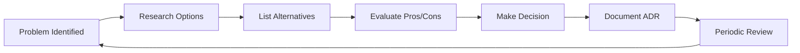
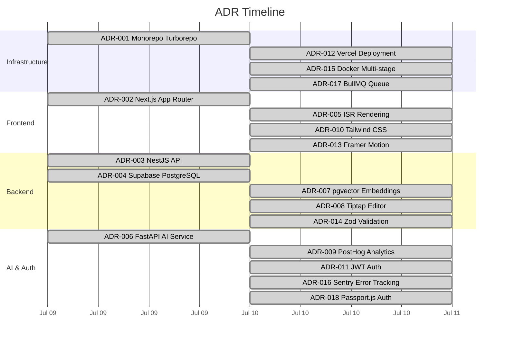

# Architectural Decision Log

> **Document:** `DecisionLog.md` | **Version:** 2.0 | **Last Updated:** July 2026
> **Status:** ✅ Active | **Owner:** Principal Architect

This document records the major architectural decisions made for the Ultimate Portfolio project. It follows a lightweight version of the Architectural Decision Record (ADR) format. All significant tool, library, and architecture choices must be recorded here.





## Template for New Entries

```markdown
### [Title]

- **Date**: YYYY-MM-DD
- **Status**: Proposed | Accepted | Deprecated | Superseded
- **Context**: What problem does this decision solve? What constraints exist?
- **Decision**: What was chosen and why.
- **Alternatives Considered**: Other options evaluated and why they were rejected.
- **Consequences**:
  - **Pros**: Expected benefits.
  - **Cons**: Trade-offs and known limitations.
- **Review Date**: YYYY-MM-DD
- **Owner**: Name
```

---

## Decisions

### 1. Monorepo Architecture with Turborepo

- **Date**: 2026-07-09
- **Status**: Accepted
- **Context**: The project consists of multiple interconnected applications (Web Frontend, API Backend, AI Service) sharing types and configurations.
- **Decision**: Use Turborepo with npm workspaces to manage the monorepo structure.
- **Consequences**:
  - **Pros**: Simplified dependency management, shared types (`@portfolio/shared`), faster builds with caching.
  - **Cons**: Increased initial setup complexity, learning curve for monorepo tooling.
- **Owner**: Principal Architect

### 2. Next.js 14 App Router for Frontend

- **Date**: 2026-07-09
- **Status**: Accepted
- **Context**: Need a highly performant, SEO-friendly portfolio and admin dashboard with complex 3D rendering capabilities.
- **Decision**: Adopt Next.js 14 utilizing the App Router with React Server Components by default.
- **Alternatives Considered**: Remix (inferior 3D ecosystem), Vite + React Router (no SSR/SEO), Astro (limited dynamic routing for admin).
- **Consequences**:
  - **Pros**: Server Components reduce bundle size, excellent SEO, built-in file system routing, Turbopack.
  - **Cons**: App Router caching can be complex, RSC + Three.js integration requires careful architecture.
- **Review Date**: 2027-01
- **Owner**: Principal Architect

### 3. NestJS for the Core Backend API

- **Date**: 2026-07-09
- **Status**: Accepted
- **Context**: Require a robust, scalable, and maintainable backend to serve the portfolio and handle admin operations.
- **Decision**: Use NestJS, following a strictly enforced 3-layer module pattern (Business Logic, Public Controllers, Admin Controllers).
- **Alternatives Considered**: Express (too minimal, no DI), Fastify (no guard/interceptor ecosystem), AdonisJS (less community support).
- **Consequences**:
  - **Pros**: Strong typing, dependency injection out-of-the-box, highly testable architecture, excellent Prisma integration.
  - **Cons**: Boilerplate-heavy compared to Express, steeper learning curve for new team members.
- **Review Date**: 2027-01
- **Owner**: Principal Architect

### 4. Supabase (PostgreSQL) with Prisma

- **Date**: 2026-07-09
- **Status**: Accepted
- **Context**: Need a scalable database that supports relational data, robust security rules, and vector embeddings for AI features.
- **Decision**: Utilize Supabase for hosted PostgreSQL (with pgvector) and Prisma as the ORM.
- **Alternatives Considered**: PlanetScale (no pgvector), MongoDB (no native vector search), Drizzle ORM (immature at decision time).
- **Consequences**:
  - **Pros**: Type-safe database access, RLS at the database level, integrated vector search, good free tier.
  - **Cons**: Prisma can be heavy on connection pooling (requires PgBouncer), Prisma migrations can be slow for large datasets.
- **Review Date**: 2027-01
- **Owner**: Principal Architect

### 5. FastAPI for AI Service

- **Date**: 2026-07-09
- **Status**: Accepted
- **Context**: The project includes AI-native features requiring Python ecosystem tools (LangChain, LLMs, embeddings).
- **Decision**: Isolate AI functionalities in a dedicated FastAPI microservice.
- **Alternatives Considered**: NestJS with LangChain.js (ecosystem less mature), Flask (less performant), single monolithic API.
- **Consequences**:
  - **Pros**: Native access to the rich Python AI ecosystem, high performance, clean API documentation (Swagger).
  - **Cons**: Introduces polyglot architecture (TypeScript + Python), complicating CI/CD and local development.
- **Review Date**: 2027-01
- **Owner**: Principal Architect

### 6. TanStack Query for Client-Side Data Fetching

- **Date**: 2026-07-10
- **Status**: Accepted
- **Context**: Admin dashboard requires client-side data fetching with caching, background refetching, optimistic updates, and pagination.
- **Decision**: Use TanStack Query (React Query) v5 for all client-side API calls.
- **Alternatives Considered**: SWR (fewer features, less mature), RTK Query (tight Redux coupling), plain fetch + useState (no caching).
- **Consequences**:
  - **Pros**: Built-in cache invalidation, deduplication, background refetching, devtools, optimistic updates for admin CRUD.
  - **Cons**: Adds ~12KB gzipped to bundle, learning curve for query keys and stale-time configuration.
- **Review Date**: 2027-07
- **Owner**: Tech Lead

### 7. Playwright for E2E Testing

- **Date**: 2026-07-10
- **Status**: Accepted
- **Context**: Need a cross-browser E2E testing framework with visual regression, trace viewer, and CI integration.
- **Decision**: Use Playwright as the sole E2E testing framework.
- **Alternatives Considered**: Cypress (limited browser support, slower), Selenium (unreliable, slow), Puppeteer (Chromium only).
- **Consequences**:
  - **Pros**: Cross-browser (Chromium, Firefox, WebKit), built-in trace viewer, visual regression, auto-wait, fast execution.
  - **Cons**: Smaller community than Cypress, WebKit support less mature.
- **Review Date**: 2027-07
- **Owner**: QA Lead

### 8. Zod as the Schema Validation Standard

- **Date**: 2026-07-10
- **Status**: Accepted
- **Context**: Need a single validation library shared between frontend and backend for API contract enforcement.
- **Decision**: Use Zod for all schema validation across the entire stack. Schemas live in `packages/shared`.
- **Alternatives Considered**: Yup (slower, weaker TypeScript inference), io-ts (complex API, smaller ecosystem), Joi (runtime only, no TypeScript inference).
- **Consequences**:
  - **Pros**: Excellent TypeScript inference (`z.infer`), single source of truth for types, fast runtime validation, transform capabilities.
  - **Cons**: Bundle size (~8KB gzipped), some complex schemas require verbose syntax.
- **Review Date**: 2027-07
- **Owner**: Tech Lead

### 9. Sentry for Error Monitoring

- **Date**: 2026-07-10
- **Status**: Accepted
- **Context**: Need production error tracking with source maps, breadcrumbs, and performance tracing.
- **Decision**: Integrate Sentry for both frontend (Next.js SDK) and backend (NestJS SDK) error monitoring, plus performance tracing.
- **Alternatives Considered**: Datadog RUM (expensive for small team), LogRocket (session replay focus), custom logging solution (maintenance burden).
- **Consequences**:
  - **Pros**: Rich context (breadcrumbs, user, environment), source map support, performance traces, generous free tier.
  - **Cons**: Adds ~30KB to frontend bundle, potential privacy concerns with user data in error reports.
- **Review Date**: 2027-07
- **Owner**: DevOps Lead

### 10. Pino for Structured Logging

- **Date**: 2026-07-10
- **Status**: Accepted
- **Context**: NestJS backend needs structured, JSON-formatted logging for production. Default NestJS logger is too basic.
- **Decision**: Use Pino (via `nestjs-pino`) for all server-side logging.
- **Alternatives Considered**: Winston (slower, more complex API), Bunyan (less maintained), NestJS default (not JSON, less performant).
- **Consequences**:
  - **Pros**: Fastest JSON logger for Node.js, native NestJS integration (`nestjs-pino`), automatic request logging.
  - **Cons**: Configuration is verbose, no built-in log viewer (requires external tool like Papertrail or Datadog).
- **Review Date**: 2027-07
- **Owner**: Tech Lead

### 11. MSW for API Mocking in Tests

- **Date**: 2026-07-10
- **Status**: Accepted
- **Context**: Frontend integration tests need reliable API mocking without starting the backend. The mock layer should be reusable across Vitest and Playwright.
- **Decision**: Use Mock Service Worker (MSW) v2 for all frontend API mocking.
- **Alternatives Considered**: MirageJS (less maintained), nock (Node-only, no browser), manual fetch mocks (brittle, verbose).
- **Consequences**:
  - **Pros**: Works in both Node (Vitest) and browser (Playwright), network-level interception, type-safe handlers, reset between tests.
  - **Cons**: Service Worker setup complexity, uncommon matchers for edge cases, debugging can be tricky.
- **Review Date**: 2027-07
- **Owner**: QA Lead

### 12. Husky + lint-staged for Pre-Commit Hooks

- **Date**: 2026-07-10
- **Status**: Accepted
- **Context**: Need automatic code formatting and linting before commits to maintain consistent code quality.
- **Decision**: Use Husky v9 with lint-staged to run Prettier and ESLint --fix on staged files.
- **Alternatives Considered**: Lefthook (fewer features), pre-commit (Python-native, less JS ecosystem integration), manual pre-commit hooks (maintenance burden).
- **Consequences**:
  - **Pros**: Auto-format on commit, guaranteed consistent code, fast (only processes staged files).
  - **Cons**: `--no-verify` bypass possible, initial setup takes ~30 minutes, can slow down large commits.
- **Review Date**: 2027-07
- **Owner**: Tech Lead

### 13. Zustand for Client-Side State Management

- **Date**: 2026-07-10
- **Status**: Accepted
- **Context**: Admin dashboard needs a lightweight state management solution for global UI state (sidebar open, active filters, theme).
- **Decision**: Use Zustand for global client-side state. Keeps server data in TanStack Query, UI-only state in Zustand.
- **Alternatives Considered**: Redux Toolkit (too much boilerplate for this scope), Jotai (good but overkill), Context API (performance issues with frequent updates).
- **Consequences**:
  - **Pros**: Tiny bundle (2KB), simple API, no providers needed, works outside React, TypeScript-first.
  - **Cons**: Less middleware ecosystem than Redux, no built-in devtools (requires separate middleware).
- **Review Date**: 2027-07
- **Owner**: Tech Lead

### 14. Three.js / React Three Fiber for 3D Portfolio Scene

- **Date**: 2026-07-10
- **Status**: Accepted
- **Context**: Portfolio requires an immersive 3D experience for the hero section and project visualizations.
- **Decision**: Use React Three Fiber (R3F) with Drei helpers for the 3D scene. Native Three.js for custom effects.
- **Alternatives Considered**: Pure Three.js (no React integration), Spline (closed source, less customizable), WebGL direct (too low-level), CSS 3D (limited capabilities).
- **Consequences**:
  - **Pros**: Declarative 3D (React-compatible), Drei provides common helpers (OrbitControls, Environment), strong TypeScript support.
  - **Cons**: Large bundle (Three.js ~500KB), performance tuning required for mobile, WebGL context limits, difficult to test.
- **Review Date**: 2027-01
- **Owner**: Tech Lead

## Cross-References
- [MASTER-INDEX.md](../MASTER-INDEX.md) — Documentation master index
- [CROSS-REFERENCE-INDEX.md](../26-reference/CROSS-REFERENCE-INDEX.md) — Cross-reference system
