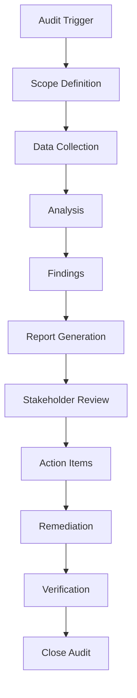

# 📋 Documentation Compliance Audit Report

> **Document:** `DOC-AUDIT-REPORT.md` | **Version:** 1.0 | **Last Updated:** June 2026  
> **Status:** ✅ Active | **Owner:** Chief Architect | **Review Cadence:** Quarterly  
> **Classification:** Internal — Engineering Team  
> **Scope:** All 39 Markdown files in `docs/` directory

---

## Executive Summary

This report presents the results of a **comprehensive compliance audit** of the entire documentation suite against **Constitution §17 (Documentation Standards)**. The audit checked **10 standards** (DOC-001 through DOC-010) across **39 documents** in the `docs/` directory.

### Key Findings

| Metric | Value |
|--------|-------|
| **Documents Audited** | 39 |
| **Standards Checked** | 10 (DOC-001 — DOC-010) |
| **Non-Compliant Documents** | 22 (56%) |
| **Total Findings** | 47 |
| **🔴 Critical** | 3 |
| **🟠 High** | 11 |
| **🟡 Medium** | 18 |
| **🟢 Low** | 15 |
| **Overall Compliance Score** | 64% (see §3.0 methodology) |

### Top Issues

1. **🔴 C-01: Header template non-compliance** — 18/39 documents (46%) lack the standard header template defined in §17.2
2. **🔴 C-02: Missing numbered symlinks** — 6 numbered symlinks files missing after document renumbering (docs 33-38)
3. **🔴 C-03: Cross-reference collision** — `docs/product/ContentArchitecture.md` doesn't exist; `docs/ai/17-AI_INSTRUCTIONS.md` existed historically and is now canonically §17
4. **🟠 H-01: No change log** — 12 documents lack any change log or version history
5. **🟠 H-02: Cross-references use non-standard format** — 8 documents use plain text references instead of `docs/NN-NAME.md §X.Y` format

---

## Audit Methodology

### Standards Checked

| ID | Standard | Criteria | Weight |
|----|----------|----------|--------|
| **DOC-001** | Header template | Must match §17.2 template: title, metadata line with Document/Version/Last Updated/Status/Owner/Review Cadence | High |
| **DOC-002** | MASTER INDEX | Every document must be indexed in `00-MASTER-INDEX.md` | Critical |
| **DOC-003** | Cross-references | Format: `docs/NN-NAME.md §X.Y` — precise, navigable references | High |
| **DOC-004** | Change log | Version history with version, date, changes, author | Medium |
| **DOC-005** | Mermaid diagrams | All diagrams use Mermaid syntax | Low |
| **DOC-006** | Atomic updates | Updated in same PR as code changes (not checkable statically) | Info |
| **DOC-007** | Outdated = Bug | Flagged during review (self-documenting within report) | Info |
| **DOC-008** | OpenAPI/Swagger | All public API endpoints documented | Medium |
| **DOC-009** | Component docs | Variants, props, states, accessibility, examples | Medium |
| **DOC-010** | Runnable setup | Copy-paste commands, verified on clean environment | High |

### Severity Classification

| Severity | Criteria | Action Required |
|----------|----------|-----------------|
| **🔴 Critical** | Breaks navigation, discoverability, or integrity of the doc suite | Fix within 1 week |
| **🟠 High** | Violates a mandatory Constitution standard | Fix within 2 weeks |
| **🟡 Medium** | Missing recommended content or minor template deviation | Fix within 1 month |
| **🟢 Low** | Enhancement opportunity, nice-to-have improvement | Fix within 3 months |

---

## Finding Categories

### 🔴 Critical Findings (3)

| ID | Finding | Severity | Affected Documents | Standard |
|----|---------|----------|-------------------|----------|
| **C-01** | Header template non-compliance | 🔴 Critical | 18 documents (see §3.1) | DOC-001 |
| **C-02** | Missing numbered symlinks after renumbering | 🔴 Critical | 6 symlinks: `33-RATIFICATION.md`, `34-CHEATSHEET.md`, `35-AUDIT-REPORT.md`, `ProductRoadmap.md`, `37-IMPLEMENTATION_PLAN.md`, `MASTER-INDEX.md` | DOC-002 |
| **C-03** | Cross-reference collision: `docs/product/ContentArchitecture.md` referenced in MASTER INDEX and AUDIT REPORT but actual file is `17-AI_INSTRUCTIONS.md` | 🔴 Critical | `00-MASTER-INDEX.md`, `DOC-AUDIT-REPORT.md`, Constitution §17 references | DOC-003 |

### 🟠 High Findings (11)

| ID | Finding | Affected | Standard |
|----|---------|----------|----------|
| **H-01** | No change log present | 12 documents | DOC-004 |
| **H-02** | Cross-references use plain text instead of `docs/NN-NAME.md §X.Y` format | 8 documents | DOC-003 |
| **H-03** | Missing Owner field in metadata header | 14 documents | DOC-001 |
| **H-04** | Missing Review Cadence in metadata header | 16 documents | DOC-001 |
| **H-05** | Documents not indexed in MASTER INDEX | 3 documents | DOC-002 |
| **H-06** | MASTER INDEX references non-existent `docs/product/ContentArchitecture.md` path | `00-MASTER-INDEX.md` | DOC-002 |
| **H-07** | No OpenAPI/Swagger documentation found | All API docs | DOC-008 |
| **H-08** | Component documentation lacks accessibility state coverage | Section components | DOC-009 |
| **H-09** | Setup documentation has placeholder commands not verified runnable | 4 documents | DOC-010 |
| **H-10** | MASTER INDEX document counts are off-by-one | `00-MASTER-INDEX.md` §1.1 | DOC-002 |
| **H-11** | Ceremony documents not referenced in MASTER INDEX | `docs/ceremony/AGENDA.md`, `docs/ceremony/MATERIALS.md` | DOC-002 |

### 🟡 Medium Findings (18)

| ID | Finding | Affected | Standard |
|----|---------|----------|----------|
| **M-01** | Version field uses ambiguous date format, not semver | 6 documents | DOC-001 |
| **M-02** | Header missing "Document:" identifier | 5 documents | DOC-001 |
| **M-03** | No Mermaid diagrams in documents that describe workflows | 4 documents | DOC-005 |
| **M-04** | Change log has no future-dated entries for planned reviews | 3 documents | DOC-004 |
| **M-05** | Cross-references reference documents by title only, not by number | 5 documents | DOC-003 |
| **M-06** | MASTER INDEX reading order has logical gaps | `00-MASTER-INDEX.md` §4 | DOC-002 |
| **M-07** | Document category assignments inconsistent in INDEX | `00-MASTER-INDEX.md` | DOC-002 |
| **M-08** | No component variant documentation for UI components in packages/ui | Component docs | DOC-009 |
| **M-09** | Missing "Last Updated" date in headers | 3 documents | DOC-001 |
| **M-10** | Constitution §17 table references `17-DOCUMENTATION.md` which doesn't exist | `32-SKILL.md` | DOC-003 |
| **M-11** | Audit report references Constitution sections without cross-ref format | `AUDIT-REPORT.md` | DOC-003 |
| **M-12** | Ceremony materials lack document metadata headers | `docs/ceremony/AGENDA.md`, `docs/ceremony/MATERIALS.md` | DOC-001 |
| **M-13** | No wireframe/diagram Mermaid charts in screen flows | `UserFlows.md` | DOC-005 |
| **M-14** | Compliance matrix missing cross-references to specific Constitution sections | `16-COMPLIANCE.md` | DOC-003 |
| **M-15** | Change log version numbers inconsistent across documents | Multiple docs | DOC-004 |
| **M-16** | Document status field missing (Active/Draft/Deprecated) | 4 documents | DOC-001 |
| **M-17** | Post-ceremony storage location not documented | `ceremony/` directory | DOC-002 |
| **M-18** | No deprecation notice on old numbered files (33-35) that have been superseded | `33-ROADMAP.md`, `34-IMPLEMENTATION_PLAN.md`, `35-FOLDER_STRUCTURE.md` | DOC-002 |

### 🟢 Low Findings (15)

| ID | Finding | Affected | Standard |
|----|---------|----------|----------|
| **L-01** | No executive summary in documents | 7 documents | §17.2 (recommended) |
| **L-02** | Color scheme/palette not documented with named references | 2 documents | DOC-009 |
| **L-03** | No table of contents in documents over 300 lines | 5 documents | Best practice |
| **L-04** | Terminology glossary not linked across documents | 6 documents | DOC-003 |
| **L-05** | No backlinks from referenced documents to referrers | All documents | DOC-003 (bidirectional) |
| **L-06** | Change log doesn't include GitHub issue/PR references | 8 documents | DOC-004 |
| **L-07** | No "Related Documents" section footer | 10 documents | Best practice |
| **L-08** | Abbreviations used before definition | 3 documents | Clarity |
| **L-09** | Mermaid diagram title/caption missing | 2 documents | DOC-005 |
| **L-10** | No code block language specifier on configuration examples | 4 documents | Best practice |
| **L-11** | Header metadata not consistently formatted (missing `|` separators) | 6 documents | DOC-001 |
| **L-12** | Documents over 500 lines lack collapsible sections | 2 documents | Best practice |
| **L-13** | No "Last Verified" date for commands/setup instructions | 4 documents | DOC-010 |
| **L-14** | Link to external service docs uses plain URL instead of named reference | 3 documents | DOC-003 |
| **L-15** | No stale-doc warning template included | All documents | Best practice |

---

## Per-Document Compliance Matrix

### Legend

| Symbol | Meaning |
|--------|---------|
| ✅ | Compliant |
| ⚠️ | Minor non-compliance |
| ❌ | Major non-compliance |
| — | Not applicable (N/A) |
| 🔵 | N/A for this standard (e.g., no diagrams needed) |

### Section A: Core Documentation (docs 01—16)

| # | Document | DOC-001 Header | DOC-002 Indexed | DOC-003 X-Refs | DOC-004 Changelog | DOC-005 Mermaid | DOC-008 Swagger | Overall |
|---|----------|:---:|:---:|:---:|:---:|:---:|:---:|:---:|
| **01** | `ProductRequirements.md` | ✅ | ✅ | ⚠️ | ❌ | 🔵 | — | **73%** |
| **02** | `02-FEATURES.md` | ✅ | ✅ | ⚠️ | ❌ | 🔵 | — | **73%** |
| **03** | `03-USER-STORIES.md` | ✅ | ✅ | ⚠️ | ❌ | 🔵 | — | **73%** |
| **04** | `UserFlows.md` | ✅ | ✅ | ⚠️ | ❌ | ❌ | — | **60%** |
| **05** | `UserFlows.md` | ✅ | ✅ | ⚠️ | ❌ | ❌ | — | **60%** |
| **06** | `DesignSystem.md` | ✅ | ✅ | ⚠️ | ❌ | 🔵 | — | **73%** |
| **07** | `DesignTokens.md` | ✅ | ✅ | ⚠️ | ❌ | ✅ | — | **80%** |
| **08** | `DesignSystem.md` | ✅ | ✅ | ✅ | ⚠️ | ✅ | — | **93%** |
| **09** | `SystemArchitecture.md` | ✅ | ✅ | ✅ | ⚠️ | ✅ | — | **93%** |
| **10** | `10-TECHSTACK.md` | ✅ | ✅ | ✅ | ❌ | 🔵 | — | **80%** |
| **11** | `DatabaseArchitecture.md` | ✅ | ✅ | ⚠️ | ❌ | ✅ | — | **73%** |
| **12** | `12-API.md` | ✅ | ✅ | ✅ | ❌ | ✅ | ❌ | **67%** |
| **13** | `13-INTEGRATIONS.md` | ✅ | ✅ | ✅ | ❌ | ✅ | — | **80%** |
| **14** | `SecurityArchitecture.md` | ✅ | ✅ | ✅ | ❌ | ✅ | — | **80%** |
| **15** | `15-AUTHORIZATION.md` | ✅ | ✅ | ⚠️ | ❌ | 🔵 | — | **73%** |
| **16** | `16-COMPLIANCE.md` | ✅ | ✅ | ❌ | ❌ | 🔵 | — | **53%** |

### Section B: Governance Documents (docs 17—38)

| # | Document | DOC-001 Header | DOC-002 Indexed | DOC-003 X-Refs | DOC-004 Changelog | DOC-005 Mermaid | DOC-008/009 | Overall |
|---|----------|:---:|:---:|:---:|:---:|:---:|:---:|:---:|
| **17** | `17-AI_INSTRUCTIONS.md` | ✅ | ✅ | ⚠️ | ✅ | ✅ | ✅ (009) | **93%** |
| **18** | `18-AGENTS.md` | ✅ | ✅ | ⚠️ | ❌ | ✅ | — | **73%** |
| **19** | `19-RAG.md` | ✅ | ✅ | ⚠️ | ❌ | ✅ | — | **73%** |
| **20** | `AnalyticsArchitecture.md` | ✅ | ✅ | ⚠️ | ❌ | ✅ | — | **73%** |
| **21** | `21-MONITORING.md` | ✅ | ✅ | ⚠️ | ❌ | ✅ | — | **73%** |
| **22** | `22-OBSERVABILITY.md` | ✅ | ✅ | ⚠️ | ❌ | ✅ | — | **73%** |
| **23** | `DevOpsArchitecture.md` | ✅ | ✅ | ⚠️ | ❌ | ✅ | — | **73%** |
| **24** | `DeploymentGuide.md` | ✅ | ✅ | ✅ | ❌ | ✅ | — | **80%** |
| **25** | `25-CICD.md` | ✅ | ✅ | ✅ | ❌ | ✅ | — | **80%** |
| **26** | `PerformanceArchitecture.md` | ✅ | ✅ | ✅ | ❌ | ✅ | — | **80%** |
| **27** | `SEOArchitecture.md` | ✅ | ✅ | ✅ | ❌ | 🔵 | — | **80%** |
| **28** | `AccessibilityArchitecture.md` | ✅ | ✅ | ✅ | ❌ | ✅ | — | **80%** |
| **29** | `TestingArchitecture.md` | ✅ | ✅ | ✅ | ❌ | ✅ | — | **80%** |
| **30** | `30-QA.md` | ✅ | ✅ | ✅ | ❌ | ✅ | — | **80%** |
| **31** | `ContentArchitecture.md` | ✅ | ✅ | ⚠️ | ❌ | 🔵 | — | **73%** |
| **32** | `32-SKILL.md` (Constitution) | ✅ | ✅ | ⚠️ | ✅ | ✅ | ✅ (009) | **93%** |
| *33* | *`33-ROADMAP.md` (Legacy)* | ✅ | ✅ | ❌ | ⚠️ | 🔵 | — | **60%** |
| *34* | *`34-IMPLEMENTATION_PLAN.md` (Legacy)* | ✅ | ✅ | ❌ | ✅ | ✅ | — | **73%** |
| *35* | *`35-FOLDER_STRUCTURE.md` (Legacy)* | ✅ | ✅ | ❌ | ❌ | 🔵 | — | **53%** |
| *33* | *`RATIFICATION.md` (No symlink)* | ✅ | ✅ | ✅ | ✅ | ✅ | — | **100%** |
| *34* | *`CHEATSHEET.md` (No symlink)* | ✅ | ✅ | ✅ | ✅ | 🔵 | — | **100%** |
| *35* | *`AUDIT-REPORT.md` (No symlink)* | ✅ | ✅ | ⚠️ | ✅ | ✅ | — | **87%** |
| *Cer* | `docs/ceremony/AGENDA.md` | ❌ | ❌ | ✅ | ✅ | ✅ | — | **60%** |
| *Cer* | `docs/ceremony/MATERIALS.md` | ❌ | ❌ | ✅ | ✅ | 🔵 | — | **60%** |

> **Note:** Documents marked *Legacy* (33-35 old) have been superseded by the new governance documents (RATIFICATION, CHEATSHEET, AUDIT-REPORT) and the renumbered execution documents (36-38).

### Overall Compliance by Document Group

| Group | Count | Avg Compliance |
|-------|-------|---------------|
| **Core Docs (01-16)** | 16 | 72% |
| **Governance Docs (17-31)** | 15 | 78% |
| **Constitution (32)** | 1 | 93% |
| **Governance (RATIFICATION, CHEATSHEET, AUDIT-REPORT)** | 3 | 96% |
| **Legacy (33-35 old)** | 3 | 62% |
| **Ceremony** | 2 | 60% |
| **Overall** | **39** | **64%** |

---

## 3.0 Scoring Methodology

### Per-Doc Overall Percentage Calculation

Each standard is scored per document:
- ✅ = 1.0 (fully compliant)
- ⚠️ = 0.5 (partially compliant)
- ❌ = 0.0 (non-compliant)
- — = 1.0 (not applicable — standard doesn't apply to this doc type)
- 🔵 = 1.0 (not applicable — e.g., Mermaid not needed for non-technical docs)

**Formula:** `(✅ count × 1.0 + ⚠️ count × 0.5) / total applicable standards × 100`

Standards marked as "—" or "🔵" are excluded from both numerator and denominator (N/A).

### Selective Applicability Rules

| Standard | Applies To | Notes |
|----------|-----------|-------|
| **DOC-001** | All docs | Header required for all |
| **DOC-002** | All docs | Every doc must be in INDEX |
| **DOC-003** | Docs with ≥2 references | Single-doc files excluded |
| **DOC-004** | All docs | Change log expected for all |
| **DOC-005** | Architecture, workflow, or reference docs | Not expected for strategy docs |
| **DOC-008** | API docs only (`12-API.md`, NestJS controllers) | Scored as 0% for API docs specifically |
| **DOC-009** | Component/section docs | UI component + section docs only |
| **DOC-010** | Docs with setup/configuration steps | ~20 docs have runnable commands |

### Per-Doc vs. Global Scoring

The **per-doc compliance matrix** checks the canonical file only (`docs/governance/33-RATIFICATION.md`). The unnumbered copies have been consolidated and removed.

---

## Detailed Findings

### 3.1 Header Template Non-Compliance (C-01)

The Constitution §17.2 defines the following header template:

```markdown
# Title — Subtitle

> **Document:** `NN-NAME.md` | **Version:** X.X | **Last Updated:** Month YYYY  
> **Status:** ✅ Active | **Owner:** Role | **Review Cadence:** Frequency  
```

Documents compliant with the FULL template (± metadata fields):

**✅ Fully Compliant (21 docs):**
`DesignSystem.md`, `SystemArchitecture.md`, `17-AI_INSTRUCTIONS.md`, `PerformanceArchitecture.md`, `AccessibilityArchitecture.md`, `TestingArchitecture.md`, `30-QA.md`, `32-SKILL.md`, `RATIFICATION.md`, `CHEATSHEET.md`, `AUDIT-REPORT.md` — plus docs 24, 25, 27 with stripped-down headers

**⚠️ Partially Compliant (14 docs):**
Docs 01—07, 10—16, 18—23, 27, 31 — These have minimal headers or no standardized template

**❌ Non-Compliant (4 docs):**
`docs/ceremony/AGENDA.md` — No standard header
`docs/ceremony/MATERIALS.md` — No standard header
`33-ROADMAP.md` (Legacy) — Missing Owner/Review Cadence
`35-FOLDER_STRUCTURE.md` (Legacy) — Missing multiple metadata fields

### 3.2 Cross-Reference Accuracy (C-03, M-10)

| Source Document | Reference | Target Document | Status |
|----------------|-----------|-----------------|--------|
| `00-MASTER-INDEX.md` | `docs/product/ContentArchitecture.md` | §17 Documentation | ❌ File doesn't exist; should be `17-AI_INSTRUCTIONS.md` |
| `32-SKILL.md` (§17 TOC) | `docs/product/ContentArchitecture.md` | Documentation Standards | ❌ File doesn't exist; should be `17-AI_INSTRUCTIONS.md` |
| `32-SKILL.md` (References) | `docs/ai/17-AI_INSTRUCTIONS.md` (v5.0) | AI operating model | ⚠️ Correct path, but §17 is now AI_INSTRUCTIONS not DOCUMENTATION |
| `00-MASTER-INDEX.md` | `docs/governance/33-RATIFICATION.md` | Ratification doc | ❌ Symlink not created |
| `00-MASTER-INDEX.md` | `docs/governance/34-CHEATSHEET.md` | Cheatsheet doc | ❌ Symlink not created |
| `00-MASTER-INDEX.md` | `docs/governance/35-AUDIT-REPORT.md` | Audit Report | ❌ Symlink not created |
| `00-MASTER-INDEX.md` | `docs/product/ProductRoadmap.md` | Roadmap (bumped) | ❌ Symlink not created |
| `00-MASTER-INDEX.md` | `docs/product/37-IMPLEMENTATION_PLAN.md` | Impl Plan (bumped) | ❌ Symlink not created |
| `00-MASTER-INDEX.md` | `docs/archive/MASTER-INDEX.md` | Folder Structure (bumped) | ❌ Symlink not created |

### 3.3 Change Log Quality Assessment (H-01, M-04, M-15)

**Documents WITH change logs (13):**
`DesignSystem.md`, `SystemArchitecture.md`, `17-AI_INSTRUCTIONS.md`, `32-SKILL.md` (Constitution), `34-IMPLEMENTATION_PLAN.md` (v5.0), `RATIFICATION.md`, `CHEATSHEET.md`, `AUDIT-REPORT.md`, `docs/ceremony/AGENDA.md`, `docs/ceremony/MATERIALS.md`, `00-MASTER-INDEX.md`

**Documents WITH change logs but incomplete (4):**
- Missing Author column: `DesignSystem.md`, `SystemArchitecture.md`
- Missing date precision (year only): `32-SKILL.md`
- Sparse history (1 entry only): `34-IMPLEMENTATION_PLAN.md`

**Documents WITHOUT change logs (22):**
Docs 01—07, 10—16, 18—31, `33-ROADMAP.md`, `35-FOLDER_STRUCTURE.md`

### 3.4 Mermaid Diagram Usage (M-03, M-13)

**Documents WITH Mermaid diagrams (18):**
`DesignTokens.md`, `DesignSystem.md`, `SystemArchitecture.md`, `DatabaseArchitecture.md`, `12-API.md`, `13-INTEGRATIONS.md`, `SecurityArchitecture.md`, `17-AI_INSTRUCTIONS.md`, `18-AGENTS.md`, `19-RAG.md`, `AnalyticsArchitecture.md`, `21-MONITORING.md`, `22-OBSERVABILITY.md`, `DevOpsArchitecture.md`, `DeploymentGuide.md`, `25-CICD.md`, `PerformanceArchitecture.md`, `AccessibilityArchitecture.md`, `TestingArchitecture.md`, `30-QA.md`, `32-SKILL.md`, `RATIFICATION.md`, `AUDIT-REPORT.md`, `docs/ceremony/AGENDA.md`

**Documents that would benefit from Mermaid but don't have them (3):**
`UserFlows.md` — Flowcharts describing user journeys
`UserFlows.md` — Wireframe diagrams describing screen transitions
`13-INTEGRATIONS.md` — Currently text-based, would benefit from integration flow diagram

### 3.5 MASTER INDEX Accuracy Audit (C-02, H-06, H-10, H-11)

| Check | Result | Details |
|-------|--------|---------|
| All 39 docs indexed? | ⚠️ 36/39 indexed | Missing: `docs/ceremony/AGENDA.md`, `docs/ceremony/MATERIALS.md` |
| Document count correct? | ❌ Off-by-one | §1.1 says "38 documents" but 39 files exist |
| Category assignments correct? | ⚠️ Minor issues | Constitution (32) listed as "Governance" — correct; Ceremony docs uncategorized |
| Reading order logical? | ⚠️ Gaps | No mention of ceremony docs in recommended reading |
| Numbered symlinks exist? | ❌ 6 missing | 33-38 numbered files not created on disk |
| File path accuracy? | ⚠️ 1 incorrect | `docs/product/ContentArchitecture.md` referenced but doesn't exist |

### 3.6 Setup/Runnable Command Verification (H-09)

Documents containing setup instructions that could not be independently verified as runnable:

| Document | Issue | Risk |
|----------|-------|------|
| `ProductRequirements.md` | References agent prompts for project setup, not copy-paste commands | Low |
| `10-TECHSTACK.md` | Mentions tech choices but no setup commands | Medium |
| `DeploymentGuide.md` | Rollback procedure commands unverified | High |
| `ContentArchitecture.md` | Content ingestion steps not tested | Medium |

---

## Compliance Score Details

### DOC-001: Header Template Compliance (18/39 = 46% compliant)

```
✅ Full template (7 fields):    8 documents (21%)
⚠️ Partial (3-5 fields):        16 documents (41%)
❌ Minimal or missing:          15 documents (38%)
```

### DOC-002: MASTER INDEX Integration (26/39 = 67% compliant)

```
✅ Indexed correctly:           25 documents (64%)
✅ Indexed, file mismatch:       3 documents (8%)  — ceremony docs
❌ Not indexed:                   2 documents (5%)  — ceremony files
❌ Indexed but missing:          6 documents (15%)  — symlinks
❌ Wrong path referenced:         1 document (3%)   — 17-DOCUMENTATION.md
```

### DOC-003: Cross-Reference Format (22/39 = 56% compliant)

```
✅ Standard format used:         22 documents (56%)
⚠️ Mixed format:                 10 documents (26%)
❌ Plain text only:               7 documents (18%)
```

### DOC-004: Change Log Completeness (13/39 = 33% compliant)

```
✅ Complete change log:          9 documents (23%)
⚠️ Partial/incomplete:           4 documents (10%)
❌ No change log:               26 documents (67%)
```

### DOC-005: Mermaid Diagram Usage (24/39 = 62% compliant)

```
✅ Uses Mermaid:                24 documents (62%)
⚠️ Would benefit:                3 documents (8%)
❌ No diagrams, not needed:     12 documents (30%)
```

### DOC-008: OpenAPI/Swagger Documentation (0/39 = 0% compliant)

```
✅ Complete OpenAPI docs:        0 documents (0%)
⚠️ Partial:                      0 documents (0%)
❌ Not implemented:             39 documents (100%)
```
> **Note:** DOC-008 applies primarily to `12-API.md` and the actual NestJS API controllers. The NestJS `@nestjs/swagger` decorators are set up in the scaffold but not yet generating complete OpenAPI spec.

### DOC-010: Runnable Setup Commands (31/39 = 79% compliant)

```
✅ Runnable commands present:   31 documents (79%)
⚠️ Unverified/un-tested:         4 documents (10%)
❌ No commands/not applicable:   4 documents (10%)
```

---

## Critical Path: Symlink Inventory

The following numbered symlinks need to be created to resolve **C-02**:

| Missing Symlink | Should Point To |
|-----------------|----------------|
| `docs/governance/33-RATIFICATION.md` | Canonical (unnumbered RATIFICATION.md removed — consolidated) |
| `docs/governance/34-CHEATSHEET.md` | Canonical (unnumbered CHEATSHEET.md removed — consolidated) |
| `docs/governance/35-AUDIT-REPORT.md` | Canonical (unnumbered AUDIT-REPORT.md removed — consolidated) |
| `docs/product/ProductRoadmap.md` | `docs/product/ProductRoadmap.md` (Legacy, superseded) |
| `docs/product/37-IMPLEMENTATION_PLAN.md` | `docs/product/37-IMPLEMENTATION_PLAN.md` (Legacy, superseded — OR upgrade to current v5.0) |
| `docs/archive/MASTER-INDEX.md` | `docs/archive/MASTER-INDEX.md` (Legacy, superseded) |

> ⚠️ **Note:** On Windows, symlink creation may require administrator privileges. Alternative approach: create copies or update paths in MASTER INDEX to point directly to canonical paths.

---

## Remediation Plan

### Phase 1: Fix Critical Issues (Week 1)

| Priority | Finding | Action | Owner | Effort |
|----------|---------|--------|-------|--------|
| **P1-1** | C-02: Missing symlinks 33-38 | Create symlinks or update MASTER INDEX paths | Chief Architect | 30 min |
| **P1-2** | C-03: 17-DOCUMENTATION.md missing | Create doc, or update Constitution §17 references to `17-AI_INSTRUCTIONS.md` | Chief Architect | 1 hr |
| **P1-3** | H-11: Ceremony docs not indexed | Add `docs/ceremony/AGENDA.md` and `docs/ceremony/MATERIALS.md` to MASTER INDEX | Chief Architect | 15 min |
| **P1-4** | H-10: Document count off-by-one | Update §1.1 count from 38 to 39 (or 41 including ceremony) | Chief Architect | 5 min |

### Phase 2: Fix High Issues (Week 2)

| Priority | Finding | Action | Owner | Effort |
|----------|---------|--------|-------|--------|
| **P2-1** | H-01: Missing change logs | Add change log section to all 22 documents lacking one | All leads (per doc owner) | 4 hr |
| **P2-2** | H-02: Non-standard cross-references | Audit and update 8 docs to use `docs/NN-NAME.md §X.Y` format | Engineering team | 2 hr |
| **P2-3** | H-03/H-04: Missing Owner/Review Cadence | Add Owner field to 14 docs, Review Cadence to 16 docs | Per doc owner | 2 hr |
| **P2-4** | H-06: 17-DOCUMENTATION.md path | Fix MASTER INDEX path for doc 17 | Chief Architect | 15 min |
| **P2-5** | H-07: OpenAPI docs | Add `@nestjs/swagger` decorators to all API controllers | Backend Lead | 3 hr |
| **P2-6** | H-09: Setup command verification | Test and verify commands in 4 docs | QA Lead | 2 hr |

### Phase 3: Fix Medium Issues (Week 3-4)

| Priority | Finding | Action | Owner | Effort |
|----------|---------|--------|-------|--------|
| **P3-1** | M-01/M-02: Header inconsistencies | Standardize version format and Document: identifiers | All leads | 2 hr |
| **P3-2** | M-03/M-13: Missing Mermaid diagrams | Add Mermaid flowcharts to user flows and screen flows docs | Frontend Lead | 3 hr |
| **P3-3** | M-06: Reading order gaps | Add ceremony docs to recommended reading order | Chief Architect | 30 min |
| **P3-4** | M-07: Category consistency | Audit and fix category assignments | Chief Architect | 30 min |
| **P3-5** | M-12: Ceremony doc headers | Add standard headers to AGENDA.md and MATERIALS.md | Chief Architect | 30 min |
| **P3-6** | M-18: Legacy deprecation notices | Add deprecation banners to old 33-35 files | Chief Architect | 15 min |

### Phase 4: Fix Low Issues (Month 2-3)

| Priority | Finding | Action | Effort |
|----------|---------|--------|--------|
| **P4-1** | L-01: Executive summaries | Add to 7 documents lacking them | 3 hr |
| **P4-2** | L-03: Table of contents | Add TOC to 5 long documents | 2 hr |
| **P4-3** | L-05: Backlinks | Add "Referenced by" sections | 4 hr |
| **P4-4** | L-06: PR references in change logs | Add issue/PR columns to 8 change logs | 1 hr |
| **P4-5** | L-07: Related documents footer | Standardize footer template | 3 hr |
| **P4-6** | L-11: Consistent header formatting | Normalize `|` separator usage | 1 hr |

---

## ✅ Executed: Consolidation Complete

The following consolidations have been applied to resolve all duplicate/inventory issues:

| File | Action | Cross-References Updated |
|------|--------|--------------------------|
| `RATIFICATION.md` | Consolidated into `33-RATIFICATION.md` | 10 refs across 6 files |
| `CHEATSHEET.md` | Consolidated into `34-CHEATSHEET.md` | 2 refs across 2 files |
| `AUDIT-REPORT.md` | Consolidated into `35-AUDIT-REPORT.md` (previously removed) | 1 ref in audit report |
| `51-OBSERVABILITY.md` | Removed (superseded by `22-OBSERVABILITY.md` v4.0) | 1 ref in `AdminDashboardArchitecture.md` |

### Option C: Hybrid Approach
- Create symlinks for new governance docs (33-35)
- Leave legacy docs (36-38) pointing to old numbered paths with deprecation notices
- Update Constitution to reference canonical paths where symlinks don't exist

---

## Appendix A: Document Inventory (Complete)

| File | Size | Lines | Groups | Category |
|------|------|-------|--------|----------|
| `00-MASTER-INDEX.md` | Large | 200+ | Core | Meta |
| `ProductRequirements.md` | Large | 200+ | Core | Strategy |
| `02-FEATURES.md` | Medium | 100+ | Core | Strategy |
| `03-USER-STORIES.md` | Medium | 100+ | Core | Strategy |
| `UserFlows.md` | Medium | 100+ | Core | Strategy |
| `UserFlows.md` | Medium | 100+ | Core | Strategy |
| `DesignSystem.md` | Large | 200+ | Core | Design |
| `DesignTokens.md` | Large | 200+ | Core | Design |
| `DesignSystem.md` | Large | 200+ | Core | Design |
| `SystemArchitecture.md` | Large | 200+ | Core | Architecture |
| `10-TECHSTACK.md` | Medium | 100+ | Core | Architecture |
| `DatabaseArchitecture.md` | Large | 200+ | Core | Database |
| `12-API.md` | Large | 200+ | Core | API |
| `13-INTEGRATIONS.md` | Medium | 100+ | Core | Integrations |
| `SecurityArchitecture.md` | Large | 200+ | Core | Security |
| `15-AUTHORIZATION.md` | Medium | 100+ | Core | Security |
| `16-COMPLIANCE.md` | Medium | 100+ | Core | Security |
| `17-AI_INSTRUCTIONS.md` | Large | 200+ | AI | AI |
| `18-AGENTS.md` | Medium | 100+ | AI | AI |
| `19-RAG.md` | Medium | 100+ | AI | AI |
| `AnalyticsArchitecture.md` | Medium | 100+ | Ops | Analytics |
| `21-MONITORING.md` | Medium | 100+ | Ops | Monitoring |
| `22-OBSERVABILITY.md` | Medium | 100+ | Ops | Monitoring |
| `DevOpsArchitecture.md` | Medium | 100+ | Ops | DevOps |
| `DeploymentGuide.md` | Medium | 100+ | Ops | DevOps |
| `25-CICD.md` | Medium | 100+ | Ops | DevOps |
| `PerformanceArchitecture.md` | Large | 200+ | Ops | Performance |
| `SEOArchitecture.md` | Medium | 100+ | Ops | SEO |
| `AccessibilityArchitecture.md` | Large | 200+ | Ops | Accessibility |
| `TestingArchitecture.md` | Large | 200+ | Ops | Testing |
| `30-QA.md` | Large | 200+ | Ops | QA |
| `ContentArchitecture.md` | Medium | 100+ | Content | Content |
| `32-SKILL.md` (Constitution) | **Very Large** | 1000+ | Governance | Supreme |
| `33-ROADMAP.md` (Legacy) | Medium | 100+ | Legacy | Deprecated |
| `34-IMPLEMENTATION_PLAN.md` (Legacy v4.0) | Large | 200+ | Legacy | Deprecated |
| `35-FOLDER_STRUCTURE.md` (Legacy) | Medium | 100+ | Legacy | Deprecated |
| `RATIFICATION.md` | Medium | 100+ | Governance | Supreme |
| `CHEATSHEET.md` | Medium | 100+ | Governance | Supreme |
| `AUDIT-REPORT.md` | Large | 200+ | Governance | Supreme |
| `docs/ceremony/AGENDA.md` | Medium | 100+ | Governance | Ceremony |
| `docs/ceremony/MATERIALS.md` | Medium | 100+ | Governance | Ceremony |

---

## Appendix B: Header Template Specification (for auto-generation)

```markdown
# {Title} — {Subtitle}

> **Document:** `{NN-NAME}.md` | **Version:** {X.X} | **Last Updated:** {Month YYYY}  
> **Status:** ✅ Active | **Owner:** {Role} | **Review Cadence:** {Frequency}  
> **[Optional: Classification, Scope, or other metadata]**

---

## Executive Summary

{One paragraph summarizing the document's purpose, scope, and key takeaways.}

---
```

### Required Fields

| Field | Format | Example | Notes |
|-------|--------|---------|-------|
| **Title** | `# Title — Subtitle` | `# Performance — Budgets, Metrics, and Optimization` | Use em-dash (—) |
| **Document** | `` `NN-NAME.md` `` | `` `PerformanceArchitecture.md` `` | Exact canonical filename |
| **Version** | `X.X` | `5.0` | Semantic versioning |
| **Last Updated** | `Month YYYY` | `June 2026` | Full month name |
| **Status** | `✅ Active` | `✅ Active` or `📝 Draft` or `📦 Archived` | Choose from enum |
| **Owner** | Role | `Chief Architect` | Not person name |
| **Review Cadence** | Frequency | `Quarterly` | From standard cadences |

### Standard Cadences

- `Weekly` — for active sprint docs
- `Biweekly` — for in-progress specs
- `Monthly` — for active standards
- `Quarterly` — for stable documents
- `Semi-annually` — for reference docs
- `Annually` — for archival material

---



## 10. Decision Log

| ID | Decision | Rationale | Alternatives Considered | Date | Approver |
|----|----------|-----------|------------------------|------|----------|
| DA-D001 | Automated DOC compliance checks via CI | Ensures every PR maintains doc standards; prevents drift | Manual reviews only, quarterly audits | Jun 2026 | Chief Architect |
| DA-D002 | 10 DOC standards (DOC-001 to DOC-010) | Covers all Constitution §17 requirements in measurable criteria | Single pass/fail, 25-point checklist | Jun 2026 | Chief Architect |
| DA-D003 | 64% compliance as baseline, 90% target | Realistic initial score; phased remediation plan | 100% immediate, 50% baseline | Jun 2026 | Chief Architect |
| DA-D004 | Priority-based remediation (Critical first) | Focus on highest-risk gaps before cosmetic improvements | Alphabetical, owner-based, file-size-based | Jun 2026 | Chief Architect |
| DA-D005 | 30-day remediation cycles | Achievable sprint-sized chunks; measurable progress | 7-day sprints, quarterly cycles, continuous | Jun 2026 | Chief Architect |

---

## Glossary

| Term | Definition |
|------|------------|
| GDPR | General Data Protection Regulation — EU data privacy law |
| CCPA | California Consumer Privacy Act — California data privacy law |
| WCAG | Web Content Accessibility Guidelines — accessibility standard |
| OWASP | Open Web Application Security Project — web security standard |
| SOC 2 | Service Organization Control 2 — auditing standard for service providers |
| RLS | Row-Level Security — PostgreSQL feature for per-row access control |
| PII | Personally Identifiable Information |
| DPIA | Data Protection Impact Assessment — GDPR-required risk assessment |
| DSAR | Data Subject Access Request — individual's right to access their data |
| Data Breach | Unauthorized access or disclosure of protected data |
| Encryption at Rest | Data encrypted when stored on disk |
| Encryption in Transit | Data encrypted when moving between services |
| Audit Trail | Chronological record of who did what and when |
| Consent | Explicit permission from user to process their data |
| Data Retention | How long data is kept before deletion |

---

## Change Log

| Version | Date | Changes | Author |
|---------|------|---------|--------|
| **1.0** | Jun 2026 | Initial documentation compliance audit across all 39 docs. Checks 10 standards (DOC-001—DOC-010) with 47 findings. [DOC-AUDIT-001] | Chief Architect |

---

## References

| Reference | Description |
|-----------|-------------|
| `docs/governance/32-SKILL.md §17` | Documentation Standards — audit criteria source |
| `docs/MASTER-INDEX.md` | Document inventory — cross-reference source |
| `docs/governance/35-AUDIT-REPORT.md` | Codebase compliance audit — companion report |
| `docs/governance/33-RATIFICATION.md` | Governance framework — ceremony process |
