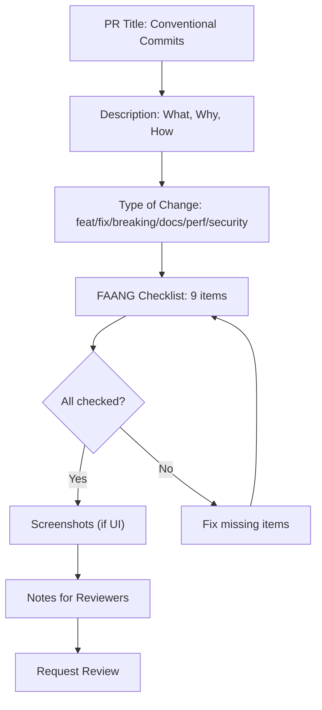

# Pull Request Template — FAANG Enterprise Standard

> **Document:** `PRTemplate.md` | **Version:** 5.0 (Enterprise Upgrade) | **Last Updated:** July 2026  
> **Status:** ✅ Active | **Owner:** Principal DevOps Engineer | **Review Cadence:** Quarterly

## 1. Executive Summary

This document defines the strict Pull Request template required for all merges into `main`. It enforces FAANG-level rigor for testing, documentation, and architecture adherence.



---

## 2. Template Output (.github/pull_request_template.md)

```markdown
## Description

<!-- Describe the changes introduced by this pull request. Link to Jira/Linear tickets. -->

Fixes # (issue)

## Type of Change

<!-- Check all that apply -->

- [ ] 🐛 Bug fix (non-breaking change which fixes an issue)
- [ ] ✨ New feature (non-breaking change which adds functionality)
- [ ] 💥 Breaking change (fix or feature that would cause existing functionality to not work as expected)
- [ ] 📝 Documentation update
- [ ] 🚀 Performance optimization
- [ ] 🛡️ Security patch

## FAANG Enterprise Checklist

<!-- All items must be checked off before merge -->

- [ ] My code follows the [Coding Standards](../docs/23-governance/CodingStandards.md) and [Component Standards](../docs/04-design/ComponentStandards.md).
- [ ] I have performed a self-review of my own code.
- [ ] I have added comprehensive unit tests for all new business logic.
- [ ] E2E Playwright tests pass locally.
- [ ] I have verified accessibility (WCAG 2.1 AA) using axe-core or equivalent tools.
- [ ] The bundle size has not significantly increased without justification.
- [ ] All new dependencies have been vetted for security and license compliance.
- [ ] I have added/updated relevant documentation in the `/docs` directory.
- [ ] Zod schemas have been updated to reflect any API contract changes.

## Screenshots / Screen Recordings

<!-- If applicable, add screenshots or recordings to show UI changes. -->

## Notes for Reviewers

<!-- Any specific areas you want reviewers to focus on? -->
```

## Cross-References

- [MASTER-INDEX.md](../MASTER-INDEX.md) — Documentation master index
- [CROSS-REFERENCE-INDEX.md](../26-reference/CROSS-REFERENCE-INDEX.md) — Cross-reference system
