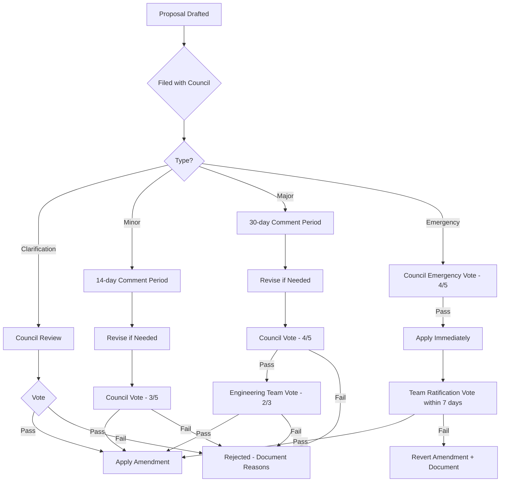
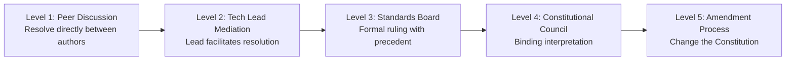
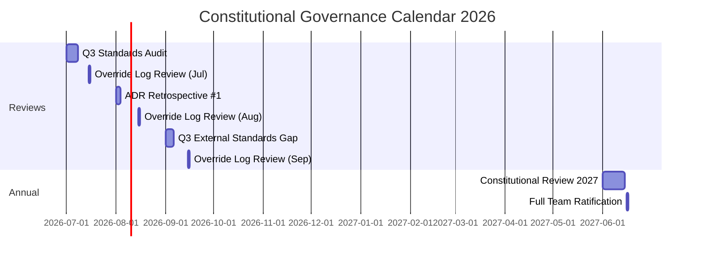

# 📜 Ratification of the AI Engineering Constitution

> **Document:** `33-RATIFICATION.md` | **Version:** 1.0 | **Last Updated:** June 2026  
> **Status:** ✅ Ratified | **Classification:** **BINDING GOVERNANCE DOCUMENT**  
> **Effective Date:** June 16, 2026 | **Review Date:** June 16, 2027 (Annual)  
> **Ratified By:** Portfolio Engineering Team

---

## Executive Summary

This document formally records the **ratification** of the [AI Engineering Constitution](32-SKILL.md) as the **supreme governing law** for all engineering activity within the Portfolio Platform. Ratification signifies that every engineer, architect, and contributor agrees to be bound by the standards, rules, and practices defined therein. This document also establishes the **governance framework**, **amendment process**, **dispute resolution mechanism**, and **constitutional oversight bodies** required to uphold the Constitution's integrity over time.

---

## Table of Contents

1. [Ratification Ceremony](#1-ratification-ceremony)
2. [Signatory Record](#2-signatory-record)
3. [Governance Bodies](#3-governance-bodies)
4. [Amendment Process](#4-amendment-process)
5. [Dispute Resolution](#5-dispute-resolution)
6. [Review Cadence](#6-review-cadence)
7. [Training & Onboarding](#7-training--onboarding)
8. [Constitutional Compliance Badge](#8-constitutional-compliance-badge)
9. [Change Log](#9-change-log)
10. [Decision Log](#10-decision-log)
11. [Glossary](#11-glossary)

---

## 1. Ratification Ceremony

### 1.1 Declaration

> **We, the undersigned members of the Portfolio Engineering Team, do hereby establish and ratify the AI Engineering Constitution as the supreme governing law of this project.**
>
> We recognize that software engineering excellence is not an accident but a deliberate practice. This Constitution codifies the standards, rules, and practices that we collectively commit to uphold. We understand that these standards may require additional effort in the short term, but we accept this burden as the price of long-term quality, maintainability, and professional pride.
>
> **Signed this 16th day of June, 2026.**

### 1.2 Ceremony Protocol

The ratification ceremony follows a structured protocol to ensure seriousness and collective buy-in:

| Step                   | Action                                                          | Duration | Responsible     |
| ---------------------- | --------------------------------------------------------------- | -------- | --------------- |
| **1. Reading**         | Full Constitution read by team members section by section       | 2 hours  | Chief Architect |
| **2. Q&A**             | Open floor for questions and clarifications                     | 1 hour   | All attendees   |
| **3. Voting**          | Each section voted on individually. Unanimous consent required. | 30 min   | All attendees   |
| **4. Reservation Log** | Team members may log reservations (see §1.3)                    | 15 min   | All attendees   |
| **5. Signing**         | All team members sign the ratification record                   | 15 min   | All attendees   |
| **6. Oath**            | Collective oath recited by the team                             | 5 min    | Chief Architect |
| **7. Commemoration**   | Ratification commit to `main` with all signatures               | 5 min    | Tech Lead       |

### 1.3 Reservation Log

Any team member may record a formal reservation at the time of ratification. Reservations do not block ratification but must be addressed within 90 days.

| Reservation ID | Section | Team Member | Concern | Status | Resolution Date |
| -------------- | ------- | ----------- | ------- | ------ | --------------- |
| —              | —       | —           | —       | —      | —               |

---

## 2. Signatory Record

### 2.1 Engineering Leadership

| Role                | Name           | Signature                  | Date         | Statement                                                                                 |
| ------------------- | -------------- | -------------------------- | ------------ | ----------------------------------------------------------------------------------------- |
| **Chief Architect** | _[Enter Name]_ | ************\_************ | Jun 16, 2026 | "I uphold this Constitution as the architectural foundation of our engineering practice." |
| **Frontend Lead**   | _[Enter Name]_ | ************\_************ | Jun 16, 2026 | "I ensure every component, every hook, every style adheres to the standards herein."      |
| **Backend Lead**    | _[Enter Name]_ | ************\_************ | Jun 16, 2026 | "I enforce API integrity, database discipline, and service separation as defined."        |
| **AI Lead**         | _[Enter Name]_ | ************\_************ | Jun 16, 2026 | "I commit to safety-first AI development, cost discipline, and hallucination prevention." |
| **QA Lead**         | _[Enter Name]_ | ************\_************ | Jun 16, 2026 | "I verify that every quality gate is enforced and every definition of done is met."       |
| **Security Lead**   | _[Enter Name]_ | ************\_************ | Jun 16, 2026 | "I ensure OWASP compliance and security-by-default across all layers."                    |

### 2.2 Engineering Team

| Role                  | Name           | Signature                  | Date         |
| --------------------- | -------------- | -------------------------- | ------------ |
| **Senior Engineer**   | _[Enter Name]_ | ************\_************ | Jun 16, 2026 |
| **Senior Engineer**   | _[Enter Name]_ | ************\_************ | Jun 16, 2026 |
| **Software Engineer** | _[Enter Name]_ | ************\_************ | Jun 16, 2026 |
| **Software Engineer** | _[Enter Name]_ | ************\_************ | Jun 16, 2026 |
| **DevOps Engineer**   | _[Enter Name]_ | ************\_************ | Jun 16, 2026 |
| **Design Engineer**   | _[Enter Name]_ | ************\_************ | Jun 16, 2026 |

### 2.3 Canonical Storage

The official ratified copy of this Constitution is maintained at:

| Artifact                | Location                                                 | Format                               |
| ----------------------- | -------------------------------------------------------- | ------------------------------------ |
| **Signed Constitution** | `docs/23-governance/32-SKILL.md` on `main` branch        | Markdown + Git commit history        |
| **Ratification Record** | `docs/23-governance/33-RATIFICATION.md` on `main` branch | Markdown with embedded signatures    |
| **Archived Snapshot**   | `docs/archive/constitution-v5.0-ratified.pdf`            | PDF (generated from signed Markdown) |

> **Note:** All placeholder names (`[Enter Name]`, `[TBD]`) must be filled within **14 calendar days** of the ratification date. The Chief Architect is responsible for collecting and recording signatures.

### 2.4 Witnesses

| Role                    | Name           | Signature                  | Date         |
| ----------------------- | -------------- | -------------------------- | ------------ |
| **Product Owner**       | _[Enter Name]_ | ************\_************ | Jun 16, 2026 |
| **Engineering Manager** | _[Enter Name]_ | ************\_************ | Jun 16, 2026 |

---

## 3. Governance Bodies

### 3.1 Constitutional Council

The Constitutional Council is the highest governance body for interpreting and enforcing the Constitution.

| Role                                  | Member  | Term              | Appointment                 |
| ------------------------------------- | ------- | ----------------- | --------------------------- |
| **Chief Justice (Architecture Lead)** | _[TBD]_ | 1 year, renewable | Elected by engineering team |
| **Justice (Frontend)**                | _[TBD]_ | 1 year, renewable | Appointed by Chief Justice  |
| **Justice (Backend)**                 | _[TBD]_ | 1 year, renewable | Appointed by Chief Justice  |
| **Justice (AI/ML)**                   | _[TBD]_ | 1 year, renewable | Appointed by Chief Justice  |
| **Justice (Security)**                | _[TBD]_ | 1 year, renewable | Appointed by Chief Justice  |

**Council Powers:**

- Interpret constitutional provisions when ambiguity exists
- Approve or reject constitutional amendments
- Review override log entries monthly
- Hear disputes that cannot be resolved at lower levels
- Grant emergency exemptions (requires 4/5 majority)

**Council Meetings:**
| Meeting Type | Frequency | Duration | Quorum |
|-------------|-----------|----------|--------|
| Regular | Monthly | 1 hour | 3/5 members |
| Emergency | As needed | 30 min | 3/5 members |
| Annual review | Yearly | 4 hours | 5/5 members |

### 3.2 Standards Enforcement Board

The Standards Enforcement Board handles day-to-day enforcement, violation reviews, and escalations.

| Role                       | Responsibility                                                 |
| -------------------------- | -------------------------------------------------------------- |
| **Enforcement Lead**       | Owns CI gates, violation tracking, audit scheduling            |
| **PR Review Coordinator**  | Ensures all PRs meet review standards and SLAs                 |
| **Documentation Steward**  | Tracks documentation freshness and cross-reference accuracy    |
| **Accessibility Advocate** | Ensures WCAG compliance, advocates for users with disabilities |

### 3.3 Technical Advisory Board

For high-impact technical decisions that affect multiple teams or the architecture as a whole.

| Member               | Composed of                                                   |
| -------------------- | ------------------------------------------------------------- |
| **Voting Members**   | All leads (Architecture, Frontend, Backend, AI, QA, Security) |
| **Advisory Members** | Senior engineers (non-voting)                                 |
| **Meeting Cadence**  | Bi-weekly, or as needed for ADR reviews                       |

---

## 4. Amendment Process

### 4.1 Amendment Types

| Type                 | Description                                                              | Approval Required                                                              | Effective              |
| -------------------- | ------------------------------------------------------------------------ | ------------------------------------------------------------------------------ | ---------------------- |
| **🟢 Clarification** | Non-substantive: fixing typos, clarifying wording, adding examples       | Simple majority of Constitutional Council                                      | Immediate              |
| **🟡 Minor**         | Adding new rule, adjusting threshold, deprecating obsolete rule          | 3/5 Constitutional Council + 14-day comment period                             | 30 days after approval |
| **🟠 Major**         | Changing core tenets, removing protections, relaxing forbidden practices | 4/5 Constitutional Council + 30-day comment period + 2/3 engineering team vote | 60 days after approval |
| **🔴 Emergency**     | Critical security or compliance gap discovered                           | 4/5 Constitutional Council (retroactive team vote within 7 days)               | Immediate              |

### 4.2 Amendment Workflow



### 4.3 Amendment Record

| Amendment ID | Date | Type | Section | Summary | Author | Vote Result |
| ------------ | ---- | ---- | ------- | ------- | ------ | ----------- |
| —            | —    | —    | —       | —       | —      | —           |

---

## 5. Dispute Resolution

### 5.1 Escalation Ladder



### 5.2 Dispute Resolution SLA

| Level                          | Initial Response      | Resolution Target  | Documentation Required            |
| ------------------------------ | --------------------- | ------------------ | --------------------------------- |
| **L1: Peer Discussion**        | 24 hours              | 3 days             | None (verbal)                     |
| **L2: Tech Lead Mediation**    | 48 hours              | 7 days             | Brief summary of positions        |
| **L3: Standards Board**        | 72 hours              | 14 days            | Written case + precedent research |
| **L4: Constitutional Council** | 1 week                | 30 days            | Full case file + proposed ruling  |
| **L5: Amendment**              | Per amendment process | Per amendment type | Formal proposal                   |

### 5.3 Dispute Record

| Case ID | Date | Level | Disputants | Topic | Ruling | Precedent Set |
| ------- | ---- | ----- | ---------- | ----- | ------ | ------------- |
| —       | —    | —     | —          | —     | —      | —             |

---

## 6. Review Cadence

### 6.1 Scheduled Reviews

| Review Type                      | Frequency     | Participants                | Scope                                          | Artifacts                               |
| -------------------------------- | ------------- | --------------------------- | ---------------------------------------------- | --------------------------------------- |
| **Constitutional Review**        | Annual        | Constitutional Council      | Full document review, amend as needed          | Updated Constitution + Ratification log |
| **Standards Audit**              | Quarterly     | Standards Enforcement Board | Verify CI gates, test coverage, doc freshness  | Audit report                            |
| **Override Log Review**          | Monthly       | Constitutional Council      | Review all overrides, verify remediation       | Override log update                     |
| **Violation Trend Review**       | Monthly       | Standards Enforcement Board | Analyze violation patterns, adjust enforcement | Trend report                            |
| **ADR Retrospective**            | After 10 ADRs | Technical Advisory Board    | Review ADR quality, identify gaps              | Retrospective report                    |
| **External Standards Alignment** | Quarterly     | All leads                   | Compare with industry best practices           | Gap analysis report                     |

### 6.2 Review Calendar



---

## 7. Training & Onboarding

### 7.1 New Engineer Onboarding

Every new engineer must complete the following before their first PR.

| Module        | Content                                             | Duration | Assessment                |
| ------------- | --------------------------------------------------- | -------- | ------------------------- |
| **CONST-101** | Constitution overview: vision, pillars, core tenets | 30 min   | Quiz (5 questions)        |
| **CONST-102** | Coding & naming standards                           | 30 min   | Quiz (5 questions)        |
| **CONST-103** | TypeScript, React, Next.js standards                | 45 min   | Code review exercise      |
| **CONST-104** | Security, accessibility, performance standards      | 45 min   | Lab exercise              |
| **CONST-105** | Review, deployment, and AI standards                | 30 min   | Quiz (5 questions)        |
| **CONST-106** | Forbidden practices, quality gates, DoD             | 30 min   | Scenario-based assessment |

**Total onboarding time:** 3.5 hours  
**Passing requirement:** 90% on all assessments  
**Failed assessment:** Retake within 48 hours. Mentor review required after 2nd failure.

### 7.2 Continuing Education

| Activity                          | Frequency                 | Audience      |
| --------------------------------- | ------------------------- | ------------- |
| Constitutional refresher          | Quarterly                 | All engineers |
| New amendment review              | Within 7 days of adoption | All engineers |
| Violation pattern review          | Monthly                   | All engineers |
| Guest lecture: industry standards | Quarterly                 | Optional      |

---

## 8. Constitutional Compliance Badge

Every PR and deployment that passes all quality gates earns a **Compliance Badge**.

```typescript
// Example compliance badge output
🏛️ CONSTITUTIONAL COMPLIANCE: PASSED
├── §22 Quality Gates: ✅ All 24 gates passed
├── §23 Definition of Done: ✅ All 26 criteria met
├── §18 Code Review: ✅ Approved by senior engineer
├── §21 Forbidden Practices: ✅ No violations detected
└── Signature: _[Reviewer]_

Badge: 🏛️ COMPLIANT — Version 5.0
```

---

## 9. Change Log

| Version | Date         | Changes                                                                                                                                                                                                                                                                                                                                                                                                                               | Author          |
| ------- | ------------ | ------------------------------------------------------------------------------------------------------------------------------------------------------------------------------------------------------------------------------------------------------------------------------------------------------------------------------------------------------------------------------------------------------------------------------------- | --------------- |
| 1.0     | Jun 16, 2026 | **Initial ratification document** — Established formal ratification process, signatory records, governance bodies (Constitutional Council, Standards Enforcement Board, Technical Advisory Board), amendment process (4 types with workflow diagram), dispute resolution (5-level escalation ladder with SLAs), review cadence (Gantt calendar), training & onboarding (6 modules, 3.5-hour curriculum), and compliance badge system. | Chief Architect |
| 1.1     | Jun 2026     | Added Decision Log (§10) with 5 governance decisions and Glossary (§11) with 15 terms.                                                                                                                                                                                                                                                                                                                                                | Chief Architect |

---

## 10. Decision Log

| ID      | Decision                                                                    | Rationale                                                                                               | Alternatives                                                                                           | Date     | Approver               |
| ------- | --------------------------------------------------------------------------- | ------------------------------------------------------------------------------------------------------- | ------------------------------------------------------------------------------------------------------ | -------- | ---------------------- |
| RAT-001 | Adopt unanimous consent for constitutional ratification                     | Ensures every team member has equal voice in governance; prevents minority disenfranchisement           | Simple majority would risk fragmentation; supermajority would slow adoption                            | Jun 2026 | Constitutional Council |
| RAT-002 | Establish 5-member Constitutional Council with elected Chief Justice        | Balances representation with decisiveness; elected leadership ensures democratic legitimacy             | Single architect authority would create bottleneck; full team vote on all matters would be impractical | Jun 2026 | Engineering Team       |
| RAT-003 | Define four-tier amendment process (Clarification, Minor, Major, Emergency) | Proportional governance — higher impact requires broader consensus; emergency path for critical gaps    | Single process for all changes would be too rigid; no emergency path would create security risk        | Jun 2026 | Constitutional Council |
| RAT-004 | Mandate 90% passing score on all onboarding assessments                     | Ensures genuine understanding of constitutional standards before contributing code                      | 100% would be impractical and cause onboarding delays; 70% would be insufficient for quality culture   | Jun 2026 | Chief Architect        |
| RAT-005 | Store ratified constitution as both Markdown and archived PDF               | Markdown enables version control and collaboration; PDF provides immutable snapshot for legal reference | Markdown only would lack tamper-evident snapshot; PDF only would prevent collaborative evolution       | Jun 2026 | Tech Lead              |

---

## 11. Glossary

| Term                            | Definition                                                                                                                                           |
| ------------------------------- | ---------------------------------------------------------------------------------------------------------------------------------------------------- |
| **Amendment**                   | A formal change to the Constitution processed through one of four defined types (Clarification, Minor, Major, Emergency)                             |
| **Constitutional Council**      | The five-member governing body responsible for interpreting the Constitution, approving amendments, and resolving disputes                           |
| **Compliance Badge**            | A certification that a PR or deployment has passed all quality gates defined in the Constitution                                                     |
| **Definition of Done (DoD)**    | A comprehensive checklist of 26 criteria that must be satisfied before work is considered complete                                                   |
| **Dispute Resolution Ladder**   | A five-level escalation framework (Peer Discussion → Tech Lead → Standards Board → Constitutional Council → Amendment) for resolving disagreements   |
| **Emergency Amendment**         | An amendment type that takes effect immediately to address critical security or compliance gaps, requiring retroactive ratification within 7 days    |
| **Forbidden Practice (FP)**     | An absolute prohibition codified in §21 of the Constitution; violation triggers immediate PR rejection or rollback                                   |
| **Governance Body**             | One of three oversight entities (Constitutional Council, Standards Enforcement Board, Technical Advisory Board) that uphold constitutional integrity |
| **Override Log**                | A register of all formal exceptions granted to constitutional provisions, tracked with approver and remediation date                                 |
| **Quality Gate**                | One of 24 mandatory checks across four stages (Pre-Commit, CI, Deployment, Production Verification) that must pass before progression                |
| **Ratification**                | The formal process by which the engineering team adopts the Constitution as the supreme governing document                                           |
| **Reservation**                 | A formal concern logged by a team member during ratification that must be addressed within 90 days                                                   |
| **Standards Enforcement Board** | The body responsible for day-to-day enforcement of constitutional standards, CI gates, and violation tracking                                        |
| **Technical Advisory Board**    | A bi-weekly forum of engineering leads for reviewing high-impact technical decisions and ADRs                                                        |
| **Unanimous Consent**           | The requirement that all team members agree to a decision, used specifically for the initial constitutional ratification                             |

---

## Document References

| Reference                                           | Description                                    |
| --------------------------------------------------- | ---------------------------------------------- |
| `docs/23-governance/32-SKILL.md` (v5.0)             | The AI Engineering Constitution being ratified |
| `docs/MASTER-INDEX.md` (v3.0)                       | Document inventory                             |
| `docs/05-architecture/SystemArchitecture.md` (v5.0) | System architecture — §14 ADR process          |

---

> **📜 This project is governed by the AI Engineering Constitution.**  
> All engineering work must comply with the standards defined therein.
>
> _"Quality is not an act. It is a habit."_
