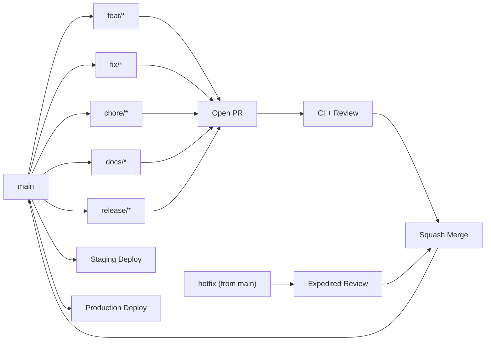
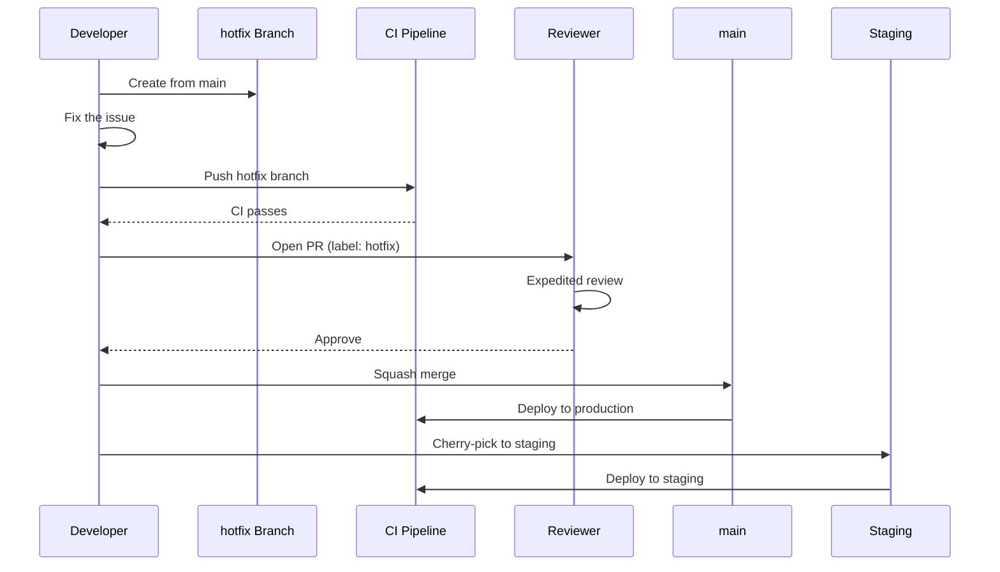

# Branch Strategy Guide

**Last updated:** 2025-01-20

---

## Table of Contents

1. Strategy Overview
2. Branch Types
3. Branch Lifecycle
4. Commit Convention
5. Pull Requests
6. Hotfix Process
7. Git Rules
8. Examples

---

## 1. Strategy Overview

This repository follows **trunk-based development** with a single long-lived branch (`main`) that is always deployable. Feature work happens on short-lived branches that are merged via squash commits, maintaining a linear history on `main`.

```
main  ────●────────●─────────●──────────●──────────●────
           \      /          /          /          /
feat/     ──●──●──●          /          /          /
fix/                        ──●──●──●  /          /
docs/                                     ──●──●──●
```

- `main` is the source of truth. Every commit on `main` has passed CI and is potentially deployable.
- Branches live at most **3 days**. Long-running branches risk painful merge conflicts.
- History on `main` is linear (squash merges only).
- Tags follow strict semver (`v1.2.3`).

---

## 2. Branch Types

### `main`

- **Purpose:** Production-ready code. Always green (passing CI). Protected — no direct pushes.
- **Source:** Created from nothing (the default branch).
- **Merge target:** All other branches merge into `main`.

### `feat/<name>`

- **Purpose:** New features, enhancements, user-facing changes.
- **Source:** `main`
- **Merge into:** `main`
- **Lifespan:** Max 3 days. Large features should be broken into multiple `feat/*` branches.

### `fix/<issue>`

- **Purpose:** Bug fixes (both production and development issues).
- **Source:** `main`
- **Merge into:** `main`
- **Lifespan:** Max 2 days. Hotfixes (critical production issues) follow the hotfix process instead.

### `chore/<task>`

- **Purpose:** Maintenance work — dependency updates, tooling configuration, build pipeline changes, refactoring without behavior change.
- **Source:** `main`
- **Merge into:** `main`

### `docs/<topic>`

- **Purpose:** Documentation-only changes — README updates, ADRs, inline code comments, guides.
- **Source:** `main`
- **Merge into:** `main`
- **Note:** Does not trigger a full CI build in some cases (configurable in CI).

### `refactor/<area>`

- **Purpose:** Code restructuring that does not change external behavior.
- **Source:** `main`
- **Merge into:** `main`

### `release/<version>`

- **Purpose:** Release preparation — version bumps, changelog updates, final testing.
- **Source:** `main`
- **Merge into:** `main`
- **Tag:** After merge, tag the merge commit with `v<version>` (e.g., `v1.2.3`).
- **Note:** Only use semantic version tags. Release branches are optional — many releases can go directly from `main`.

---

## 3. Branch Lifecycle

Every branch (except `main`) follows this lifecycle:

```
Create from main → Work → Push → Open PR → Review → Squash merge → Delete branch
```

#### Branch Lifecycle



### Step-by-step

```bash
# 1. Create branch from main
git checkout main
git pull
git checkout -b feat/blog-pagination

# 2. Work (make changes, commit locally)
git add .
git commit -m "feat(blog): add pagination"

# 3. Push
git push -u origin feat/blog-pagination

# 4. Open Pull Request (via GitHub UI or gh CLI)

# 5. Review + CI passes → Squash merge via GitHub UI

# 6. Delete branch (automatic after merge, or manually)
git branch -d feat/blog-pagination
git push origin --delete feat/blog-pagination
```

---

## 4. Commit Convention

All commits follow the [Conventional Commits](https://www.conventionalcommits.org/) format:

```
type(scope): description
```

| Type | Scope examples | Description |
|------|----------------|-------------|
| `feat` | `blog`, `auth`, `projects` | A new feature or user-facing change |
| `fix` | `auth`, `api`, `ui` | A bug fix |
| `chore` | `deps`, `build`, `ci` | Maintenance, no production code change |
| `docs` | `api`, `readme`, `architecture` | Documentation only |
| `refactor` | `prisma`, `hooks`, `state` | Code restructuring, no behavior change |
| `style` | `css`, `tailwind` | Formatting, styling (not logic) |
| `test` | `blog`, `auth` | Adding or updating tests |
| `perf` | `api`, `queries` | Performance improvement |
| `ci` | `docker`, `github-actions` | CI/CD configuration |

### Examples

```
feat(blog): add pagination with cursor-based navigation
feat(auth): implement OAuth Google login flow
fix(auth): handle token expiry on 401 responses
fix(login): correct lockout timing after failed attempts
chore(deps): upgrade @tanstack/react-query to v5.60
chore(ci): add prisma-validate job to CI pipeline
docs(api): document endpoint response envelope format
docs(architecture): add RFC-002 for TanStack React Query
refactor(hooks): extract shared mutation invalidation logic
refactor(prisma): consolidate PrismaService getters
style(portfolio): adjust hero section spacing
test(blog): add service unit tests for findAll filtering
perf(queries): add database indexes for section lookups
ci(docker): enable BuildKit cache for faster image builds
```

---

## 5. Pull Requests

### PR requirements

1. **Title** follows the commit convention: `type(scope): description`
2. **Description** includes:
   - What this PR does
   - Why this change is needed
   - Screenshots (for UI changes)
   - Any breaking changes or migration steps
3. **Linear history** — squash merge is required (enforced by branch protection)

### CI checks

Every PR triggers the CI pipeline defined in `.github/workflows/ci.yml`:

- **Quality matrix** (apps/api + apps/web):
  - `npm run lint`
  - `npm run typecheck`
  - `npm test` (tests are required; web tests may continue-on-error)
  - `npm run build`
- **Prisma validation:**
  - `npm run prisma:validate --workspace=apps/api`
  - `npm run prisma:generate --workspace=apps/api`

### Approval

- PRs require **1 approval** from a team member.
- The author should request specific reviewers based on the affected area.
- Reviewers check:
  - Code correctness and style consistency
  - Test coverage
  - Type safety (`tsc --noEmit` must pass)
  - No secrets or hardcoded credentials

---

## 6. Hotfix Process

Hotfixes are for critical production issues that cannot wait for the normal release cycle.

```
main ────●────────●─── hotfix commit ──●───
          \                             /
hotfix/    └─────●──●──────────────────┘
```

### Steps

```bash
# 1. Branch from main
git checkout main
git pull
git checkout -b fix/critical-prod-issue

# 2. Fix the issue
# ... make changes ...

# 3. Commit with fix type
git commit -m "fix(auth): patch critical token vulnerability"

# 4. Open PR against main
# PR must be labeled "hotfix" and get expedited review

# 5. Merge (squash) → deploy immediately

# 6. Backport to any active release branches if applicable
git checkout release/v1.1.x
git cherry-pick <commit-hash>
git push
```

#### Hotfix Process Flow



### Rules

- Hotfixes bypass the 3-day branch lifespan rule but should still be minimal.
- At least one approval is still required.
- After merging, verify the fix in production monitoring before closing the issue.

---

## 7. Git Rules

| Rule | Enforcement |
|------|-------------|
| **No direct pushes to main** | Branch protection rule (GitHub) |
| **PR requires 1 approval** | Branch protection rule (GitHub) |
| **PR must pass all CI checks** | Required status checks in branch protection |
| **Branch must be up to date with main** | "Require branches to be up to date" enabled |
| **Squash merge only** | "Allow squash merging" selected, rebase/merge disabled |
| **Delete branch after merge** | "Automatically delete head branches" enabled |
| **Signed tags for releases** | Manual enforcement via CI (tags matching `v*` trigger docker builds) |

### Why squash merge?

- Linear history on `main` — easy to read, easy to bisect
- Every commit on `main` is a complete, working unit
- Eliminates merge bubbles and feature noise from WIP commits
- The PR description serves as the squashed commit message

---

## 8. Examples

### `feat/*` — New feature

```
Branch: feat/blog-pagination
PR title: feat(blog): add cursor-based pagination
Commits:
  feat(blog): add pagination dto and service method
  feat(blog): add pagination controller endpoint
  feat(blog): add pagination UI component with page selector
  test(blog): add pagination e2e tests
Squash message: feat(blog): add cursor-based pagination
```

```
Branch: feat/dashboard-analytics
PR title: feat(analytics): add admin dashboard analytics widgets
Squash message: feat(analytics): add admin dashboard analytics widgets
```

### `fix/*` — Bug fix

```
Branch: fix/login-lockout-timing
PR title: fix(login): correct lockout timing after failed attempts
Commits:
  fix(login): correct lockout timing calculation
  fix(login): add lockout notification to login form
Squash message: fix(login): correct lockout timing after failed attempts
```

```
Branch: fix/token-expiry-handling
PR title: fix(auth): handle token expiry on 401 responses
Squash message: fix(auth): handle token expiry on 401 responses
```

### `chore/*` — Maintenance

```
Branch: chore/upgrade-tanstack-v5
PR title: chore(deps): upgrade @tanstack/react-query to v5.60
Squash message: chore(deps): upgrade @tanstack/react-query to v5.60
```

```
Branch: chore/ci-optimization
PR title: chore(ci): optimize Docker build cache layers
Squash message: chore(ci): optimize Docker build cache layers
```

### `docs/*` — Documentation

```
Branch: docs/rfc-prisma-orm
PR title: docs(architecture): add RFC-001 for Prisma ORM
Squash message: docs(architecture): add RFC-001 for Prisma ORM
```

```
Branch: docs/branch-strategy-guide
PR title: docs(engineering): add branch strategy guide
Squash message: docs(engineering): add branch strategy guide
```

### `refactor/*` — Code restructuring

```
Branch: refactor/prisma-service-getters
PR title: refactor(prisma): consolidate PrismaService model getters
Squash message: refactor(prisma): consolidate PrismaService model getters
```

```
Branch: refactor/hook-invalidation-pattern
PR title: refactor(hooks): extract shared mutation invalidation helper
Squash message: refactor(hooks): extract shared mutation invalidation helper
```

### `release/*` — Release

```
Branch: release/v1.2.0
PR title: chore(release): v1.2.0
Commits:
  chore(release): bump version to 1.2.0
  docs(changelog): add v1.2.0 changelog entry
Tag: v1.2.0 (on the merge commit)
```

### Full workflow example

```bash
# Create a feature branch
git checkout main
git pull
git checkout -b feat/blog-pagination

# Work and commit
git add .
git commit -m "feat(blog): add pagination dto and service method"
git add .
git commit -m "feat(blog): add pagination controller endpoint"

# Push and open PR
git push -u origin feat/blog-pagination
# → Open PR via GitHub UI: "feat(blog): add cursor-based pagination"
# → CI runs: lint, typecheck, test, build, prisma-validate
# → Review requested → 1 approval → Squash merge → Branch deleted

# Update local main
git checkout main
git pull
```

## Cross-References
- [MASTER-INDEX.md](../MASTER-INDEX.md) — Documentation master index
- [CROSS-REFERENCE-INDEX.md](../26-reference/CROSS-REFERENCE-INDEX.md) — Cross-reference system
