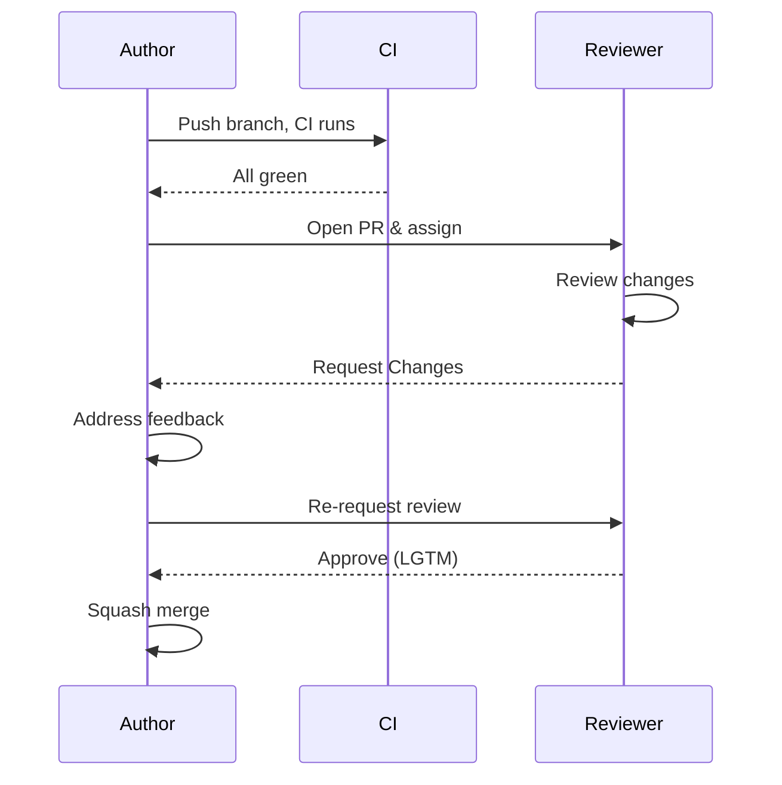
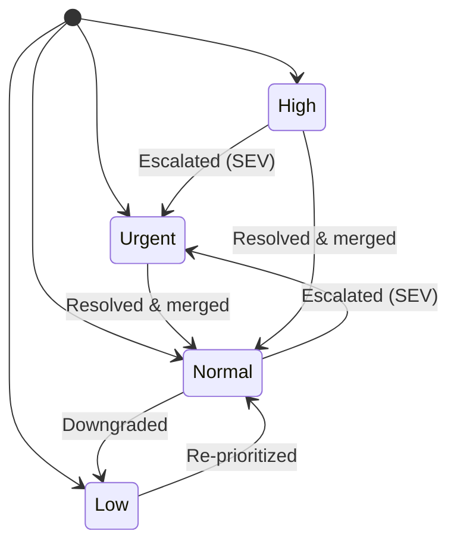

# Code Review Standards

> **Version:** 1.0  
> **Applies to:** All code in `apps/web`, `apps/api`, `apps/ai`, `packages/shared`, `packages/ui`, `packages/config`  
> **Last Updated:** 2026-07-11

---

## 1. Purpose of Code Review

Code review serves three primary purposes in this project:

### 1.1 Quality Assurance

Catch defects, logic errors, edge cases, and security vulnerabilities before they reach production. The portfolio is publicly visible and the admin dashboard manages all site content — bugs in data mutation, caching, or auth can have immediate real-world impact.

### 1.2 Knowledge Sharing

Spread understanding of the three-layer NestJS pattern, the Next.js App Router architecture, and shared Zod contracts across the team. Every review is a teaching moment. No single person should be the sole owner of a module.

### 1.3 Security and Compliance

Given that the API handles authentication (JWT + OAuth), file uploads, admin content management, and reflects data publicly, every review must verify that security controls are correctly applied: auth guards, role checks, input validation, rate limiting, and audit logging.

---

## 2. Review Process

```
┌──────────┐    ┌──────────┐    ┌──────────┐    ┌──────────┐    ┌──────────┐    ┌──────────┐
│ 1. Submit │ → │ 2. Assign │ → │ 3. Review │ → │ 4. Address│ → │ 5. Approve│ → │ 6. Merge  │
└──────────┘    └──────────┘    └──────────┘    └──────────┘    └──────────┘    └──────────┘
```

### Step 1: Submit

- Author opens a PR with a descriptive title following conventional commits: `type(scope): description`
- Type: `feat`, `fix`, `docs`, `style`, `refactor`, `test`, `chore`
- Scope: `web`, `api`, `ai`, `shared`, `ui`, `infra`, `docs`
- Example: `feat(api): add bulk-delete endpoint for skills`
- Description includes: what changed, why, how to test, related issue number
- CI must be green before requesting review

### Step 2: Assign

- Author self-assigns or requests specific reviewers via GitHub
- Default reviewer: tech lead for the affected scope (web/api/ai)
- At least one approval required; two for changes touching auth, payments, or database migrations

### Step 3: Review

- Reviewer performs thorough review (see §4 and §6–§9)
- Comments are categorized as blocking or non-blocking (see §10)
- Review should be completed within SLA (see §3)

### Step 4: Address

- Author responds to every comment — either by making the change or explaining why not
- Mark resolved conversations explicitly
- Push additional commits; do not force-push or rebase until review is complete

### Step 5: Approve

- Reviewer re-reviews changes and approves when all blocking items are resolved
- Use the GitHub "Approve" review, optionally with "Comments" (non-blocking)

### Step 6: Merge

- Squash merge is preferred to keep a clean history on `main`
- Merge commit message should match the PR title
- Delete the branch after merge

#### Approval Process



---

## 3. Review SLA

| Severity | SLA | Example |
|----------|-----|---------|
| **SEV** (production outage, security vulnerability) | **4 hours** | Auth bypass, XSS in public output, broken portfolio rendering |
| **Normal** (feature, refactor, bugfix) | **24 hours** | New admin CRUD, test additions, UI polish |
| **Large** (>500 lines changed, multi-module) | **48 hours** | New module, database migration, API redesign |

If the reviewer cannot meet the SLA, they must communicate with the author and reassign or delay with explicit agreement.

#### Review SLA Tiers



---

## 4. What Reviewers Check

Reviewers evaluate every PR against these dimensions, in priority order:

### 4.1 Functional Correctness

- Does the code do what the PR description says?
- Are the expected inputs and outputs correct?
- Do API responses match the `{ data, meta }` envelope?
- Are Zod schemas in `packages/shared` in sync with DTOs in `apps/api`?

### 4.2 Edge Cases

- Empty states: what happens when a list is empty?
- Error states: what happens when the API returns 4xx/5xx?
- Null/undefined: are optional fields handled?
- Pagination: what happens on page 0 or beyond the last page?
- Concurrent requests: can bulk operations partially fail?

### 4.3 Security (OWASP Top 10)

- **Broken Access Control:** Are `@Roles` guards present on admin routes?
- **Injection:** Are inputs sanitized via `sanitizeStrings`? Are raw SQL queries avoided?
- **XSS:** Is user-generated content sanitized before rendering?
- **Sensitive Data Exposure:** Are secrets in env vars, not hardcoded? Is `passwordHash` never returned?
- **Security Misconfiguration:** Is CORS restricted to `CORS_ORIGIN`? Is Helmet configured?
- **Rate Limiting:** Are auth endpoints throttled?
- **Audit Logging:** Are admin mutations decorated with `@Audit`?

### 4.4 Test Coverage

- Are new features covered by unit tests?
- Are bug fixes accompanied by a regression test?
- Do tests cover edge cases (failures, empty results, auth errors)?
- Do all existing tests still pass?

### 4.5 Performance

- Are N+1 queries avoided? (Check Prisma `include` / `select` usage)
- Is caching applied on read-heavy portfolio endpoints (`@CacheTTL`)?
- Are large payloads paginated?
- Are expensive computations memoized or deferred?

### 4.6 Readability

- Is the code self-documenting?
- Are variable names descriptive?
- Is the control flow easy to follow?
- Are there unnecessary comments? (Prefer clear code over comments)

### 4.7 Documentation

- Is documentation updated for changed behavior?
- Are new API endpoints documented in Swagger (`@ApiOperation`, `@ApiTags`)?
- Are complex business rules explained in PR description?
- Does the PR reference any relevant ADR or design doc?

---

## 5. Code Style & Patterns

All code must follow the patterns established in the codebase. Key non-negotiables:

| Concern | Standard | Enforcement |
|---------|----------|-------------|
| **API Structure** | Three-layer: `module/` (service + DTOs) → `portfolio/controllers/` → `admin/controllers/` | Lint + review |
| **Data Fetching (Web)** | TanStack React Query hooks in `lib/hooks/` | Review |
| **Validation** | Zod schemas in `packages/shared` + `class-validator` DTOs in API | TypeScript + review |
| **Database** | Prisma ORM via `PrismaService`; snake_case table names via `@@map` | Review |
| **API Envelope** | `{ data, meta? }` for all responses | Review |
| **Auth** | JWT + Passport; `JwtAuthGuard` + `RolesGuard` on admin controllers | Review |
| **Caching** | `@CacheTTL()` on portfolio (read-only) endpoints; cache invalidation on mutations | Review |
| **Mutations** | `@Audit({action, resource})` on all admin mutations | Review |
| **Frontend** | Server components by default; `'use client'` only for interactivity | Review |
| **Types** | Strict TypeScript, no `any`, branded IDs (`UserId`, `ProjectId`), interfaces over types | Lint + review |

---

## 6. NestJS-Specific Review Items

When reviewing backend code, verify:

### Module Layer (`apps/api/src/modules/<entity>/`)

- Does the service extend `@Injectable()`?
- Are `PrismaService` and `CacheService` injected via constructor?
- Are DTO files named as `create-<entity>.dto.ts` and `update-<entity>.dto.ts`?
- Do DTOs use `class-validator` decorators? Are `@IsOptional()` on update DTOs?
- Are `@nestjs/swagger` decorators (`@ApiProperty`, `@ApiPropertyOptional`) present?
- Are NOT FOUND cases handled with `NotFoundException`?
- Is input sanitization applied via `sanitizeStrings()`?
- Is caching invalidated after mutations (`cache.delPattern`)?
- Are bulk operations atomic or properly error-handled?

### Portfolio Controllers (`apps/api/src/portfolio/controllers/<entity>.controller.ts`)

- Route prefix: `@Controller('portfolio/<entity>')`
- Cached with `@CacheTTL(120000)` or similar?
- Read-only methods only (GET)?
- Return `this.<service>.findAll(...)` directly (envelope handled by interceptor)?

### Admin Controllers (`apps/api/src/admin/controllers/<entity>.controller.ts`)

- Route prefix: `@Controller('admin/<entity>')`
- Decorated with `@UseGuards(JwtAuthGuard, RolesGuard)` at class level?
- Decorated with `@ApiBearerAuth()` at class level?
- Every mutation route has `@Roles('admin'[, 'editor'[, 'viewer']])`?
- Every mutation route has `@Audit({action, resource})`?
- Mutations return `{ data: await this.<service>.<method>(...) }`?
- Delete endpoints use `@HttpCode(HttpStatus.NO_CONTENT)`?
- Bulk endpoints use `@HttpCode(HttpStatus.OK)`?

### Module Registration

- Is the module imported in both `PortfolioModule` and `AdminModule`?
- Is the service exported from the module so both can use it?

---

## 7. React/Next.js-Specific Review Items

### Server vs Client Components

- Can the component be a Server Component? Start there.
- Only add `'use client'` when you need: `useState`, `useEffect`, `useContext`, `onClick`, browser APIs, custom hooks
- Client components should be leaf nodes in the component tree — push interactivity down

### Data Fetching

- Server Components should fetch directly via `getSections()`, `getProjects()` etc. from `lib/api.ts`
- Client-side data fetching uses hooks from `lib/hooks/` (e.g., `useSkills()`, `useProjects()`)
- Hooks should use `useApiQuery` from `lib/use-api-query.ts`
- Mutations use TanStack Query's `useMutation`
- Loading states use the `loading.tsx` convention; errors use `error.tsx`

### File Conventions

- `page.tsx` for route pages
- `layout.tsx` for shared layouts
- `loading.tsx` for loading UIs
- `error.tsx` for error boundaries
- `not-found.tsx` for 404 pages

### Component Structure

- Default export for page/layout components; named exports for reusable components
- Props typed with TypeScript interface, exported from component file or a types file
- Tailwind utility classes preferred; custom CSS in `kebab-case` class names
- Reusable UI components go in `components/ui/`

---

## 8. Security Review Checklist

Every PR must pass this checklist before approval:

- [ ] **Authentication:** Are protected routes guarded? JWT guard present?
- [ ] **Authorization:** Are role checks applied with `@Roles`? Minimum required role?
- [ ] **Input Validation:** Are DTOs validated with `class-validator`? Zod schemas on shared boundary?
- [ ] **Sanitization:** Is `sanitizeStrings()` called on user input before DB write?
- [ ] **XSS Prevention:** Is user-generated content escaped before rendering? (React does this by default, but `dangerouslySetInnerHTML` is a red flag)
- [ ] **SQL Injection:** Is Prisma parameterized query used? No raw SQL or string concatenation?
- [ ] **Rate Limiting:** Are auth/login endpoints throttled? `ThrottlerGuard` applied globally?
- [ ] **CORS:** Is the `CORS_ORIGIN` env var used, not a wildcard?
- [ ] **Secrets:** No API keys, tokens, or passwords in code or committed files?
- [ ] **Data Exposure:** Are sensitive fields (`passwordHash`, `refreshToken`) excluded from API responses?
- [ ] **Audit Trail:** Are all admin mutations decorated with `@Audit`?
- [ ] **File Upload:** Are file types and sizes validated? Stored outside web root?

---

## 9. Testing Review Checklist

- [ ] New code has corresponding unit/integration tests
- [ ] Tests cover: success path, error path, edge cases (empty, null, invalid input)
- [ ] Bug fixes include a regression test that fails before the fix
- [ ] Test file mirrors source path: `auth.service.ts` → `auth.service.spec.ts`
- [ ] Test names describe the scenario: `should reject login when account is locked`
- [ ] No flaky tests (time-dependent, order-dependent, network-dependent without mocks)
- [ ] CI passes (all checks are green)
- [ ] Code coverage does not decrease below threshold (if enforced)
- [ ] E2E tests updated for user-facing changes (web only)

---

## 10. The Reviewer's Disposition

Reviews use GitHub's three-tier review system:

### LGTM (Approve)

The code is correct, well-structured, and meets all standards. No changes needed. Use this when you are confident the PR is production-ready.

### Comments (Comment)

Non-blocking observations, style suggestions, or questions. The author may address them in a follow-up PR or resolve with explanation. Use phrases like:
- "Consider extracting this logic into a helper."
- "Nit: the variable name `x` could be more descriptive."
- "This works as-is, but you might look at how `ProjectsService` handles this case."

### Request Changes (Request Changes)

Blocking issues that must be resolved before merge. Use this for:
- Logic errors or incorrect behavior
- Missing security controls (auth, validation, sanitization)
- Test gaps for critical paths
- Violations of the three-layer pattern or established conventions
- Missing audit decorators on admin mutations

### Examples

**Good review comment:**
> The `bulkDelete` method in `skills.service.ts` deletes all matching records, but doesn't check whether any of the IDs exist. If all provided IDs are invalid, the caller gets `{ deleted: 0, failed: 5 }` with no indication that nothing happened. Consider a) validating existence first, or b) adding a check and returning `NotFoundException` if none match.

Why it's good: Specific file and method, describes the problem, offers two concrete solutions, and doesn't assume the author's preferred approach.

**Bad review comment:**
> This won't work.

Why it's bad: No specificity, no explanation of why it won't work, no suggested fix, not actionable.

---

## 11. Handling Disagreements

When the author and reviewer cannot reach consensus:

1. **Discuss in the PR thread** — clarify intent, constraints, and tradeoffs with specific examples
2. **Escalate to the tech lead** for the affected scope (web/api/ai) — they make the final call
3. **Document the decision** — the resolution (and the reasoning) should be recorded as a PR comment or linked ADR for future reference
4. **No blocking without substance** — if a reviewer cannot articulate a concrete defect, the author may request a second opinion

**Guiding principle:** Perfect is the enemy of good. Not every PR must be flawless — it must be correct, secure, and maintainable. Reviewers should distinguish between "this could be better" (non-blocking) and "this is wrong" (blocking).

## Cross-References
- [MASTER-INDEX.md](../MASTER-INDEX.md) — Documentation master index
- [CROSS-REFERENCE-INDEX.md](../26-reference/CROSS-REFERENCE-INDEX.md) — Cross-reference system
