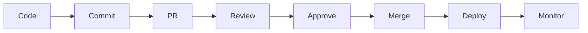
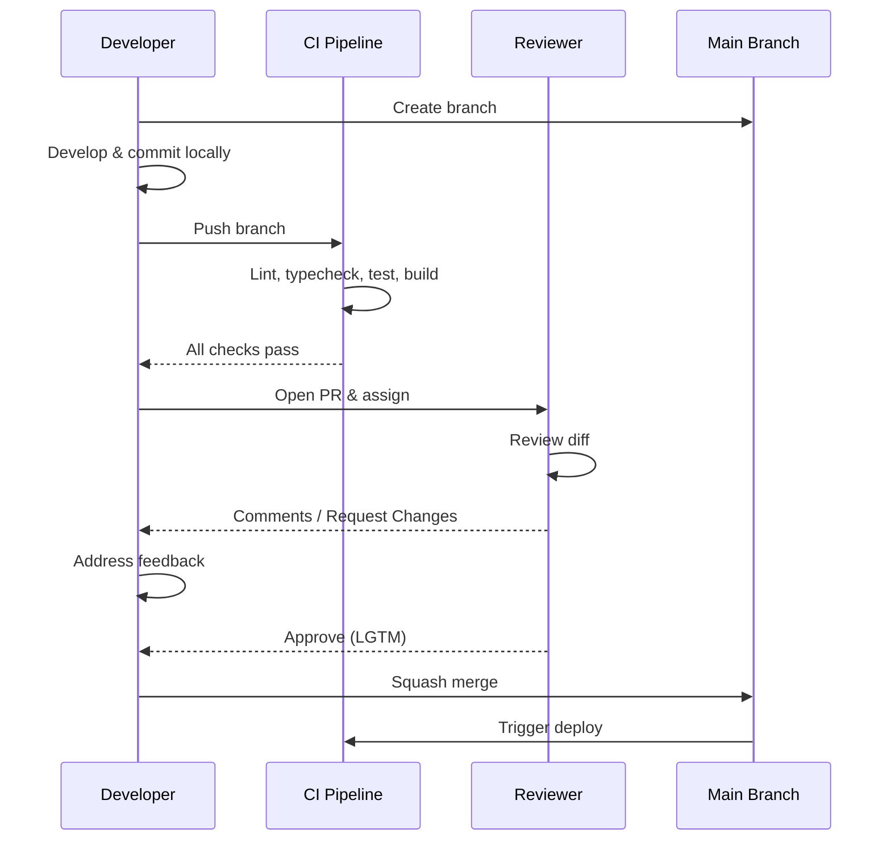
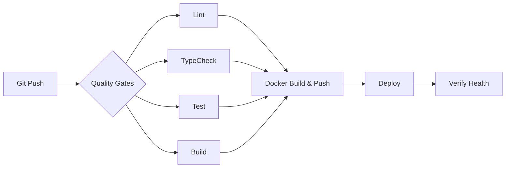

# Engineering Playbook — Portfolio Platform

> **Document:** `engineering-playbook.md` | **Version:** 1.0 | **Last Updated:** July 2026
> **Status:** ✅ Active | **Owner:** Engineering Lead | **Review Cadence:** Quarterly
> **Related:** [System Architecture](../05-architecture/SystemArchitecture.md) | [Testing Architecture](../35-quality/TestingArchitecture.md) | [Security Architecture](../11-security/SecurityArchitecture.md) | [CI/CD Pipeline](../21-operations/53-CI-CD-PIPELINE.md) | [Deployment Guide](../21-operations/DeploymentGuide.md) | [Incident Response](../21-operations/incident-response-playbook.md)

---

## Table of Contents

1. [Engineering Culture & Principles](#1-engineering-culture--principles)
2. [Development Workflow](#2-development-workflow)
3. [Code Review Standards](#3-code-review-standards)
4. [Testing Standards](#4-testing-standards)
5. [CI/CD Pipeline](#5-cicd-pipeline)
6. [Deployment & Releases](#6-deployment--releases)
7. [Incident Response](#7-incident-response)
8. [On-Call Expectations](#8-on-call-expectations)
9. [Technical Debt Management](#9-technical-debt-management)
10. [Documentation Standards](#10-documentation-standards)
11. [Security & Compliance](#11-security--compliance)
12. [Tools & Environment](#12-tools--environment)

---

## 1. Engineering Culture & Principles

### 1.1 Core Values

**Ownership.** Every engineer owns their code from inception through production. You write it, you test it, you deploy it, you monitor it, you respond when it breaks. The person who merges a change is accountable for its behavior in production. This is not about blame — it is about closing the feedback loop so that quality improves with every cycle.

**Quality without dogma.** We enforce rigorous automated gates (lint, typecheck, test, build) before anything reaches production, but we recognize that perfection is the enemy of progress. A pragmatic 80% solution shipped today is better than a perfect solution shipped next quarter. The distinction between "technical debt" and "technical bankruptcy" is intentionality: debt with a repayment plan is acceptable; unconscious accumulation is not.

**Pragmatism over purity.** Architectural patterns exist to serve the product, not the other way around. The three-layer module pattern (business logic in `src/modules/<entity>/`, public delivery in `src/portfolio/controllers/`, admin delivery in `src/admin/controllers/`) is the convention for API work, but when a simpler approach suffices, we take it. Every abstraction carries a cost; we pay it only when the benefit is clear.

**Continuous improvement.** Every deployment is an opportunity to learn. We instrument everything (Sentry, Pino, PostHog) and review metrics weekly. We hold regular retrospectives. We invest 20% of each sprint in refactoring, tooling, and paying down technical debt.

### 1.2 Blameless Postmortems

Every incident — from a SEV-4 typo to a SEV-1 outage — produces a postmortem. These are blameless by design. The goal is never to identify who made a mistake; it is to identify what systems, processes, or guardrails failed and how to strengthen them.

Postmortems follow the template at [`docs/21-operations/post-incident-review-template.md`](../21-operations/post-incident-review-template.md) and must include:

- A clear timeline of events
- Root cause analysis (distinguishing trigger from contributing factors)
- Impact assessment (uptime, error rate, affected users)
- Action items with owners and due dates
- What went well, what went poorly, what was confusing

All postmortems are archived in the `docs/incidents/` directory and reviewed during the quarterly engineering retrospective.

### 1.3 Psychological Safety

We foster an environment where every engineer can ask questions, challenge assumptions, admit mistakes, and propose ideas without fear of ridicule or reprisal. Code reviews are collegial discussions, not gatekeeping rituals. When a review comment says "this is wrong," it is a statement about the code, not the author. When an incident occurs, the first question is always "what can we learn?", never "whose fault is it?"

---

## 2. Development Workflow

### 2.1 Git Workflow: Trunk-Based Development

We practice **trunk-based development** with short-lived feature branches. The default branch is `main`, and it is always deployable.

```
main ──●────●────●────●────●────●
         \          /
feat/xxx  └──●──●──┘
              \
fix/yyy       └──●──┘
```

**Rules:**

- Branches live no longer than **3 days**. Anything longer must be broken into smaller increments.
- Feature branches must be rebased onto `main` before opening a pull request.
- `main` is protected: no direct pushes, no bypassing CI, squash-merge only.
- Feature flags (see [`docs/21-operations/60-FEATURE-FLAGS.md`](../21-operations/60-FEATURE-FLAGS.md)) enable merging incomplete work safely — never use long-lived branches to hide unfinished features.

### 2.2 Branch Naming Convention

| Prefix      | Purpose                                    |
| ----------- | ------------------------------------------ |
| `feat/`     | New feature or enhancement                 |
| `fix/`      | Bug fix                                    |
| `chore/`    | Maintenance, tooling, dependency updates   |
| `docs/`     | Documentation changes only                 |
| `refactor/` | Code restructuring with no behavior change |
| `test/`     | Adding or updating tests                   |
| `perf/`     | Performance optimization                   |
| `revert/`   | Reverting a previous change                |

**Examples:** `feat/portfolio-contact-form`, `fix/auth-token-refresh`, `chore/upgrade-turbo-2`, `docs/api-standards-update`, `refactor/prisma-service-extraction`, `perf/lazy-load-three-js`

### 2.3 Commit Conventions: Conventional Commits

Every commit message must follow the [Conventional Commits](https://www.conventionalcommits.org/) specification:

```
<type>(<scope>): <description>

[optional body]

[optional footer]
```

**Types:**

| Type        | Usage                                  |
| ----------- | -------------------------------------- |
| `feat:`     | A new feature                          |
| `fix:`      | A bug fix                              |
| `chore:`    | Maintenance, build, or tooling         |
| `docs:`     | Documentation only                     |
| `refactor:` | Code change with no feature/fix intent |
| `test:`     | Adding or correcting tests             |
| `perf:`     | Performance improvement                |
| `ci:`       | CI/CD configuration                    |
| `build:`    | Build system changes                   |
| `style:`    | Formatting (no logic change)           |

**Scopes** map to workspace or module: `api`, `web`, `ai`, `shared`, `ui`, `config`, `infra`, `docs`.

**Examples:**

```
feat(api): add contact form submission endpoint
fix(web): correct 3D scene loading on Safari
chore(deps): upgrade prisma to 5.14
test(api): add service specs for auth module
ci: add Prisma migration validation job
```

### 2.4 Pull Request Workflow

```
Create branch → Develop → Commit → Push → Open PR → Self-review → Assign reviewers → Address feedback → Squash merge
```

**Step-by-step:**

1. **Create branch** from `main` using the naming convention above.
2. **Develop locally** with frequent small commits. Run `npm run lint`, `npm run typecheck`, and relevant tests before pushing.
3. **Push branch** and open a pull request against `main` using the GitHub PR template.
4. **Self-review** before assigning others. Read your own diff as if you were a stranger to it. Catch the obvious issues first.
5. **Assign reviewers** — minimum 1 for `chore`/`docs`, minimum 2 for `feat`/`fix`/`refactor`. Use GitHub's "Reviewers" feature.
6. **Address feedback** with additional commits. Never rebase or force-push during review — additional commits make it easy to see what changed between review rounds.
7. **Squash merge** when all reviewers have approved and CI is green. The squash commit message should be a clean Conventional Commit message (combine the PR title + key details).

#### Dev Workflow Diagram



### 2.5 PR Size Limits

| Limit         | Rule                                                                                     |
| ------------- | ---------------------------------------------------------------------------------------- |
| **400 lines** | Hard maximum for changed lines (excluding generated files, lockfiles, and test fixtures) |
| **20 files**  | Hard maximum for changed files                                                           |
| **3 commits** | Target number of commits per PR (squash-before-merge absorbs cleanup commits)            |

Anything larger must be split into multiple PRs, coordinated with feature flags or incremental delivery. Large PRs accumulate review debt, slow velocity, and increase the probability of undetected defects. If you cannot describe the change in one sentence, the PR is too large.

---

## 3. Code Review Standards

### 3.1 Review Expectations

Reviewers are expected to respond within **24 hours** (business days) of being assigned. If you cannot meet this SLA, unassign yourself so the author can find another reviewer.

**Reviewer responsibilities:**

- Review the diff thoroughly — do not LGTM without understanding every changed line.
- Test the change mentally or locally if the change is complex.
- Verify that automated checks (CI, CodeQL, Dependabot) have passed.
- Leave constructive, specific feedback. "This is wrong" must be accompanied by "because..." and ideally "consider...".
- Approve only when you are confident the change is correct and complete.

### 3.2 What Reviewers Check

**Correctness:**

- Does the code do what the PR description says?
- Are edge cases handled (null, empty, error states)?
- Are there off-by-one errors, race conditions, or concurrency issues?
- Do error paths clean up resources (DB connections, file handles)?

**Security:**

- Are user inputs validated and sanitized? (The API's global `ValidationPipe` with `whitelist: true` and `forbidNonWhitelisted: true` catches most, but not all.)
- Is the principle of least privilege followed in data access?
- Are there any hardcoded secrets, tokens, or credentials?
- Do new endpoints need rate limiting or auth guards?
- See [`docs/11-security/SecurityArchitecture.md`](../11-security/SecurityArchitecture.md) and [`docs/11-security/SecretsManagement.md`](../11-security/SecretsManagement.md) for detailed requirements.

**Testing:**

- Are new features covered by unit tests?
- Are bug fixes accompanied by a regression test?
- Do tests follow the test naming convention?
- Are there meaningful assertions (not just "does not throw")?

**Performance:**

- Are N+1 queries avoided? (Check Prisma queries in the diff.)
- Are expensive operations cached or deferred?
- Could this change cause a regression in Core Web Vitals?
- Are large assets (3D models, images) lazy-loaded?

**Style & Conventions:**

- Does the code follow the three-layer module pattern for API entities (`modules/` → `portfolio/controllers/` → `admin/controllers/`)?
- Are imports from `@portfolio/shared` preferred over redefining types?
- Does the code use the API response envelope `{ data, meta? }`?
- Is the code formatted? (lint-staged enforces Prettier + ESLint on commit; CI enforces it too.)

**Documentation:**

- Are new APIs documented in the existing doc patterns?
- Do public functions have necessary JSDoc/TSDoc?
- Are complex algorithms or business rules explained in comments?
- Has the PR description captured the "why" behind the change?

### 3.3 Review Levels

| Level               | Meaning                                                                                                             | Action Required                                            |
| ------------------- | ------------------------------------------------------------------------------------------------------------------- | ---------------------------------------------------------- |
| **Approved (LGTM)** | The change is correct, tested, and ready to merge.                                                                  | None — the author may merge.                               |
| **Comments**        | Minor suggestions, questions, or nits. The reviewer trusts the author to address them without another review cycle. | Author addresses or responds; may merge without re-review. |
| **Request Changes** | The reviewer believes the change is incorrect, incomplete, or unsafe.                                               | Author must address all concerns and request re-review.    |

If a reviewer requests changes, the author should not merge until that reviewer re-approves. If circumstances require escalation, the author may ask the reviewer to downgrade to "Comments" with a clear explanation of why the concern is addressed or deferred.

### 3.4 PR Checklist

Before opening a PR, authors should verify:

- [ ] Branch name follows `type/` convention
- [ ] Commit messages follow Conventional Commits
- [ ] All CI checks pass (lint, typecheck, test, build)
- [ ] New code has tests (unit for logic, integration for API, e2e for flows)
- [ ] New API endpoints are documented in Swagger (decorators) and follow the response envelope
- [ ] Database schema changes have corresponding migrations (`npm run prisma:migrate:dev`)
- [ ] No secrets, credentials, or local paths are committed
- [ ] PR description explains what and why, with screenshots if UI changed
- [ ] PR is under 400 lines changed

#### PR Lifecycle



---

## 4. Testing Standards

### 4.1 Test Pyramid

We follow a strict 70/20/10 split across three test layers:

```
        ╱╲
       ╱  ╲        E2E Tests      10%
      ╱    ╲
     ╱──────╲
    ╱        ╲    Integration     20%
   ╱          ╲
  ╱────────────╲
 ╱              ╲  Unit Tests     70%
╱                ╲
```

| Layer       | Tool                     | Workspace                                                | Target Coverage |
| ----------- | ------------------------ | -------------------------------------------------------- | --------------- |
| Unit        | Jest (API), Vitest (Web) | `apps/api`, `apps/web`, `packages/shared`, `packages/ui` | ≥ 80%           |
| Integration | Supertest (Jest)         | `apps/api`                                               | ≥ 60%           |
| E2E         | Playwright               | `apps/web`                                               | ≥ 40%           |

**Unit tests** validate business logic in isolation. For the API (`apps/api`), this means testing `Service` classes in `src/modules/<entity>/` by mocking `PrismaService`. For the web (`apps/web`), this means testing utility functions, hooks, and pure components. Tests live alongside the code they test with a `.spec.ts` suffix (API) or `.test.ts/tsx` suffix (Web).

**Integration tests** validate module boundaries and data access. For the API, this means testing controllers against a test database (or mock Prisma) with Supertest hitting the NestJS app instance. For the web, this means testing page components and data-fetching functions.

**E2E tests** validate user journeys in a browser. Run with Playwright against a deployed preview or local instance. Cover critical paths: portfolio page load, contact form submission, admin login, content CRUD.

### 4.2 Configuration Reference

**API (Jest):** `apps/api/jest.config.ts`

- Matches `*.spec.ts` in `src/`
- Uses `ts-jest` for transformation
- Coverage excludes `*.module.ts` and `main.ts`
- Path alias `@/` maps to `<rootDir>/`

**Web (Vitest):** `apps/web/vitest.config.ts`

- Matches `*.test.{ts,tsx}` in `src/`
- Uses `jsdom` environment, `v8` coverage provider
- Path aliases for `@/`, `@portfolio/shared`, `@portfolio/ui`
- Setup file at `src/test/setup.tsx`

### 4.3 What to Test in Each Layer

**Unit tests must cover:**

- Business logic branches (if/else, switch, ternary)
- Edge cases (empty arrays, null inputs, boundary values)
- Error conditions and exception paths
- Service method return values and side effects
- Transform/mapper functions

**Integration tests must cover:**

- HTTP request/response contracts (status codes, headers, body shape)
- Authentication and authorization guards (`JwtAuthGuard`, `RolesGuard`, `@Roles`)
- Database read/write operations through the service layer
- Cache behavior (`@CacheTTL`, cache invalidation)
- Validation pipe behavior (malformed input, missing fields)

**E2E tests must cover:**

- Core user journeys: page load → content display → interaction
- Admin CRUD flows: login → create → read → update → delete
- Error and loading states
- Responsive layout and mobile views

### 4.4 Test Naming Conventions

**Files:**

- API: `<entity>.service.spec.ts` for services, `<entity>.controller.spec.ts` for controllers
- Web: `<ComponentName>.test.tsx` for components, `use<hook>.test.ts` for hooks

**Test cases (descriptive sentences, no `should`):**

```typescript
describe('AuthService', () => {
  describe('validateUser', () => {
    it('returns user data when credentials are valid', () => { ... });
    it('throws UnauthorizedException when password does not match', () => { ... });
    it('throws NotFoundException when email is not registered', () => { ... });
    it('rejects tokens that have been revoked', () => { ... });
  });
});
```

Use `describe` blocks to mirror the class/module structure and method names within. Each `it` describes a scenario in plain English.

### 4.5 CI Gates

- All PRs must pass lint, typecheck, and unit tests before merge
- Integration tests run on every push to `main`
- E2E tests run against ephemeral Vercel preview deployments on PRs
- Coverage regressions cause a warning (not a hard block, but the PR author must address them)
- Flaky tests are quarantined immediately — a flaky test degrades trust in the entire suite

---

## 5. CI/CD Pipeline

### 5.1 Pipeline Architecture

The CI/CD pipeline is defined in `.github/workflows/ci.yml` and documented in [`docs/21-operations/25-CICD.md`](../21-operations/25-CICD.md) and [`docs/21-operations/53-CI-CD-PIPELINE.md`](../21-operations/53-CI-CD-PIPELINE.md).

**Stages (sequential with parallel substages):**

```
Pre-commit (local) → Push → CI Quality → Docker Build → Deploy → Verify
```

**Stage 1: Quality Gates (parallel, ~3.5 min)**

| Job                 | Command                                                 | Purpose                                      |
| ------------------- | ------------------------------------------------------- | -------------------------------------------- |
| **Lint**            | `npm run lint --workspace=${{ matrix.workspace }}`      | ESLint with repo config                      |
| **TypeCheck**       | `npm run typecheck --workspace=${{ matrix.workspace }}` | `tsc --noEmit` for both api and web          |
| **Build**           | `npm run build --workspace=${{ matrix.workspace }}`     | Turbo build with dependency graph resolution |
| **Test**            | `npm run test --workspace=${{ matrix.workspace }}`      | Jest (API) or Vitest (Web)                   |
| **Prisma Validate** | `npm run prisma:validate`                               | Schema validation and generation             |

The quality stage runs on the matrix `[apps/api, apps/web]`. Web tests have `continue-on-error` for flexibility; API tests are strict.

**Stage 2: Docker Build & Push (main/tags only)**

- API image built from `apps/api/Dockerfile` and pushed to `ghcr.io`
- Web image built from `apps/web/Dockerfile` and pushed to `ghcr.io`
- Images tagged with `latest` and `${{ github.sha }}`
- Layer caching via `type=gha`

**Stage 3: Deploy (post-CI, per-provider tooling)**

- Frontend + API: Vercel (`main` branch auto-deploy)
- AI Service: Railway (`main` branch auto-deploy)
- Database: Supabase migrations (manual via `prisma:migrate:deploy`)
- See [`docs/21-operations/DeploymentGuide.md`](../21-operations/DeploymentGuide.md) for provider-specific configuration.

#### CI Pipeline Flow



### 5.2 Quality Gates

| Gate            | Fail on                  | Action                                    |
| --------------- | ------------------------ | ----------------------------------------- |
| ESLint          | Any error                | Block PR, author must fix                 |
| tsc             | Any type error           | Block PR, author must fix                 |
| Build           | Build failure            | Block PR, author must fix                 |
| Tests           | Any failure              | Block PR, author must fix                 |
| Coverage        | Drop > 5%                | Warning, author must explain or improve   |
| Prisma Validate | Schema error             | Block PR, author must fix                 |
| Docker Build    | Build failure            | Block deploy — investigate infrastructure |
| CodeQL          | High/CRIT alert          | Block PR, security team notified          |
| Dependabot      | CRIT alert on direct dep | Block PR, patch within 48h                |

### 5.3 Environment Promotion

```
Local Dev → PR Preview (Vercel) → Staging (main) → Production (main + deploy)
```

| Environment    | Purpose               | Deploy Trigger                  | URL                                |
| -------------- | --------------------- | ------------------------------- | ---------------------------------- |
| **Local**      | Development + testing | Manual (`npm run dev`)          | `localhost:3000`, `localhost:3001` |
| **Preview**    | Per-PR QA, E2E tests  | PR open/sync                    | `<pr>.preview.vercel.app`          |
| **Staging**    | Pre-prod validation   | Push to `main`                  | `staging.portfolio.vercel.app`     |
| **Production** | Live                  | Push to `main` + deploy trigger | `portfolio.vercel.app`             |

### 5.4 Rollback Procedure

When a deployment causes issues:

1. **Identify the last known good deployment** — Vercel dashboard or `git log --oneline -20`
2. **Revert the deploy** — Vercel: navigate to the deployment dashboard and promote the previous version; Railway: `railway rollback`
3. **Revert the code** — open a `revert/` PR with `git revert <sha>` and follow the standard PR workflow
4. **Verify** — check Sentry for error rates, check health endpoints (`/api/health/liveness`, `/api/health/readiness`)
5. **File a postmortem** — if the incident affected users, follow the post-incident review template at [`docs/21-operations/post-incident-review-template.md`](../21-operations/post-incident-review-template.md)

For a comprehensive rollback runbook, see the [Incident Response Playbook](../21-operations/incident-response-playbook.md).

---

## 6. Deployment & Releases

### 6.1 Release Cadence

We deploy continuously. Every merge to `main` that passes CI is deployable, and most merges are deployed within minutes. There is no release train, no release candidate phase, and no code freeze (except during incident response).

**When we deploy:**

- Every merged PR to `main` triggers Vercel + Railway deploys
- Tagged versions (`v*`) trigger Docker image builds for archival
- Emergency fixes follow the same path but with expedited review

### 6.2 Feature Flags

Risky or incomplete features are wrapped in feature flags. This allows us to:

- Merge unfinished work without exposing it to users
- Canary-release features to subsets of users (10% → 50% → 100%)
- Instantly disable a feature without redeploying (kill switch, < 30s)
- Run A/B experiments with statistical significance (≥ 95% confidence)

All feature flags follow the lifecycle in [`docs/21-operations/60-FEATURE-FLAGS.md`](../21-operations/60-FEATURE-FLAGS.md). Every flag must have a cleanup date. Flags without a scheduled cleanup are considered technical debt (see Section 9).

### 6.3 Zero-Downtime Deploys

The platform ensures zero-downtime deployments through:

- **Vercel:** Serverless functions are deployed gradually; existing requests complete on the old runtime while new requests route to the new one.
- **Database migrations:** Prisma migrations must be backward-compatible. Follow these rules:
  - Never `DROP COLUMN` without a two-phase migration (first release: stop writing, second release: drop)
  - Never `RENAME COLUMN` — create the new column, dual-write, backfill, then drop the old one
  - Always add nullable columns or columns with defaults
  - Test migrations against staging before production

### 6.4 Release Checklist

Before deploying to production, verify:

- [ ] CI passes (lint, typecheck, test, build, Docker)
- [ ] Database migrations applied and tested
- [ ] Feature flag toggled off for unreleased features
- [ ] Sentry error rate stable (no spike compared to previous 24h)
- [ ] Lighthouse scores ≥ 90 on critical public pages
- [ ] No high/critical Dependabot alerts
- [ ] Changelog entry ready (auto-generated from Conventional Commits)

For the full release readiness checklist, see [`docs/21-operations/ReleaseChecklist.md`](../21-operations/ReleaseChecklist.md).

---

## 7. Incident Response

### 7.1 Severity Definitions

| Severity  | Label    | Response SLA      | Example                                                               |
| --------- | -------- | ----------------- | --------------------------------------------------------------------- |
| **SEV-1** | Critical | 15 min            | Site down, data breach, auth system failure                           |
| **SEV-2** | High     | 30 min            | API error rate > 5%, degraded performance, feature outage             |
| **SEV-3** | Medium   | 2 hours           | Partial feature failure (e.g., single endpoint failing), slow queries |
| **SEV-4** | Low      | Next business day | Cosmetic issue, non-critical bug, documentation error                 |

### 7.2 Response SLA

| Metric              | SEV-1    | SEV-2    | SEV-3   | SEV-4           |
| ------------------- | -------- | -------- | ------- | --------------- |
| Time to acknowledge | 5 min    | 10 min   | 30 min  | 4 hours         |
| Time to mitigate    | 30 min   | 1 hour   | 4 hours | 2 business days |
| Postmortem due      | 24 hours | 48 hours | 1 week  | Optional        |

### 7.3 Communication Channels

- **Alerting:** Sentry error spikes, Better Uptime health checks, Telegram bot notifications
- **Coordination:** #incidents Slack/Discord channel during active response
- **Status page:** Better Uptime status page for external communication
- **Post-incident:** Postmortem document filed in `docs/incidents/`

### 7.4 Incident Lifecycle

1. **Detection** — Automated alert, monitoring dashboard anomaly, or user report
2. **Triage** (within 5 min) — Confirm the alert, check health endpoints, identify what changed (`git log --oneline -10`), check Sentry and provider status pages
3. **Diagnosis** — Follow scenario-specific runbooks (500 errors, slow responses, auth failures, etc.) in the [Incident Response Playbook](../21-operations/incident-response-playbook.md)
4. **Mitigation** — Apply fix (revert deploy, toggle feature flag, scale resources), verify restoration
5. **Resolution** — Confirm monitoring stable, notify stakeholders, file postmortem

### 7.5 Postmortem Requirements

Every SEV-1 and SEV-2 incident requires a post-incident review within the SLA window. SEV-3 incidents require a postmortem if the root cause is unclear or if the incident repeats. SEV-4 incidents are optional but encouraged.

The postmortem template is at [`docs/21-operations/post-incident-review-template.md`](../21-operations/post-incident-review-template.md). It must include:

- Incident summary (ID, severity, date, duration, responders)
- Timeline of events (UTC timestamps)
- Impact metrics (uptime, error rate, P95 latency, affected users)
- Root cause analysis (trigger + contributing factors)
- Response evaluation (what went well, what went poorly, what was confusing)
- Action items with owners and due dates

---

## 8. On-Call Expectations

### 8.1 Rotation Schedule

The on-call rotation covers **business hours (08:00–20:00 UTC) for SEV-3/4** and **24/7 for SEV-1/2**. Rotations are weekly, Monday to Monday. Each rotation has a **primary** and a **secondary** responder.

- **Primary:** First responder for all alerts. Acknowledges within SLA, drives triage and mitigation.
- **Secondary:** Backup if primary is unavailable during an incident. Handles lower-severity items during active SEV-1/2 response.

### 8.2 Handoff Process

At the end of each rotation, the outgoing on-call conducts a handoff with the incoming on-call:

1. Review all open incidents and their status
2. Transfer ownership of active investigations
3. Share any relevant context (recent deploys, known issues, impending changes)
4. Confirm the incoming on-call has access to all monitoring dashboards and runbooks
5. Update the on-call schedule

### 8.3 Escalation Paths

```
Primary → Secondary → Engineering Lead → DevOps Lead → CTO
```

- If the primary does not acknowledge within the response SLA, the secondary is paged automatically.
- If both are unavailable, the Engineering Lead is contacted.
- For security incidents, the Security Lead is added to the escalation chain immediately.

### 8.4 After-Hours Protocol

- SEV-1/2 incidents warrant immediate response regardless of time.
- SEV-3 incidents during non-business hours: acknowledge, document, and triage next business day unless the issue is actively degrading.
- SEV-4 incidents are handled during regular business hours.
- After an after-hours incident, the on-call should take time off to recover. Managers ensure this happens.

---

## 9. Technical Debt Management

### 9.1 Tech Debt Register

All known technical debt is tracked in [`docs/21-operations/TechnicalDebtRegister.md`](../21-operations/TechnicalDebtRegister.md). Each entry includes:

| Field               | Description                           |
| ------------------- | ------------------------------------- |
| **ID**              | Unique identifier (TD-01, TD-02, ...) |
| **Date Added**      | When the debt was first recorded      |
| **Component**       | Workspace or module affected          |
| **Description**     | What the debt is and why it exists    |
| **Impact**          | High / Medium / Low                   |
| **Mitigation Plan** | The planned fix or improvement        |
| **Status**          | Open / In Progress / Resolved         |

### 9.2 20% Time for Refactoring

Every sprint, 20% of engineering capacity is reserved for addressing technical debt, improving tooling, and improving developer experience. This is not optional "if we have time" work — it is scheduled and tracked like feature work.

Teams select items from the Technical Debt Register during sprint planning. Priority is determined by:

1. **Impact on development velocity** — Is this debt slowing down every PR?
2. **Risk to production** — Could this debt cause an incident?
3. **Cost of delay** — Does deferring make the fix more expensive?

### 9.3 Debt Repayment Prioritization

| Priority | Criteria                                                        | Action                             |
| -------- | --------------------------------------------------------------- | ---------------------------------- |
| **P0**   | Blocking feature delivery or actively causing production issues | Address within current sprint      |
| **P1**   | Slowing development or creating risk                            | Address within next 2 sprints      |
| **P2**   | Known suboptimal pattern with no immediate impact               | Schedule with 20% time             |
| **P3**   | Cosmetic or aspirational improvements                           | Backlog, address opportunistically |

### 9.4 Deprecation Policy

When a feature, API endpoint, or package is deprecated:

1. **Announce** — Document the deprecation with a timeline (minimum 30 days for breaking changes)
2. **Grace period** — Old behavior continues to work but logs a deprecation warning
3. **Remove** — After the grace period, the deprecated code may be deleted
4. **Document** — Update all relevant docs and remove the feature from the MASTER-INDEX

For API versioning, we support Content Negotiation via the `Accept` header (`application/vnd.portfolio.v<n>+json`), allowing graceful migration between API versions without breaking existing consumers.

---

## 10. Documentation Standards

### 10.1 What to Document

| What                   | Where                                                     | Required?                                     |
| ---------------------- | --------------------------------------------------------- | --------------------------------------------- |
| Architecture decisions | `docs/27-decisions/` or inline in architecture docs       | Required for all significant decisions        |
| API endpoints          | Swagger decorators in code, plus `docs/10-api/` reference | Required for all endpoints                    |
| Module interfaces      | README or module-level doc comment                        | Required for all new modules                  |
| Complex algorithms     | Inline comments + architecture doc reference              | Required for non-obvious logic                |
| Database schema        | Prisma schema (`prisma/schema.prisma`)                    | Self-documenting via schema                   |
| Security controls      | `docs/11-security/` per control type                      | Required for all auth/authz/data protection   |
| Operation runbooks     | `docs/21-operations/`                                     | Required for CI/CD, deploy, incident response |
| Testing patterns       | `docs/35-quality/`                                        | Required for new test categories              |
| Onboarding             | `AGENTS.md` at root                                       | Maintained by engineering lead                |

### 10.2 Documentation Review Process

Documentation is code. It is subject to the same review process:

- Documentation-only changes use the `docs/` branch prefix
- Doc changes in the same PR as code changes are reviewed together
- Architecture and security docs require review by the respective domain lead
- Every doc must have a header with version, status, owner, and last-updated date

### 10.3 Keeping Docs Up to Date

- **PRs must update relevant docs.** If you add an endpoint, the API doc must be updated. If you change a security control, the security doc must be updated.
- **Quarterly doc audit.** Every quarter, the engineering lead reviews the docs directory for stale or inaccurate documents.
- **Doc health in CI.** The repo has 280+ documentation files (see `docs/MASTER-INDEX.md`). We periodically validate cross-references and broken links.

### 10.4 Cross-Referencing

Documents should reference each other using relative paths. Follow the existing pattern:

```markdown
See [Secrets Management](../11-security/SecretsManagement.md) for secret rotation policies.
Refer to [CI/CD Pipeline](../21-operations/53-CI-CD-PIPELINE.md) for deployment workflow details.
```

The `MASTER-INDEX.md` at `docs/MASTER-INDEX.md` serves as the authoritative catalog of all documentation. When adding a new doc, register it in the master index.

---

## 11. Security & Compliance

### 11.1 Security Review Requirement

Every PR that touches authentication, authorization, data handling, or external service integration requires a security review by a domain lead. The following changes trigger mandatory security review:

- Changes to `src/modules/auth/` (JWT guards, strategies, token issuance)
- Changes to database schema or RLS policies
- Changes to CORS, CSP, or other HTTP security headers (configured in `src/main.ts`)
- Changes to file upload, data export, or PII handling
- Changes to third-party API integrations (OpenAI, Resend, PostHog, Sentry)
- Any change involving secrets, API keys, or encrypted data

The security architecture is documented in [`docs/11-security/SecurityArchitecture.md`](../11-security/SecurityArchitecture.md) and covers 10 domains across 40+ security controls.

### 11.2 Secrets Management

Secrets must never be hardcoded. The policy is defined in [`docs/11-security/SecretsManagement.md`](../11-security/SecretsManagement.md):

- **Local development:** `.env.local` or `config/.env` (in `.gitignore`)
- **CI/CD:** GitHub Actions encrypted secrets
- **Production:** Platform-specific secret stores (Vercel Secrets, Railway env vars)
- **Rotation:** JWT secrets rotated every 90 days; API keys rotated every 180 days; emergency rotation on suspected compromise
- **Scanning:** `git-secrets` or `trufflehog` as pre-commit hooks; GitHub secret scanning enabled on the repository

### 11.3 Dependency Vulnerability Management

- **Dependabot** is configured for the repository and alerts on all vulnerabilities
- **CRITICAL** severity on direct dependencies: patch within 48 hours
- **HIGH** severity on direct dependencies: patch within 1 week
- **MODERATE/LOW:** patch within the current sprint
- Transitive dependency vulnerabilities are evaluated for actual exploitability before prioritizing
- `npm audit` runs as part of the CI pipeline

### 11.4 Data Classification

Data is classified into four tiers per the [Data Classification Policy](../11-security/data-classification.md):

| Level  | Label        | Examples                                                      |
| ------ | ------------ | ------------------------------------------------------------- |
| **L1** | Public       | Portfolio projects, blog posts, published content             |
| **L2** | Internal     | Aggregated analytics, feature flags, audit logs (non-PII)     |
| **L3** | Confidential | User emails, lead/contact data, AI chat messages              |
| **L4** | Restricted   | Password hashes, JWT secrets, API keys, DB connection strings |

Every PR must handle data at the appropriate classification level. L3 data requires encryption at rest and in transit. L4 data requires all of the above plus strict access control and rotation policies. Never log, print, or expose L3/L4 data in error messages, stack traces, or console output.

### 11.5 Compliance

The platform aligns with OWASP Top 10:2025, GDPR, CCPA, and WCAG 2.2 AA. See the Security Architecture document for the full compliance matrix.

---

## 12. Tools & Environment

### 12.1 Required Tools

| Tool        | Version              | Purpose                          |
| ----------- | -------------------- | -------------------------------- |
| **Node.js** | ≥ 18 (CI uses 22)    | Runtime for API, Web, tooling    |
| **npm**     | ≥ 10 (10.8.0 pinned) | Package manager, workspaces      |
| **Docker**  | Latest CE            | Container builds, local services |
| **Git**     | ≥ 2.40               | Version control                  |
| **VS Code** | Latest               | Recommended IDE (see below)      |

### 12.2 IDE Setup (VS Code Recommended)

**Required extensions:**

- ESLint (dbaeumer.vscode-eslint)
- Prettier (esbenp.prettier-vscode)
- Prisma (Prisma.prisma)
- Tailwind CSS (bradlc.vscode-tailwindcss)
- Thunder Client (rangav.vscode-thunder-client) — for API testing

**Workspace settings (`.vscode/settings.json`):**

```json
{
  "editor.formatOnSave": true,
  "editor.defaultFormatter": "esbenp.prettier-vscode",
  "editor.codeActionsOnSave": {
    "source.fixAll.eslint": "explicit"
  },
  "typescript.preferences.importModuleSpecifier": "non-relative",
  "typescript.tsdk": "node_modules/typescript/lib"
}
```

### 12.3 Local Development Environment

The monorepo provides a unified dev experience through Turborepo:

| Command             | What It Does                                                         |
| ------------------- | -------------------------------------------------------------------- |
| `npm run dev`       | Starts all three services concurrently (web:3000, api:3001, ai:8000) |
| `npm run dev:web`   | Web only (Next.js with Turbopack)                                    |
| `npm run dev:api`   | API only with watch mode (NestJS hot-reload)                         |
| `npm run dev:ai`    | AI service only (FastAPI auto-reload)                                |
| `npm run build`     | Build all workspaces with correct dependency ordering                |
| `npm run lint`      | ESLint across all workspaces                                         |
| `npm run typecheck` | `tsc --noEmit` across all workspaces                                 |
| `npm run format`    | Prettier formatting across the repo                                  |

**Environment variables:** Copy `config/.env.example` to `config/.env` and fill in the values. The `DATABASE_URL` points at a Supabase PostgreSQL instance. Redis is optional for local development (BullMQ sessions degrade gracefully).

### 12.4 Performance Profiling Tools

| Tool                        | Use Case                                | How to Use                                           |
| --------------------------- | --------------------------------------- | ---------------------------------------------------- |
| **Sentry Performance**      | API transaction profiling (P50/P95/P99) | Deployed with `SENTRY_DSN`; view in Sentry dashboard |
| **Lighthouse CI**           | Core Web Vitals for public pages        | `npx lighthouse-ci https://localhost:3000`           |
| **Chrome DevTools**         | Client-side profiling (3D, animations)  | Performance tab + Memory tab                         |
| **React DevTools Profiler** | Component render profiling              | Browser extension                                    |
| **Prisma Query Logging**    | N+1 detection, query performance        | Enable `logging: ['query']` in `PrismaService`       |
| **BullMQ Queue Dashboard**  | Background job performance              | Available at `/admin/queues` when enabled            |

---

## References

### Internal Documents

| Document                      | Path                                                                                                       |
| ----------------------------- | ---------------------------------------------------------------------------------------------------------- |
| System Architecture           | [`docs/05-architecture/SystemArchitecture.md`](../05-architecture/SystemArchitecture.md)                   |
| Testing Architecture          | [`docs/35-quality/TestingArchitecture.md`](../35-quality/TestingArchitecture.md)                           |
| Security Architecture         | [`docs/11-security/SecurityArchitecture.md`](../11-security/SecurityArchitecture.md)                       |
| CI/CD Pipeline                | [`docs/21-operations/25-CICD.md`](../21-operations/25-CICD.md)                                             |
| CI/CD Pipeline (Detailed)     | [`docs/21-operations/53-CI-CD-PIPELINE.md`](../21-operations/53-CI-CD-PIPELINE.md)                         |
| Deployment Guide              | [`docs/21-operations/DeploymentGuide.md`](../21-operations/DeploymentGuide.md)                             |
| Incident Response Playbook    | [`docs/21-operations/incident-response-playbook.md`](../21-operations/incident-response-playbook.md)       |
| Post-Incident Review Template | [`docs/21-operations/post-incident-review-template.md`](../21-operations/post-incident-review-template.md) |
| Release Checklist             | [`docs/21-operations/ReleaseChecklist.md`](../21-operations/ReleaseChecklist.md)                           |
| Release Management            | [`docs/21-operations/ReleaseManagement.md`](../21-operations/ReleaseManagement.md)                         |
| Feature Flags                 | [`docs/21-operations/60-FEATURE-FLAGS.md`](../21-operations/60-FEATURE-FLAGS.md)                           |
| Technical Debt Register       | [`docs/21-operations/TechnicalDebtRegister.md`](../21-operations/TechnicalDebtRegister.md)                 |
| Secrets Management            | [`docs/11-security/SecretsManagement.md`](../11-security/SecretsManagement.md)                             |
| Data Classification           | [`docs/11-security/data-classification.md`](../11-security/data-classification.md)                         |
| Error Budget Policy           | [`docs/24-development/error-budget-policy.md`](error-budget-policy.md)                                     |
| Debugging Guide               | [`docs/24-development/debugging-guide.md`](debugging-guide.md)                                             |

### Configuration Files

| File                        | Purpose                              |
| --------------------------- | ------------------------------------ |
| `.github/workflows/ci.yml`  | CI workflow definition               |
| `turbo.json`                | Turborepo pipeline configuration     |
| `apps/api/jest.config.ts`   | Jest configuration (API)             |
| `apps/web/vitest.config.ts` | Vitest configuration (Web)           |
| `package.json`              | Root workspace, scripts, lint-staged |
| `config/.env.example`       | Environment variable template        |

---

> **This Engineering Playbook is a living document.** It is reviewed quarterly and updated as processes evolve. All engineers are encouraged to propose changes via PR with the `docs/` branch prefix.
