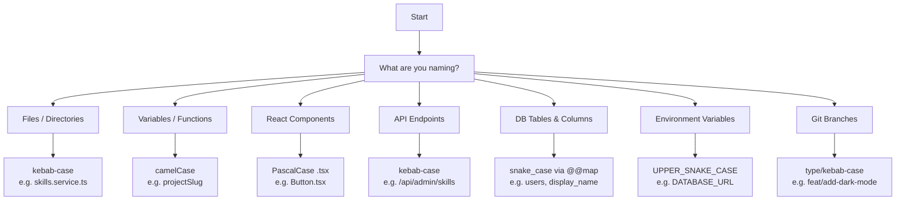

# Naming Conventions

> **Version:** 1.0  
> **Applies to:** All code in this monorepo (`apps/*`, `packages/*`)  
> **Last Updated:** 2026-07-11  
> **Authority:** These conventions are derived from the existing codebase. When in doubt, search for an existing example and follow it.

---

## 1. General Principles

### 1.1 Descriptive over Cryptic

Name things for their reader, not their writer. A variable name should communicate what it holds; a function name should communicate what it does.

```typescript
// Preferred
const sanitizedInput = sanitizeStrings(dto);
const activeProjects = await this.prisma.project.findMany({ where: { isActive: true } });

// Avoid
const tmp = sanitizeStrings(dto);
const ps = await this.prisma.project.findMany({ where: { isActive: true } });
```

### 1.2 Consistency over Personal Preference

When working in an existing file, match the conventions of that file. When adding a new module, match the conventions of the nearest sibling module. Personal preferences yield to project consistency.

### 1.3 One Concept, One Name

Use the same name for the same concept everywhere. If the database calls it `section_key`, the Zod schema calls it `section_key`, the DTO calls it `sectionKey`, and the frontend component calls it `sectionKey` — do not introduce a fourth variant.

---

## 2. TypeScript / JavaScript

| Construct                | Convention                              | Example                                          |
| ------------------------ | --------------------------------------- | ------------------------------------------------ |
| Variables                | `camelCase`                             | `const projectSlug = ...`                        |
| Functions                | `camelCase`                             | `function findAll(...)`                          |
| Classes                  | `PascalCase`                            | `class SkillsService`                            |
| Types / Interfaces       | `PascalCase`                            | `type ProjectId`, `interface CreateSkillDto`     |
| Constants (module-level) | `UPPER_SNAKE_CASE`                      | `const CACHE_KEY = 'skills'`                     |
| Enums                    | `PascalCase` enum, `PascalCase` members | `enum UserRole { Admin, Editor, Viewer }`        |
| File names               | `kebab-case`                            | `skills.service.ts`, `current-user.decorator.ts` |

### Branded Types

Branded types use `PascalCase` with a descriptive singular noun:

```typescript
export type UserId = string & { readonly __brand: 'UserId' };
export type ProjectId = string & { readonly __brand: 'ProjectId' };
export type SectionId = string & { readonly __brand: 'SectionId' };
```

### Interfaces vs Types

- Prefer `interface` for object shapes that may be extended
- Prefer `type` for unions, intersections, and branded primitives
- Follow the existing convention of the file you're modifying

### Discriminated Unions

Use a `type` field with a literal string to discriminate:

```typescript
type Result<T> =
  | { status: 'success'; data: T }
  | { status: 'error'; code: string; message: string };
```

---

## 3. NestJS Backend

### File Suffixes

Every NestJS artifact in `apps/api/src/` uses a standard suffix:

| Artifact            | Suffix            | Example                                 |
| ------------------- | ----------------- | --------------------------------------- |
| Service             | `.service.ts`     | `skills.service.ts`                     |
| Controller          | `.controller.ts`  | `skills.controller.ts`                  |
| Module              | `.module.ts`      | `skills.module.ts`                      |
| Guard               | `.guard.ts`       | `jwt-auth.guard.ts`                     |
| Decorator           | `.decorator.ts`   | `current-user.decorator.ts`             |
| Filter              | `.filter.ts`      | `global-exception.filter.ts`            |
| Interceptor         | `.interceptor.ts` | `response-envelope.interceptor.ts`      |
| Pipe                | `.pipe.ts`        | `validation.pipe.ts`                    |
| Strategy (Passport) | `.strategy.ts`    | `jwt.strategy.ts`, `google.strategy.ts` |
| DTO                 | `.dto.ts`         | `create-skill.dto.ts`                   |

### Class Naming

Combine the entity name with the NestJS artifact type using PascalCase:

```typescript
// Service
export class SkillsService {}

// Portfolio controller
export class PortfolioSkillsController {}

// Admin controller
export class AdminSkillsController {}

// Module
export class SkillsModule {}

// Guard
export class JwtAuthGuard extends AuthGuard('jwt') {}

// Decorator
export const Roles = (...roles: string[]) => SetMetadata(ROLES_KEY, roles);
export const Audit = (metadata: AuditMetadata) => SetMetadata(AUDIT_KEY, metadata);
```

### DTO Naming

- **Create:** `Create<Entity>Dto` — all required fields
- **Update:** `Update<Entity>Dto` — all fields optional (`@IsOptional()`)
- **Query/Filter:** `<Entity>QueryDto` — for complex query parameters
- **Response:** `<Entity>ResponseDto` — only when the response shape differs significantly from the entity

Files use the pattern `create-<entity>.dto.ts`, `update-<entity>.dto.ts`.

### Method Naming in Services

| Operation                        | Method Name                            |
| -------------------------------- | -------------------------------------- |
| List all (with optional filters) | `findAll(opts?)`                       |
| Single by ID                     | `findById(id: string)`                 |
| Single by slug or ID             | `findBySlugOrId(slugOrId: string)`     |
| Create                           | `create(dto: CreateDto)`               |
| Update                           | `update(id: string, dto: UpdateDto)`   |
| Delete                           | `delete(id: string)`                   |
| Toggle boolean field             | `toggle<Field>(id: string)`            |
| Bulk delete                      | `bulkDelete(ids: string[])`            |
| Bulk update                      | `bulkUpdate(ids: string[], data: ...)` |

### Module Directory Structure

```
modules/<entity>/
├── dto/
│   ├── index.ts          # barrel export
│   ├── create-<entity>.dto.ts
│   └── update-<entity>.dto.ts
├── <entity>.module.ts
└── <entity>.service.ts
```

---

## 4. Next.js Frontend

### App Router File Conventions

| Convention    | File Name       | Purpose                          |
| ------------- | --------------- | -------------------------------- |
| Page          | `page.tsx`      | Route UI (default export)        |
| Layout        | `layout.tsx`    | Shared wrapper for route segment |
| Loading       | `loading.tsx`   | Suspense fallback                |
| Error         | `error.tsx`     | Error boundary (`'use client'`)  |
| Not Found     | `not-found.tsx` | 404 page                         |
| Template      | `template.tsx`  | Re-instantiated layout wrapper   |
| Route Handler | `route.ts`      | API route within app directory   |

### Directory Naming

- Route segments use `kebab-case`: `src/app/case-studies/`, `src/app/guest-appearances/`
- Dynamic route parameters use `[param]`: `src/app/blog/[slug]/`
- Group routes with `(group)`: `src/app/(marketing)/`

### Path Aliases

Use the `@/` alias configured in `tsconfig.json`:

```typescript
import { getSections } from '@/lib/api';
import { Button } from '@/components/ui/Button';
import { Card } from '@/components/ui/Card';
```

---

## 5. React Components

### Component Naming

- PascalCase for component functions and file names
- One component per file (except small tightly-coupled helpers)
- Default export for page/layout components; named export for reusable components

```typescript
// components/ui/Button.tsx
'use client';
export function Button(props: ButtonProps) { ... }
export type ButtonProps = { variant: 'primary' | 'secondary'; ... };
```

### Props Naming

- Props use `camelCase` with descriptive names
- Boolean props use `is` or `has` prefix: `isActive`, `isFeatured`, `hasError`
- Event handlers use `on` prefix: `onClick`, `onSubmit`, `onChange`
- Props interface/type is named `<ComponentName>Props`

```typescript
interface CardProps {
  title: string;
  description: string;
  isFeatured?: boolean;
  onEdit?: (id: string) => void;
}
```

### Hooks

- Custom hooks use the `use` prefix and `camelCase`:
  - `useSkills()`, `useProjects()`, `useAuth()`
- Hooks live in `apps/web/src/lib/hooks/use<domain>.ts`
- Each hook file exports a named function and may export its return type
- Data-fetching hooks use `useApiQuery` from `lib/use-api-query.ts`

```typescript
// lib/hooks/useSkills.ts
export function useSkills(category?: string) {
  return useApiQuery(['skills', category], () => getSkills(category));
}
```

### Directory Structure

```
components/
├── ui/           # Reusable primitives (Button, Card, Input, Tooltip)
├── sections/     # Portfolio section components (Hero, About, Skills, Projects)
├── layout/       # Layout components (PageWrapper, Header, Footer)
├── admin/        # Admin dashboard components
├── 3d/           # Three.js / R3F components
├── effects/      # Visual effects (particles, transitions)
├── interactions/ # Interaction components (drag, scroll)
├── skeletons/    # Loading skeleton components
└── ai/           # AI chat interface components
```

---

## 6. Database (Prisma)

### Model Names (PascalCase, singular)

Prisma model names are singular PascalCase, mapped to snake_case table names:

```prisma
model User {
  @@map("users")
}
model Section {
  @@map("sections")
}
model Project {
  @@map("projects")
}
model ProjectImage {
  @@map("project_images")
}
```

### Field Names (camelCase in model, snake_case in DB)

Fields are defined in `camelCase` with `@map` to snake_case columns:

```prisma
model User {
  id                  String    @id @default(uuid())
  displayName         String    @map("display_name")
  avatarUrl           String?   @map("avatar_url")
  passwordHash        String?   @map("password_hash")
  failedLoginAttempts Int       @default(0) @map("failed_login_attempts")
  lockedUntil         DateTime? @map("locked_until")
  createdAt           DateTime  @default(now()) @map("created_at")
  updatedAt           DateTime  @updatedAt @map("updated_at")
}
```

### Relation Fields

- Foreign key: `camelCase` + `Id` suffix: `userId`, `projectId`
- Relation reference: matches the related model name in camelCase: `user`, `project`

```prisma
model Session {
  userId String @map("user_id")
  user   User   @relation(fields: [userId], references: [id], onDelete: Cascade)
}
```

### Index Naming

Prisma auto-generates index names. Use `@@index([field1, field2])` — no custom naming unless required for migration compatibility.

### Enum Naming

```prisma
enum UserRole {
  admin
  editor
  viewer
}
```

---

## 7. API Endpoints

### URL Structure

```
/api/portfolio/<entity>[/:id]       # Public read-only
/api/admin/<entity>[/:id]           # Authenticated CRUD
```

### HTTP Methods

| Method   | Action | Portfolio                       | Admin                          |
| -------- | ------ | ------------------------------- | ------------------------------ |
| `GET`    | List   | `GET /api/portfolio/skills`     | `GET /api/admin/skills`        |
| `GET`    | Single | `GET /api/portfolio/skills/:id` | `GET /api/admin/skills/:id`    |
| `POST`   | Create | —                               | `POST /api/admin/skills`       |
| `PATCH`  | Update | —                               | `PATCH /api/admin/skills/:id`  |
| `DELETE` | Delete | —                               | `DELETE /api/admin/skills/:id` |

### Special Actions

Non-CRUD actions use a verb after the entity:

| Endpoint       | Convention                                    |
| -------------- | --------------------------------------------- |
| Toggle feature | `PATCH /api/admin/skills/:id/toggle-featured` |
| Bulk delete    | `POST /api/admin/skills/bulk-delete`          |
| Bulk update    | `PATCH /api/admin/skills/bulk-update`         |
| Export         | `GET /api/admin/export/skills`                |
| Restore        | `PATCH /api/admin/skills/:id/restore`         |

### Controller Route Prefixes

```typescript
// Portfolio (read-only)
@Controller('portfolio/skills')
export class PortfolioSkillsController { ... }

// Admin (authenticated CRUD)
@Controller('admin/skills')
export class AdminSkillsController { ... }
```

---

## 8. Environment Variables

### Format

- `UPPER_SNAKE_CASE` with underscore separators
- Grouped by domain with a prefix
- No spaces, no hyphens

### Prefix Conventions

| Domain            | Prefix         | Examples                                      |
| ----------------- | -------------- | --------------------------------------------- |
| Database          | `DATABASE_`    | `DATABASE_URL`                                |
| Authentication    | `AUTH_`        | `AUTH_JWT_SECRET`, `AUTH_GOOGLE_CLIENT_ID`    |
| API configuration | `API_`         | `API_PORT`, `API_PREFIX`                      |
| Next.js public    | `NEXT_PUBLIC_` | `NEXT_PUBLIC_API_URL`, `NEXT_PUBLIC_SITE_URL` |
| Redis / Cache     | `REDIS_`       | `REDIS_HOST`, `REDIS_PORT`                    |
| External services | `<SERVICE>_`   | `SENTRY_DSN`, `RESEND_API_KEY`                |
| CORS              | `CORS_`        | `CORS_ORIGIN`                                 |

---

## 9. Git Branches

### Branch Naming

```
<type>/<short-description>
```

| Type        | Usage              | Example                      |
| ----------- | ------------------ | ---------------------------- |
| `feat/`     | New feature        | `feat/add-dark-mode`         |
| `fix/`      | Bug fix            | `fix/login-validation`       |
| `chore/`    | Maintenance        | `chore/update-deps`          |
| `refactor/` | Code restructuring | `refactor/module-pattern`    |
| `docs/`     | Documentation      | `docs/code-review-standards` |
| `test/`     | Test additions     | `test/skills-service`        |

Use kebab-case for the description. Be concise but descriptive.

### Commit Messages

Follow conventional commits:

```
<type>(<scope>): <description>
```

- Types: `feat`, `fix`, `docs`, `style`, `refactor`, `test`, `chore`
- Scopes: `web`, `api`, `ai`, `shared`, `ui`, `infra`, `docs`

---

## 10. File & Directory Organization

### One Concern Per File

Each file should export one primary thing (class, function, component, type). Co-locate small tightly-coupled helpers, but extract shared utilities.

### Flat over Nested

Prefer flat directory structures over deep nesting. Three levels of subdirectories should be rare.

```
# Preferred
modules/skills/
├── dto/
│   ├── create-skill.dto.ts
│   └── update-skill.dto.ts
├── skills.module.ts
└── skills.service.ts

# Avoid
modules/skills/
├── services/
│   └── skills.service.ts
├── controllers/
│   └── ...
├── dto/
│   ├── input/
│   │   ├── create-skill.dto.ts
│   │   └── update-skill.dto.ts
│   └── output/
│       └── skill-response.dto.ts
├── interfaces/
├── skills.module.ts
```

### Barrel Exports

Use `index.ts` barrel files for public module interfaces:

```typescript
// modules/skills/dto/index.ts
export { CreateSkillDto } from './create-skill.dto';
export { UpdateSkillDto } from './update-skill.dto';
```

### Import Order

Group imports in this order, separated by a blank line:

1. External / framework imports (`@nestjs/common`, `react`, `next/navigation`)
2. Internal library imports (`@portfolio/shared`, `@portfolio/ui`)
3. Absolute project imports (`@/lib/api`, `@/components/ui/Button`)
4. Relative imports (`../../common/database/prisma.service`, `./dto`)

---

## 11. CSS / Tailwind

### Utility Classes

Prefer Tailwind utility classes for styling. Custom CSS should be rare and only for animations, complex keyframes, or third-party overrides.

### Custom Class Names

When custom CSS is necessary, use `kebab-case`:

```css
.hero-section { ... }
.project-card { ... }
.section-heading { ... }
.slide-in-animation { ... }
```

### CSS Module Files

Named in `kebab-case` with `.module.css` extension:

```
Hero.module.css
project-card.module.css
```

### Tailwind Arbitrary Values

Use sparingly. Favor theme tokens defined in `tailwind.config.ts`. When using arbitrary values, prefer `theme()` function.

---

## 12. Special Cases

### Branded Types

Branded types in `packages/shared/src/index.ts` follow this pattern:

```typescript
export type <EntityName>Id = string & { readonly __brand: '<EntityName>Id' };
```

Always cast through the branded type at the API boundary.

### DTO Suffixes

- `Create<Entity>Dto` — for creation payloads
- `Update<Entity>Dto` — for partial update payloads
- `<Entity>QueryDto` — for complex query/filter parameters
- `<Entity>ResponseDto` — for custom response shapes

### Service Method Return Types

- `findAll` → `Promise<PaginatedResult<T>>` (wrapped by `paginateQuery`/`paginate`)
- `findById` → `Promise<T>` (throws `NotFoundException` if not found)
- `create` → `Promise<T>`
- `update` → `Promise<T>` (throws `NotFoundException` if not found)
- `delete` → `Promise<void>` or `Promise<boolean>`
- `bulkDelete` → `Promise<{ deleted: number; failed: number }>`

### API Response Envelope

All API responses follow `{ data, meta? }`:

```typescript
// Single item
{ "data": { "id": "uuid", "name": "React" } }

// Paginated list
{ "data": [{ "id": "uuid", "name": "React" }], "meta": { "page": 1, "perPage": 50, "total": 27 } }

// Created / Updated
{ "data": { "id": "uuid", "name": "React" } }

// Deleted — status 204, no body
```

---

## Appendix: Quick Reference

| What               | Convention                    | Example                             |
| ------------------ | ----------------------------- | ----------------------------------- |
| Variable           | `camelCase`                   | `projectSlug`                       |
| Function           | `camelCase`                   | `findAll()`                         |
| Class              | `PascalCase`                  | `SkillsService`                     |
| Type/Interface     | `PascalCase`                  | `ProjectId`, `CreateSkillDto`       |
| Constant           | `UPPER_SNAKE`                 | `CACHE_KEY`, `BCRYPT_ROUNDS`        |
| File name          | `kebab-case`                  | `skills.service.ts`                 |
| Component file     | `.tsx`                        | `Button.tsx`                        |
| NestJS file suffix | `.service.ts`                 | `skills.service.ts`                 |
| Route directory    | `kebab-case`                  | `case-studies/`                     |
| Prisma model       | Singular PascalCase + `@@map` | `model User { @@map("users") }`     |
| Prisma field       | `camelCase` + `@map`          | `displayName @map("display_name")`  |
| API endpoint       | `kebab-case`                  | `/api/admin/skills/toggle-featured` |
| Env var            | `UPPER_SNAKE`                 | `DATABASE_URL`                      |
| Git branch         | `type/kebab-case`             | `feat/add-dark-mode`                |
| DTO class          | `PascalCase` + `Dto` suffix   | `CreateSkillDto`                    |
| Hook               | `use` prefix + `camelCase`    | `useSkills()`                       |
| Props type         | `ComponentName` + `Props`     | `CardProps`                         |
| CSS class          | `kebab-case`                  | `hero-section`                      |

## 13. Naming Decision Tree



## Cross-References

- [MASTER-INDEX.md](../MASTER-INDEX.md) — Documentation master index
- [CROSS-REFERENCE-INDEX.md](../26-reference/CROSS-REFERENCE-INDEX.md) — Cross-reference system
