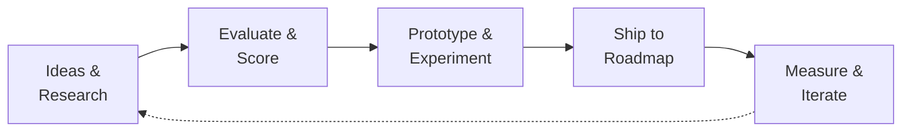

# Innovation Backlog

> **Purpose:** Track forward-looking feature ideas, experiments, and strategic initiatives that are not yet prioritized for development.
> **Audience:** Product team, Engineering leadership, Stakeholders
> **Owner:** Head of Product / CTO
> **Dependencies:** [PRODUCT-ROADMAP.md](./PRODUCT-ROADMAP.md), [FutureRoadmap.md](../01-product/FutureRoadmap.md), [Backlog.md](../01-product/Backlog.md), [TechnicalDebtRegister.md](../21-operations/TechnicalDebtRegister.md)
> **Status:** Living document | **Review Frequency:** Monthly
> **Version:** 1.0 | **Last Updated:** July 2026

---

## Innovation Pipeline

Initiatives are classified into three tiers based on time horizon, resource requirements, and strategic certainty.

### Tier 1: Strategic Initiatives (Next 6–12 Months)

Well-understood opportunities with clear value propositions. These are candidates for the next PRODUCT-ROADMAP.md cycle after validation.

| ID    | Initiative                                                                                                                                                                                                                                                                                                                  | Category               | Expected Impact                                                                                   | Effort Estimate | Dependencies                                                                                                                                                                                                   | Status    |
| ----- | --------------------------------------------------------------------------------------------------------------------------------------------------------------------------------------------------------------------------------------------------------------------------------------------------------------------------- | ---------------------- | ------------------------------------------------------------------------------------------------- | --------------- | -------------------------------------------------------------------------------------------------------------------------------------------------------------------------------------------------------------- | --------- |
| IB-01 | **3D Scene Editor in Admin** — Visual editor for the R3F hero scene: drag-and-drop GLTF placement, lighting presets, camera path editing via Theatre.js                                                                                                                                                                     | 3D / Immersive         | High — Democratizes 3D content updates without code deploys                                       | 8–10 weeks      | Theatre.js integration in admin UI (`@theatre/core`, `@theatre/r3f`); admin sandbox infra (`apps/api/src/admin/controllers/sandbox.controller.ts`)                                                             | Research  |
| IB-02 | **Sandbox IDE 2.0 — Multi-file editor + AI copilot** — Extend the WebContainer sandbox (`@webcontainer/api`) with an AI coding assistant that uses the FastAPI service (`apps/ai`) for inline code suggestions, debugging, and refactoring                                                                                  | AI / Developer Tooling | High — Differentiator for the portfolio; showcases AI integration on live infrastructure          | 10–12 weeks     | WebContainer strict COOP/COEP headers (already configured in Next.js); `apps/ai` FastAPI service (currently a stub at `apps/ai/app/main.py`); Monaco editor (`@monaco-editor/react`)                           | Prototype |
| IB-03 | **AI-Powered Content Strategy Engine** — Analyze portfolio content gaps (skills, projects, blog) via RAG embeddings (`ContentEmbedding` model, pgvector) and auto-suggest missing case studies, skill categories, or blog topics. Integrates with `apps/ai` for generation and `packages/shared` Zod schemas for validation | AI / Content           | Medium-High — Keeps portfolio fresh and comprehensive; reduces content maintenance burden         | 6–8 weeks       | `apps/api/prisma/schema.prisma` ContentEmbedding model; `apps/ai` service (needs LangChain pipeline); `docs/08-ai/19-RAG.md` design spec                                                                       | Design    |
| IB-04 | **Interactive Resume / Timeline Explorer** — An animated, GSAP-driven interactive timeline that visualises the Experience model with scrubbable scroll-linked animation, company logos from `MediaAsset`, and Theatre.js sequenced micro-animations per role                                                                | Frontend / 3D          | Medium — Major UX upgrade for the Experience section; portfolio differentiator                    | 4–6 weeks       | `apps/web/src/components/sections/` existing section patterns; Lenis smooth scroll already installed (`lenis: ^1.3.23`); GSAP (`gsap: ^3.15.0`) and Theatre.js (`@theatre/core: ^0.7.2`) already in deps       | Research  |
| IB-05 | **Real-time Collaboration for Blog CMS** — Operational Transformation + WebSockets for the Tiptap editor (`@tiptap/react`, `@tiptap/pm`) in the admin blog CMS (`A-02` on roadmap). Enable simultaneous editing with cursor presence                                                                                        | CMS / Admin            | Medium — Foundation for multi-editor workflows; enterprise CMS requirement                        | 8–10 weeks      | Tiptap collaboration extensions (bcw-savje/tiptap-collab or Hocuspocus); NestJS WebSocket gateway; BullMQ for persistence queue                                                                                | Design    |
| IB-06 | **Performance Budget CI Gate** — Enforce performance budgets (Lighthouse scores, bundle size, image weight) as a blocking CI check. Integrate with Vercel deployments and GitHub Actions                                                                                                                                    | DevOps / Performance   | High — Prevents regression; hardens the `apps/web` build pipeline                                 | 3–4 weeks       | `@next/bundle-analyzer` already in devDeps; `lighthouse-ci` integration; `docs/35-quality/performance-budget.md` existing spec; performance budgets defined in `docs/15-performance/PERFORMANCE-BENCHMARKS.md` | Design    |
| IB-07 | **Localization (i18n) v1 — Multi-language Portfolio** — Next.js App Router i18n with 3+ locales. Translate sections, projects, blog content with AI-assisted translation workflow through `apps/ai`. Use `next-themes`-style locale switcher                                                                                | Platform / UX          | Medium — Expands reach to non-English visitors; P-09 on roadmap (Q1 2027)                         | 6–8 weeks       | Next.js i18n routing; `apps/ai` LLM translation pipeline; content model needs `locale` field or separate localized content tables                                                                              | Research  |
| IB-08 | **Custom Analytics Dashboard Builder** — Drag-and-drop dashboard query builder in admin that lets users compose analytics queries from `AnalyticsEvent`, `AnalyticsSession`, and `PageView` models. Chart type selection, date ranges, saved dashboards                                                                     | Admin / Analytics      | Medium — Replaces static admin analytics (A-04 on roadmap) with self-service tool                 | 8–12 weeks      | `apps/api/src/portfolio/controllers/analytics.controller.ts` + `apps/api/src/admin/controllers/analytics.controller.ts` existing analytics stack; shadcn/ui chart components                                   | Research  |
| IB-09 | **Lead Scoring & Auto-Routing Engine** — ML-based lead scoring using historical `Lead` + `LeadActivity` + `LeadNote` data. Auto-assign priority, route to appropriate contact channel (email, Telegram notification), trigger BullMQ email workflows                                                                        | AI / CRM               | Medium — Converts the contact/lead module into a proactive business tool                          | 6–8 weeks       | `apps/api/prisma/schema.prisma` Lead + LeadActivity + LeadNote models; `apps/api/src/common/queue/email.processor.ts` for notifications; `apps/api/src/common/notifications/` infrastructure                   | Prototype |
| IB-10 | **Section Template Marketplace** — Reusable, configurable section templates (`Section.stylePreset`, `Section.styleConfig`). Users can browse, preview, and apply templates with one click. Template versioning and community submissions                                                                                    | Platform / Content     | Medium — Accelerates portfolio creation; platform differentiator                                  | 8–10 weeks      | Section model with `style_preset`, `style_config`, `content` JSON fields already supports this; architecture doc `docs/04-design/ComponentLibrary.md`                                                          | Research  |
| IB-11 | **Web Vitals Real-time Monitor** — Dashboard showing real-time Core Web Vitals (LCP, CLS, INP, TTFB) from RUM data + synthetic checks. Alert threshold configuration with Sentry integration                                                                                                                                | Observability / DevOps | Medium-High — Proactive performance monitoring; complements Sentry (`apps/api/src/main.ts:16-24`) | 5–7 weeks       | `@sentry/nextjs` with tracing already configured; web-vitals library; `docs/14-observability/` category exists                                                                                                 | Design    |
| IB-12 | **Media Asset CDN with Automatic Transforms** — Image optimization pipeline: auto-resize, format conversion (WebP/AVIF), blurhash placeholder generation, and responsive srcset. Integrate with `MediaAsset` model and Supabase Storage                                                                                     | Backend / Performance  | High — Directly impacts Lighthouse scores and user experience                                     | 5–7 weeks       | `apps/api/prisma/schema.prisma` MediaAsset model (has `variants` JSON field, `width`, `height`, `mimeType`); Supabase Storage bucket `assets`; `sharp` or `@img/sharp` for transforms                          | Prototype |

### Tier 2: Exploratory (12–24 Months)

Promising ideas that need validation spikes or market research before committing roadmap capacity.

| ID    | Initiative                                                                                                                                                                                                                                          | Category                    | Expected Impact                                       | Effort Estimate | Dependencies                                                                                                                                                                                                       | Status      |
| ----- | --------------------------------------------------------------------------------------------------------------------------------------------------------------------------------------------------------------------------------------------------- | --------------------------- | ----------------------------------------------------- | --------------- | ------------------------------------------------------------------------------------------------------------------------------------------------------------------------------------------------------------------ | ----------- |
| IB-13 | **Voice-Controlled Portfolio Navigation** — Voice UI using Web Speech API or Whisper API via `apps/ai` for hands-free navigation. "Show me your React projects", "Tell me about your experience at X"                                               | AI / UX                     | Medium — Novel interaction model; accessibility win   | 4–5 weeks (POC) | Web Speech API browser support; `apps/ai` transcription endpoint; existing chat conversation models for session persistence                                                                                        | Research    |
| IB-14 | **Generative 3D Portfolio Scene from Resume** — Auto-generate the hero 3D scene (`@react-three/fiber`) from structured data (skills, projects, experience). Skill proficiency maps to 3D geometry complexity, tech stack colors drive scene palette | AI / 3D                     | High — Zero-config 3D portfolio; viral shareability   | 8–12 weeks      | `@react-three/drei` + `@react-three/postprocessing` for scene building; `apps/ai` for layout generation; `ContentEmbedding` model for semantic mapping                                                             | Exploration |
| IB-15 | **Community Guestbook + Social Feed** — Public guestbook (`ReadingListItem`-style model) with social features: reactions, threaded replies, embeddable portfolio badge. Authenticated via OAuth (Google/GitHub) using existing Passport.js setup    | Platform / Social           | Medium — Community engagement; social proof           | 6–8 weeks       | Passport.js OAuth flow (`docs/27-decisions/ADR-018-nestjs-passport-auth.md`); existing `ReadingListItem` model pattern                                                                                             | Exploration |
| IB-16 | **Self-Service API Key Management Portal** — Admin UI for generating, rotating, and revoking API keys (`ApiKey` model). Usage analytics dashboard, rate limit configuration per key, permission scoping (read/write/admin)                          | Admin / Platform            | Medium — Unlocks public API vision (PL-02 on roadmap) | 5–7 weeks       | `apps/api/prisma/schema.prisma` ApiKey model (key hash, prefix, permissions, expiry); `apps/api/src/modules/api-keys/` module                                                                                      | Research    |
| IB-17 | **Headless CMS Mode** — Expose a fully headless GraphQL API (via NestJS + `@nestjs/graphql`) for the portfolio content. Decouple frontend rendering from CMS; enable third-party consumers                                                          | Platform / API              | High — Architectural flexibility; B2B use cases       | 10–14 weeks     | Existing portfolio controllers (`apps/api/src/portfolio/controllers/`) provide the read path; `packages/shared` Zod schemas map naturally to GraphQL types; `apps/api/src/admin/controllers/` cover the write path | Exploration |
| IB-18 | **AI-Driven A/B Testing Framework** — Auto-test different section layouts (`style_preset`), hero scene variants, and CTA placements. Use `FeatureFlag` model + `rollout_percentage` for targeting. Bayesian analysis via `apps/ai`                  | AI / Optimization           | Medium — Data-driven design decisions                 | 8–10 weeks      | `apps/api/prisma/schema.prisma` FeatureFlag model (targeting rules, rollout percentage); `apps/api/src/portfolio/controllers/feature-flags.controller.ts`; `docs/06-backend/feature-flag-guide.md`                 | Research    |
| IB-19 | **Live Coding Stream Overlay** — Real-time code editor in the portfolio that simulates a live coding stream. Uses WebContainer + Monaco with a simulated typing effect, re-playable from any point. Embeddable in blog posts                        | Developer Tooling / Content | Medium — Differentiator for technical blog content    | 5–8 weeks       | WebContainer already in deps (`@webcontainer/api: ^1.6.4`); Monaco editor (`@monaco-editor/react: ^4.7.0`); sandbox controller at `apps/api/src/admin/controllers/sandbox.controller.ts`                           | Exploration |
| IB-20 | **Personalized Visitor Dashboard** — Return-visitor recognition via fingerprinting + localStorage token. Show personalized content recommendations, "since your last visit" updates, and preferred theme (`next-themes`). Privacy-first with opt-in | Platform / UX               | Low-Medium — Delight feature; privacy-compliant       | 4–6 weeks       | Visitor analytics already exist (`AnalyticsSession.visitorId`, `AnalyticsEvent.visitorId`); `next-themes: ^0.3.0` for theme; `docs/11-security/PRIVACY.md`                                                         | Exploration |

### Tier 3: Vision (24+ Months / Moonshots)

High-risk, high-reward ideas that could redefine the platform. These require significant R&D investment.

| ID    | Initiative                                                                                                                                                                                                                                                                                                                                               | Category               | Expected Impact                                                                                 | Effort Estimate | Dependencies                                                                                                                                                                                                | Status   |
| ----- | -------------------------------------------------------------------------------------------------------------------------------------------------------------------------------------------------------------------------------------------------------------------------------------------------------------------------------------------------------- | ---------------------- | ----------------------------------------------------------------------------------------------- | --------------- | ----------------------------------------------------------------------------------------------------------------------------------------------------------------------------------------------------------- | -------- |
| IB-21 | **Neural Portfolio Engine** — An AI system that builds a personalized portfolio site for each visitor in real-time. Section order, visual styling, content depth, and 3D scene are dynamically generated based on the visitor's inferred interests (referrer, time-on-site patterns, interaction history). Uses the full content corpus via pgvector RAG | AI / Visionary         | Transformational — No two visitors see the same portfolio; paradigm shift for personal websites | 20+ weeks       | Full RAG pipeline (`docs/08-ai/19-RAG.md`); `ContentEmbedding` model + pgvector; `FeatureFlag` system for targeting; `Section` model content/styleConfig flexibility; `apps/ai` service                     | Moonshot |
| IB-22 | **Portfolio-as-a-Platform (PaaP)** — A multi-tenant SaaS platform where other developers create portfolios using the same architecture. Each tenant gets isolated Supabase schemas, custom domain, and AI-powered content generation. Monetised via subscription tiers                                                                                   | Platform / Business    | Transformational — New revenue stream; network effects                                          | 30+ weeks       | Multi-tenancy rework of entire API; isolation layer (`supabase-js` per-tenant); billing integration; existing templates and section system as building blocks                                               | Moonshot |
| IB-23 | **3D Portfolio Metaverse Room** — A persistent, multi-user 3D space built with `@react-three/xr` or `@react-three/fiber` + WebRTC where visitors can walk through a gallery of projects, interact with 3D skill visualizations, and chat with each other in real-time                                                                                    | 3D / Visionary         | Transformational — Industry showcase; bleeding-edge tech demo                                   | 24+ weeks       | WebRTC + 3D scene compositing; `@react-three/postprocessing` for visual effects; `detect-gpu` for capability detection; `ChatConversation`/`ChatMessage` models for real-time chat persistence              | Moonshot |
| IB-24 | **Autonomous Code Contributor** — An AI agent (powered by `apps/ai`) that reads the project's own codebase, identifies TODOs, bug patterns, and feature gaps from the PRODUCT-ROADMAP.md, and autonomously creates well-structured PRs. Uses the Sandbox IDE (WebContainer) as a safe execution sandbox                                                  | AI / Developer Tooling | Transformational — The portfolio improves itself; ultimate meta-feature                         | 16+ weeks       | Full `apps/ai` FastAPI service implementation; `docs/08-ai/08g-AI-ASSISTANT-ARCHITECTURE.md` + `docs/08-ai/08h-AI-ASSISTANT-IMPLEMENTATION.md` design specs; code analysis pipeline; GitHub API integration | Moonshot |
| IB-25 | **Decentralized Identity & Credential Verification** — Integrate blockchain-based credential verification for achievements, certifications, and work experience. Issue verifiable credentials for skills; visitors can cryptographically verify claims                                                                                                   | Platform / Visionary   | Medium — Trust signal; early adopter of decentralized web standards                             | 12–16 weeks     | `Achievement` model with `credential_url` field; `Experience` model; Supabase PostgreSQL compatible with pgcrypto                                                                                           | Moonshot |

---

## Experiment Log

Record of structured experiments conducted to validate innovation hypotheses.

| ID    | Experiment                                           | Hypothesis                                                                                                                                                                                                    | Success Criteria                                                                                                   | Timeline           | Outcome |
| ----- | ---------------------------------------------------- | ------------------------------------------------------------------------------------------------------------------------------------------------------------------------------------------------------------- | ------------------------------------------------------------------------------------------------------------------ | ------------------ | ------- |
| EX-01 | **WebContainer Performance on Mid-range Hardware**   | The sandbox IDE (`@webcontainer/api`) boots in under 5 seconds on a Core i5 / 8GB RAM device                                                                                                                  | 90th percentile boot time < 5s; memory usage < 200MB                                                               | Jul 2026 (2 weeks) | TBD     |
| EX-02 | **Theatre.js + GSAP Scroll Animation Performance**   | Sequencing a Theatre.js timeline with GSAP ScrollTrigger at 60fps is feasible for 5+ simultaneous animated sections without frame drops                                                                       | No dropped frames on Chrome DevTools performance tab; consistent 60fps on M1 MacBook and Windows i7                | Jul 2026 (1 week)  | TBD     |
| EX-03 | **AI Chat Cold-Start Quality Baseline**              | Current RAG pipeline (if non-functional, a mock with `apps/ai` stub returning canned responses) achieves >70% user satisfaction on portfolio knowledge queries                                                | User satisfaction rating >= 3.5/5 on a 10-question test set; <3s response time at P95                              | Aug 2026 (1 week)  | TBD     |
| EX-04 | **pgvector Embedding Quality for Portfolio Content** | Chunking projects, skills, and blog content into 512-char overlapping chunks and embedding with text-embedding-3-small yields semantically relevant search results for domain-specific queries                | MRR@10 >= 0.75 on a hand-curated test set of 50 portfolio-specific questions                                       | Aug 2026 (2 weeks) | TBD     |
| EX-05 | **COOP/COEP Isolation for Sandbox IDE Production**   | Current headers (`CrossOriginEmbedderPolicy: false` in `apps/api/src/main.ts:30`) are too permissive. Hypothesis: strict COOP/COEP enables `SharedArrayBuffer` but breaks Supabase client. Trade-off analysis | Clear documentation of which features break and mitigation strategies; recommendation for production header config | Aug 2026 (1 week)  | TBD     |
| EX-06 | **Three.js GLTF Compression Ratio Benchmark**        | Using `gltf-transform` to apply Draco + meshopt compression yields 60-80% size reduction on hero scene models without perceptible quality loss on modern GPUs                                                 | Size reduction >= 70%; no perceptible difference in blind A/B test (N=10); load time < 2s on 4G                    | Sep 2026 (1 week)  | TBD     |
| EX-07 | **Tiptap Collaboration Backend Latency**             | A WebSocket-based collaboration backend for Tiptap (`@tiptap/react`) adds <50ms P95 latency per operation on a US-east-1 server with 2 concurrent editors                                                     | P95 operation latency < 50ms; no conflicting-change data loss in stress test                                       | Sep 2026 (2 weeks) | TBD     |
| EX-08 | **Sentry Profiling Overhead on NestJS**              | `@sentry/profiling-node` integration (`apps/api/src/main.ts:21`) adds <5% overhead to request processing time                                                                                                 | CPU overhead < 5%; memory overhead < 50MB; trace sampling rate 0.1 viable for production                           | Jul 2026 (1 week)  | TBD     |

---

## Innovation Themes

### Theme 1: Ambient Intelligence — AI as Portfolio Co-Pilot

The portfolio should not just display content—it should understand, adapt, and improve itself. This theme spans the entire pipeline from content ingestion (`ContentEmbedding` + pgvector RAG) through dynamic personalization to autonomous improvement.

**Candidate initiatives:** IB-03 (Content Strategy Engine), IB-09 (Lead Scoring), IB-18 (A/B Testing), IB-21 (Neural Portfolio Engine), IB-24 (Autonomous Code Contributor)

**Reference docs:** `docs/08-ai/STRATEGY.md`, `docs/08-ai/MODEL-DECISION-MATRIX.md`, `docs/27-decisions/ADR-006-fastapi-ai.md`, `docs/27-decisions/ADR-007-pgvector.md`

### Theme 2: Immersive Storytelling — 3D & Motion as a Narrative Medium

3D and animation should serve a narrative purpose, not just decoration. From the hero scene (IB-01) through timeline visualization (IB-04) to the metaverse gallery (IB-23), motion should guide attention, convey hierarchy, and make the portfolio memorable.

**Candidate initiatives:** IB-01 (3D Scene Editor), IB-04 (Interactive Timeline), IB-14 (Generative 3D Scene), IB-23 (Metaverse Room)

**Reference docs:** `docs/08-ai/08o-IMMERSIVE-EXPERIENCE.md`, `docs/05-architecture/AnimationArchitecture.md`, `docs/04-design/VisualExperienceSystem.md`, `docs/27-decisions/ADR-013-framer-motion.md`

### Theme 3: Developer Platform — From Portfolio to Product

Transforming the portfolio from a personal site into a platform that other developers use. This includes the public API (IB-17/IB-16), template marketplace (IB-10), sandbox IDE (IB-02), and the eventual PaaS (IB-22).

**Candidate initiatives:** IB-02 (Sandbox IDE 2.0), IB-10 (Template Marketplace), IB-16 (API Key Management), IB-17 (Headless CMS), IB-19 (Live Coding Overlay), IB-22 (PaaS)

**Reference docs:** `docs/37-future/Sandbox-AI-IDE.md`, `docs/05-architecture/IntegrationArchitecture.md`, `docs/10-api/APIContracts.md`, `docs/10-api/12-API.md`, `docs/05-architecture/ServiceArchitecture.md`

### Theme 4: Operational Excellence — Invisible Infrastructure

The platform must be observable, performant, and reliable without requiring manual attention. This theme covers automated performance enforcement, real-time monitoring, and self-healing infrastructure.

**Candidate initiatives:** IB-06 (Performance Budget CI), IB-11 (Web Vitals Monitor), IB-12 (Media CDN), IB-08 (Analytics Dashboard)

**Reference docs:** `docs/15-performance/PERFORMANCE-BENCHMARKS.md`, `docs/14-observability/`, `docs/21-operations/21-MONITORING.md`, `docs/21-operations/22-OBSERVABILITY.md`, `docs/27-decisions/ADR-016-sentry-error-tracking.md`

### Theme 5: Community & Trust — Social Proof Ecosystems

Building trust signals and community engagement features into the platform. Verifiable credentials, social interactions, and transparent contribution histories create a credible professional brand.

**Candidate initiatives:** IB-15 (Guestbook + Social Feed), IB-25 (Decentralized Identity), IB-20 (Personalized Dashboard), IB-09 (Lead Scoring)

**Reference docs:** `docs/11-security/SecurityArchitecture.md`, `docs/11-security/16-COMPLIANCE.md`, `docs/11-security/data-classification.md`, `docs/01-product/UserPersonas.md`

---

## Cross-References

### Internal Documents

- **Primary Roadmap:** [PRODUCT-ROADMAP.md](./PRODUCT-ROADMAP.md) — Initiatives IB-07 ↔ P-09, IB-08 ↔ A-04, IB-02 ↔ PL-02 alignment
- **Future Roadmap:** [FutureRoadmap.md](../01-product/FutureRoadmap.md) — Long-horizon alignment
- **Product Backlog:** [Backlog.md](../01-product/Backlog.md) — Ready-for-dev items extracted from Tier 1
- **Technical Debt:** [TechnicalDebtRegister.md](../21-operations/TechnicalDebtRegister.md) — Infrastructure improvements that must precede certain innovations (e.g., IB-06 needs CI pipeline hardened first)
- **AI Strategy:** [STRATEGY.md](../08-ai/STRATEGY.md) — Documents the overall AI vision that Themes 1, 5 draw from
- **Agent Architecture:** [AGENT.md](../08-ai/AGENT.md) — Design spec that IB-24 (Autonomous Contributor) builds on
- **RAG Design:** [19-RAG.md](../08-ai/19-RAG.md) — Foundation for IB-03, IB-21
- **Feature Flag Guide:** [feature-flag-guide.md](../06-backend/feature-flag-guide.md) — Required infrastructure for IB-18
- **Design Doc:** [08o-IMMERSIVE-EXPERIENCE.md](../04-design/08o-IMMERSIVE-EXPERIENCE.md) — Design foundation for Theme 2 initiatives
- **Sandbox IDE Spec:** [Sandbox-AI-IDE.md](../features/Sandbox-AI-IDE.md) — Vision document for IB-02
- **Performance Budget:** [performance-budget.md](../35-quality/performance-budget.md) — Existing spec for IB-06
- **PRIVACY Policy:** [PRIVACY.md](../11-security/PRIVACY.md) — IB-20 must comply with documented privacy standards
- **Accessibility Arch:** [AccessibilityArchitecture.md](../35-quality/AccessibilityArchitecture.md) — All frontend innovations must maintain WCAG compliance
- **Testing Strategy:** [TestingArchitecture.md](../35-quality/TestingArchitecture.md) — Experiment verification methodology

### External References

- **WebContainer API:** https://webcontainers.io/ — Sandbox IDE foundation (IB-02, IB-19)
- **Theatre.js Studio:** https://www.theatrejs.com/ — 3D animation sequencing (IB-01, IB-04)
- **pgvector:** https://github.com/pgvector/pgvector — Embedding storage for RAG (IB-03, IB-21)
- **Tiptap Collaboration:** https://tiptap.dev/docs/collaboration/getting-started — Real-time editing (IB-05)
- **Lighthouse CI:** https://github.com/GoogleChrome/lighthouse-ci — Performance gates (IB-06)
- **Spline:** https://spline.design/ — 3D scene design alternative for IB-01 workflow

### ADR References

| ADR     | Title                  | Relevant Initiatives                             |
| ------- | ---------------------- | ------------------------------------------------ |
| ADR-001 | Turborepo Monorepo     | IB-22 (PaaS multi-tenant)                        |
| ADR-002 | Next.js App Router     | IB-07 (i18n), IB-21 (dynamic pages)              |
| ADR-006 | FastAPI AI Service     | IB-03, IB-14, IB-18, IB-24                       |
| ADR-007 | pgvector Embeddings    | IB-03, IB-21                                     |
| ADR-008 | Tiptap Editor          | IB-05 (collaboration)                            |
| ADR-012 | Vercel Deployment      | IB-06 (CI gates), IB-11 (web vitals)             |
| ADR-016 | Sentry Error Tracking  | IB-11 (monitoring integration)                   |
| ADR-017 | BullMQ Background Jobs | IB-05 (collab persistence), IB-09 (lead routing) |
| ADR-018 | Passport.js Auth       | IB-15 (social login), IB-16 (API key auth)       |

---

## Scoring Rubric

Initiatives in the Innovation Pipeline are scored on the following dimensions during monthly review:

| Dimension                   | Weight | Scoring (1–5)                                                     |
| --------------------------- | ------ | ----------------------------------------------------------------- |
| Strategic Alignment         | 25%    | How well does this support the product vision and roadmap themes? |
| Technical Feasibility       | 20%    | Can we build this with our current stack and team?                |
| User Impact                 | 20%    | How many users benefit, and how significantly?                    |
| Competitive Differentiation | 15%    | Does this set the portfolio apart from peers?                     |
| Effort / Risk Ratio         | 10%    | Is the expected impact proportional to the investment?            |
| Innovation Value            | 10%    | Does this push the team's skills or the tech forward?             |

**Thresholds:**

- **Score >= 4.0:** Elevate to PRODUCT-ROADMAP.md for next-quarter consideration
- **Score 3.0–3.9:** Keep in Tier 1 or Tier 2; refine hypothesis
- **Score < 3.0:** Demote to Tier 3 or archive; revisit in 6 months

---

## Archive

| ID  | Initiative | Archived | Rationale |
| --- | ---------- | -------- | --------- |
| —   | —          | —        | —         |

_No items archived yet. Initiatives are reviewed monthly; those scoring < 3.0 on the rubric for two consecutive reviews are moved here._

---

## Change Log

| Date     | Change                                                                | Author          |
| -------- | --------------------------------------------------------------------- | --------------- |
| Jul 2026 | Initial v1.0 — 25 initiatives across 3 tiers, 8 experiments, 5 themes | Head of Product |

---

_End of Document — Innovation Backlog v1.0_
_Next Review: August 2026_
