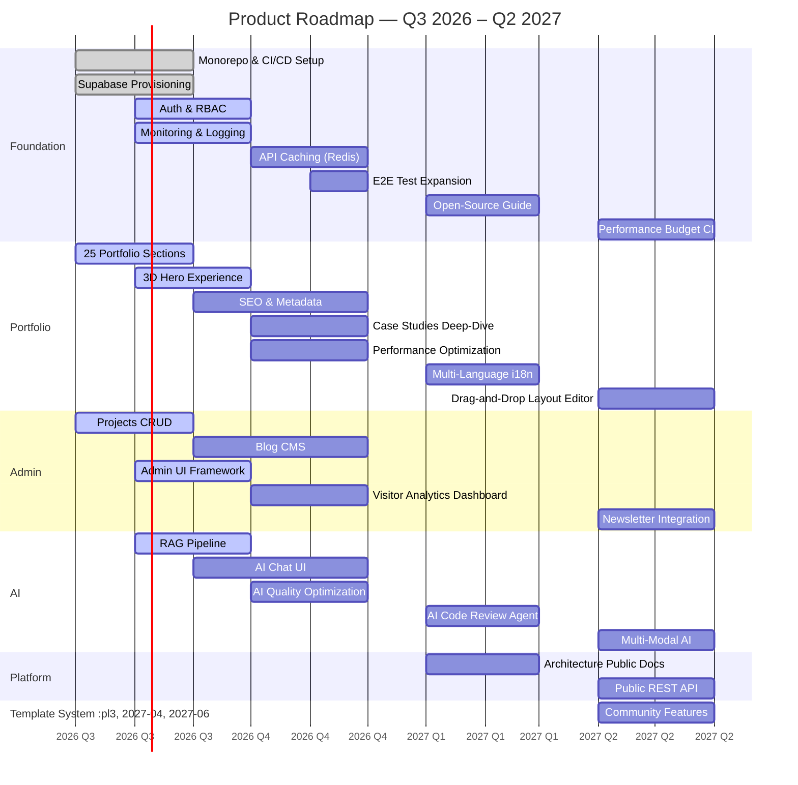

# Product Roadmap — Theme-Based Delivery Plan

> **Document:** `ProductRoadmap.md` | **Version:** 2.0 | **Last Updated:** July 2026
> **Status:** Active | **Owner:** Product Owner | **Review Cadence:** Quarterly
> **Horizon:** Q3 2026 – Q2 2027 (4 quarters)
> **Cross-References:** [FutureRoadmap.md](./FutureRoadmap.md) | [okrs.md](./okrs.md) | [Backlog.md](./Backlog.md)

---

## 1. Roadmap Overview



The product roadmap is organized into **5 strategic swimlanes** across **4 quarters**. Each initiative is categorized by status and linked to measurable success criteria. Dependencies between swimlanes are explicitly noted to guide sequencing decisions.

### Theme Swimlanes

| Swimlane       | Focus                           | Owner         | Q3            | Q4            | Q1            | Q2            |
| -------------- | ------------------------------- | ------------- | ------------- | ------------- | ------------- | ------------- |
| **Foundation** | Infra, auth, CI/CD, performance | Architect     | 5 initiatives | 2 initiatives | 1 initiative  | 1 initiative  |
| **Portfolio**  | Public sections, 3D, content    | Frontend Lead | 5 initiatives | 3 initiatives | 2 initiatives | 1 initiative  |
| **Admin**      | Dashboard, CMS, analytics       | Full-stack    | 3 initiatives | 2 initiatives | —             | 1 initiative  |
| **AI**         | Chat, RAG, agents, multi-modal  | AI Architect  | 3 initiatives | 1 initiative  | 3 initiatives | 1 initiative  |
| **Platform**   | API, templates, community       | Product Owner | —             | —             | 2 initiatives | 3 initiatives |

**Total Initiatives:** 39 across 4 quarters (progression: Q3=16, Q4=8, Q1=8, Q2=7)

---

## 2. Q3 2026 (Jul–Sep) — Foundation & Launch

**Theme:** Launch & Establish | **Status:** Active | **Resource:** 2.5 person-quarters

### Foundation

| ID   | Initiative                   | Status         | Description                                                          | Success Metric                                       | Deps |
| ---- | ---------------------------- | -------------- | -------------------------------------------------------------------- | ---------------------------------------------------- | ---- |
| F-01 | Monorepo & CI/CD setup       | 🟢 Complete    | Turborepo, GitHub Actions (lint → typecheck → test → build → deploy) | Pipeline < 10 min; zero failed deploys               | —    |
| F-02 | Supabase provisioning        | 🟢 Complete    | PostgreSQL, Auth, Storage, pgvector extension                        | Database responsive; connection pool healthy         | —    |
| F-03 | Prisma schema & shared types | 🟢 Complete    | Database models + Zod schemas in `packages/shared`                   | Prisma generate succeeds; types sync across packages | F-02 |
| F-04 | Auth & RBAC                  | 🟡 In Progress | JWT auth, HttpOnly cookies, admin/editor/viewer roles                | Zero auth vulnerabilities; secure admin access       | F-03 |
| F-05 | Monitoring & logging         | 🟡 In Progress | Sentry error tracking, Pino structured logging, uptime monitoring    | Alert response < 15 min for SEV-1                    | F-01 |

### Portfolio

| ID   | Initiative                  | Status         | Description                                                                              | Success Metric                                       | Deps |
| ---- | --------------------------- | -------------- | ---------------------------------------------------------------------------------------- | ---------------------------------------------------- | ---- |
| P-01 | 25 portfolio sections       | 🟡 In Progress | Hero, About, Projects, Skills, Experience, Education, Testimonials, Stats, Contact, Blog | 25/25 sections live and responsive                   | —    |
| P-02 | 3D hero experience          | 🟡 In Progress | React Three Fiber scene with branded GLTF + lazy loading                                 | 3D load < 3s; no LCP regression                      | —    |
| P-03 | Responsive design baseline  | 🟡 In Progress | All sections adapt to mobile/tablet/desktop                                              | Zero layout shift at any breakpoint                  | P-01 |
| P-04 | SEO & metadata              | 🔵 Planned     | OG tags, sitemap, structured data, canonical URLs                                        | Rich previews on Twitter/LinkedIn/Slack              | P-01 |
| P-05 | Public architecture section | 🔵 Planned     | System diagram, tech stack badges, ADR links                                             | Architecture page receives > 10% of visitor sessions | —    |

### Admin

| ID   | Initiative         | Status         | Description                                             | Success Metric                             | Deps |
| ---- | ------------------ | -------------- | ------------------------------------------------------- | ------------------------------------------ | ---- |
| A-01 | Projects CRUD      | 🟡 In Progress | Rich text editor, image upload, tags, publish/unpublish | Full CRUD operational; 5+ projects managed | F-04 |
| A-02 | Blog CMS           | 🔵 Planned     | Markdown editor, categories, draft/publish workflow     | First blog post published via CMS          | A-01 |
| A-03 | Admin UI framework | 🟡 In Progress | Layout, navigation, data tables, forms                  | All admin views share consistent UI        | F-04 |

### AI

| ID    | Initiative              | Status         | Description                                                  | Success Metric                                         | Deps  |
| ----- | ----------------------- | -------------- | ------------------------------------------------------------ | ------------------------------------------------------ | ----- |
| AI-01 | RAG pipeline            | 🟡 In Progress | LangChain + pgvector; content chunking and embedding         | 100% portfolio content embedded; query returns results | F-02  |
| AI-02 | AI chat UI              | 🔵 Planned     | Streaming responses, suggested questions, feedback mechanism | Chat initiated in > 10% of sessions                    | AI-01 |
| AI-03 | Knowledge base curation | 🔵 Planned     | Project post-mortems, skill matrices, experience narratives  | Human-rated response quality ≥ 85%                     | AI-01 |

---

## 3. Q4 2026 (Oct–Dec) — Scale & Analyze

**Theme:** Scale & Refine | **Status:** Planned | **Resource:** 2.0 person-quarters

### Foundation

| ID   | Initiative          | Status     | Description                                   | Success Metric             | Deps |
| ---- | ------------------- | ---------- | --------------------------------------------- | -------------------------- | ---- |
| F-06 | API caching (Redis) | 🔵 Planned | NestJS cache module; conditional invalidation | P95 API response < 200ms   | F-01 |
| F-07 | E2E test expansion  | 🔵 Planned | Playwright covering 3 critical paths          | 3+ E2E flows passing in CI | P-01 |

### Portfolio

| ID   | Initiative               | Status     | Description                                               | Success Metric                        | Deps       |
| ---- | ------------------------ | ---------- | --------------------------------------------------------- | ------------------------------------- | ---------- |
| P-06 | Case studies deep-dive   | 🔵 Planned | Problem → approach → architecture → results per project   | 3+ deep-dive case studies published   | P-01       |
| P-07 | Performance optimization | 🔵 Planned | Image opt, code splitting, critical CSS, caching strategy | Lighthouse ≥ 95 all categories        | P-01, P-02 |
| P-08 | 3D asset optimization    | 🔵 Planned | GLTF compression, LOD, fallback for low-end devices       | 3D page load < 3s on mid-range mobile | P-02       |

### Admin

| ID   | Initiative                  | Status     | Description                                      | Success Metric                            | Deps  |
| ---- | --------------------------- | ---------- | ------------------------------------------------ | ----------------------------------------- | ----- |
| A-04 | Visitor analytics dashboard | 🔵 Planned | Page views, sessions, geo, device data in admin  | 10+ dashboard widgets; data < 5 min delay | A-01  |
| A-05 | AI query analytics          | 🔵 Planned | Query logs, unanswered Qs, satisfaction by topic | AI analytics surfaced in admin            | AI-02 |

### AI

| ID    | Initiative              | Status     | Description                                              | Success Metric                           | Deps         |
| ----- | ----------------------- | ---------- | -------------------------------------------------------- | ---------------------------------------- | ------------ |
| AI-04 | AI quality optimization | 🔵 Planned | Fine-tune prompts, expand knowledge base, reduce latency | Response quality ≥ 90%; P95 latency < 3s | AI-01, AI-03 |

---

## 4. Q1 2027 (Jan–Mar) — Intelligence & Reach

**Theme:** Intelligence & Reach | **Status:** Researching | **Resource:** 1.75 person-quarters

### Foundation

| ID   | Initiative                     | Status     | Description                                    | Success Metric                     | Deps |
| ---- | ------------------------------ | ---------- | ---------------------------------------------- | ---------------------------------- | ---- |
| F-08 | Open-source contribution guide | 🔵 Planned | CONTRIBUTING.md, issue templates, CI for forks | 10+ contributors by end of quarter | F-01 |

### Portfolio

| ID   | Initiative             | Status         | Description                                | Success Metric                          | Deps        |
| ---- | ---------------------- | -------------- | ------------------------------------------ | --------------------------------------- | ----------- |
| P-09 | Multi-language (i18n)  | 🔵 Researching | Next.js i18n routing; 2 additional locales | 3 locales live; 100% content translated | P-01        |
| P-10 | Localized AI responses | 🔵 Researching | RAG queries answered in user's language    | AI quality ≥ 80% in supported locales   | P-09, AI-04 |

### AI

| ID    | Initiative               | Status         | Description                                            | Success Metric                         | Deps  |
| ----- | ------------------------ | -------------- | ------------------------------------------------------ | -------------------------------------- | ----- |
| AI-05 | AI code review agent     | 🔵 Researching | PR analysis against style guide; automated suggestions | 5+ successful agent-assisted PR merges | AI-04 |
| AI-06 | AI content generation    | 🔵 Researching | Draft blog posts from outline + knowledge base         | 2+ AI-assisted posts published         | AI-04 |
| AI-07 | Proactive AI suggestions | 🔵 Researching | AI recommends content gaps and improvements            | 3+ AI suggestions accepted per quarter | AI-04 |

### Platform

| ID    | Initiative               | Status         | Description                                  | Success Metric                               | Deps |
| ----- | ------------------------ | -------------- | -------------------------------------------- | -------------------------------------------- | ---- |
| PL-01 | Architecture public docs | 🔵 Researching | ADR index, system diagrams, deployment guide | 5+ ADRs documented; public architecture page | F-01 |

---

## 5. Q2 2027 (Apr–Jun) — Platform & Ecosystem

**Theme:** Platform & Ecosystem | **Status:** Researching | **Resource:** 1.75 person-quarters

### Foundation

| ID   | Initiative               | Status         | Description                         | Success Metric              | Deps       |
| ---- | ------------------------ | -------------- | ----------------------------------- | --------------------------- | ---------- |
| F-09 | Performance budget in CI | 🔵 Researching | Lighthouse CI with enforced budgets | Budget violations block PRs | F-01, P-07 |

### Portfolio

| ID   | Initiative                  | Status         | Description                             | Success Metric                     | Deps |
| ---- | --------------------------- | -------------- | --------------------------------------- | ---------------------------------- | ---- |
| P-11 | Drag-and-drop layout editor | 🔵 Researching | Visual section ordering and arrangement | Layout changed via editor by owner | P-01 |

### Admin

| ID   | Initiative             | Status         | Description                               | Success Metric                    | Deps |
| ---- | ---------------------- | -------------- | ----------------------------------------- | --------------------------------- | ---- |
| A-06 | Newsletter integration | 🔵 Researching | RSS feed, Mailchimp/SendGrid subscription | 50+ subscribers by end of quarter | A-02 |

### AI

| ID    | Initiative                 | Status         | Description                                        | Success Metric                       | Deps  |
| ----- | -------------------------- | -------------- | -------------------------------------------------- | ------------------------------------ | ----- |
| AI-08 | Multi-modal AI exploration | 🔵 Researching | Voice interface prototype; basic 3D generation POC | Working prototype with defined scope | AI-05 |

### Platform

| ID    | Initiative              | Status         | Description                                     | Success Metric                           | Deps  |
| ----- | ----------------------- | -------------- | ----------------------------------------------- | ---------------------------------------- | ----- |
| PL-02 | Public REST API         | 🔵 Researching | Versioned API with key auth; Swagger docs       | 3+ external consumers actively using API | F-03  |
| PL-03 | Section template system | 🔵 Researching | Reusable templates with different visual styles | 3+ templates available for use           | P-01  |
| PL-04 | Community features      | 🔵 Researching | Guestbook, changelog, public badge              | 20+ guestbook entries; monthly changelog | PL-02 |

---

## 6. Dependencies Map

```
Q3 2026                        Q4 2026                        Q1 2027                        Q2 2027
───────                        ───────                        ───────                        ───────
F-01 ──┬── F-04 ──── F-07 ────────────────────── F-08 ──────────────────────────────────── F-09
       │
       ├── P-01 ──┬── P-06 ────────────────────── P-09 ──────────────── P-11
       │          ├── P-07 ───────────────────────────────────────────────────
       │          └── A-04 ─────────────────────────────────────────────────── A-06
       │
       ├── A-01 ──┬── A-02 ──── A-05
       │          └── A-03
       │
       ├── F-02 ──┬── AI-01 ──┬── AI-02 ──┬── AI-04 ──┬── AI-05 ──── AI-08
       │          │            │            │           ├── AI-06
       │          │            │            │           └── AI-07
       │          │            │            │
       │          │            │            └────────────── P-10
       │          │            │
       │          │            └── AI-03
       │          │
       │          └── F-03 ─────────────────────────────────────────────── PL-02
       │
       └── P-02 ──── P-08
```

---

## 7. Resource Distribution by Quarter

| Area       | Q3 2026 | Q4 2026 | Q1 2027 | Q2 2027 | Total |
| ---------- | ------- | ------- | ------- | ------- | ----- |
| Foundation | 40%     | 25%     | 10%     | 10%     | 23%   |
| Portfolio  | 30%     | 35%     | 25%     | 10%     | 26%   |
| Admin      | 15%     | 15%     | 0%      | 10%     | 10%   |
| AI         | 15%     | 15%     | 45%     | 15%     | 22%   |
| Platform   | 0%      | 10%     | 20%     | 55%     | 19%   |

---

## 8. Key Risks & Mitigations

| Risk                                                         | Affected Initiatives        | Likelihood | Impact | Mitigation                                                                                              | Owner         |
| ------------------------------------------------------------ | --------------------------- | ---------- | ------ | ------------------------------------------------------------------------------------------------------- | ------------- |
| AI quality below threshold delays multiple Q1 initiatives    | AI-04 → AI-05, AI-06, AI-07 | Medium     | High   | Spike test RAG quality early (Q3); have fallback plan if quality doesn't improve with curation          | AI Architect  |
| 3D performance unacceptable on mobile                        | P-02, P-08                  | Medium     | Medium | Implement LOD and fallback content from day one; time-box optimization to 1 sprint                      | Frontend Lead |
| i18n scope under-estimated (requires content rewrite for AI) | P-09, P-10                  | Medium     | Medium | Limit first i18n launch to high-traffic sections only; use English as fallback for AI responses         | Product Owner |
| Open-source community doesn't materialize                    | F-08, PL-04                 | Medium     | Low    | Lower expectations; focus on documentation quality as portfolio piece regardless of adoption            | Product Owner |
| Single-person bottleneck on AI workstream                    | AI-01 through AI-08         | High       | High   | Prioritize ruthlessly; defer any AI initiative that doesn't directly serve the portfolio's core purpose | Product Owner |
| Public API introduces maintenance burden                     | PL-02                       | Low        | Medium | Make API read-only initially; commit to stability guarantees before v1.0                                | Architect     |

---

## 9. Status Legend

| Icon           | Meaning                        | Criteria                                                  |
| -------------- | ------------------------------ | --------------------------------------------------------- |
| 🟢 Complete    | Delivered, tested, deployed    | All acceptance criteria met; deployed to production       |
| 🟡 In Progress | Active development this sprint | Sprint backlog contains associated work items             |
| 🔵 Planned     | Scheduled for upcoming quarter | Acceptance criteria drafted; dependencies identified      |
| 🔵 Researching | Under investigation            | Exploration POC or spike in progress; no build commitment |

---

## 10. Roadmap Change Log

| Date     | Change               | Rationale                                                                                      | Author        |
| -------- | -------------------- | ---------------------------------------------------------------------------------------------- | ------------- |
| Jul 2026 | Initial v2.0 release | Replaced phase-based format with theme-based swimlane format for clearer cross-area visibility | Product Owner |

---

_Document Version: 2.0 — Product Roadmap_
_Last Updated: July 2026_
_Next Review: October 2026_
