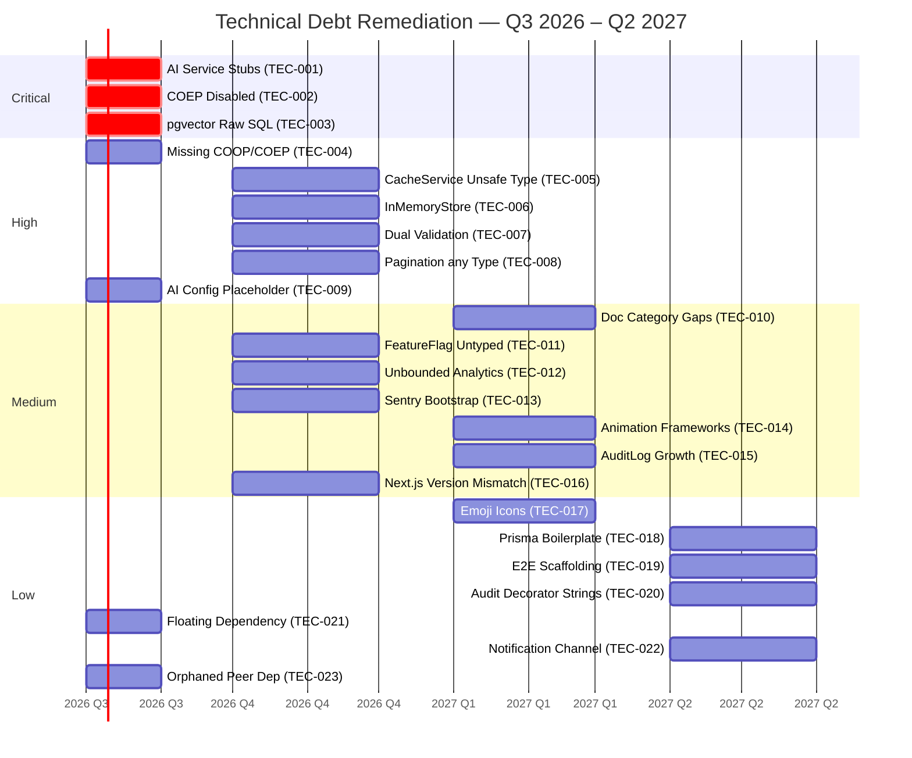

# Technical Debt Roadmap

> **Purpose:** Catalog and prioritize known technical debt across the monorepo
> **Audience:** Engineering team, Tech leads, CTO
> **Owner:** Engineering Manager / Tech Lead
> **Dependencies:** [PRODUCT-ROADMAP.md](./PRODUCT-ROADMAP.md), [INNOVATION-BACKLOG.md](./INNOVATION-BACKLOG.md), CODE-QUALITY-METRICS.md
> **Status:** Living document | **Review Frequency:** Quarterly

## Debt Classification

| Severity | Definition | Target Remediation |
|----------|------------|-------------------|
| Critical | Blocks delivery or causes production incidents | Next sprint |
| High | Significant maintenance burden or performance impact | Next quarter |
| Medium | Code quality or minor performance issues | Next 2 quarters |
| Low | Cosmetic, style, or nice-to-have improvements | When convenient |

## Debt Inventory

| ID | Area | Description | Severity | Est.Effort | Owner | Discovered | Target Fix | Status |
|----|------|-------------|----------|------------|-------|------------|------------|--------|
| TEC-001 | AI | FastAPI AI services partially stubbed (RAGService, EmbeddingService init with "we will initialize these later") | Critical | 3 weeks | AI Architect | Jul 2026 | Q3 2026 | Planned |
| TEC-002 | Security | Helmet crossOriginEmbedderPolicy: false disables COEP for WebContainer Sandbox, weakening Spectre/Meltdown isolation | Critical | 2 weeks | Architect | Jul 2026 | Q3 2026 | Backlog |
| TEC-003 | Database | ContentEmbedding pgvector column managed via raw SQL outside Prisma -- schema drift risk | Critical | 1 week | Backend Lead | Jul 2026 | Q3 2026 | Planned |
| TEC-004 | Security | COOP/COEP isolation headers missing for WebContainer Sandbox route (@webcontainer/api) | High | 1 week | Frontend Lead | Jul 2026 | Q3 2026 | Backlog |
| TEC-005 | API | CacheService uses ny type assertion on 	his.client!.scan() return, bypassing ioredis safety | High | 2 days | Backend Lead | Jul 2026 | Q4 2026 | Backlog |
| TEC-006 | Testing | InMemoryStore duplicates full Prisma CRUD logic but lacks relational integrity -- false-positive tests | High | 2 weeks | Backend Lead | Jul 2026 | Q4 2026 | Backlog |
| TEC-007 | API | Dual validation: Zod schemas in packages/shared + class-validator in NestJS DTOs may diverge | High | 1 week | Full-stack | Jul 2026 | Q4 2026 | Backlog |
| TEC-008 | API | pagination.helper.ts:57 uses orderBy?: any in paginateQuery, discarding Prisma type safety | High | 1 day | Backend Lead | Jul 2026 | Q4 2026 | Backlog |
| TEC-009 | AI | pps/ai/app/config.py hardcodes CORS_ORIGINS with production domain placeholder | High | 1 day | AI Architect | Jul 2026 | Q3 2026 | Planned |
| TEC-010 | Docs | 37-category doc restructure left categories 22 (Release), 33 (Onboarding), 35 (Quality) at 0-25% coverage | Medium | 3 weeks | Tech Lead | Jul 2026 | Q1 2027 | Planned |
| TEC-011 | API | FeatureFlag 	argetingRules field typed as Json @default("{}") with no Zod validation | Medium | 2 days | Backend Lead | Jul 2026 | Q4 2026 | Backlog |
| TEC-012 | Database | No pagination on AnalyticsEvent queries -- high-volume table can cause unbounded SELECTs | Medium | 2 days | Backend Lead | Jul 2026 | Q4 2026 | Backlog |
| TEC-013 | API | Sentry init in main.ts:16-25 throws at bootstrap if SENTRY_DSN invalid -- no graceful degradation | Medium | 1 day | Architect | Jul 2026 | Q4 2026 | Backlog |
| TEC-014 | Frontend | 5 animation frameworks: Three.js stack + GSAP + Theatre.js + Lenis + Framer Motion -- bundle audit needed | Medium | 1 week | Frontend Lead | Jul 2026 | Q1 2027 | Backlog |
| TEC-015 | Database | AuditLog model has no partitioning strategy -- single-table growth degrades query performance | Medium | 3 days | Backend Lead | Jul 2026 | Q1 2027 | Backlog |
| TEC-016 | Frontend | Next.js 14.2.x with @next/bundle-analyzer 16.x -- version mismatch; @sentry/nextjs 10.x targets Next.js 15+ | Medium | 2 days | Frontend Lead | Jul 2026 | Q4 2026 | Backlog |
| TEC-017 | API | Service model uses hardcoded emoji icon field instead of icon font component reference | Low | 1 day | Full-stack | Jul 2026 | Q1 2027 | Backlog |
| TEC-018 | API | PrismaService exposes 30+ per-model getter properties -- boilerplate could be automated via Proxy | Low | 2 days | Backend Lead | Jul 2026 | Q2 2027 | Backlog |
| TEC-019 | Frontend | E2E test suite uses Playwright but no test scripts exist beyond CLI invocation | Low | 3 days | Frontend Lead | Jul 2026 | Q2 2027 | Backlog |
| TEC-020 | API | Audit decorator uses string literals for action/resource -- no type-safe enum | Low | 1 day | Backend Lead | Jul 2026 | Q2 2027 | Backlog |
| TEC-021 | Frontend | detect-gpu dependency pinned to * (any version) in package.json -- floating dependency risk | Low | 0.5 day | Frontend Lead | Jul 2026 | Q3 2026 | Planned |
| TEC-022 | API | Notification channel hardcoded to "telegram" in schema -- extension to email/SMS requires migration | Low | 2 days | Backend Lead | Jul 2026 | Q2 2027 | Backlog |
| TEC-023 | App | Root package.json declares peer dep entities@^4.5.0 but no workspace imports it -- orphaned | Low | 0.5 day | Tech Lead | Jul 2026 | Q3 2026 | Planned |

## Debt Details

### Critical Items

#### TEC-001 -- AI Service Stubs (apps/ai)

**Files:** pps/ai/app/main.py:29-32, pps/ai/app/services/rag_service.py, pps/ai/app/services/embedding_service.py

The FastAPI lifecycle initializes five services with the comment # We will initialize these later when we implement them. RAGService and EmbeddingService constructors may contain no-op or skeleton implementations. This blocks the entire AI roadmap (AI-01 through AI-08 in PRODUCT-ROADMAP.md). Until these services are fully wired, chat, analyze, and suggest endpoints return errors or empty responses.

**Remediation:**
1. Audit each service's implementation status (RAG pipeline, embedding generation, cache integration)
2. Wire actual LangChain/OpenAI calls with proper error handling
3. Add integration tests against a local vector DB
4. Connect to pgvector via SQLAlchemy async session (currently missing from pps/ai/app/database.py)

**Dependencies:** Requires OPENAI_API_KEY and DATABASE_URL env vars configured for AI workspace. Blocks product roadmap AI-01 through AI-03.

---

#### TEC-002 -- COEP Disabled for WebContainer (apps/api)

**File:** pps/api/src/main.ts:29-30

`	ypescript
helmet({
  contentSecurityPolicy: process.env.NODE_ENV === 'production' ? undefined : false,
  crossOriginEmbedderPolicy: false,
  ...
})
`

crossOriginEmbedderPolicy: false disables Cross-Origin Embedder Policy across all API responses. This is required because the admin Sandbox IDE (@webcontainer/api at pps/web/src/app/admin/sandbox) needs cross-origin isolation, but the current configuration provides none. This weakens Spectre/Meltdown attack surface protection for all API consumers.

**Remediation:**
1. Implement per-route COEP/COOP headers for the sandbox route only (via NestJS middleware for dmin/sandbox/*)
2. Restore global crossOriginEmbedderPolicy: true (or 
equire-corp) for all other routes
3. Verify WebContainer starts correctly with the narrower header scope
4. Add Cross-Origin-Opener-Policy: same-origin and Cross-Origin-Embedder-Policy: require-corp on the sandbox route
5. Update pps/web/next.config.js to also set headers for the /admin/sandbox path

**Dependencies:** Must be resolved before the Sandbox IDE can ship to production. Documented in docs/features/Sandbox-AI-IDE.md.

---

#### TEC-003 -- Raw SQL pgvector Embeddings (prisma/schema)

**File:** pps/api/prisma/schema.prisma:618

`prisma
// embedding vector stored via raw SQL (pgvector), not Prisma-native
`

The ContentEmbedding model defines metadata columns in Prisma but the actual ector(1536) column for embeddings is managed exclusively through raw SQL. This creates a drift risk: Prisma Migrate may drop the vector column, and prisma validate does not catch the inconsistency. The database schema truth is split between schema.prisma and raw migration SQL.

**Remediation:**
1. Use Prisma's Unsupported type or a custom native type mapping for the vector column
2. Document the raw SQL vector column in the Prisma schema as a @@ignored annotation pattern
3. Add a CI check that runs prisma validate and a companion script that verifies pgvector column presence
4. Consider the @prisma/extension-pgvector community adapter if compatible with Prisma 7.x

---

### High Items

#### TEC-004 -- Missing COOP/COEP for Sandbox Route

**Files:** pps/web/src/app/admin/sandbox/*, pps/api/src/main.ts:28-34

The WebContainer API (@webcontainer/api v1.6.4) requires these HTTP response headers to function:
- Cross-Origin-Opener-Policy: same-origin
- Cross-Origin-Embedder-Policy: require-corp

Currently, crossOriginEmbedderPolicy: false is set globally on the API (Helmet config), and the Next.js app does not set COOP/COEP headers for the /admin/sandbox route. The Sandbox will fail to start with a SharedArrayBuffer is not defined error in production.

**Remediation:**
1. Remove the global crossOriginEmbedderPolicy: false from API Helmet (see TEC-002)
2. In pps/web/next.config.js, add sync headers() returning COOP/COEP for /admin/sandbox/:path*
3. Verify WebContainer boots in a production build
4. Document the isolation requirements in the deployment runbook

---

#### TEC-005 -- Unsafe Type Assertion in CacheService

**File:** pps/api/src/common/cache/cache.service.ts:72

`	ypescript
const result: [string, string[]] = await (this.client! as any).scan(cursor, 'MATCH', pattern, 'COUNT', 100);
`

The s any cast on 	his.client! bypasses ioredis type definitions. The delPattern method uses Redis SCAN cursor iteration: if the Redis connection drops mid-scan, the method throws an uncaught error from the ny-typed call.

**Remediation:**
1. Remove s any and properly type the ioredis scan method
2. Use scanStream instead of manual cursor iteration for safer pattern deletion
3. Add catch wrapping inside the do...while loop to prevent partial-deletion hangs
4. Test with Redis connection interrupted mid-scan

---

#### TEC-006 -- InMemoryStore as Test Double

**File:** pps/api/src/common/database/in-memory.store.ts (144 lines)

The InMemoryStore implements a full fake database with CRUD, soft delete, seeding, and query-by-predicate. It is used as a Prisma substitute in tests but has significant behavioral differences:
- No referential integrity enforcement (e.g., deleting a Project does not cascade to ProjectImage)
- indBy predicate scans all entries O(n) vs Prisma's indexed queries
- indOneBy returns first match, not a unique constraint-based match
- No transaction support

This creates false-positive tests that pass against InMemoryStore but fail against real Prisma.

**Remediation:**
1. Replace with @prisma/client connected to a test Postgres instance (via Testcontainers or pg_tmp)
2. Keep InMemoryStore only for unit tests of the store itself (not service-level tests)
3. Add a TestPrismaService that wraps PrismaClient with a DATABASE_URL pointing to a test DB
4. Document in docs/quality/TestingArchitecture.md

---

#### TEC-007 -- Dual Validation Schema Drift

**Evidence:** packages/shared (Zod schemas) vs pps/api/src/modules/*/dto/ (class-validator decorators)

The API uses class-validator + class-transformer for DTO validation (via NestJS ValidationPipe with whitelist + orbidNonWhitelisted), while packages/shared contains Zod schemas intended as the source of truth for cross-app contracts. When a field is added to a Zod schema but not to the corresponding NestJS DTO, the API silently drops it (whitelist: true). When a class-validator rule is stricter than the Zod schema, the API rejects valid data that the shared type allows.

**Remediation:**
1. Abandon class-validator in favor of Zod-only validation via a custom ZodValidationPipe
2. Auto-generate NestJS DTOs from Zod schemas using a codegen script
3. Add a CI step: Zod schema diff check between packages/shared and pps/api/src/modules/*/dto/
4. Track in docs/engineering/RFC-002-tanstack-query.md as a follow-up RFC

---

#### TEC-008 -- ny Type in Pagination Helper

**File:** pps/api/src/common/database/pagination.helper.ts:57

`	ypescript
export async function paginateQuery<T>(
  prismaQuery: (args: { skip: number; take: number; orderBy?: any }) => Promise<T[]>,
`

The orderBy parameter accepts ny, circumventing Prisma's generated Prisma.XxxOrderByWithRelationInput types. Callers can pass invalid sort configurations that only fail at runtime.

**Remediation:**
1. Add a generic constraint TOrderBy parameter to paginateQuery
2. Accept orderBy?: TOrderBy
3. All callers will then be type-checked at compile time
4. Update the 15+ service methods that call paginateQuery with inline orderBy objects

---

#### TEC-009 -- AI Config Has Production Placeholder

**File:** pps/ai/app/config.py:10

`python
CORS_ORIGINS: list[str] = ["http://localhost:3000", "https://your-production-domain.com"]
`

The default CORS_ORIGINS includes a your-production-domain.com placeholder. If deployed without overriding via .env, the AI service will accept CORS requests from this non-existent domain (benign) but will reject requests from the actual production domain if it differs. This is a deployment trap.

**Remediation:**
1. Remove the placeholder default -- require CORS_ORIGINS to be explicitly set in .env
2. Add validation in Settings that CORS_ORIGINS does not contain placeholder values
3. Document in pps/ai/.env.example with a clear comment

---

### Medium Items

#### TEC-010 -- Doc Category Gaps Post-Restructure

**Files:** docs/MASTER-INDEX.md:84-85, docs/22-release/, docs/33-onboarding/ (empty), docs/35-quality/ (partial)

The v7.0 restructure expanded docs from 28 to 37 categories. Three categories remain below 25% coverage:
- **22-release:** No documents -- release process, versioning, changelog conventions undocumented
- **33-onboarding:** docs/onboarding/developer-onboarding.md exists but covers only developer setup; no operations/admin onboarding
- **35-quality:** 21 documents listed but some are stubs or redirects (e.g., 52-TESTING-STRATEGY.md is a redirect stub)

Overall doc score is 75/100; target is Level 4 (Managed) at 85+.

**Remediation:**
1. Populate category 22 with release-process guide, versioning convention, and changelog policy
2. Expand onboarding to cover admin, operations, and contributor paths
3. Convert all quality-category stubs to substantive content
4. Update MASTER-INDEX.md coverage percentages after each addition

---

#### TEC-011 -- FeatureFlag TargetingRules Untyped

**File:** pps/api/prisma/schema.prisma:604

`prisma
targetingRules  Json     @default("{}") @map("targeting_rules")
`

The 	argetingRules field accepts arbitrary JSON. No Zod schema or runtime validation ensures the structure conforms to an expected targeting rule format (e.g., { "groups": [...], "percentage": 50 }). An admin UI could store malformed rules that silently disable or misroute features.

**Remediation:**
1. Define a Zod schema for targeting rules in packages/shared
2. Add a validation pipe on the admin controller endpoint
3. Add a fallback in eature-flags.service.ts that defaults to disabled if rules are unparseable
4. Document the targeting rule format in docs/operations/60-FEATURE-FLAGS.md

---

#### TEC-012 -- Unbounded AnalyticsEvent Queries

**File:** pps/api/prisma/schema.prisma:335-351

The AnalyticsEvent model has no partitioning or archiving strategy. Queries on analytics events (e.g., portfolio dashboard aggregates) execute full-table scans as volume grows. The composite index [eventName, createdAt(sort: Desc)] helps for filtered queries, but unfiltered COUNT(*) or GROUP BY queries degrade O(n).

**Remediation:**
1. Add 	ake limits to all portfolio analytics queries (default 1000)
2. Implement event TTL archival to a cold storage table (monthly partition)
3. Add a WHERE createdAt > NOW() - INTERVAL '90 days' default filter in the service layer
4. Consider TimescaleDB hypertable conversion for the analytics schema

---

#### TEC-013 -- Sentry Bootstrap Blocks Startup

**File:** pps/api/src/main.ts:16-25

`	ypescript
if (process.env.SENTRY_DSN) {
  Sentry.init({ dsn: process.env.SENTRY_DSN, ... });
  logger.log('Sentry initialized with profiling');
}
`

If Sentry.init() throws (invalid DSN, network unreachable, missing profiling integration), the entire bootstrap fails because there is no 	ry/catch. In development, a developer with a stale .env SENTRY_DSN value cannot start the API.

**Remediation:**
1. Wrap Sentry init in 	ry/catch with a logger.warn() fallback
2. profilesSampleRate should default to  regardless of environment, only override via explicit env var
3. Move pre-bootstrap validation to a dedicated config.module.ts with clear error messages

---

#### TEC-014 -- Animation Framework Proliferation

**File:** pps/web/package.json -- five animation-related dependencies:

| Package | Purpose | Size (approx) |
|---------|---------|--------------|
| 	hree + @react-three/fiber + drei + postprocessing | 3D scene rendering | ~600 KB gzipped |
| gsap | Timeline-based animations | ~30 KB gzipped |
| ramer-motion / motion | Declarative React animations | ~35 KB gzipped |
| 	heatre/core + 	heatre/r3f | Motion design tooling | ~50 KB gzipped |
| lenis | Smooth scrolling | ~8 KB gzipped |

No single framework is deprecated, but overlapping capabilities (GSAP vs Framer Motion for scroll-triggered animations, Theatre.js vs r3f for 3D animation) increase bundle size and maintenance surface area.

**Remediation:**
1. Audit each framework's usage across pps/web/src/components/
2. Consolidate scroll-triggered animation to one framework (recommend: Framer Motion for React-bound, GSAP for timeline-heavy)
3. Document the decision in docs/architecture/AnimationArchitecture.md
4. Tree-shake unused exports; consider dynamic imports for secondary frameworks

---

#### TEC-015 -- AuditLog Table Growth

**File:** pps/api/prisma/schema.prisma:474-492

The AuditLog model stores all table mutations with oldValues and 
ewValues JSON blobs. Without partitioning or archival, a moderately active admin workflow (1000 mutations/day) produces ~365K rows/year at ~2KB each (~700MB/year). Queries filtering by 	ableName or createdAt on this growing table will degrade.

**Remediation:**
1. Add PostgreSQL table partitioning by createdAt (monthly ranges) to the AuditLog table
2. Implement a cleanup.service.ts policy: archive records older than 12 months to cold storage
3. Add a DataRetention config for audit logs in SystemSetting
4. Update docs/database/DataRetention.md with the retention schedule

---

#### TEC-016 -- Next.js Version Mismatch Risk

**File:** pps/web/package.json:47 + pps/web/package.json:58,26

- Next.js: ^14.2.0
- @sentry/nextjs: ^10.59.0 (Sentry 10 targets Next.js 15+/16)
- @next/bundle-analyzer: ^16.2.9 (requires Next.js 16)

The @next/bundle-analyzer v16.x is not compatible with Next.js 14.x -- it may resolve to a different version via npm hoisting and silently fail. The @sentry/nextjs 10.x works with Next.js 14 but may activate codepaths intended for newer versions.

**Remediation:**
1. Pin @next/bundle-analyzer to ^14.2.0 to match the Next.js version
2. Verify @sentry/nextjs 10.x compatibility matrix explicitly
3. Upgrade to Next.js 15 or 16 (aligned with Sentry 10 and the fact that @next/bundle-analyzer 16 is already resolved)

---

### Low Items

#### TEC-017 -- Hardcoded Emoji Icons in Service Model

**File:** pps/api/prisma/schema.prisma:247

`prisma
icon  String  @default("laptop")
`

The Service model stores icons as raw emoji characters. This approach has three problems:
- Emoji rendering varies across operating systems and browsers (Windows vs macOS vs Linux)
- Icon cannot be styled (color, size, animation) via CSS
- No semantic meaning for screen readers -- accessibility gap

**Remediation:**
1. Replace emoji icon strings with icon font identifiers (e.g., Lucide icon names, since lucide-react is already a dependency)
2. Add an IconComponent mapping in the frontend that renders the appropriate icon
3. Add a migration that converts existing emoji values to their Lucide equivalents
4. Update the Admin CMS icon picker to use an icon search component

---

#### TEC-018 -- PrismaService Boilerplate Getters

**File:** pps/api/src/common/database/prisma.service.ts:23-55

PrismaService exposes 30+ per-model getters that each delegate to 	his.client.<model>. This is mechanical boilerplate: every new model requires a new getter line. Patterns like 	his.client.({ model: { ... } }) or a JavaScript Proxy could automate this.

**Remediation:**
1. Replace with a JS Proxy that forwards property access to 	his.client
2. Alternatively, use a generic model(name: string) method with typed return
3. Maintain backward compatibility with existing service imports

---

#### TEC-019 -- E2E Test Scaffolding Missing

**File:** pps/web/package.json:14-15

`json
"test:e2e": "npx playwright test",
"test:e2e:ui": "npx playwright test --headed"
`

The E2E test scripts reference Playwright commands but no test files may exist under pps/web/e2e/ or pps/web/tests/. Without scaffolding, 
pm run test:e2e will exit with No tests found.

**Remediation:**
1. Create the Playwright config file (playwright.config.ts) if missing
2. Scaffold 3 critical-path E2E tests: homepage load, portfolio navigation, admin login
3. Add to CI pipeline in .github/workflows/
4. Document E2E test patterns in docs/quality/E2EStrategy.md

---

#### TEC-020 -- Audit Decorator Stringly-Typed

**File:** pps/api/src/common/decorators/audit.decorator.ts

The @Audit() decorator accepts string literals for ction and 
esource:

`	ypescript
@Audit({ action: 'create', resource: 'project' })
`

No compile-time validation ensures these strings match an allowed set. A typo like 'projet' silently stores mislabeled audit logs, breaking downstream reporting.

**Remediation:**
1. Define AuditAction and AuditResource enums in packages/shared
2. Update the @Audit() decorator to accept enum values instead of strings
3. Audit existing usage across all controllers for correctness
4. Add a lint rule banning raw string literals in @Audit() calls

---

#### TEC-021 -- Floating detect-gpu Dependency

**File:** pps/web/package.json:41

`json
"detect-gpu": "*"
`

The * range allows any major version to be installed, including breaking changes. If detect-gpu releases a v3 with a different API surface, 
pm install could silently break the application.

**Remediation:**
1. Pin to the currently-resolved version from package-lock.json
2. Or use ^ with a specific minor version (e.g., ^2.0.0)
3. Run 
pm ls detect-gpu to determine the actual resolved version
4. Add a .npmrc save-prefix=^ convention if not already set

---

#### TEC-022 -- Notification Channel Hardcoded

**File:** pps/api/prisma/schema.prisma:463

`prisma
channel   String    @default("telegram")
`

The Notification model defaults to "telegram" as the sole delivery channel. Adding email (Resend), SMS, or push notification support requires a schema migration and service-layer dispatch routing. The current implementation only supports a single channel.

**Remediation:**
1. Extract channel dispatch to a strategy pattern (NotificationChannelStrategy)
2. Implement EmailAdapter using the existing 
esend dependency (pps/api/src/common/notifications/email.adapter.ts already exists as a stub)
3. Add a channel_config JSON field for per-channel settings (webhook URLs, API keys)
4. Update the notification creation UI in the admin dashboard

---

#### TEC-023 -- Orphaned Peer Dependency

**File:** package.json:42

`json
"peerDependencies": {
  "entities": "^4.5.0"
}
`

The root package.json declares entities@^4.5.0 as a peer dependency, but no workspace in the monorepo imports entities (an HTML entity encoding/decoding library). This peer dep is never resolved by consumers of this package and can be safely removed.

**Remediation:**
1. Search the monorepo for import ... from 'entities' or 
equire('entities')
2. If no usage found, remove the peerDependencies.entities entry
3. If usage exists, add entities as a direct dependency to the consuming workspace

---

## Debt Trends

| Quarter | Critical | High | Medium | Low | Total | Resolved | Net Change |
|---------|----------|------|--------|-----|-------|----------|------------|
| Q1 2026 | 0 | 0 | 0 | 0 | 0 | 0 | -- |
| Q2 2026 | 0 | 0 | 0 | 0 | 0 | 0 | -- |
| Q3 2026 | 3 | 6 | 7 | 7 | 23 | 0 | +23 |
| Q4 2026 | -- | -- | -- | -- | -- | -- | Pending |

**Notes:**
- Q1-Q2 2026: Debt tracking not yet established. The document was created mid-Q3 2026 during the v7.0 documentation restructure.
- Q3 2026 baseline: 23 items cataloged. 3 critical, 6 high, 7 medium, 7 low.
- Target: Reduce critical count to 0 by end of Q3 2026, reduce high count to =3 by end of Q4 2026.

## Remediation Progress

| Action | Owner | Target | Status |
|--------|-------|--------|--------|
| TEC-009: Fix AI config placeholder | AI Architect | Q3 2026 | Planned |
| TEC-021: Pin detect-gpu version | Frontend Lead | Q3 2026 | Planned |
| TEC-023: Remove orphaned peer dep | Tech Lead | Q3 2026 | Planned |
| TEC-001: Wire AI service implementations | AI Architect | Q3 2026 | Planned |
| TEC-003: Add pgvector Prisma type mapping | Backend Lead | Q3 2026 | Planned |
| TEC-002: Scoped COEP for sandbox only | Architect | Q3 2026 | Backlog |
| TEC-004: Add COOP/COEP headers on sandbox route | Frontend Lead | Q3 2026 | Backlog |
| TEC-005: Type-safe CacheService scan | Backend Lead | Q4 2026 | Backlog |
| TEC-006: Replace InMemoryStore with test DB | Backend Lead | Q4 2026 | Backlog |
| TEC-007: Unify Zod + class-validator | Full-stack | Q4 2026 | Backlog |
| TEC-008: Generic orderBy type in paginateQuery | Backend Lead | Q4 2026 | Backlog |
| TEC-011: Zod schema for targetingRules | Backend Lead | Q4 2026 | Backlog |
| TEC-012: AnalyticsEvent query limits | Backend Lead | Q4 2026 | Backlog |
| TEC-013: Graceful Sentry init | Architect | Q4 2026 | Backlog |
| TEC-016: Pin bundle-analyzer to matching version | Frontend Lead | Q4 2026 | Backlog |
| TEC-010: Populate doc category gaps | Tech Lead | Q1 2027 | Planned |
| TEC-014: Animation framework consolidation audit | Frontend Lead | Q1 2027 | Backlog |
| TEC-015: AuditLog partitioning | Backend Lead | Q1 2027 | Backlog |
| TEC-017: Replace emoji icons with Lucide | Full-stack | Q1 2027 | Backlog |
| TEC-018: Automate PrismaService model proxying | Backend Lead | Q2 2027 | Backlog |
| TEC-019: Scaffold E2E tests | Frontend Lead | Q2 2027 | Backlog |
| TEC-020: Type-safe audit enums | Backend Lead | Q2 2027 | Backlog |
| TEC-022: Multi-channel notification strategy | Backend Lead | Q2 2027 | Backlog |

## Cross-References

| Reference | Purpose |
|-----------|---------|
| [PRODUCT-ROADMAP.md](./PRODUCT-ROADMAP.md) | Product initiatives that depend on debt remediation (AI-01 through AI-08, P-02, P-07) |
| docs/MASTER-INDEX.md | Documentation coverage metrics affected by TEC-010 |
| docs/features/Sandbox-AI-IDE.md | Feature spec affected by TEC-002, TEC-004 |
| docs/quality/TestingArchitecture.md | Testing strategy affected by TEC-006, TEC-019 |
| docs/architecture/AnimationArchitecture.md | Animation framework decisions affected by TEC-014 |
| docs/engineering/RFC-002-tanstack-query.md | RFC affected by TEC-007 validation unification |
| docs/database/DataRetention.md | Data retention policy affected by TEC-015 |
| docs/operations/60-FEATURE-FLAGS.md | Feature flag documentation affected by TEC-011 |
| docs/api/ErrorHandling.md | Error handling pattern affected by TEC-013 |
| apps/api/src/main.ts | Helmet + Sentry config (TEC-002, TEC-013) |
| apps/api/src/common/cache/cache.service.ts | Unsafe type assertion (TEC-005) |
| apps/api/src/common/database/prisma.service.ts | Boilerplate model getters (TEC-018) |
| apps/api/src/common/database/in-memory.store.ts | Test double fidelity gap (TEC-006) |
| apps/api/src/common/database/pagination.helper.ts | ny type loss (TEC-008) |
| apps/api/prisma/schema.prisma | Schema-level debt: pgvector, emoji icons, untyped Json, hardcoded defaults (TEC-003, TEC-011, TEC-012, TEC-015, TEC-017, TEC-022) |
| apps/ai/app/config.py | CORS_ORIGINS placeholder (TEC-009) |
| apps/ai/app/main.py | Service stub comment (TEC-001) |
| apps/web/package.json | Animation framework proliferation + version mismatches + floating dep (TEC-014, TEC-016, TEC-021) |
| packages/shared | Zod schemas for cross-app contracts (TEC-007) |

## Version History

| Version | Date | Changes | Author |
|---------|------|---------|--------|
| 1.0 | Jul 2026 | Initial catalog: 23 items across all severities. Baseline established during Q3 2026 documentation restructure (v7.0). | Engineering Manager |

---

*Document Version: 1.0 -- Technical Debt Roadmap*
*Last Updated: July 2026*
*Next Review: October 2026*

## Cross-References
- [MASTER-INDEX.md](../MASTER-INDEX.md) — Documentation master index
- [CROSS-REFERENCE-INDEX.md](../26-reference/CROSS-REFERENCE-INDEX.md) — Cross-reference system
