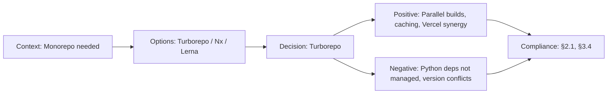

# ADR-001: Monorepo with Turborepo

> **Status:** Accepted | **Date:** 2026-06-17 | **Author:** Architecture Board  
> **Deciders:** Principal Frontend Architect, Staff Backend Architect, Principal Platform Engineer  
> **Reference:** [SystemArchitecture.md §1.3](../05-architecture/SystemArchitecture.md) | [10-TECHSTACK.md](../05-architecture/10-TECHSTACK.md)

## Context

The portfolio platform consists of three applications (`apps/web`, `apps/api`, `apps/ai`) and three shared packages (`packages/shared`, `packages/ui`, `packages/config`). We need a build orchestration and dependency management strategy that supports:

- **Shared code** between frontend, backend, and AI services (TypeScript types, validation schemas, constants)
- **Atomic deployments** where a change to shared code triggers rebuilds of all dependent apps
- **Parallel task execution** for linting, testing, and building across all packages
- **Incremental builds** to avoid rebuilding unchanged packages during development
- **Single `package.json` lock file** for reproducible dependency resolution

The project has a single developer (portfolio owner) with occasional AI agent contributions, so the tooling must be simple to maintain.

## Decision

We adopt **Turborepo v2** with **npm workspaces** for monorepo management.

## Options Considered

| Option                                | Pros                                                                                                                                                                    | Cons                                                                                |
| ------------------------------------- | ----------------------------------------------------------------------------------------------------------------------------------------------------------------------- | ----------------------------------------------------------------------------------- |
| **Turborepo v2** ✅                   | Zero-config task orchestration, intelligent caching (local + remote), native npm workspace support, minimal config (`turbo.json`), owned by Vercel (deployment synergy) | Smaller ecosystem than Nx, less code generation tooling                             |
| **Nx**                                | Powerful code generators, deep plugin ecosystem, computation caching, affected command for CI                                                                           | Steeper learning curve, heavier config, overkill for 3-app monorepo                 |
| **Lerna**                             | Mature, well-known, good for publishing packages                                                                                                                        | Maintenance concerns (donated to Nx), no native task caching, slower builds         |
| **Polyrepo**                          | Full isolation, independent deployment                                                                                                                                  | Code duplication, no shared types, version drift between services, CI/CD complexity |
| **pnpm workspaces (no orchestrator)** | Fast installs, strict dependency resolution                                                                                                                             | No task caching, no parallel orchestration, manual dependency graph management      |

## Consequences

### Positive

- `turbo build` parallelizes across all 3 apps + 3 packages with dependency-aware ordering
- Local cache hits skip rebuilds for unchanged packages (~70% faster CI)
- `turbo.json` is < 30 lines of configuration
- Vercel detects Turborepo automatically for optimized deployments
- Single `npm install` at root installs all dependencies

### Negative

- All apps share one `node_modules` — version conflicts require careful resolution
- Turborepo doesn't manage Python dependencies for `apps/ai` (uses separate `requirements.txt`)
- Remote caching requires Vercel account or custom storage backend

### Neutral

- CI runs `turbo lint test build` in one command — replaces per-app scripts
- Package boundaries enforce clean architecture (no circular imports)

## Decision Flow

## Compliance

- Aligns with Constitution §2.1: "Monorepo architecture with clear package boundaries"
- Aligns with Constitution §3.4: "Build tooling must support incremental, cached builds"

## Cross-References

- [MASTER-INDEX.md](../MASTER-INDEX.md) — Documentation master index
- [CROSS-REFERENCE-INDEX.md](../26-reference/CROSS-REFERENCE-INDEX.md) — Cross-reference system
