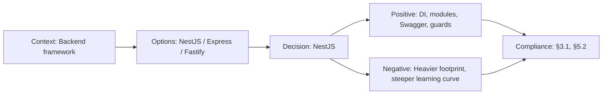

# ADR-003: NestJS for API Backend

> **Status:** Accepted | **Date:** 2026-06-17 | **Author:** Architecture Board  
> **Deciders:** Staff Backend Architect, Principal Platform Engineer  
> **Reference:** [10-TECHSTACK.md](../architecture/10-TECHSTACK.md) | [SystemArchitecture.md §3](../architecture/SystemArchitecture.md)

## Context

The API layer needs to handle: RESTful CRUD for 37 database tables, JWT authentication with Supabase, rate limiting, input validation, Swagger documentation auto-generation, and structured error handling. The framework must support dependency injection for testability and modular architecture for clear separation of concerns (Auth, Content, Leads, Analytics, AI proxy).

## Decision

We adopt **NestJS 10** as the API framework.

## Options Considered

| Option           | Pros                                                                                                                                            | Cons                                                                               |
| ---------------- | ----------------------------------------------------------------------------------------------------------------------------------------------- | ---------------------------------------------------------------------------------- |
| **NestJS 10** ✅ | TypeScript-native, DI container, module system, built-in guards/pipes/interceptors, Swagger auto-gen, Passport.js integration, active ecosystem | Heavier than Express/Fastify, opinionated structure, steeper learning curve        |
| **Express.js**   | Minimal, flexible, largest ecosystem, easy to start                                                                                             | No structure by default, no DI, manual Swagger setup, spaghetti risk at scale      |
| **Fastify**      | Fastest Node.js framework, schema-based validation, plugin system                                                                               | Smaller ecosystem, less opinionated, manual guard/interceptor patterns             |
| **Hono**         | Ultra-lightweight, edge-first, Web Standard APIs                                                                                                | Very new, small ecosystem, no DI, no guard/decorator patterns                      |
| **tRPC**         | End-to-end type safety, no REST boilerplate                                                                                                     | Tied to TypeScript clients, no REST API for external consumers, limited middleware |

## Consequences

### Positive

- Module system enforces separation: `AuthModule`, `ContentModule`, `LeadsModule`, `AnalyticsModule`
- Built-in `AuthGuard`, `RolesGuard` for 4-layer authorization model
- `@nestjs/swagger` auto-generates OpenAPI 3.0 spec from decorators
- `class-validator` + `class-transformer` provide declarative DTO validation
- DI container enables clean unit testing with mock injection

### Negative

- ~2x larger dependency footprint than Express alone
- Decorators and DI can be over-engineered for simple endpoints
- TypeORM/Prisma integration paths exist but we use Supabase SDK directly

## Decision Flow

## Compliance

- Aligns with Constitution §3.1: "Modular, testable backend with clear boundaries"
- Aligns with Constitution §5.2: "API documentation auto-generated from code"

## Cross-References
- [MASTER-INDEX.md](../MASTER-INDEX.md) — Documentation master index
- [CROSS-REFERENCE-INDEX.md](../26-reference/CROSS-REFERENCE-INDEX.md) — Cross-reference system
