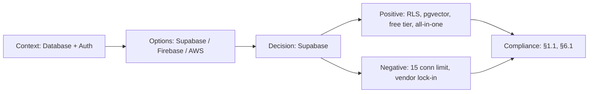

# ADR-004: Supabase over Raw PostgreSQL

> **Status:** Accepted | **Date:** 2026-06-17 | **Author:** Architecture Board  
> **Deciders:** Principal Data Architect, Enterprise Cloud Architect, Staff Backend Architect  
> **Reference:** [SystemArchitecture.md §1.3](../architecture/SystemArchitecture.md) | [DatabaseArchitecture.md](../database/DatabaseArchitecture.md)

## Context

The data layer needs: PostgreSQL with RLS, vector embeddings (pgvector), user authentication, file storage, real-time subscriptions, and all within a ~$0/month budget (free tier). We must decide between self-hosted PostgreSQL and a managed Backend-as-a-Service platform.

## Decision

We adopt **Supabase** (managed PostgreSQL 15 + Auth + Storage + Realtime) as the data platform.

## Options Considered

| Option                           | Pros                                                                                                                                                         | Cons                                                                                                      |
| -------------------------------- | ------------------------------------------------------------------------------------------------------------------------------------------------------------ | --------------------------------------------------------------------------------------------------------- |
| **Supabase** ✅                  | Free tier (500MB, 50K auth users, 1GB storage), built-in Auth/Storage/Realtime, RLS-first security, pgvector included, auto-generated REST API, dashboard UI | Vendor lock-in risk, connection limit (15), region limitation (free tier), Supabase-specific SDK patterns |
| **Raw PostgreSQL (self-hosted)** | Full control, no vendor lock-in, unlimited connections                                                                                                       | Requires managing auth, storage, backups, security, scaling — significant ops overhead                    |
| **Neon**                         | Serverless PostgreSQL, auto-scaling, branching                                                                                                               | Smaller free tier, no bundled auth/storage/realtime, separate services needed                             |
| **PlanetScale**                  | MySQL-compatible, branching, auto-scaling                                                                                                                    | No PostgreSQL (no RLS, no pgvector), no bundled services                                                  |
| **Firebase**                     | Real-time, auth, storage, hosting — all-in-one                                                                                                               | NoSQL (Firestore) contradicts our schema-on-write philosophy, no SQL, no RLS                              |

## Consequences

### Positive

- Single platform provides: Database + Auth + Storage + Realtime + Edge Functions
- RLS policies are enforced at database level (security-by-default)
- pgvector extension included (no separate vector DB infrastructure)
- Supabase JS SDK provides type-safe, RLS-aware client
- Free tier supports the full portfolio workload (~845K rows, < 500MB)

### Negative

- Free tier limits: 15 concurrent connections, single region, 500MB storage
- Supabase SDK patterns differ from raw `pg` client — migration effort if switching
- Auto-generated REST API (PostgREST) not used (we use NestJS), but still exposed
- Supabase Auth token format is opaque — debugging requires JWT decoding tools

## Decision Flow

## Compliance

- Aligns with Constitution §1.1: "Cost-optimized architecture targeting ~$10/year total infrastructure"
- Aligns with Constitution §6.1: "RLS as primary access control mechanism"

## Cross-References
- [MASTER-INDEX.md](../MASTER-INDEX.md) — Documentation master index
- [CROSS-REFERENCE-INDEX.md](../26-reference/CROSS-REFERENCE-INDEX.md) — Cross-reference system
