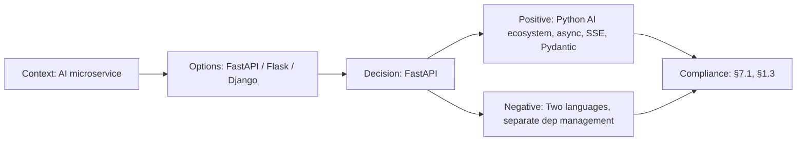

# ADR-006: FastAPI for AI Service

> **Status:** Accepted | **Date:** 2026-06-17 | **Author:** Architecture Board  
> **Deciders:** Principal AI Architect, Staff Backend Architect  
> **Reference:** [SystemArchitecture.md §1.3](../architecture/SystemArchitecture.md) | [19-RAG.md](../ai/19-RAG.md)

## Context

The AI microservice (`apps/ai`) handles: RAG pipeline orchestration (LangChain), vector similarity search (pgvector), LLM API calls (OpenAI GPT-4), SSE streaming responses, content analysis, and suggestion generation. Python is the dominant language for AI/ML tooling, with LangChain, LlamaIndex, and OpenAI SDK all Python-first.

## Decision

We adopt **FastAPI** (Python) for the AI microservice.

## Options Considered

| Option                  | Pros                                                                                                                                                | Cons                                                                                      |
| ----------------------- | --------------------------------------------------------------------------------------------------------------------------------------------------- | ----------------------------------------------------------------------------------------- |
| **FastAPI** ✅          | Python-native (AI ecosystem alignment), async/await, auto-generated OpenAPI docs, Pydantic validation, SSE support, excellent LangChain integration | Separate language from Node.js stack, deployment complexity, Python dependency management |
| **NestJS (extend API)** | Same language/framework as main API, shared types                                                                                                   | Python AI libraries have no Node.js equivalents, LangChain.js is behind Python version    |
| **Flask**               | Simple, mature, large ecosystem                                                                                                                     | No async by default, manual OpenAPI, no native validation                                 |
| **Django**              | Batteries-included, ORM, admin                                                                                                                      | Overkill for microservice, sync-first, heavy framework                                    |
| **LangServe**           | LangChain-native deployment                                                                                                                         | Too specialized, limited customization, early-stage                                       |

## Consequences

### Positive

- LangChain, OpenAI SDK, sentence-transformers are Python-first with best documentation
- FastAPI's async support handles concurrent chat sessions efficiently
- Pydantic models provide request/response validation matching TypeScript DTOs
- SSE streaming via `StreamingResponse` for real-time AI chat
- Auto-generated docs at `/docs` for AI endpoint testing

### Negative

- Two languages in the monorepo (TypeScript + Python)
- Python dependency management separate from npm (`requirements.txt` / `pyproject.toml`)
- Docker required for consistent Python environment across dev/staging/prod
- Cross-service type safety requires manual contract maintenance (see 50-DATA-CONTRACTS.md)

## Decision Flow

## Compliance

- Aligns with Constitution §7.1: "AI/ML services in Python for ecosystem alignment"
- Aligns with Constitution §1.3: "Microservice boundaries at domain boundaries"

## Cross-References
- [MASTER-INDEX.md](../MASTER-INDEX.md) — Documentation master index
- [CROSS-REFERENCE-INDEX.md](../26-reference/CROSS-REFERENCE-INDEX.md) — Cross-reference system
