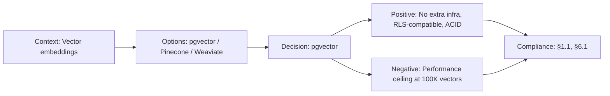

# ADR-007: pgvector over Pinecone/Weaviate

> **Status:** Accepted | **Date:** 2026-06-17 | **Author:** Architecture Board  
> **Deciders:** Principal AI Architect, Principal Data Architect  
> **Reference:** [19-RAG.md](../08-ai/19-RAG.md) | [DatabaseArchitecture.md §11](../09-database/DatabaseArchitecture.md)

## Context

The RAG pipeline needs vector similarity search for retrieving relevant portfolio content (document chunks) when answering AI chat queries. We store ~500 document chunks with 1536-dimensional OpenAI embeddings. We need to choose between a dedicated vector database and an embedded solution.

## Decision

We adopt **pgvector** (PostgreSQL extension) for vector similarity search, embedded in our existing Supabase PostgreSQL instance.

## Options Considered

| Option          | Pros                                                                                                                     | Cons                                                                            |
| --------------- | ------------------------------------------------------------------------------------------------------------------------ | ------------------------------------------------------------------------------- |
| **pgvector** ✅ | SQL-native, no separate infra, included in Supabase free tier, ACID transactions, RLS-compatible, IVFFlat + HNSW indexes | Slower than dedicated vector DBs at >1M vectors, no built-in metadata filtering |
| **Pinecone**    | Purpose-built, fast at scale, managed, metadata filtering                                                                | $70+/month for paid tier, separate infra, network latency, vendor lock-in       |
| **Weaviate**    | GraphQL API, hybrid search, multi-modal                                                                                  | Self-hosted complexity, resource-heavy, overkill for 500 chunks                 |
| **Qdrant**      | Rust-based (fast), filtering, payload storage                                                                            | Requires separate deployment, additional infra cost                             |
| **ChromaDB**    | Simple API, Python-native, local-first                                                                                   | Not production-ready for server deployment, limited scalability                 |

## Consequences

### Positive

- Zero additional infrastructure cost (included in Supabase)
- Vector data co-located with relational data (JOINs work naturally)
- RLS policies apply to vector tables (same security model)
- IVFFlat index sufficient for 500-10K chunks (< 50ms similarity search)
- Single backup/restore covers all data including vectors

### Negative

- Performance ceiling at ~100K vectors with IVFFlat (mitigated by HNSW upgrade path)
- No built-in metadata filtering (use SQL WHERE clauses instead)
- No vector-specific monitoring dashboards (use pg_stat_statements)

## Decision Flow

## Compliance

- Aligns with Constitution §1.1: "Zero additional infrastructure cost"
- Aligns with Constitution §6.1: "RLS applies to all data, including vectors"

## Cross-References

- [MASTER-INDEX.md](../MASTER-INDEX.md) — Documentation master index
- [CROSS-REFERENCE-INDEX.md](../26-reference/CROSS-REFERENCE-INDEX.md) — Cross-reference system
