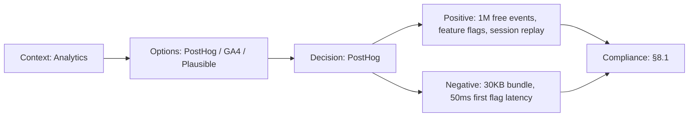

# ADR-009: PostHog over Mixpanel/Amplitude

> **Status:** Accepted | **Date:** 2026-06-17 | **Author:** Architecture Board  
> **Deciders:** Principal Data Architect, Staff Frontend Architect  
> **Reference:** [AnalyticsArchitecture.md](../operations/AnalyticsArchitecture.md)

## Context

The portfolio needs product analytics: page views, section interactions, conversion funnels (visitor → contact form submission), session recording (optional), feature flags, and A/B testing. We need a privacy-respecting, free-tier-viable analytics platform.

## Decision

We adopt **PostHog Cloud** (free tier) for product analytics, feature flags, and session replay.

## Options Considered

| Option                 | Pros                                                                                                                                       | Cons                                                                                      |
| ---------------------- | ------------------------------------------------------------------------------------------------------------------------------------------ | ----------------------------------------------------------------------------------------- |
| **PostHog** ✅         | Open-source, generous free tier (1M events/month), self-hostable, feature flags included, session replay, EU hosting option, GDPR-friendly | Newer than alternatives, JS bundle ~30KB, self-hosted requires infra                      |
| **Mixpanel**           | Mature, powerful funnels, SQL-like queries                                                                                                 | Free tier (1K monthly tracked users) too small, expensive scaling                         |
| **Amplitude**          | Best-in-class behavioral analytics, cohort analysis                                                                                        | Free tier (10M events) decent but limited features, heavy SDK                             |
| **Google Analytics 4** | Free, ubiquitous                                                                                                                           | Privacy concerns (GDPR), cookie consent required, data sampling, Google ecosystem lock-in |
| **Plausible**          | Privacy-first, lightweight, no cookies                                                                                                     | No custom events, no funnels, no feature flags — analytics only                           |

## Consequences

### Positive

- 1M events/month free tier covers portfolio workload
- Feature flags enable gradual rollouts without redeploy
- Session replay helps debug UX issues (opt-in, GDPR-compliant)
- Self-hostable fallback if vendor terms change
- No cookie consent banner needed (cookieless tracking mode)

### Negative

- JS SDK adds ~30KB to bundle (loaded async, non-blocking)
- Feature flag evaluation adds ~50ms latency on first load
- Free tier limited to 1 project (sufficient for portfolio)

## Decision Flow

## Compliance

- Aligns with Constitution §8.1: "Privacy-respecting analytics with opt-out capability"

## Cross-References
- [MASTER-INDEX.md](../MASTER-INDEX.md) — Documentation master index
- [CROSS-REFERENCE-INDEX.md](../26-reference/CROSS-REFERENCE-INDEX.md) — Cross-reference system
