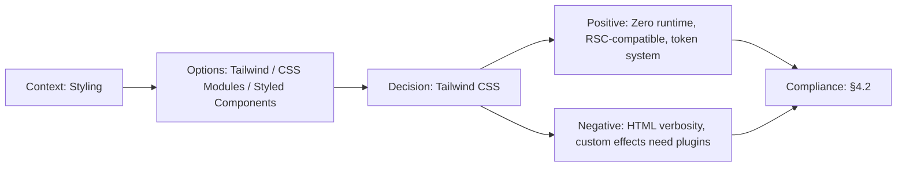

# ADR-010: Tailwind CSS over CSS-in-JS

> **Status:** Accepted | **Date:** 2026-06-17 | **Author:** Architecture Board  
> **Deciders:** Staff Frontend Architect, Principal UX Architect  
> **Reference:** [10-TECHSTACK.md](../architecture/10-TECHSTACK.md) | [DesignSystem.md](../design/DesignSystem.md)

## Context

The design system needs a CSS methodology that supports: 120+ design tokens, responsive design, dark mode, glassmorphism effects, micro-animations, and component-level styling. The approach must work with React Server Components (RSC) which cannot use runtime CSS-in-JS.

## Decision

We adopt **Tailwind CSS v3** as the utility-first CSS framework, extended with custom design tokens.

## Options Considered

| Option                | Pros                                                                                                                                                 | Cons                                                                                     |
| --------------------- | ---------------------------------------------------------------------------------------------------------------------------------------------------- | ---------------------------------------------------------------------------------------- |
| **Tailwind CSS** ✅   | Utility-first, zero runtime overhead, RSC-compatible, JIT compilation, design token integration via `tailwind.config`, responsive/dark mode built-in | HTML verbosity, learning curve for utility classes, custom design requires extend config |
| **Styled Components** | Component-scoped, dynamic props, theme provider                                                                                                      | Runtime CSS-in-JS — incompatible with RSC, JS bundle overhead                            |
| **Emotion**           | Similar to Styled Components, css prop                                                                                                               | Same RSC incompatibility, runtime overhead                                               |
| **CSS Modules**       | Zero runtime, component-scoped, standard CSS                                                                                                         | No utility classes, verbose for responsive/dark mode, no design token system             |
| **Vanilla Extract**   | Zero runtime, TypeScript types, theme contract                                                                                                       | Complex setup, smaller ecosystem, steeper learning curve                                 |

## Consequences

### Positive

- Zero runtime CSS overhead (all styles compiled at build time)
- RSC-compatible (no JavaScript required for styling)
- `tailwind.config.ts` serves as single source of truth for design tokens
- JIT mode generates only used utilities (< 20KB CSS in production)
- Built-in responsive (`sm:`, `md:`, `lg:`) and dark mode (`dark:`) variants

### Negative

- HTML class strings can be verbose (mitigated by `cn()` utility + component abstraction)
- Custom glassmorphism effects require `@apply` or plugin authoring
- Tailwind's default design tokens may conflict with custom design system (resolved via `extend`)

## Decision Flow

## Compliance

- Aligns with Constitution §4.2: "Zero-runtime CSS solution compatible with RSC"

## Cross-References
- [MASTER-INDEX.md](../MASTER-INDEX.md) — Documentation master index
- [CROSS-REFERENCE-INDEX.md](../26-reference/CROSS-REFERENCE-INDEX.md) — Cross-reference system
