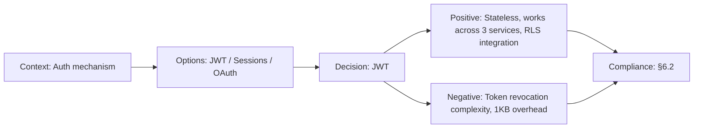

# ADR-011: JWT over Session-based Auth

> **Status:** Accepted | **Date:** 2026-06-17 | **Author:** Architecture Board  
> **Deciders:** Enterprise Security Architect, Staff Backend Architect  
> **Reference:** [SecurityArchitecture.md](../SecurityArchitecture.md) | [15-AUTHORIZATION.md](../15-AUTHORIZATION.md)

## Context

The API needs stateless authentication that works across the Next.js frontend, NestJS API, and FastAPI AI service. Supabase Auth issues JWTs by default. We need to decide between JWT-based and session-based authentication.

## Decision

We adopt **JWT (RS256) authentication** via Supabase Auth, with httpOnly cookie storage and refresh token rotation.

## Options Considered

| Option                     | Pros                                                                                                                            | Cons                                                                                       |
| -------------------------- | ------------------------------------------------------------------------------------------------------------------------------- | ------------------------------------------------------------------------------------------ |
| **JWT (Supabase Auth)** ✅ | Stateless verification, works across all 3 services, Supabase-native, no session store needed, RLS integration via `auth.uid()` | Token revocation requires session table check, token size (~1KB), refresh token management |
| **Session-based**          | Simple revocation (delete session), smaller cookies                                                                             | Requires shared session store (Redis), doesn't work with Supabase RLS, stateful            |
| **API Keys**               | Simple for service-to-service                                                                                                   | Not suitable for user authentication, no refresh, manual management                        |
| **OAuth tokens only**      | Standard, delegated auth                                                                                                        | No offline access, provider-dependent, complex flow                                        |

## Consequences

### Positive

- Supabase RLS policies automatically use JWT claims (`auth.uid()`, `auth.role()`)
- All 3 services can verify tokens independently (RS256 public key)
- No shared session store needed (no Redis dependency)
- Token refresh rotation prevents replay attacks

### Negative

- Token revocation requires `sessions` table check (not purely stateless)
- JWT payload adds ~1KB per request (acceptable for HTTP, not WebSocket-optimal)
- Refresh token rotation must be carefully implemented to prevent race conditions

## Decision Flow

## Compliance

- Aligns with Constitution §6.2: "Stateless authentication compatible with microservices"

## Cross-References
- [MASTER-INDEX.md](../MASTER-INDEX.md) — Documentation master index
- [CROSS-REFERENCE-INDEX.md](../26-reference/CROSS-REFERENCE-INDEX.md) — Cross-reference system
