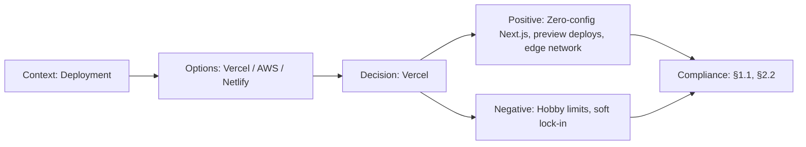

# ADR-012: Vercel over Cloudflare/Netlify

> **Status:** Accepted | **Date:** 2026-06-17 | **Author:** Architecture Board  
> **Deciders:** Principal DevOps Engineer, Principal Platform Engineer, Enterprise Cloud Architect  
> **Reference:** [DeploymentGuide.md](../21-operations/DeploymentGuide.md) | [SystemArchitecture.md §9](../05-architecture/SystemArchitecture.md)

## Context

The Next.js frontend needs a deployment platform that supports: ISR (Incremental Static Regeneration), Edge Functions, preview deployments per PR, automatic HTTPS, global CDN, and Turborepo integration. Budget constraint: free tier must cover the full portfolio workload.

## Decision

We adopt **Vercel** (Hobby plan, free) as the primary deployment platform for the Next.js frontend.

## Options Considered

| Option                   | Pros                                                                                                                          | Cons                                                                                                |
| ------------------------ | ----------------------------------------------------------------------------------------------------------------------------- | --------------------------------------------------------------------------------------------------- |
| **Vercel** ✅            | Next.js creator (best ISR/RSC support), Turborepo integration, preview deploys, Edge Functions, analytics, generous free tier | Commercial projects require Pro ($20/mo), Vercel-specific features risk lock-in                     |
| **Cloudflare Pages**     | Fastest CDN, Workers runtime, generous free tier, no commercial restriction                                                   | ISR support via `@cloudflare/next-on-pages` is experimental, different runtime (workerd vs Node.js) |
| **Netlify**              | Good Next.js support, forms, identity                                                                                         | ISR support lagging, runtime adapter differences, smaller edge network                              |
| **AWS Amplify**          | Full AWS ecosystem, custom domains                                                                                            | Complex setup, cold starts, slower deployments, ISR support via OpenNext                            |
| **Self-hosted (Docker)** | Full control, no vendor lock-in                                                                                               | Ops overhead, no CDN, manual HTTPS, no preview deploys                                              |

## Consequences

### Positive

- Zero-config Next.js 14 deployment (App Router, RSC, ISR all work natively)
- Preview deployments on every PR with unique URLs
- Vercel Analytics built-in (Web Vitals, real user monitoring)
- Edge Network in 40+ regions for sub-100ms global delivery
- Turborepo Remote Caching integration for faster CI builds

### Negative

- Hobby plan limits: 100GB bandwidth/month, 100 deployments/day (sufficient for portfolio)
- Vercel-specific `next.config.js` features may not work on other platforms
- Soft lock-in through `@vercel/analytics`, `@vercel/og` packages (mitigated by abstraction)
- API routes on Vercel use serverless functions (10s timeout on Hobby, 60s on Pro)

## Decision Flow

## Compliance

- Aligns with Constitution §1.1: "Free tier deployment for portfolio workload"
- Aligns with Constitution §2.2: "Global edge delivery network"

## Cross-References

- [MASTER-INDEX.md](../MASTER-INDEX.md) — Documentation master index
- [CROSS-REFERENCE-INDEX.md](../26-reference/CROSS-REFERENCE-INDEX.md) — Cross-reference system
