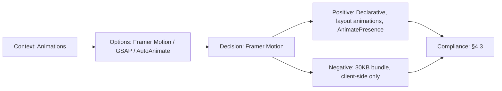

# ADR-013: Framer Motion over React Spring

> **Status:** Accepted | **Date:** 2026-06-17 | **Author:** Architecture Board  
> **Deciders:** Staff Frontend Architect, Principal UX Architect  
> **Reference:** [10-TECHSTACK.md](../10-TECHSTACK.md) | [DesignSystem.md §animations](../DesignSystem.md)

## Context

The portfolio requires extensive micro-animations: page transitions, scroll-triggered reveals, hover effects, section entrance animations, 3D hero interactions, and layout animations for the admin CMS (drag-and-drop reorder). The animation library must be React-native and support both simple and complex animations.

## Decision

We adopt **Framer Motion** as the animation library.

## Options Considered

| Option               | Pros                                                                                                                                                 | Cons                                                                             |
| -------------------- | ---------------------------------------------------------------------------------------------------------------------------------------------------- | -------------------------------------------------------------------------------- |
| **Framer Motion** ✅ | Declarative API, layout animations, gesture support, scroll-triggered animations, `AnimatePresence` for exit animations, excellent React integration | Bundle size ~30KB, React-only, some SSR considerations                           |
| **React Spring**     | Physics-based animations, small bundle, works with react-three-fiber                                                                                 | Lower-level API, more code for common patterns, weaker layout animations         |
| **GSAP**             | Most powerful animation engine, timeline control, ScrollTrigger                                                                                      | Not React-native (imperative), license restrictions for commercial, heavy bundle |
| **CSS Animations**   | Zero bundle cost, GPU-accelerated, simple                                                                                                            | Cannot animate layout, limited orchestration, verbose for complex sequences      |
| **Auto Animate**     | One-line setup, automatic transitions                                                                                                                | Too simple for complex animations, limited control                               |

## Consequences

### Positive

- `motion.div` wrapper provides declarative `animate`, `initial`, `exit` props
- `AnimatePresence` handles page transitions and conditional rendering exits
- `useScroll` + `useTransform` for scroll-linked animations (parallax, progress bars)
- `Reorder.Group` for drag-and-drop section reordering in admin CMS
- Layout animations (`layout` prop) for smooth DOM reflows

### Negative

- ~30KB gzipped (loaded only on interactive pages)
- `motion` components are client-side only (requires `'use client'` boundary)
- Performance requires `will-change` and GPU-accelerated properties (transform, opacity)

## Decision Flow

## Compliance

- Aligns with Constitution §4.3: "Declarative animation system with scroll-triggered reveals"

## Cross-References

- [MASTER-INDEX.md](../MASTER-INDEX.md) — Documentation master index
- [CROSS-REFERENCE-INDEX.md](../26-reference/CROSS-REFERENCE-INDEX.md) — Cross-reference system
