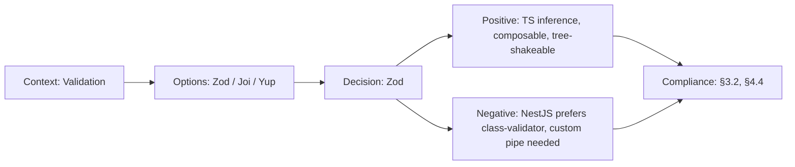

# ADR-014: Zod over Yup/Joi for Validation

> **Status:** Accepted | **Date:** 2026-06-17 | **Author:** Architecture Board  
> **Deciders:** Staff Frontend Architect, Staff Backend Architect  
> **Reference:** [10-TECHSTACK.md](../10-TECHSTACK.md)

## Context

Data validation is needed across: frontend form validation (React Hook Form), API request/response validation (NestJS DTOs), environment variable validation, and shared type contracts between services. The validation library should provide TypeScript type inference from schemas to eliminate duplicate type definitions.

## Decision

We adopt **Zod** as the schema validation library across all TypeScript services.

## Options Considered

| Option                | Pros                                                                                                                                                                                   | Cons                                                                       |
| --------------------- | -------------------------------------------------------------------------------------------------------------------------------------------------------------------------------------- | -------------------------------------------------------------------------- |
| **Zod** ✅            | TypeScript-first, type inference from schemas (`z.infer<typeof schema>`), composable schemas, discriminated unions, tree-shakeable, works with React Hook Form (`@hookform/resolvers`) | Newer than alternatives, smaller ecosystem of extensions                   |
| **Yup**               | Mature, good docs, widely used                                                                                                                                                         | Weaker TypeScript inference, larger bundle, relies on `@types/yup`         |
| **Joi**               | Most mature, powerful validation                                                                                                                                                       | No TypeScript inference, Node.js only (not browser-friendly), heavy bundle |
| **class-validator**   | NestJS-native, decorator-based                                                                                                                                                         | Class-based (not functional), no frontend usage, runtime-only types        |
| **Ajv (JSON Schema)** | Standard-based, fastest validation                                                                                                                                                     | Verbose schema syntax, poor DX for TypeScript, no type inference           |

## Consequences

### Positive

- `z.infer<typeof schema>` eliminates duplicate type definitions
- Single library for frontend forms, API DTOs, env vars, and shared contracts
- Tree-shakeable: only imported validators included in bundle
- Composable: `z.object().merge()`, `z.discriminatedUnion()` for complex schemas
- React Hook Form integration via `zodResolver` for form validation

### Negative

- NestJS prefers `class-validator` — requires custom pipe for Zod DTOs
- Error messages require customization for user-facing forms
- Zod schemas in `packages/shared` become cross-service contract (must be versioned carefully)

## Decision Flow

## Compliance

- Aligns with Constitution §3.2: "Single source of truth for data shapes"
- Aligns with Constitution §4.4: "TypeScript-first validation with type inference"

## Cross-References

- [MASTER-INDEX.md](../MASTER-INDEX.md) — Documentation master index
- [CROSS-REFERENCE-INDEX.md](../26-reference/CROSS-REFERENCE-INDEX.md) — Cross-reference system
