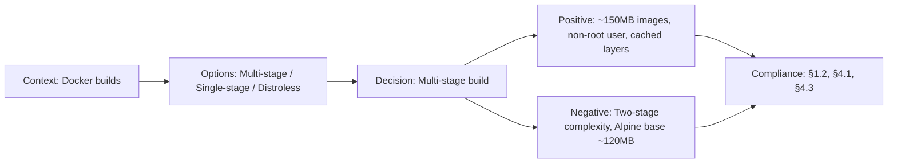

# ADR-015: Multi-stage Docker Build for Applications

> **Status:** Accepted | **Date:** 2026-07-11 | **Author:** Architecture Board
> **Deciders:** Principal DevOps Engineer, Staff Backend Architect, Principal Platform Engineer
> **Reference:** [Dockerfile.api](../../apps/api/Dockerfile) | [Dockerfile.web](../../apps/web/Dockerfile)

## Context

The portfolio platform has three applications (`apps/web`, `apps/api`, `apps/ai`) that require containerized deployments for production and CI/CD environments. The API and Web apps are Node.js-based and need Docker images that are:

- **Small** — sub-200MB for fast pull times in CI/CD and production deploys
- **Secure** — non-root runtime user, minimal surface area
- **Reproducible** — deterministic builds from lockfile, no local state
- **Cacheable** — leverage Docker layer caching for fast CI iteration
- **Health-checkable** — services must signal readiness to orchestrators

Both Dockerfiles currently exist but have not been formally reviewed or standardized. The AI service (`apps/ai`) is a placeholder stub and is scoped out of this ADR.

## Decision

We adopt a **two-stage multi-stage Docker build** pattern for both Node.js applications:

### API (`apps/api/Dockerfile`)

**Stage 1 — Builder:**

- Base image: `node:22-alpine`
- Copy `package.json` and `package-lock.json`, run `npm ci` (caches node_modules layer)
- Copy source files (`tsconfig.json`, `nest-cli.json`, `prisma/`, `src/`)
- Run `npx prisma generate` to produce the Prisma client at the custom output path
- Run `npm run build` to compile TypeScript to `dist/`

**Stage 2 — Runner:**

- Base image: `node:22-alpine`
- Create non-root user/group `nestjs` (UID/GID 1001)
- Copy only runtime assets from builder: `dist/`, `node_modules/`, `generated/`, `prisma/`
- `USER nestjs`
- Expose port `3001`
- HEALTHCHECK: `wget --spider` against `/api/health/liveness`
- CMD: `node dist/main`

### Web (`apps/web/Dockerfile`)

**Stage 1 — Builder:**

- Base image: `node:22-alpine`
- Copy `package.json`, `package-lock.json`, and `packages/` (monorepo shared deps)
- Run `npm ci`
- Copy `tsconfig.json`, `next.config.mjs`, `postcss.config.js`, `tailwind.config.ts`, `public/`, `src/`
- `ENV NEXT_TELEMETRY_DISABLED=1`
- Run `npm run build` (Next.js outputs to `.next/` with `output: "standalone"`)

**Stage 2 — Runner:**

- Base image: `node:22-alpine`
- Create non-root user/group `nextjs` (UID/GID 1001)
- Copy `public/` directly
- Copy `.next/standalone/` (Next.js minimized standalone output) — owned by `nextjs:nodejs`
- Copy `.next/static/` separately (immutable assets, owned by `nextjs:nodejs`)
- `USER nextjs`
- Expose port `3000`
- HEALTHCHECK: `wget --spider` against `/health`
- CMD: `node server.js`

## Options Considered

| Option                      | Pros                                                      | Cons                                                                                  |
| --------------------------- | --------------------------------------------------------- | ------------------------------------------------------------------------------------- |
| **Multi-stage (chosen) ✅** | ~150MB images, non-root user, cached layers, reproducible | Slightly more complex Dockerfile, two-stage requires understanding of artifacts       |
| **Single-stage build**      | Simple, one Dockerfile stage                              | devDependencies in final image (~500MB+), root user, no layer optimization            |
| **Distroless images**       | Minimal (~20MB), no shell, no package manager             | No shell for HEALTHCHECK, Alpine's `wget` not available harder to debug, no `/bin/sh` |
| **Bazel (rules_docker)**    | Hermetic + incremental builds, multi-language support     | Heavy tooling, steep learning curve, overkill for 2 Node.js services                  |
| **BuildKit inline caching** | Works with any of the above                               | Not a replacement for build strategy — complementary                                  |

## Consequences

### Positive

- Final images are ~150MB each (vs ~500MB+ single-stage) — faster CI pulls and deploys
- Non-root users (`nestjs`/`nextjs`) limit container breakout risk
- HEALTHCHECK enables orchestrator auto-recovery
- Layer ordering (`package.json` before source) maximizes Docker layer caching — `npm ci` layer is reused unless deps change
- Web standalone output excludes Next.js build tooling from runtime
- Reproducible: `npm ci` uses lockfile, no `npm install` or version resolution at build time

### Negative

- Builder stage requires full toolchain (TypeScript, Prisma CLI, Next.js) — not as minimal as distroless
- `node:22-alpine` base adds ~120MB even before app code
- Two Dockerfiles need maintenance — changes to build pipeline must be mirrored
- `apps/ai` (Python/FastAPI) is not covered — will need its own Docker strategy

### Neutral

- Images can be published to `ghcr.io` for CI caching across runs
- Docker layer caching requires consistent `COPY` ordering — adding new files to source dirs invalidates the build layer
- Health check port/endpoint changes must be synchronized between Dockerfile and orchestrator config

## Decision Flow

## Compliance

- Aligns with Constitution §1.2: "Containerized deployments for all production services"
- Aligns with Constitution §4.1: "Non-root runtime for all containers"
- Aligns with Constitution §4.3: "Health checks for orchestrator auto-recovery"
- Dockerfile best practices: minimal layers, ordered COPY for caching, specific tag pinning, .dockerignore recommended

## Cross-References
- [MASTER-INDEX.md](../MASTER-INDEX.md) — Documentation master index
- [CROSS-REFERENCE-INDEX.md](../26-reference/CROSS-REFERENCE-INDEX.md) — Cross-reference system
