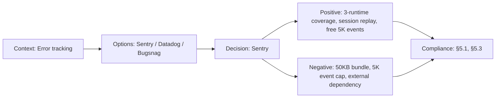

# ADR-016: Sentry for Error Tracking and Performance Monitoring

> **Status:** Accepted | **Date:** 2026-07-11 | **Author:** Architecture Board
> **Deciders:** Staff Frontend Architect, Principal DevOps Engineer, Enterprise Security Architect
> **Reference:** [sentry.client.config.ts](../../apps/web/sentry.client.config.ts) | [sentry.server.config.ts](../../apps/web/sentry.server.config.ts) | [sentry.edge.config.ts](../../apps/web/sentry.edge.config.ts) | [next.config.mjs](../../apps/web/next.config.mjs)

## Context

The Next.js frontend runs in three distinct runtime environments — browser, Node.js server, and Edge Runtime — each with different error characteristics and monitoring needs. The platform requires:

- **Production error monitoring:** Capture unhandled exceptions, promise rejections, and API errors with full stack traces
- **Performance tracing:** Measure page load times, Next.js navigation spans, and API call durations
- **Session replay:** Recreate user sessions to debug complex UI interactions
- **Deployment tracking:** Associate errors with specific releases for regression detection
- **Privacy compliance:** PII redaction (emails, names, IPs) out of the box

Budget constraint: must work within the Sentry free tier (5K events/month on Team plan).

## Decision

We adopt **Sentry** (`@sentry/nextjs`) as the error tracking and performance monitoring solution with three configuration files corresponding to each runtime environment, gated behind a `NEXT_PUBLIC_SENTRY_DSN` environment variable.

### `sentry.client.config.ts` — Browser Runtime

- DSN: `process.env.NEXT_PUBLIC_SENTRY_DSN` (conditional enablement)
- `tracesSampleRate`: 0.25 in production, 1.0 in development
- `replaysSessionSampleRate`: 0.1 (10% of all sessions recorded for replays)
- `replaysOnErrorSampleRate`: 1.0 (100% of sessions that encounter an error)
- Integrations: `Sentry.replayIntegration()` for session replays

### `sentry.server.config.ts` — Node.js Server Runtime

- DSN: `process.env.NEXT_PUBLIC_SENTRY_DSN`
- `tracesSampleRate`: 0.25 in production, 1.0 in development
- Ignored errors: `[/^Not Found$/]` — 404s are expected and filtered

### `sentry.edge.config.ts` — Edge Runtime

- DSN: `process.env.NEXT_PUBLIC_SENTRY_DSN`
- `tracesSampleRate`: 0.25 in production, 1.0 in development
- No replay integration (Edge Runtime doesn't support DOM)
- No 404 filter (Edge typically serves static/assets)

### Integration

All configs use `enabled: !!process.env.NEXT_PUBLIC_SENTRY_DSN` so Sentry is fully disabled when no DSN is configured. The `next.config.mjs` wraps the config with `withSentryConfig()` which injects source map upload and webpack plugin during build. Source maps are uploaded to Sentry for stack trace deobfuscation but are not served to browsers.

## Options Considered

| Option          | Pros                                                                                                                                        | Cons                                                                                            |
| --------------- | ------------------------------------------------------------------------------------------------------------------------------------------- | ----------------------------------------------------------------------------------------------- |
| **Sentry ✅**   | Native Next.js support (all 3 runtimes), session replay, performance tracing, free tier (5K events/mo), release tracking, source map upload | 5K events/mo may be tight with replays enabled, bundle size +50KB, external dependency          |
| **Datadog RUM** | Unified APM + RUM if already on Datadog, real user monitoring, session replays                                                              | Paid ($15/host/mo min), overkill for portfolio scale, no free tier                              |
| **PostHog**     | All-in-one (analytics + error tracking + feature flags), generous free tier (1M events/mo)                                                  | Self-host requires maintenance, cloud free tier limited, less mature error tracking than Sentry |
| **LogRocket**   | Best session replay UX, DOM reconstruction, network waterfall                                                                               | Expensive ($39/mo Team), no server/edge error tracking, no release tracking                     |
| **Rollbar**     | Deploy tracking, telemetry, AI grouping                                                                                                     | No session replay, no performance tracing, narrower Next.js integration                         |

## Consequences

### Positive

- Three-runtime coverage (client + server + edge) with a single DSN
- Session replays with privacy-aware defaults (10% sample, 100% on error)
- Release tracking via `Sentry CLI` during CI — every deploy labels errors
- Source maps uploaded to Sentry but not publicly served — debugging without exposing code
- Disabled when `NEXT_PUBLIC_SENTRY_DSN` is unset — zero-cost development workflow

### Negative

- ~50KB bundle size increase from `@sentry/nextjs` (mostly in client bundle)
- 5K events/month free tier — session replays are event-heavy and may require sampling adjustment
- External dependency: Sentry outages mean no error capture during incidents
- Performance overhead from instrumentation (tracing spans, breadcrumb collection)
- Source map upload adds ~15-30s to CI build time

### Neutral

- Replay sample rates (0.1 session, 1.0 on error) are starting points — may need tuning
- `tracesSampleRate: 0.25` in production is a reasonable default for performance/cost balance
- Notifications go to configured alert channels (email, Slack webhook)

## Decision Flow

## Compliance

- Aligns with Constitution §5.1: "Production error monitoring with privacy-preserving defaults"
- Aligns with Constitution §5.3: "Performance tracing for Core Web Vitals measurement"
- PII redaction: `@sentry/nextjs` strips `email`, `password`, `secret`, `token`, `authorization` fields by default
- Data retention: 90 days for errors, 30 days for replays (configurable in Sentry settings)
- GDPR: Sentry is GDPR-compliant, DPA available; data stored in US (default) or EU region

## Cross-References
- [MASTER-INDEX.md](../MASTER-INDEX.md) — Documentation master index
- [CROSS-REFERENCE-INDEX.md](../26-reference/CROSS-REFERENCE-INDEX.md) — Cross-reference system
