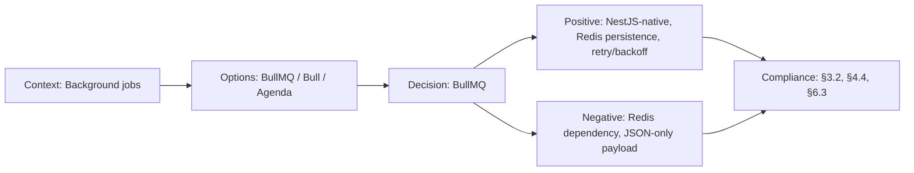

# ADR-017: BullMQ for Background Job Processing

> **Status:** Accepted | **Date:** 2026-07-11 | **Author:** Architecture Board
> **Deciders:** Staff Backend Architect, Principal DevOps Engineer, Enterprise Cloud Architect
> **Reference:** [queue.module.ts](../../apps/api/src/common/queue/queue.module.ts) | [email.processor.ts](../../apps/api/src/common/queue/email.processor.ts) | [DeploymentGuide.md](../21-operations/DeploymentGuide.md)

## Context

The NestJS API needs to perform asynchronous background work that should not block HTTP request-response cycles:

- **Email delivery:** Contact form submissions, notification alerts, password reset emails — all sent via Resend
- **Scheduled cleanup:** Old session records, expired refresh tokens, stale analytics snapshots
- **Async notification processing:** Webhook delivery to external services, audit log aggregation

Key constraints:

- Jobs must survive process restarts (persistent storage)
- Failed jobs must be retried with exponential backoff
- The queue system must integrate cleanly with NestJS's DI and module system
- Minimal infrastructure overhead — Redis may already be in use for caching

The existing implementation (`apps/api/src/common/queue/`) registers a single `BullModule.forRootAsync` and an `email` queue with `EmailProcessor` worker. The email processor stubs out when `RESEND_API_KEY` is not configured, logging a message instead of sending.

## Decision

We adopt **BullMQ** (`@nestjs/bullmq`) as the background job processing framework with a **Redis** backend.

### Architecture

- **Queue client:** `BullModule.forRootAsync` reads `REDIS_URL` from config, falling back to `redis://localhost:6379`
- **Queue registration:** `BullModule.registerQueue({ name: 'email' })` — additional queues registered as needed
- **Worker:** `EmailProcessor` extends `WorkerHost` with `@Processor('email')` decorator
- **Email flow:** Job data contains `{ type, to, subject, html }` → Resend SDK sends → success/failure logged

### Resilience

- **Exponential backoff:** Default BullMQ retry strategy — jobs retry with increasing delay after failure
- **Dead letter queue:** After 3 failed attempts, the job is moved to a stalled/dead set (configurable via `maxAttempts`)
- **Graceful shutdown:** `WorkerHost` handles SIGTERM — prevents job interruption during deployment rollouts
- **Stub mode:** When `RESEND_API_KEY` is unset, the processor logs `[QUEUE STUB]` instead of throwing — safe for development

### Future queues (planned)

| Queue       | Purpose                                | Schedule             |
| ----------- | -------------------------------------- | -------------------- |
| `email`     | Contact form, notifications            | On-demand            |
| `cleanup`   | Session/token cleanup, log rotation    | Cron (`0 3 * * *`)   |
| `analytics` | Aggregation rollups, report generation | Cron (`0 */6 * * *`) |

## Options Considered

| Option                   | Pros                                                                                                                                                            | Cons                                                                                                      |
| ------------------------ | --------------------------------------------------------------------------------------------------------------------------------------------------------------- | --------------------------------------------------------------------------------------------------------- |
| **BullMQ ✅**            | NestJS-native `@nestjs/bullmq` integration, Redis persistence (survives restarts), mature (v5), exponential backoff, rate limiting, delayed jobs, Bull Board UI | Redis dependency, job payload size limited to 512MB (Redis value limit), moderate learning curve          |
| **Bee-Queue**            | Lighter than BullMQ, same Redis backend, simple API                                                                                                             | Fewer features (no delayed jobs, no rate limiting), less active maintenance, no native NestJS integration |
| **Agenda**               | MongoDB-based (no extra infra), cron syntax, simple                                                                                                             | Less mature, MongoDB lock overhead, weaker NestJS ecosystem support                                       |
| **RabbitMQ**             | AMQP standard, strong routing, durability guarantees                                                                                                            | Heavy ops overhead (Erlang VM, management), overkill for portfolio queue volume                           |
| **AWS SQS**              | Fully managed, infinite retention, DLQ built-in                                                                                                                 | AWS dependency (lock-in), no NestJS-native integration, poll-based (latency), paid at scale               |
| **In-process execution** | Zero infrastructure, simple `setTimeout`/`setImmediate`                                                                                                         | Jobs lost on process crash, blocks event loop, no retry, no observability                                 |

## Consequences

### Positive

- Jobs survive API restarts (Redis persistence) — no lost contact form submissions
- Exponential backoff with dead letter queue prevents cascading failures
- Bull Board (optional) provides a web UI at `/api/admin/queues` for monitoring
- `@nestjs/bullmq` integrates with NestJS DI — processors can inject services and config
- Stub mode enables local development without any external dependencies
- Redis is likely already needed for session store and caching — no new infrastructure

### Negative

- Redis is a required dependency for the API — adds ~50MB container memory overhead
- Job payload serialization: all job data must be JSON-serializable (no Buffer, no class instances)
- BullMQ v5 moved to `@nestjs/bullmq` (separate from `@nestjs/bull`) — careful version matching required
- Bull Board adds admin routes that must be authenticated (mitigated by JWT guards on admin routes)

### Neutral

- Default retry strategy may need tuning per queue — email retries faster than cleanup
- Redis memory usage grows with queue backlogs — monitor `INFO memory` during peak loads
- Migration from BullMQ requires queue drain + worker replacement — non-trivial but documented

## Decision Flow

## Compliance

- Aligns with Constitution §3.2: "Asynchronous job processing with persistence guarantees"
- Aligns with Constitution §4.4: "Graceful degradation when external services are unavailable"
- Aligns with Constitution §6.3: "Retry with exponential backoff for transient failures"
- GDPR: Email queue payloads may contain PII (email addresses, names) — ensure data is not logged in plaintext; retention period must be configured on queues

## Cross-References

- [MASTER-INDEX.md](../MASTER-INDEX.md) — Documentation master index
- [CROSS-REFERENCE-INDEX.md](../26-reference/CROSS-REFERENCE-INDEX.md) — Cross-reference system
