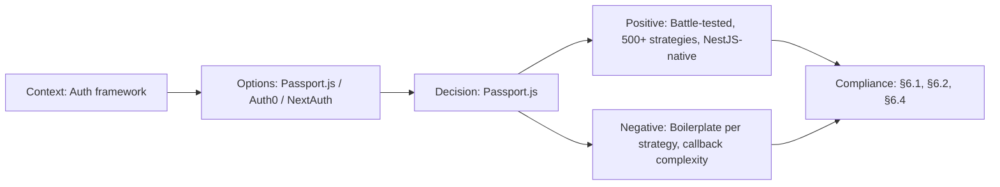

# ADR-018: Passport.js for Authentication

> **Status:** Accepted | **Date:** 2026-07-11 | **Author:** Architecture Board
> **Deciders:** Enterprise Security Architect, Staff Backend Architect, Principal Platform Engineer
> **Reference:** [auth.module.ts](../../apps/api/src/modules/auth/auth.module.ts) | [SecurityArchitecture.md](../architecture/SecurityArchitecture.md)

## Context

The API requires a multi-strategy authentication system that supports:

- **JWT bearer tokens** — stateless API authentication for the admin dashboard and API clients
- **Google OAuth** — social login for admin users via Google accounts
- **GitHub OAuth** — social login for admin users via GitHub accounts (aligns with open-source contributor base)
- **Role-based access control** — `admin`, `editor`, `viewer` roles on protected routes
- **Session management** — refresh token rotation, rate-limited login attempts

The existing `auth.module.ts` registers `PassportModule`, `JwtModule`, and six providers (`AuthService`, `JwtStrategy`, `JwtAuthGuard`, `RolesGuard`, `GoogleStrategy`, `GithubStrategy`). This ADR formalizes the authentication architecture that is already implemented in code.

Key security requirements:

- OWASP ASVS L1 compliance for authentication
- Password hashing with bcrypt (cost factor 12)
- Account lockout after 5 failed attempts
- 15-minute access token TTL with refresh token rotation
- Refresh tokens hashed (SHA-256) in Redis before storage
- No plaintext secrets in logs, responses, or URLs

## Decision

We adopt **Passport.js** (`@nestjs/passport`) as the authentication framework with three strategies:

### JWT Strategy (`JwtStrategy`)

- **Token source:** Bearer token from `Authorization` header
- **Algorithm:** HS256 (symmetric, server-side secret)
- **Access token TTL:** 15 minutes (configurable via `JWT_EXPIRES_IN`)
- **Issuer:** `portfolio-api`
- **Audience:** `portfolio-admin`
- **Secret:** Injected from `ConfigService` — stored in `JWT_SECRET` env var
- **Validation:** Decode → verify signature → check expiry → load user → attach to request

### Google OAuth Strategy (`GoogleStrategy`)

- **OAuth version:** OAuth 2.0
- **Scopes:** `email`, `profile`
- **Callback:** Handles token exchange in `validate()` method
- **User creation:** Auto-provisions user record on first login if not existing

### GitHub OAuth Strategy (`GithubStrategy`)

- **OAuth version:** OAuth 2.0
- **Scopes:** `user:email` (access verified primary email)
- **Callback:** Same pattern as Google — `validate()` handles token exchange
- **User creation:** Auto-provisions user record with GitHub profile data

### AuthService

- **Password hashing:** bcrypt with cost factor 12 (~250ms per hash on modern hardware)
- **Login rate limiting:** Lockout after 5 consecutive failed attempts (1-hour window, stored in Redis)
- **Refresh token rotation:**
  - Access token issued with associated refresh token (long-lived, e.g., 7 days)
  - On refresh, old refresh token is invalidated (SHA-256 hashed in Redis)
  - New access + refresh token pair issued
  - Replay detection: if a revoked refresh token is used, all tokens for that user are invalidated

### Guards

- `JwtAuthGuard`: Extends `AuthGuard('jwt')` — validates JWT and attaches user to `request.user`
- `RolesGuard`: Checks `@Roles()` metadata against user roles — `admin`, `editor`, `viewer`
- All admin controllers default to `@UseGuards(JwtAuthGuard, RolesGuard)` + `@ApiBearerAuth()`

## Options Considered

| Option                     | Pros                                                                                                                    | Cons                                                                                                                  |
| -------------------------- | ----------------------------------------------------------------------------------------------------------------------- | --------------------------------------------------------------------------------------------------------------------- |
| **Passport.js ✅**         | Battle-tested (15+ years), 500+ strategies, native `@nestjs/passport` integration, community support (NestJS ecosystem) | Boilerplate per strategy, middleware-style composability can be confusing, docs fragmented across strategies          |
| **Custom auth middleware** | Full control, no dependency, minimal bundle                                                                             | Implement every security concern from scratch (CSRF, session, rate limiting), easy to miss edge cases, time-consuming |
| **Supabase Auth**          | Built-in JWT (RS256), RLS integration, social providers, managed infrastructure                                         | Requires Supabase project, less flexible role model, external dependency for auth flow, downgrade attack surface      |
| **Auth0**                  | Enterprise-grade, MFA, breach detection, universal login                                                                | Paid at scale ($23+/mo), external redirect for login, vendor lock-in, overkill for portfolio                          |
| **Okta**                   | Enterprise SSO, lifecycle management, adaptive MFA                                                                      | Complexity, enterprise pricing, over-engineered for single-admin portfolio                                            |

## Consequences

### Positive

- Three authentication strategies with a unified `request.user` interface
- Refresh token rotation with replay detection — strong protection against token theft
- Rate-limited login (5 attempts) prevents brute force attacks
- bcrypt cost 12 provides strong hash resistance against offline cracking
- Role-based guards integrate declaratively with route handlers (`@Roles('admin')`)
- Passport's ecosystem means adding new strategies (Twitter, Discord, etc.) is well-documented

### Negative

- Passport.js has a reputation for "callback spaghetti" — mitigated by NestJS's `@nestjs/passport` abstraction
- Each strategy requires its own `strategy.ts` file with validate/callback method — three files for three strategies
- OAuth flows require registered callback URLs — complicates local development (must use tunneling or env-specific config)
- Refresh token rotation with Redis adds operational dependency beyond the DB

### Neutral

- `JWT_EXPIRES_IN` is configurable — can be shortened for higher security or lengthened for DX
- OAuth auto-provisioning means the first Google/GitHub login also creates the DB user record
- `@Public()` decorator can selectively bypass `JwtAuthGuard` on specific routes

## Decision Flow

## Compliance

- OWASP ASVS L1: Password complexity (bcrypt cost 12), lockout (5 attempts), session management (refresh rotation)
- Aligns with Constitution §6.1: "Multi-strategy authentication with least-privilege role model"
- Aligns with Constitution §6.2: "Stateless JWT authentication compatible with microservices"
- Aligns with Constitution §6.4: "OWASP ASVS L1 minimum for authentication controls"
- GDPR: OAuth flows respect scope consent; no PII logged in auth tokens; refresh tokens hashed at rest

## Cross-References
- [MASTER-INDEX.md](../MASTER-INDEX.md) — Documentation master index
- [CROSS-REFERENCE-INDEX.md](../26-reference/CROSS-REFERENCE-INDEX.md) — Cross-reference system
