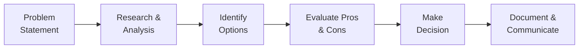

# D-[XXX]: [Decision Title]

> **Date:** YYYY-MM-DD  
> **Author:** [Name]  
> **Status:** [Decided | Proposed | Deprecated]

---

## Decision Workflow

## Context

[Why was this decision needed? Describe the background, constraints, and circumstances that led to this decision. Include relevant links to issues, RFCs, or discussions.]

## Decision

[What was decided? State the decision clearly and concisely. Include the key technologies, patterns, or approaches chosen.]

## Options Considered

| Option | Description | Pros | Cons |
|--------|-------------|------|------|
| [Option A] | [Brief description] | [Pro 1], [Pro 2] | [Con 1], [Con 2] |
| [Option B] | [Brief description] | [Pro 1], [Pro 2] | [Con 1], [Con 2] |

## Consequences

**Positive:**
- [Positive outcome 1]
- [Positive outcome 2]

**Negative:**
- [Negative outcome 1]
- [Negative outcome 2]

## References

- [RFC-NNN: Related RFC](link)
- [ADR-NNN: Related Architecture Decision](link)
- [PR #N: Implementation](link)
- [Issue #N: Discussion](link)

## Cross-References
- [MASTER-INDEX.md](../MASTER-INDEX.md) — Documentation master index
- [CROSS-REFERENCE-INDEX.md](../26-reference/CROSS-REFERENCE-INDEX.md) — Cross-reference system
