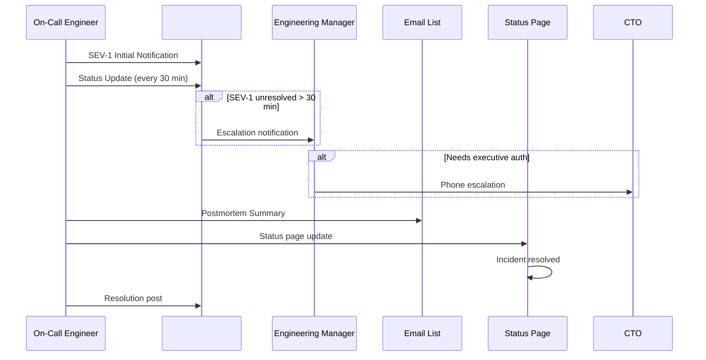

# Incident Communication Templates

> **Document:** `incident-communication-templates.md` | **Version:** 1.0 | **Last Updated:** July 2026
> **Status:** Active | **Owner:** DevOps Lead | **Review Cadence:** Quarterly
> **Related:** [incident-response-playbook.md](../21-operations/incident-response-playbook.md) | [incident-severity-criteria.md](../21-operations/incident-severity-criteria.md) | [on-call-schedule.md](../21-operations/on-call-schedule.md)

---

## 1. Purpose

Standardized templates for incident communication across Slack, email, and the customer-facing status page. Using consistent templates reduces cognitive overhead during incidents and ensures no critical information is omitted.

**Golden rule:** Communicate early, communicate often. Err on the side of over-communication.

---

## Comms Escalation Flow



---

## 2. Slack Templates

### 2.1 SEV-1 Initial Notification

Post to `#ops-alerts` immediately when a SEV-1 is declared. @-mention the on-call engineers and the incident channel.

```
🚨 SEV-1: [BRIEF TITLE]
Impact: [What's affected — e.g. "All users unable to access website"]
Started: [Timestamp in UTC]
Service: [web / api / ai / db / multiple]
Response: @oncall-primary @oncall-secondary
Channel: #ops-incident
Link: [link to incident channel thread]
```

**Example:**

```
🚨 SEV-1: Database Unreachable — All API Endpoints Returning 500
Impact: All users unable to access portfolio website and admin dashboard
Started: 2026-07-10 14:32 UTC
Service: database (Supabase PostgreSQL)
Response: @oncall-primary @oncall-secondary
Channel: #ops-incident
```

### 2.2 SEV-1 Status Update (Every 30 Minutes)

Post to the incident thread in `#ops-incident` every 30 minutes (or sooner if there's a significant change).

```
🔄 UPDATE: [INCIDENT TITLE] — [X] minutes elapsed
Status: [Investigating / Mitigating / Resolved / Monitoring]
Impact: [Current impact — updated if changed]
What we know: [Brief summary of findings]
Action taken: [What's been done so far]
Next step: [What we're doing next]
Next update: [Time in UTC]
```

**Example:**

```
🔄 UPDATE: Database Unreachable — 12 minutes elapsed
Status: Investigating
Impact: All users unable to access site. API returning 502 for all requests.
What we know: Supabase PostgreSQL is not accepting connections. Database CPU at 98%. Connection pool exhausted.
Action taken: Restarted connection pool. Initiated failover to read replica.
Next step: Promoting read replica to primary.
Next update: 2026-07-10 15:05 UTC
```

### 2.3 SEV-1 Resolution

Post to `#ops-alerts` and the incident thread in `#ops-incident` when the service is restored and monitoring confirms stability.

```
✅ RESOLVED: [INCIDENT TITLE]
Duration: [X] minutes
Root Cause: [Brief, 1-2 sentence explanation]
Action: [What was done to fix]
Monitoring: [Service verified stable for X minutes]
Postmortem: [Link to postmortem doc — added within 48h]
```

**Example:**

```
✅ RESOLVED: Database Unreachable
Duration: 37 minutes
Root Cause: Connection pool exhaustion caused by unclosed connections from a background job processing contact form submissions.
Action: Killed stuck connections, restarted pool, deployed fix to close connections properly in the background job.
Monitoring: Verified stable for 15 minutes. Database CPU at 25%.
Postmortem: https://github.com/portfolio/docs/postmortems/2026-07-10-db-connection-pool-exhaustion.md
```

### 2.4 SEV-2/3 Notification

Post to `#ops-alerts` for SEV-2 incidents. SEV-3 can be posted as a direct message to the team lead or in the team channel.

```
⚠️ SEV-[2|3]: [BRIEF TITLE]
Impact: [What's affected]
SLA: [Response time for this severity]
Owner: [Person or team handling it]
Status: [Investigating / Mitigating / Resolved]
Channel: #ops-incident (for SEV-2 only)
```

**Example (SEV-2):**

```
⚠️ SEV-2: Contact Form Submissions Failing
Impact: Users unable to submit contact form. Error 400 on POST /api/contact.
SLA: Acknowledge by 15 minutes, fix within 8 hours.
Owner: @backend-lead
Status: Investigating
Channel: #ops-incident
```

**Example (SEV-3):**

```
⚠️ SEV-3: Blog Search Returning Empty Results
Impact: Blog search query returns no results. Recent 3 posts not indexed.
SLA: Fix within 48 hours.
Owner: @team-lead
Status: Investigating
```

### 2.5 SEV-2/3 Resolution

```
✅ RESOLVED: [INCIDENT TITLE]
Duration: [X] minutes/hours
Root Cause: [Brief explanation]
Action: [What was done]
Owner: [Person]
```

### 2.6 Missed SLA Notification

Automatically posted by PagerDuty when a SEV-1/2 alert is not acknowledged within the SLA window.

```
⏰ SLA BREACH: [INCIDENT TITLE]
Severity: [SEV-1 / SEV-2]
Alert sent at: [Time in UTC]
ACK deadline: [Time in UTC]
Current status: [Unacknowledged / Late ACK]
Escalated to: @oncall-secondary (or @engineering-manager)
```

### 2.7 Maintenance Window Notification

Post to `#ops-maintenance` at least 24 hours before scheduled maintenance.

```
🔧 MAINTENANCE WINDOW: [TITLE]
Date: [YYYY-MM-DD]
Time: [Start UTC] — [End UTC] (Estimated duration: [X] min)
Impact: [What will be affected / degraded / unavailable]
Reason: [Why the maintenance is needed]
Status page: [Link to status page update]
Contact: @owner
```

---

## 3. Customer-Facing Status Page Updates

### 3.1 Status Page Provider

The Portfolio platform uses **Better Uptime** for the public status page at `status.portfolio.dev`.

### 3.2 Initial Notification

```
[Component] — Investigating

We are currently investigating reports of [brief description of the issue].
Users may experience [symptoms].

Our team is working on identifying the root cause.
We will provide updates as they become available.

Next update: [Time in UTC]
Posted: [Time in UTC]
```

**Example:**

```
API — Investigating

We are currently investigating reports of errors when accessing the portfolio website.
Users may experience slow page loads or error messages when browsing projects.

Our team is working on identifying the root cause.
We will provide updates as they become available.

Next update: 2026-07-10 15:15 UTC
Posted: 2026-07-10 14:32 UTC
```

### 3.3 Status Update

```
[Component] — [Investigating / Identified / Monitoring]

We have [identified the root cause / applied a fix / implemented a workaround].

[Brief description of what we found or did]

We are currently [monitoring the fix / continuing investigation].

Next update: [Time in UTC]
Posted: [Time in UTC]
```

**Example:**

```
API — Identified

We have identified the root cause: a database connection pool exhaustion issue.

We are in the process of failing over to a standby database instance.
Some users may continue to experience errors during the failover process.

Next update: 2026-07-10 14:50 UTC
Posted: 2026-07-10 14:40 UTC
```

### 3.4 Resolution

```
[Component] — Resolved

This incident has been resolved.

[Brief description of what happened and the fix applied]

All systems are now operating normally.
A postmortem will be published within 48 hours detailing the root cause and preventive measures.

Posted: [Time in UTC]
```

**Example:**

```
API — Resolved

This incident has been resolved.

A database connection pool exhaustion issue caused the API to become unresponsive.
We failed over to a standby database instance and applied a fix to properly close idle connections.

All systems are now operating normally.
A postmortem will be published within 48 hours detailing the root cause and preventive measures.

Posted: 2026-07-10 15:09 UTC
```

### 3.5 Scheduled Maintenance

```
[Component] — Scheduled Maintenance

We will be performing scheduled maintenance on [component] on [date].
During this window, [expected impact].

Start time: [UTC]
End time: [UTC]
Posted: [Time in UTC]
```

---

## 4. Email Templates

### 4.1 SEV-1 Internal Notification (Engineering Team)

```
Subject: [SEV-1] [Service] — [Brief Description]

Severity: SEV-1 (Critical)
Status: Investigating
Started: YYYY-MM-DD HH:MM UTC

Impact:
- [What's affected]
- [Users/services impacted]
- [Revenue/data impact if known]

Current actions:
- [On-call engineer] is leading the response
- [Engineering Manager] has been notified
- [Specific actions being taken]

Next update: Within 30 minutes

Incident channel: #ops-incident
Status page: https://status.portfolio.dev
```

### 4.2 Postmortem Summary (Email to Engineering Team)

```
Subject: Postmortem: [INCIDENT TITLE] — [DATE]

Summary
[A sentence describing what happened and when, including duration and severity]

Timeline
- [Time in UTC]: Issue detected — [brief note]
- [Time in UTC]: Investigation began — [brief note]
- [Time in UTC]: Root cause identified — [brief note]
- [Time in UTC]: Mitigation applied — [brief note]
- [Time in UTC]: Service restored — [brief note]

Root Cause
[1-2 sentence explanation of what caused the incident]

Resolution
[What was done to fix the issue and restore service]

Impact
- Downtime: X minutes
- Errors: X 5xx responses
- Users affected: X
- Revenue impact: $X (if any)

Action Items
| Action | Owner | Due Date |
|--------|-------|----------|
| [Fix root cause] | @name | YYYY-MM-DD |
| [Add monitoring] | @name | YYYY-MM-DD |
| [Update runbook] | @name | YYYY-MM-DD |

Lessons Learned
- What went well: [List]
- What went wrong: [List]
- What to improve: [List]

Full postmortem: [Link to postmortem document]
```

**Example:**

```
Subject: Postmortem: Database Connection Pool Exhaustion — July 10, 2026

Summary
On July 10, 2026, from 14:32 to 15:09 UTC, the Portfolio API was unavailable for 37 minutes due to database connection pool exhaustion caused by unclosed connections from a background job.

Timeline
- 14:32 UTC: Alert triggered — API health check failed
- 14:33 UTC: On-call acknowledged
- 14:35 UTC: Investigation began — checked logs, found connection pool full
- 14:42 UTC: Root cause identified — background job leaking connections
- 14:45 UTC: Killed stuck connections, restarted pool
- 14:55 UTC: Failover to read replica initiated
- 15:09 UTC: Service restored, monitoring stable

Root Cause
A background job that processes contact form submissions was not closing database connections after completion. Over several hours, this leaked connections until the pool was exhausted.

Resolution
1. Killed all stuck connections in the pool
2. Restarted the database connection pool
3. Deployed a fix to ensure connections are closed in the background job
4. Verified all connections are properly released after job completion

Impact
- Downtime: 37 minutes
- Errors: ~2,400 5xx responses
- Users affected: All users (no traffic during incident due to monitoring window)
- Revenue impact: None

Action Items
| Action | Owner | Due Date |
|--------|-------|----------|
| Add connection leak monitoring | SRE | 2026-07-17 |
| Add connection pool saturation alert | SRE | 2026-07-17 |
| Audit all background jobs for connection leaks | Backend | 2026-07-24 |

Lessons Learned
- What went well: Fast detection via health check alert, clear communication
- What went wrong: No monitoring for connection pool saturation
- What to improve: Add pool saturation alerting, scheduled connection leak audits
```

### 4.3 Weekly Incident Summary (Email to Engineering Team)

```
Subject: Weekly Incident Summary — Week of [DATE]

Summary
- Total incidents: [X]
- SEV-1: [X]
- SEV-2: [X]
- SEV-3/4: [X]
- Open action items: [X]
- Overdue action items: [X]

Notable incidents
- [Date]: [Brief description]
- [Date]: [Brief description]

Trends
- [Any patterns or recurring issues]

Open action items
| ID | Incident | Action | Owner | Due | Status |
|----|----------|--------|-------|-----|--------|
| ... | ... | ... | ... | ... | ... |

Next week's on-call
- Primary: [Name]
- Secondary: [Name]
```

---

## 5. Phone Tree Script

### 5.1 Calling the On-Call Engineer (SEV-1 After-Hours)

```
"Hi [Name], this is [Caller Name] from Portfolio Engineering.
We have a SEV-1 incident: [brief description].
This is a critical incident requiring immediate attention.
Please check #ops-incident on Slack and acknowledge the PagerDuty alert.
I'll stay on the line until you confirm you've seen the alert."
```

### 5.2 Escalating to Engineering Manager

```
"Hi [Name], this is [Caller Name] from Portfolio Engineering.
We have a SEV-1 incident that [primary on-call] has been working on for [X] minutes without resolution.
The incident is: [brief description].
We need your assistance with [specific ask — authorization, decision, resource].
Please join #ops-incident on Slack."
```

### 5.3 Escalating to CTO

```
"Hi [Name], this is [Caller Name] from Portfolio Engineering.
We have a SEV-1 incident requiring executive authorization: [brief description].
[Decision needed — e.g. DR activation, breach disclosure, customer communication].
Please join #ops-incident on Slack or take a call with [current lead]."
```

---

## 6. Communication Cadence Summary

| Severity  | Initial                     | Updates                      | Resolution  | Postmortem     |
| --------- | --------------------------- | ---------------------------- | ----------- | -------------- |
| **SEV-1** | Immediate (#ops-alerts)     | Every 30 min (#ops-incident) | When stable | Within 5 days  |
| **SEV-2** | Immediate (#ops-alerts)     | Every 60 min (#ops-incident) | When stable | Within 10 days |
| **SEV-3** | Direct message to team lead | As needed                    | When fixed  | Not required   |
| **SEV-4** | Issue comment / PR          | On merge                     | On merge    | Not required   |

---

_Document Version: 1.0 — Incident Communication Templates_
_Last Updated: July 2026_
_Next Review Date: October 2026_

## Cross-References

- [MASTER-INDEX.md](../MASTER-INDEX.md) — Documentation master index
- [CROSS-REFERENCE-INDEX.md](../26-reference/CROSS-REFERENCE-INDEX.md) — Cross-reference system
