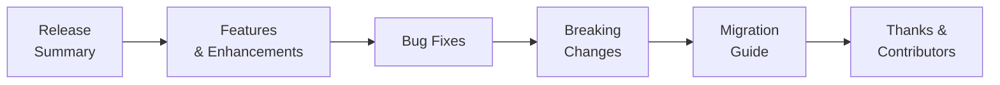

# Release vX.Y.Z — YYYY-MM-DD

## Release Note Sections

## Features
- [Feature description] ([PR #N])
- [Feature description] ([PR #N])

## Bug Fixes
- [Bug description] ([PR #N])
- [Bug description] ([PR #N])

## Performance
- [Performance improvement description] ([PR #N])

## Security
- [Security fix description] ([PR #N])

## Documentation
- [Documentation change description] ([PR #N])

## Maintenance
- [Dependency update, refactoring, chore, etc.] ([PR #N])

## Breaking Changes
- [Description of breaking change and migration guide] ([PR #N])

---

**Full Changelog:** [vX.Y.Z-1...vX.Y.Z](link-to-compare)

## Cross-References
- [MASTER-INDEX.md](../MASTER-INDEX.md) — Documentation master index
- [CROSS-REFERENCE-INDEX.md](../26-reference/CROSS-REFERENCE-INDEX.md) — Cross-reference system
