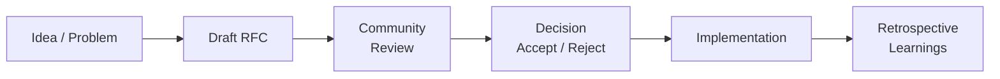

# RFC-[NNN]: [Title]

> **Status:** [Proposed | Accepted | Rejected | Superseded]  
> **Date:** YYYY-MM-DD  
> **Author:** [Name]  
> **PR:** [#NN](link-to-PR)

---

## Table of Contents

1. Summary
2. Motivation
3. Detailed Design
4. Alternatives Considered
5. Migration Plan
6. Testing Strategy
7. Open Questions
8. Decision

---

## RFC Process



## Summary

[1-2 paragraph summary of the proposal. What is being proposed, and at a high level, how does it work? Include the key technologies, patterns, or architectural changes being introduced.]

## Motivation

[Why is this change needed? What problem does it solve? Describe the current state, its limitations, and the desired future state.]

**Key drivers:**

- [Driver 1]
- [Driver 2]
- [Driver 3]

## Detailed Design

[Technical details of the implementation. Include architecture diagrams in ASCII or links to visuals, data flow descriptions, interface definitions, configuration changes, and any relevant code samples.]

### Architecture

```
[Component diagram or data flow]
```

### Interfaces

```typescript
// TypeScript interface or type definitions
interface ProposedInterface {
  // ...
}
```

### Configuration

[Any new environment variables, feature flags, or config changes.]

## Alternatives Considered

| Alternative | Pros             | Cons             |
| ----------- | ---------------- | ---------------- |
| [Option A]  | [Pro 1], [Pro 2] | [Con 1], [Con 2] |
| [Option B]  | [Pro 1], [Pro 2] | [Con 1], [Con 2] |
| [Option C]  | [Pro 1], [Pro 2] | [Con 1], [Con 2] |

## Migration Plan

[How to migrate from the current state to the proposed state. Include rollout phases, feature flags, backward compatibility guarantees, and rollback strategy.]

| Phase | Description | Duration   |
| ----- | ----------- | ---------- |
| 1     | [Phase 1]   | [Timeline] |
| 2     | [Phase 2]   | [Timeline] |
| 3     | [Phase 3]   | [Timeline] |

## Testing Strategy

[How will this be tested? Describe unit tests, integration tests, E2E tests, manual QA, and monitoring/observability for the new feature.]

| Test Type   | Scope             | Tooling                |
| ----------- | ----------------- | ---------------------- |
| Unit        | [What is covered] | Jest / Vitest          |
| Integration | [What is covered] | Supertest / Playwright |
| E2E         | [What is covered] | Playwright             |

## Open Questions

- [Unresolved question 1]
- [Unresolved question 2]
- [Unresolved question 3]

## Decision

> **Status:** [Accepted / Rejected / Superseded]  
> **Date:** YYYY-MM-DD  
> **Reviewed by:** [Reviewers]

[Rationale for the decision, any modifications made during review, and links to the review discussion.]

## Cross-References

- [MASTER-INDEX.md](../MASTER-INDEX.md) — Documentation master index
- [CROSS-REFERENCE-INDEX.md](../26-reference/CROSS-REFERENCE-INDEX.md) — Cross-reference system
