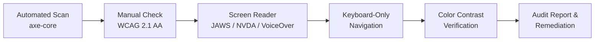

# Accessibility Audit Checklist — WCAG 2.1 AA

> **Purpose:** Verify that the application meets WCAG 2.1 AA success criteria through automated and manual audit procedures.
> **Audience:** Frontend Lead, QA Engineers, Design Lead, Accessibility Champion
> **Owner:** Accessibility Champion
> **Dependencies:** [ACCESSIBILITY-TESTING-GUIDE.md](../16-accessibility/ACCESSIBILITY-TESTING-GUIDE.md) | [ACCESSIBILITY-CHECKLIST.md](../16-accessibility/ACCESSIBILITY-CHECKLIST.md) | [WCAG-STATEMENT.md](../35-quality/wcag-statement.md) | [ACCESSIBILITY-ARCHITECTURE.md](../35-quality/AccessibilityArchitecture.md) | [COMPONENT-LIBRARY.md](../04-design/ComponentLibrary.md)
> **Standards:** WCAG 2.1 AA, Section 508, EN 301 549
> **Status:** Active | **Review Frequency:** Quarterly

---

## A11y Audit Workflow

---

## 1. Perceivable — Text Alternatives (WCAG 1.1)

| #   | Item                               | Description                                                                                     | Owner         | Pass/Fail |
| --- | ---------------------------------- | ----------------------------------------------------------------------------------------------- | ------------- | --------- |
| 1   | Informative images have alt text   | All `` elements with meaningful content have non-empty `alt` describing the image purpose. | Frontend Lead | [ ]       |
| 2   | Decorative images marked           | Purely decorative images use `alt=""` (empty) or `role="presentation"` to hide from AT.         | Frontend Lead | [ ]       |
| 3   | Icon buttons have accessible names | Icon-only buttons/links have `aria-label` or visible text; no unlabeled icon buttons.           | Frontend Lead | [ ]       |
| 4   | Complex images described           | Charts, graphs, and diagrams have a text description or accessible data table nearby.           | Design Lead   | [ ]       |
| 5   | SVG elements labeled               | Inline SVGs have `<title>` and `aria-labelledby` referencing it.                                | Frontend Lead | [ ]       |

## 2. Perceivable — Time-Based Media (WCAG 1.2)

| #   | Item                        | Description                                                                          | Owner         | Pass/Fail |
| --- | --------------------------- | ------------------------------------------------------------------------------------ | ------------- | --------- |
| 6   | Video captions available    | All pre-recorded video content has synchronized captions (WEBVTT or equivalent).     | Content Lead  | [ ]       |
| 7   | Audio descriptions provided | Pre-recorded video with important visual information has audio description track.    | Content Lead  | [ ]       |
| 8   | No auto-playing media       | No audio or video plays automatically on page load; if present, has pause mechanism. | Frontend Lead | [ ]       |
| 9   | Media controls accessible   | Play/pause, volume, and caption controls are keyboard accessible and labeled.        | Frontend Lead | [ ]       |

## 3. Perceivable — Adaptable (WCAG 1.3)

| #   | Item                            | Description                                                                                      | Owner         | Pass/Fail |
| --- | ------------------------------- | ------------------------------------------------------------------------------------------------ | ------------- | --------- |
| 10  | Semantic landmarks present      | Pages use `<header>`, `<nav>`, `<main>`, `<footer>` landmarks; no generic `
`-only layout.   | Frontend Lead | [ ]       |
| 11  | Heading hierarchy correct       | `h1` → `h2` → `h3` sequence without skipped levels; one `h1` per page.                           | Frontend Lead | [ ]       |
| 12  | Lists use semantic markup       | Related items use `<ul>`, `<ol>`, `<dl>`; not styled `
` or ` ` lists.                    | Frontend Lead | [ ]       |
| 13  | Content order logical           | DOM order matches visual order; no CSS `order` or absolute positioning that breaks logical flow. | Frontend Lead | [ ]       |
| 14  | Data tables use proper markup   | Data tables use `<th>`, `scope`, `<caption>`, `<thead>`/`<tbody>`; no layout tables.             | Frontend Lead | [ ]       |
| 15  | Instructions not solely sensory | Instructions do not rely on shape, size, color, or sound alone (e.g., "click the green button"). | Design Lead   | [ ]       |

## 4. Perceivable — Distinguishable (WCAG 1.4)

| #   | Item                          | Description                                                                                         | Owner         | Pass/Fail |
| --- | ----------------------------- | --------------------------------------------------------------------------------------------------- | ------------- | --------- |
| 16  | Color contrast AA minimum     | Normal text: contrast ratio ≥ 4.5:1; large text (≥ 18px / 14px bold): ≥ 3:1.                        | Design Lead   | [ ]       |
| 17  | Color not sole differentiator | Information conveyed by color is also expressed through text, icon, or pattern.                     | Design Lead   | [ ]       |
| 18  | Text resizable to 200%        | Page content readable when browser zoom is at 200%; no text clipping or overlap.                    | Frontend Lead | [ ]       |
| 19  | Reflow at 400% zoom           | Single-column layout works at 320px viewport width without horizontal scroll.                       | Frontend Lead | [ ]       |
| 20  | Non-text contrast ≥ 3:1       | UI components (buttons, form inputs, focus indicators) have ≥ 3:1 contrast against adjacent colors. | Design Lead   | [ ]       |
| 21  | Focus indicator visible       | Interactive elements have 2px+ visible focus ring with 3:1 contrast against background.             | Frontend Lead | [ ]       |

## 5. Operable — Keyboard Accessible (WCAG 2.1)

| #   | Item                                  | Description                                                                                                  | Owner         | Pass/Fail |
| --- | ------------------------------------- | ------------------------------------------------------------------------------------------------------------ | ------------- | --------- |
| 22  | All functionality keyboard accessible | Every interactive element reachable and operable via keyboard alone (Tab, Enter, Space, Escape, Arrow keys). | Frontend Lead | [ ]       |
| 23  | No keyboard traps                     | Focus does not get trapped in any widget; Esc or Ctrl+Tab exits modal/overlay.                               | Frontend Lead | [ ]       |
| 24  | Skip-to-content link present          | First tabbable element on every page is "Skip to content" that jumps to `<main>`.                            | Frontend Lead | [ ]       |
| 25  | Focus order logical                   | Tab order follows visual reading order; no random `tabindex` values > 0.                                     | Frontend Lead | [ ]       |
| 26  | Custom widgets have ARIA roles        | Custom interactive controls (carousels, accordions, tabs) have appropriate `role`, `aria-*` states.          | Frontend Lead | [ ]       |

## 6. Operable — Enough Time (WCAG 2.2)

| #   | Item                               | Description                                                                                                         | Owner         | Pass/Fail |
| --- | ---------------------------------- | ------------------------------------------------------------------------------------------------------------------- | ------------- | --------- |
| 27  | Time limits adjustable             | Any session timeout can be extended (at least 20s warning) or disabled.                                             | Frontend Lead | [ ]       |
| 28  | Moving content can be paused       | Auto-scrolling carousels, marquees, or animations have a pause/stop button.                                         | Frontend Lead | [ ]       |
| 29  | `prefers-reduced-motion` respected | CSS `@media (prefers-reduced-motion: reduce)` disables non-essential motion; `animation-duration: 0.01ms` fallback. | Frontend Lead | [ ]       |

## 7. Operable — Seizures & Physical (WCAG 2.3–2.5)

| #   | Item                                  | Description                                                                                          | Owner         | Pass/Fail |
| --- | ------------------------------------- | ---------------------------------------------------------------------------------------------------- | ------------- | --------- |
| 30  | No flashing content > 3Hz             | No content flashes more than 3 times per second; no strobe effects.                                  | Frontend Lead | [ ]       |
| 31  | Touch targets ≥ 44x44px               | All interactive elements on mobile have minimum 44x44px touch target (including padding/margin).     | Design Lead   | [ ]       |
| 32  | Pointer gestures support single-point | All functionality operable with single-point activation (tap/click), not requiring complex gestures. | Frontend Lead | [ ]       |
| 33  | Label in name                         | Visible label text is included in or matches the accessible name for form controls.                  | Frontend Lead | [ ]       |

## 8. Understandable — Readable & Predictable (WCAG 3.1–3.2)

| #   | Item                         | Description                                                                                                 | Owner         | Pass/Fail |
| --- | ---------------------------- | ----------------------------------------------------------------------------------------------------------- | ------------- | --------- |
| 34  | `lang` attribute set         | `<html lang="en">` or appropriate language attribute set on every page.                                     | Frontend Lead | [ ]       |
| 35  | Consistent navigation        | Navigation patterns repeat across pages in the same order; no unexpected reordering.                        | Design Lead   | [ ]       |
| 36  | Focus context not lost       | No unexpected context changes on focus (e.g., form submission on blur).                                     | Frontend Lead | [ ]       |
| 37  | Changes on input predictable | Form submission, link activation, or value change does not cause unexpected context change without warning. | Frontend Lead | [ ]       |

## 9. Understandable — Input Assistance (WCAG 3.3)

| #   | Item                                 | Description                                                                                        | Owner         | Pass/Fail |
| --- | ------------------------------------ | -------------------------------------------------------------------------------------------------- | ------------- | --------- |
| 38  | All form inputs have labels          | Every `<input>`, `<select>`, `<textarea>` has an associated `<label>` with `for` attribute.        | Frontend Lead | [ ]       |
| 39  | Required fields indicated            | Required form fields are visually indicated (asterisk + `required` attribute) and announced by AT. | Frontend Lead | [ ]       |
| 40  | Error messages clear and specific    | Validation errors identify the field and describe the issue ("Email format is invalid").           | Frontend Lead | [ ]       |
| 41  | Errors linked via `aria-describedby` | Error text linked to input via `aria-describedby`; `aria-invalid` set on invalid fields.           | Frontend Lead | [ ]       |
| 42  | Suggestions provided for errors      | Where possible, suggestions for correction are included in error messages.                         | Frontend Lead | [ ]       |
| 43  | `autocomplete` attributes present    | Form fields use `autocomplete` values (email, name, tel, etc.) per WCAG 1.3.5.                     | Frontend Lead | [ ]       |

## 10. Robust — Compatible (WCAG 4.1)

| #   | Item                                  | Description                                                                               | Owner         | Pass/Fail |
| --- | ------------------------------------- | ----------------------------------------------------------------------------------------- | ------------- | --------- |
| 44  | ARIA attributes valid                 | No invalid ARIA attribute values; `aria-*` properties match the element's role.           | Frontend Lead | [ ]       |
| 45  | ARIA attributes non-redundant         | Native HTML semantics preferred; ARIA not used to override native semantics incorrectly.  | Frontend Lead | [ ]       |
| 46  | Dynamic content announced             | Content added dynamically uses `aria-live="polite"` or `assertive`; AT announces changes. | Frontend Lead | [ ]       |
| 47  | Custom roles have required properties | Custom widgets (tabpanel, dialog, combobox) have all required ARIA states and properties. | Frontend Lead | [ ]       |
| 48  | HTML valid                            | W3C HTML validator reports zero errors on all page templates.                             | Frontend Lead | [ ]       |

---

## Audit Summary

| Metric                          | Threshold                    | Result | Status |
| ------------------------------- | ---------------------------- | ------ | ------ |
| Automated violations (axe-core) | 0 critical/serious           | \_\_\_ | [ ]    |
| Lighthouse Accessibility score  | ≥ 90                         | \_\_\_ | [ ]    |
| Manual check failures           | 0                            | \_\_\_ | [ ]    |
| Keyboard-only coverage          | 100% of interactive elements | \_\_\_ | [ ]    |
| Color contrast violations       | 0 (AA normal + large)        | \_\_\_ | [ ]    |

---

## Cross-References

| Document                    | Location                                             | Relationship                                                     |
| --------------------------- | ---------------------------------------------------- | ---------------------------------------------------------------- |
| Accessibility Testing Guide | `../16-accessibility/ACCESSIBILITY-TESTING-GUIDE.md` | Automated tool setup, manual test procedures, JAWS/NVDA scripts  |
| Accessibility Checklist     | `../16-accessibility/ACCESSIBILITY-CHECKLIST.md`     | Quick-reference per-stage (design, dev, QA) checklist            |
| WCAG Statement              | `../35-quality/wcag-statement.md`                    | Conformance claim, supported technologies, exemption notes       |
| Accessibility Architecture  | `../35-quality/AccessibilityArchitecture.md`         | A11y strategy, toolchain, component-level conventions            |
| Component Library           | `../04-design/ComponentLibrary.md`                   | Pre-built accessible component patterns (modal, tabs, accordion) |
| Brand Guidelines            | `../04-design/BrandGuidelines.md`                    | Approved color palette for contrast compliance                   |
| Quality Gates               | `../35-quality/QUALITY-GATES.md`                     | G2 (PR) enforces axe-core: G3 (pre-deploy) enforces a11y score   |

---

_Last updated: July 2026. Run full audit quarterly; run automated subset per PR._
