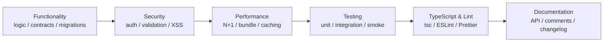

# Code Review Checklist

> **Purpose:** Standardize code review across all workspaces to ensure architecture, security, performance, testing, and documentation requirements are met before merging.
> **Audience:** All Engineers (Reviewers), Engineering Lead, QA Lead
> **Owner:** Principal Staff Engineer
> **Dependencies:** [CODE-REVIEW-STANDARDS.md](../24-development/CODE-REVIEW-STANDARDS.md) | [TESTING-CODE-REVIEW-CHECKLIST.md](../13-testing/CODE-REVIEW-CHECKLIST.md) | [QUALITY-GATES.md](../35-quality/QUALITY-GATES.md) | [CODING-STANDARDS.md](../governance/CodingStandards.md) | [GIT-STANDARDS.md](../governance/GitStandards.md) | [ARCHITECTURE-PRINCIPLES.md](../architecture/ArchitecturePrinciples.md)
> **Status:** Active | **Review Frequency:** Per PR

---

## Review Categories

---

## 1. Architecture & Design Compliance

| # | Item | Description | Owner | Status |
|---|------|-------------|-------|--------|
| 1 | Three-layer pattern respected | Business logic in `modules/*`, not in controllers. No service logic duplicated in both portfolio and admin controllers. | Reviewer | [ ] |
| 2 | Shared types imported from `@portfolio/shared` | Zod schemas and TypeScript types imported from shared package; no redefinition in consumer. | Reviewer | [ ] |
| 3 | API envelope contract honored | All responses use `{ data, meta? }` structure; no bare responses. | Reviewer | [ ] |
| 4 | Module boundaries not crossed | No direct imports from `apps/web` to `apps/api` or vice versa; communication via API only. | Reviewer | [ ] |
| 5 | Principle of least surprise | Naming, file placement, and patterns match existing codebase conventions. | Reviewer | [ ] |
| 6 | Migration avoids tech debt | No workarounds that bypass architecture (e.g., `any` casts, `eslint-disable` without justification). | Reviewer | [ ] |

## 2. Security Review

| # | Item | Description | Owner | Status |
|---|------|-------------|-------|--------|
| 7 | Auth guards present on admin routes | `@UseGuards(JwtAuthGuard, RolesGuard)` + `@Roles()` on all admin controller methods. | Reviewer | [ ] |
| 8 | Public routes explicitly marked | `@Public()` decorator applied to public routes; no implicit public access. | Reviewer | [ ] |
| 9 | Input validation complete | All external inputs validated via Zod schemas or class-validator DTOs; `whitelist: true` + `forbidNonWhitelisted: true`. | Reviewer | [ ] |
| 10 | SQL injection prevented | All database queries use Prisma's parameterized API; no raw SQL string concatenation. | Reviewer | [ ] |
| 11 | XSS prevented | User-generated content rendered via React JSX (auto-escaped); no `dangerouslySetInnerHTML` without sanitization. | Reviewer | [ ] |
| 12 | No secrets committed | No API keys, tokens, passwords, or connection strings in the diff; env vars used exclusively. | Reviewer | [ ] |
| 13 | Audit logging on mutations | `@Audit()` decorator applied to all create/update/delete operations; audit context includes user ID and action. | Reviewer | [ ] |
| 14 | Rate limiting appropriate | New public endpoints have `@Throttle()` limits matching risk level. | Reviewer | [ ] |

## 3. Performance Impact

| # | Item | Description | Owner | Status |
|---|------|-------------|-------|--------|
| 15 | No N+1 queries | Prisma queries use `include` or Prisma JOINs; no lazy-loading inside loops. | Reviewer | [ ] |
| 16 | No expensive sync operations | Heavy computations (image processing, AI calls) offloaded to background jobs (BullMQ). | Reviewer | [ ] |
| 17 | Bundle impact assessed | New dependencies weighed against bundle budget; dynamic imports used for heavy modules. | Reviewer | [ ] |
| 18 | Rendering strategy correct | Pages use appropriate rendering (SSG/ISR/SSR/CSR) per data freshness needs. | Reviewer | [ ] |
| 19 | No render-blocking patterns | No synchronous scripts, large inline CSS, or unoptimized images in critical path. | Reviewer | [ ] |

## 4. Testing Coverage

| # | Item | Description | Owner | Status |
|---|------|-------------|-------|--------|
| 20 | Unit tests present for new logic | Services, utilities, and hooks have unit tests covering happy path, edge cases, and error states. | Reviewer | [ ] |
| 21 | Test coverage threshold met | New code maintains ≥ 80% line coverage; no uncovered branches in critical logic. | Reviewer | [ ] |
| 22 | Integration tests for API changes | New/modified API endpoints have integration tests verifying response shape and status codes. | Reviewer | [ ] |
| 23 | Component tests added | New UI components have RTL/Vitest tests for rendering, interactions, and accessibility. | Reviewer | [ ] |
| 24 | Smoke tests updated | E2E test suite updated to cover new user flows; no regressions in critical paths. | Reviewer | [ ] |

## 5. Error Handling & Logging

| # | Item | Description | Owner | Status |
|---|------|-------------|-------|--------|
| 25 | try/catch on all async operations | Fallible operations wrapped; errors caught with meaningful context, not swallowed. | Reviewer | [ ] |
| 26 | Error responses structured | API errors return consistent `{ statusCode, message, error, correlationId }` envelope. | Reviewer | [ ] |
| 27 | Pino logger used (not console.log) | Structured logging via Pino; log messages contain correlation ID and context. | Reviewer | [ ] |
| 28 | Sensitive data excluded from logs | Passwords, tokens, PII not logged; `log.redact` config reviewed if new fields added. | Reviewer | [ ] |
| 29 | Graceful degradation | UI shows helpful error states and retry mechanisms on API failure; no blank screen. | Reviewer | [ ] |

## 6. Documentation & Comments

| # | Item | Description | Owner | Status |
|---|------|-------------|-------|--------|
| 30 | Public API documented | New endpoints documented in comments or OpenAPI decorators; response/request schemas clear. | Reviewer | [ ] |
| 31 | Complex logic explained | Non-obvious algorithms, business rules, or workarounds have explanatory comments. | Reviewer | [ ] |
| 32 | README/related docs updated | If behavior changed, relevant markdown docs updated (architecture, ADR, API docs). | Reviewer | [ ] |
| 33 | CHANGELOG entry added | Significant changes noted in root CHANGELOG.md following keepachangelog format. | Reviewer | [ ] |

## 7. API Contract & Migration Safety

| # | Item | Description | Owner | Status |
|---|------|-------------|-------|--------|
| 34 | Breaking changes flagged | Schema/endpoint changes that break backward compatibility identified and versioned. | Reviewer | [ ] |
| 35 | Database migration reversible | `prisma migrate dev` generated a reversible migration; down migration tested. | Reviewer | [ ] |
| 36 | No destructive migration without plan | `DROP COLUMN`, `DELETE` migrations have data preservation strategy (backup, backfill). | Reviewer | [ ] |
| 37 | OpenAPI spec updated | If API changed, `openapi.json` regenerated or updated manually. | Reviewer | [ ] |

## 8. Accessibility & Browser Compatibility

| # | Item | Description | Owner | Status |
|---|------|-------------|-------|--------|
| 38 | Semantic HTML used | New UI uses `<button>`, `<nav>`, `<main>`, etc.; no `
`-based interactive controls. | Reviewer | [ ] |
| 39 | Keyboard navigation verified | Tab order logical; interactive elements reachable and operable via keyboard. | Reviewer | [ ] |
| 40 | Color contrast sufficient | New design tokens checked against color palette; AA minimum contrast maintained. | Reviewer | [ ] |
| 41 | Cross-browser tested | Changes verified in Chrome, Firefox, Safari, Edge (last 2 major versions). | Reviewer | [ ] |
| 42 | Mobile responsive | Layout functional at 320px width; no horizontal overflow or broken grid. | Reviewer | [ ] |

## 9. TypeScript & Lint Compliance

| # | Item | Description | Owner | Status |
|---|------|-------------|-------|--------|
| 43 | `tsc --noEmit` passes | No type errors in changed files; strict mode violations resolved. | Reviewer | [ ] |
| 44 | ESLint rules followed | No new ESLint warnings; no `eslint-disable` comments without justification. | Reviewer | [ ] |
| 45 | Prettier formatting consistent | Code formatted via Prettier; no formatting-only diffs. | Reviewer | [ ] |
| 46 | No `any` types | New code avoids `any`; proper types or `unknown` with type guards used. | Reviewer | [ ] |
| 47 | Branch naming follows convention | Branch name matches `feature/`, `fix/`, `hotfix/`, `chore/` prefix per GIT-STANDARDS.md. | Reviewer | [ ] |

---

## Cross-References

| Document | Location | Relationship |
|----------|----------|--------------|
| Code Review Standards | `../24-development/CODE-REVIEW-STANDARDS.md` | Review process, reviewer roles, SLA definitions |
| Testing Code Review Checklist | `../13-testing/CODE-REVIEW-CHECKLIST.md` | FAANG-level expanded checklist with deep-dive categories |
| Quality Gates | `../35-quality/QUALITY-GATES.md` | G2 gate definitions, CI enforcement, bypass procedure |
| Coding Standards | `../governance/CodingStandards.md` | Language-specific conventions, naming, file structure |
| Git Standards | `../governance/GitStandards.md` | Branch naming, commit message format, merge strategy |
| Architecture Principles | `../architecture/ArchitecturePrinciples.md` | Design principles, three-layer pattern, module boundaries |
| PR Template | `../governance/PRTemplate.md` | PR description format, required sections, reviewer checklist |
| Definition of Done | `../quality/DefinitionOfDone.md` | Cross-team DoD acceptance criteria |

---

*Last updated: July 2026. Apply to every PR targeting `main`.*
