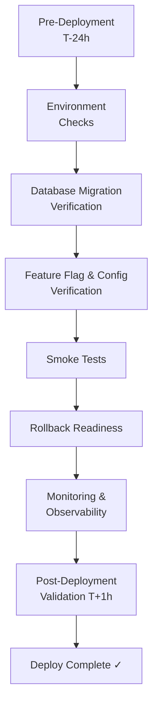

# Deployment Checklist

> **Purpose:** Ensure every production deployment is safe, verifiable, and fully reversible with zero-downtime guarantees.
> **Audience:** DevOps Lead, Engineering Lead, QA Engineers, On-Call Engineers
> **Owner:** Principal DevOps Lead
> **Dependencies:** [DEPLOYMENT-GUIDE.md](../12-devops/DEPLOYMENT-GUIDE.md) | [CI-CD-IMPLEMENTATION-GUIDE.md](../12-devops/CI-CD-IMPLEMENTATION-GUIDE.md) | [ROLLBACK-PLAYBOOK.md](../playbooks/rollback-playbook.md) | [RELEASE-PROCESS.md](../22-release/RELEASE-PROCESS.md) | [PRODUCTION-GO-LIVE-CHECKLIST.md](./PRODUCTION-GO-LIVE-CHECKLIST.md) | [QUALITY-GATES.md](../35-quality/QUALITY-GATES.md)
> **Status:** Active | **Review Frequency:** Per Release

---

## Deployment Pipeline

---

## Pre-Deployment Verification (T-24h)

| # | Item | Description | Owner | Status |
|---|------|-------------|-------|--------|
| 1 | CI pipeline green | All CI checks pass on the target commit: lint, typecheck, unit tests, integration tests, build. | CI Pipeline | [ ] |
| 2 | Code review complete | All PRs in the release have at least one approved review; no unresolved threads. | Engineering Lead | [ ] |
| 3 | Security scan passed | CodeQL SAST, `npm audit`, and trufflehog scan report zero high/critical findings. | Security Lead | [ ] |
| 4 | Quality gates passed | All gates from QUALITY-GATES.md (G1–G3) are green for this release. | QA Lead | [ ] |
| 5 | Release version tagged | Semantic version tag pushed and matches CHANGELOG entry. | Engineering Lead | [ ] |
| 6 | Release notes drafted | CHANGELOG entry written following RELEASE-NOTE-TEMPLATE.md format. | Engineering Lead | [ ] |
| 7 | Breaking change notice | If API schema changed, breaking change communicated to consumers 1 week in advance. | API Owner | [ ] |
| 8 | Feature flags reviewed | All in-progress features gated behind feature flags; no incomplete features exposed. | Product Lead | [ ] |

## Environment Checks

| # | Item | Description | Owner | Status |
|---|------|-------------|-------|--------|
| 9 | Environment parity confirmed | Staging and production configs compared; env vars, secrets, and feature flags match (excluding secrets). | DevOps Lead | [ ] |
| 10 | All env vars set in target | Every variable in `.env.example` is set in the target environment with correct values. | DevOps Lead | [ ] |
| 11 | Secrets rotation verified | No secrets from previous deployments carry over; rotation schedule confirmed up to date. | Security Lead | [ ] |
| 12 | CORS origins correct | `CORS_ORIGIN` env var includes production domains only (no wildcards, no stale dev URLs). | DevOps Lead | [ ] |
| 13 | SSL/TLS certificates valid | All custom domain certificates valid for > 7 days; auto-renewal confirmed operational. | DevOps Lead | [ ] |
| 14 | DNS records verified | `A`/`CNAME` records for all custom domains resolve to correct CDN endpoints. | DevOps Lead | [ ] |

## Database Migration Verification

| # | Item | Description | Owner | Status |
|---|------|-------------|-------|--------|
| 15 | Migration script reviewed | All new Prisma migrations reviewed for data loss, backfill correctness, and index impact. | Backend Lead | [ ] |
| 16 | Rollback migration prepared | Down migration tested; reverting to prior schema completes in < 5 minutes. | Backend Lead | [ ] |
| 17 | Staging migration applied cleanly | `npm run prisma:migrate:deploy` ran against staging; no warnings or errors. | Backend Lead | [ ] |
| 18 | Database backup taken | Full `pg_dump` of production database completed; backup checksummed and stored off-site. | DevOps Lead | [ ] |
| 19 | Migration run on read-replica | Schema changes applied to read-replica first; replication lag monitored for 10 minutes. | DevOps Lead | [ ] |
| 20 | Index build timed | Any new index creation timed and verified to complete within maintenance window. | Backend Lead | [ ] |

## Feature Flag & Configuration Verification

| # | Item | Description | Owner | Status |
|---|------|-------------|-------|--------|
| 21 | Feature flag matrix reviewed | All flags in the release audited: expected state (on/off) documented for each environment. | Product Lead | [ ] |
| 22 | Kill switch verified | Critical feature flags have a "kill switch" that disables them without a redeploy. | Engineering Lead | [ ] |
| 23 | Dark launch test passed | Feature behind flag behaves correctly when flag is off (no console errors, no degraded UX). | QA Lead | [ ] |
| 24 | Rate limits confirmed | Global and per-route throttle limits match production configuration documented in DEPLOYMENT-GUIDE.md. | DevOps Lead | [ ] |

## Smoke Tests

| # | Item | Description | Owner | Status |
|---|------|-------------|-------|--------|
| 25 | Production health check | `GET /api/health` returns 200 with expected JSON body including database connectivity. | CI Pipeline | [ ] |
| 26 | Home page loads | Portfolio landing page renders with 3D scene, content sections, and no console errors. | QA Lead | [ ] |
| 27 | Contact form functional | Form submits successfully; email notification received within 60 seconds. | QA Lead | [ ] |
| 28 | AI chat initializes | AI assistant opens, accepts user input, and streams a coherent response. | QA Lead | [ ] |
| 29 | Admin login flow | All OAuth providers (Google, GitHub, email/password) authenticate successfully. | QA Lead | [ ] |
| 30 | CRUD operations verified | Create, read, update, delete on at least one content entity (project, blog post) works. | QA Lead | [ ] |
| 31 | Search functional | Site search returns expected results; no broken or empty states. | QA Lead | [ ] |

## Rollback Readiness

| # | Item | Description | Owner | Status |
|---|------|-------------|-------|--------|
| 32 | Previous deployment health | Last known-good deployment identified and verified healthy; can rollback in < 5 minutes. | DevOps Lead | [ ] |
| 33 | Vercel instant rollback confirmed | Vercel one-click rollback target identified; UI accessible to deployer. | DevOps Lead | [ ] |
| 34 | Docker image tags documented | Previous API/AI container image tags and registry paths documented for rollback. | DevOps Lead | [ ] |
| 35 | Database rollback migration ready | `prisma migrate deploy --to <previous>` command verified; migration file available. | Backend Lead | [ ] |
| 36 | Rollback decision criteria defined | Error rate, latency thresholds, and severity matrix from PRODUCTION-GO-LIVE-CHECKLIST.md reviewed by team. | Engineering Lead | [ ] |

## Monitoring & Observability Verification

| # | Item | Description | Owner | Status |
|---|------|-------------|-------|--------|
| 37 | Sentry DSN active | Test error sent via health endpoint appears in Sentry dashboard within 30 seconds. | DevOps Lead | [ ] |
| 38 | PostHog events verified | Test page view and custom event received in PostHog live view. | DevOps Lead | [ ] |
| 39 | Pino log level configured | Log level set to `info` in production; structured JSON logs confirmed flowing. | DevOps Lead | [ ] |
| 40 | Dashboard dashboards loaded | All monitoring dashboards (Sentry, PostHog, Better Uptime) show live data post-deploy. | DevOps Lead | [ ] |
| 41 | Alerts configured | Slack/PagerDuty alert rules active; test alert triggered and received by on-call channel. | DevOps Lead | [ ] |
| 42 | Uptime monitor active | External uptime monitor (Better Uptime) confirms production endpoint returns 200 from 3+ regions. | DevOps Lead | [ ] |

## Post-Deployment Validation (T+1h)

| # | Item | Description | Owner | Status |
|---|------|-------------|-------|--------|
| 43 | Error rate below threshold | API and frontend error rate < 0.1% in Sentry; no 5xx spike observed. | On-Call Engineer | [ ] |
| 44 | P95 response time normal | API P95 latency < 200ms (admin) / < 100ms (portfolio cached); no regression from baseline. | On-Call Engineer | [ ] |
| 45 | Lighthouse scores maintained | Lighthouse performance, accessibility, best-practices ≥ 90 on all page templates. | QA Lead | [ ] |
| 46 | Database connections stable | Supabase dashboard shows < 20 concurrent connections; no slow query alerts. | Backend Lead | [ ] |
| 47 | CDN cache hit ratio healthy | Cache hit ratio > 80% on Vercel edge; ISR cache purged and repopulated for updated pages. | DevOps Lead | [ ] |
| 48 | Backup job completed | First automated post-deploy backup ran successfully and is restorable. | DevOps Lead | [ ] |
| 49 | No CORS or mixed content warnings | Browser console on all custom domains shows zero CORS or mixed-content errors. | QA Lead | [ ] |
| 50 | Security headers verified | `curl -I` on all production endpoints returns CSP, HSTS, X-Frame-Options, X-Content-Type-Options. | Security Lead | [ ] |

---

## Cross-References

| Document | Location | Relationship |
|----------|----------|--------------|
| Deployment Guide | `../12-devops/DEPLOYMENT-GUIDE.md` | Full deployment architecture, environment strategy, rollback procedures |
| CI/CD Implementation | `../12-devops/CI-CD-IMPLEMENTATION-GUIDE.md` | Pipeline configuration, build phases, artifact promotion |
| Rollback Playbook | `../playbooks/rollback-playbook.md` | Step-by-step rollback execution procedure |
| Release Process | `../22-release/RELEASE-PROCESS.md` | Release types, cadence, standard vs. hotfix flow |
| Production Go-Live | `../29-checklists/PRODUCTION-GO-LIVE-CHECKLIST.md` | Launch-day checklist for initial and major releases |
| Quality Gates | `../35-quality/QUALITY-GATES.md` | G1–G5 gate definitions, enforcement, bypass procedures |
| Environment Matrix | `../devops/environment-matrix.md` | Per-environment variable inventory and configuration |
| Blue-Green Strategy | `../operations/deployment-strategy-blue-green.md` | Zero-downtime deployment pattern |
| Infrastructure Diagram | `../devops/infrastructure-diagram.md` | Network topology and service dependencies |

---

*Last updated: July 2026. Review before every production deployment.*
