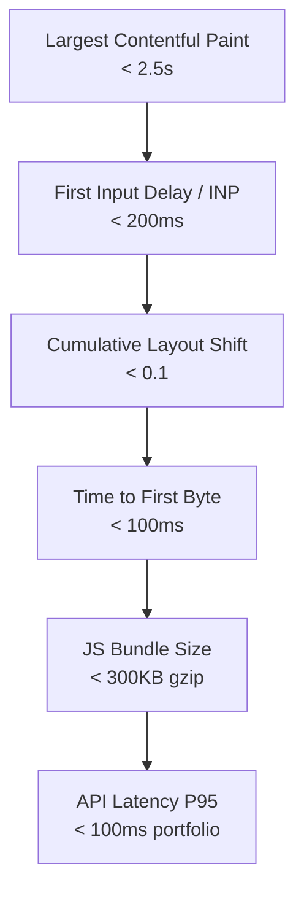

# Performance Review Checklist

> **Purpose:** Systematically verify that the application meets performance budgets, identifies regressions, and maintains a fast, responsive user experience.
> **Audience:** Frontend Lead, Backend Lead, QA Engineers, DevOps Lead
> **Owner:** Principal Engineer
> **Dependencies:** [PERFORMANCE-BENCHMARKS.md](../15-performance/PERFORMANCE-BENCHMARKS.md) | [BUNDLE-ANALYSIS.md](../15-performance/BUNDLE-ANALYSIS.md) | [SCALABILITY-STRATEGY.md](../15-performance/SCALABILITY-STRATEGY.md) | [PERFORMANCE-BUDGET.md](../quality/performance-budget.md) | [PERFORMANCE-OPTIMIZATION.md](../quality/PerformanceOptimization.md) | [CACHE-ARCHITECTURE.md](../api/49-CACHE-ARCHITECTURE.md)
> **Status:** Active | **Review Frequency:** Quarterly

---

## Performance Review Flow

---

## Bundle Size Audit

| # | Item | Description | Owner | Status |
|---|------|-------------|-------|--------|
| 1 | Bundle analyzer run | `ANALYZE=true npm run build` executed; report reviewed for the primary entry point. | Frontend Lead | [ ] |
| 2 | Initial JS bundle within budget | Total JS (gzipped) for the home page < 300 KB initial, < 500 KB total. | Frontend Lead | [ ] |
| 3 | Three.js lazy-loaded | Three.js / R3F loaded only when hero section intersects viewport; not in critical path. | Frontend Lead | [ ] |
| 4 | Monaco editor on-demand | Monaco Editor loaded only on `/admin/sandbox` route; excluded from main bundle. | Frontend Lead | [ ] |
| 5 | Tiptap admin-only | Tiptap editor chunk loaded only on admin content pages; verified via network tab. | Frontend Lead | [ ] |
| 6 | No duplicate dependencies | `npm ls` checked for duplicate packages; no duplicated React, Next.js, or Three.js versions. | Frontend Lead | [ ] |
| 7 | Tree-shaking effective | Unused exports removed from bundle; no unexpected large modules in production build. | Frontend Lead | [ ] |

## Lighthouse & Core Web Vitals

| # | Item | Description | Owner | Status |
|---|------|-------------|-------|--------|
| 8 | Lighthouse Performance ≥ 90 | Desktop and mobile Lighthouse performance score ≥ 90 on all page templates. | QA Lead | [ ] |
| 9 | Lighthouse Accessibility ≥ 90 | Accessibility score ≥ 90; zero automatic axe-core violations. | QA Lead | [ ] |
| 10 | LCP < 2.5s | Largest Contentful Paint (75th percentile, mobile) under 2.5 seconds. | Frontend Lead | [ ] |
| 11 | INP < 200ms | Interaction to Next Paint (75th percentile) under 200 milliseconds. | Frontend Lead | [ ] |
| 12 | CLS < 0.1 | Cumulative Layout Shift score under 0.1; no layout shifts from late-loading content. | Frontend Lead | [ ] |
| 13 | FCP < 1.8s | First Contentful Paint under 1.8 seconds on 3G throttled mobile. | Frontend Lead | [ ] |
| 14 | TBT < 200ms | Total Blocking Time under 200ms; no long tasks on main thread. | Frontend Lead | [ ] |

## API Response Times

| # | Item | Description | Owner | Status |
|---|------|-------------|-------|--------|
| 15 | Portfolio endpoints P95 < 100ms | Public (cached) portfolio endpoints respond within 100ms at P95. | Backend Lead | [ ] |
| 16 | Admin endpoints P95 < 200ms | Authenticated admin CRUD endpoints respond within 200ms at P95. | Backend Lead | [ ] |
| 17 | No N+1 queries | All Prisma queries use `include` or `select` with proper relation loading; no lazy-load N+1. | Backend Lead | [ ] |
| 18 | Query execution time < 50ms | P95 database query execution under 50ms; `EXPLAIN ANALYZE` reviewed for new queries. | Backend Lead | [ ] |
| 19 | API pagination enforced | List endpoints enforce pagination (default page size ≤ 50); no unbounded result sets. | Backend Lead | [ ] |

## Database Query Performance

| # | Item | Description | Owner | Status |
|---|------|-------------|-------|--------|
| 20 | Slow query log reviewed | `pg_stat_statements` or Supabase query performance reviewed; no queries > 200ms. | Backend Lead | [ ] |
| 21 | Index coverage verified | `EXPLAIN` shows index scans (not sequential scans) on all frequent query patterns. | Backend Lead | [ ] |
| 22 | Missing indexes identified | `pg_stat_user_indexes` checked; no missing indexes on foreign key or filter columns. | Backend Lead | [ ] |
| 23 | Connection pool within limits | Supabase connection pool at < 80% capacity; no connection starvation. | Backend Lead | [ ] |
| 24 | Migration index impact assessed | New migrations reviewed for index bloat or unused index creation. | Backend Lead | [ ] |

## Caching Strategy

| # | Item | Description | Owner | Status |
|---|------|-------------|-------|--------|
| 25 | ISR revalidation configured | Portfolio pages use ISR with appropriate `revalidate` intervals (home: 60s, content: 300s). | Frontend Lead | [ ] |
| 26 | API response caching active | Portfolio controller endpoints use `@CacheTTL`; cache headers returned in response. | Backend Lead | [ ] |
| 27 | CDN cache hit ratio > 80% | Vercel edge cache hit ratio above 80% for static assets and ISR pages. | DevOps Lead | [ ] |
| 28 | Cache invalidation verified | Content update triggers cache purge; stale content not served beyond revalidation window. | QA Lead | [ ] |
| 29 | No cache on authenticated routes | Admin API responses have `Cache-Control: no-store`; no cached auth data. | Backend Lead | [ ] |

## Image & Asset Optimization

| # | Item | Description | Owner | Status |
|---|------|-------------|-------|--------|
| 30 | Next.js Image component used | All images use `next/image` with `width`/`height` to prevent layout shift. | Frontend Lead | [ ] |
| 31 | WebP/AVIF formats served | Modern image formats served with fallback; verified via browser DevTools network tab. | Frontend Lead | [ ] |
| 32 | Responsive images configured | `sizes` attribute and `srcSet` generated by Next.js; correct image size served per viewport. | Frontend Lead | [ ] |
| 33 | LQIP/blur placeholder active | Above-the-fold images use blur-data-URL placeholders; no blank spaces during load. | Frontend Lead | [ ] |
| 34 | Image CDN configured | Images served via Vercel Image Optimization or external CDN; origin server not hit for images. | Frontend Lead | [ ] |

## Code Splitting & Animation Performance

| # | Item | Description | Owner | Status |
|---|------|-------------|-------|--------|
| 35 | Route-based code splitting effective | Each route loads only its own chunks; no route-level code leakage confirmed. | Frontend Lead | [ ] |
| 36 | Dynamic imports used for heavy components | Three.js scene, Monaco editor, Tiptap, and admin dashboard use `next/dynamic`. | Frontend Lead | [ ] |
| 37 | Animation frame rate stable | Three.js / R3F scene maintains 60 FPS on target devices; `Stats.js` panel reviewed. | Frontend Lead | [ ] |
| 38 | `prefers-reduced-motion` respected | Animations disabled or reduced when user preference is set; verified via DevTools emulation. | Frontend Lead | [ ] |
| 39 | No JS animation jank | GSAP/Framer Motion animations show no frame drops; `requestAnimationFrame` scheduling checked. | Frontend Lead | [ ] |

## Network & Memory

| # | Item | Description | Owner | Status |
|---|------|-------------|-------|--------|
| 40 | Network request waterfall clean | No render-blocking resources; critical CSS inlined, non-critical deferred. | Frontend Lead | [ ] |
| 41 | Total page weight < 1MB | Total transferred page weight (HTML + JS + CSS + images) under 1 MB for initial load. | Frontend Lead | [ ] |
| 42 | Memory heap stable | No memory leaks in SPA client-side navigation; heap snapshots show stable growth. | Frontend Lead | [ ] |
| 43 | WebSocket connections cleaned | AI chat connections close properly; no orphaned WebSocket connections in Performance tab. | Frontend Lead | [ ] |
| 44 | Compression enabled | Brotli compression confirmed on all text-based responses via `Content-Encoding` header. | DevOps Lead | [ ] |

---

## Cross-References

| Document | Location | Relationship |
|----------|----------|--------------|
| Performance Benchmarks | `../15-performance/PERFORMANCE-BENCHMARKS.md` | Baseline metrics and quarter-over-quarter tracking |
| Bundle Analysis | `../15-performance/BUNDLE-ANALYSIS.md` | Detailed bundle composition, code-splitting strategy |
| Scalability Strategy | `../15-performance/SCALABILITY-STRATEGY.md` | Horizontal/vertical scaling, caching layers, sharding |
| Performance Budget | `../quality/performance-budget.md` | Budget thresholds for bundles, LCP, TBT, CLS |
| Performance Optimization | `../quality/PerformanceOptimization.md` | Optimization techniques and implementation guidance |
| Cache Architecture | `../api/49-CACHE-ARCHITECTURE.md` | ISR, response cache, CDN cache strategy |
| Performance Testing | `../quality/PerformanceTesting.md` | Load testing methodology, k6 scripts, stress testing |
| DORA Metrics | `../operations/dora-metrics.md` | Deployment frequency, lead time, change failure rate |

---

*Last updated: July 2026. Review quarterly or before any major release.*
