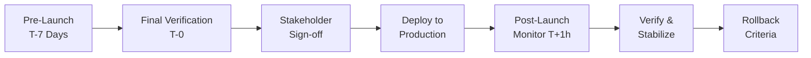

# Production Go-Live Checklist

> **Document:** `29-checklists/PRODUCTION-GO-LIVE-CHECKLIST.md` | **Version:** 1.0 | **Last Updated:** July 2026
> **Status:** ✅ Active | **Owner:** Architecture Lead | **Related:** [LaunchPlan.md](../operations/LaunchPlan.md)

---

## Go-Live Workflow

---

## Pre-Launch (T-7 Days)

### DNS & Networking
- [ ] **DNS records configured** — `A`/`CNAME` records for `portfolio.com` and `www.portfolio.com` point to Vercel's edge network.
- [ ] **DNS propagation verified** — `dig`/`nslookup` resolves to expected Vercel IPs across multiple resolvers.
- [ ] **SSL certificates issued and verified** — Auto-provisioned via Vercel or LetsEncrypt; no browser warnings.
- [ ] **CORS origins whitelisted** — `CORS_ORIGIN` env var includes `https://portfolio.com`, `https://www.portfolio.com`, and `http://localhost:3000` (dev).

### Infrastructure
- [ ] **Database migrations run and verified** — `npm run prisma:migrate:deploy` applied cleanly against production Supabase; schema matches staging.
- [ ] **All environment variables set** in Vercel (frontend), Docker/NestJS (API), and Docker/FastAPI (AI). Verified with `printenv`-style health check.
- [ ] **CDN configured** — Vercel edge network active; ISR cache purge mechanism tested.
- [ ] **Rate limiting configured** — Global `ThrottlerGuard` at 100 req/min per IP; stricter limits on auth routes (10 req/min) and contact form (5 req/min).
- [ ] **Redis connection verified** — BullMQ queues (email, notifications) connect and process test jobs.

### Monitoring & Observability
- [ ] **Sentry DSN configured** — Test error sent via health endpoint; error appears in Sentry dashboard within 30s.
- [ ] **PostHog configured** — Test event received and visible in PostHog live events view.
- [ ] **Pino logging verified** — Structured JSON logs flowing; log level set to `info` in production.

### External Services
- [ ] **Email service (Resend) configured** — Test email sent from contact form; received within 60s.
- [ ] **AI provider API keys configured** — OpenAI/Anthropic keys valid; test prompt returns expected response.
- [ ] **OAuth providers configured** — Google and GitHub OAuth apps registered; redirect URIs point to production (`https://api.portfolio.com/api/admin/auth/*`).

### Backup & Recovery
- [ ] **Backup system verified** — Automated daily Supabase backup enabled; manual pg_dump tested and restorable.
- [ ] **Rollback plan documented** — Steps in LaunchPlan.md; team has reviewed and practiced.

---

## Launch Day (T-0)

### Deployment
- [ ] **Final database backup taken** — `pg_dump` completed; backup file checksummed and stored off-site.
- [ ] **All services deployed to production** — Frontend (Vercel), API (Docker/ghcr.io), AI (Docker/ghcr.io). CI pipeline green on `main`.
- [ ] **Health check endpoints returning 200** — `/api/health` (NestJS), `/health` (FastAPI), Vercel status page.

### Verification
- [ ] **Smoke tests passed** — All critical user flows verified:
  - Portfolio landing page loads with 3D scene and content.
  - Contact form submits successfully; email notification received.
  - AI chat opens, accepts input, and streams response.
  - Admin login works (email + Google + GitHub OAuth).
  - Content CRUD operations (create/edit/delete project, blog post, section).
- [ ] **SSL certificate verified** — No browser warnings on any subdomain.
- [ ] **Custom domain returns 200** — `https://portfolio.com`, `https://www.portfolio.com`, `https://api.portfolio.com`.

### Delivery & Analytics
- [ ] **Email delivery verified** — Contact form email, password reset, welcome emails all deliverable (no spam folder).
- [ ] **AI chat responds correctly** — QA script of 5 test prompts returns coherent, context-aware responses.
- [ ] **Admin login works** — All three OAuth providers (Google, GitHub, email/password) tested.
- [ ] **Analytics events firing correctly** — Page views, form submissions, chat initiations appear in PostHog within 30s.

### Performance & Alerts
- [ ] **CDN cache warming initiated** — Key pages (home, projects, about) pre-cached via curl requests from multiple regions.
- [ ] **Monitoring dashboards verified** — Sentry, PostHog, Better Uptime dashboards show live data.
- [ ] **Alerts configured and test-triggered** — Slack/PagerDuty alert fires for test error and test downtime.

---

## Post-Launch (T+1 Hour)

- [ ] **Performance metrics within budget** — Lighthouse >= 95 all pages, LCP < 1.5s, CLS < 0.1.
- [ ] **Error rates below threshold** — < 0.1% error rate on API and frontend (Sentry verified).
- [ ] **No 4xx/5xx spikes** — Vercel analytics and Sentry show baseline traffic only.
- [ ] **Database connections normal** — Supabase dashboard shows < 20 concurrent connections; no slow queries.
- [ ] **API response times normal** — P95 < 200ms for admin endpoints, < 100ms for portfolio (cached).
- [ ] **Backup job ran successfully** — First automated backup completed and verified.

---

## Rollback Criteria

| Condition | Threshold | Action |
|-----------|-----------|--------|
| **Error rate** | > 5% for > 5 minutes | Rollback immediately |
| **P95 API latency** | > 500ms for > 10 minutes | Rollback immediately |
| **Security vulnerability** | Confirmed (any severity) | Rollback immediately |
| **Critical feature broken** | > 50% of smoke tests fail | Rollback immediately |
| **Database corruption** | Any confirmed data loss | Restore from backup |
| **Auth failure** | Any OAuth provider unavailable > 15 min | Rollback to previous release |

### Rollback Procedure

1. Revert `main` branch to last known good commit: `git revert HEAD --no-commit && git push`.
2. Re-deploy frontend via Vercel rollback (one-click in Vercel dashboard).
3. Re-deploy API container using previous tag: `docker pull ghcr.io/portfolio/api:<previous-tag>`.
4. Re-run database rollback migration (if schema changed): `npm run prisma:migrate:deploy -- --to <previous-migration>`.
5. Verify health check endpoints return 200.
6. Run smoke tests.
7. Notify team via Slack.

---

*Last updated: July 2026. Review before every production deployment.*

---

## Cross-References

| Reference | Description |
|-----------|-------------|
| [MASTER-INDEX.md](../MASTER-INDEX.md) | Documentation master index |
| [CROSS-REFERENCE-INDEX.md](../26-reference/CROSS-REFERENCE-INDEX.md) | Cross-reference mapping |
| [LaunchPlan.md](../21-operations/LAUNCH-PLAN.md) | Launch plan reference |
| [PRODUCTION-READINESS.md](../21-operations/PRODUCTION-READINESS.md) | Production readiness review |
| [DeploymentGuide.md](../12-devops/DEPLOYMENT-GUIDE.md) | Deployment guide |
| [SecurityHardening.md](../11-security/SECURITY-HARDENING.md) | Security hardening plan |
| [ReleaseChecklist.md](../21-operations/RELEASE-CHECKLIST.md) | Release checklist |
