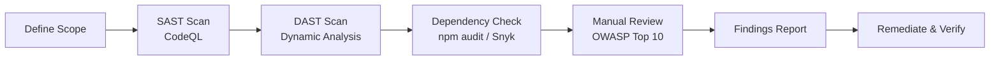

# Security Audit Checklist

> **Purpose:** Comprehensive security verification covering OWASP Top 10, dependency integrity, authentication/authorization hardening, API security, and infrastructure posture.
> **Audience:** Security Lead, DevOps Lead, Backend Lead, Engineering Lead
> **Owner:** Principal Security Architect
> **Dependencies:** [SECURITY-ARCHITECTURE.md](../11-security/SECURITY-ARCHITECTURE.md) | [SECURITY-REVIEW-CHECKLIST.md](./SECURITY-REVIEW-CHECKLIST.md) | [THREAT-MODEL.md](../11-security/THREAT-MODEL.md) | [OWASP-ASVS-MAPPING.md](../11-security/owasp-asvs-mapping.md) | [COMPLIANCE-MATRIX.md](../36-enterprise/COMPLIANCE-MATRIX.md) | [SECRETS-MANAGEMENT.md](../11-security/SecretsManagement.md) | [SUPPLY-CHAIN-SECURITY.md](../11-security/supply-chain-security-policy.md)
> **Standards:** OWASP Top 10:2025, OWASP ASVS L3, SOC 2, CIS Benchmarks
> **Status:** Active | **Review Frequency:** Quarterly

---

## Security Audit Workflow

---

## A. OWASP Top 10 Verification

| # | Item | Description | Owner | Status |
|---|------|-------------|-------|--------|
| 1 | A01 — Broken Access Control | Verify RBAC enforcement on all admin routes; no IDOR vulnerabilities via parameter tampering. | Backend Lead | [ ] |
| 2 | A02 — Cryptographic Failures | TLS 1.3 enforced; no weak ciphers; passwords hashed with bcrypt (cost ≥ 12). | Security Lead | [ ] |
| 3 | A03 — Injection | All SQL queries parameterized; no raw string concatenation; XSS sanitization on user content. | Backend Lead | [ ] |
| 4 | A04 — Insecure Design | Rate limiting on auth/contact endpoints; no business logic flaws identified in threat model. | Security Lead | [ ] |
| 5 | A05 — Security Misconfiguration | Helmet headers, CORS, CSP verified; no default credentials; debug endpoints disabled. | DevOps Lead | [ ] |
| 6 | A06 — Vulnerable Components | `npm audit`, `ghcr.io` image scans, and Snyk reports zero high/critical vulnerabilities. | DevOps Lead | [ ] |
| 7 | A07 — Auth & Session Mgmt | JWT expiry ≤ 15 min; refresh tokens rotated; MFA enforced for admin accounts. | Security Lead | [ ] |
| 8 | A08 — Software & Data Integrity | CI/CD pipeline signed artifacts; `package-lock.json` integrity verified; no supply-chain tampering. | DevOps Lead | [ ] |
| 9 | A09 — Security Logging Failures | Audit logging on all mutations; Sentry error tracking active; logs include correlation IDs. | Security Lead | [ ] |
| 10 | A10 — SSRF | Outbound HTTP requests restricted; URL validation on webhook/fetch endpoints; no internal network access from API. | Backend Lead | [ ] |

## B. Dependency & Supply Chain Security

| # | Item | Description | Owner | Status |
|---|------|-------------|-------|--------|
| 11 | `npm audit` clean | All direct and transitive dependencies have zero high/critical severity advisories. | DevOps Lead | [ ] |
| 12 | Snyk/CodeQL scan passed | Snyk monitoring active; no open SAST findings above medium severity. | Security Lead | [ ] |
| 13 | Dependency freshness reviewed | Outdated packages (> 6 months behind latest) identified and scheduled for update. | DevOps Lead | [ ] |
| 14 | License compliance verified | All dependencies have OSSI-approved licenses; no GPLv3 in non-GPL codebase. | Legal/Owner | [ ] |
| 15 | Lockfile integrity maintained | `package-lock.json` committed and reviewed; no unexpected sub-dependency changes. | DevOps Lead | [ ] |
| 16 | Docker base image scanned | `ghcr.io` base images (Node, Python) scanned with Trivy; no critical CVEs. | DevOps Lead | [ ] |

## C. Secret & Credential Management

| # | Item | Description | Owner | Status |
|---|------|-------------|-------|--------|
| 17 | No secrets in source code | `trufflehog` scan passes against entire repository; no API keys, tokens, or passwords in git history. | Security Lead | [ ] |
| 18 | All secrets in environment variables | Connection strings, API keys, JWT secrets loaded from env vars; no hardcoded defaults. | Backend Lead | [ ] |
| 19 | Secrets rotation schedule on track | All secrets rotated within their defined cadence; rotation log reviewed. | Security Lead | [ ] |
| 20 | No secrets in logs or error pages | Pino logger redacts sensitive fields; Sentry scrubs PII and credentials before transmission. | Backend Lead | [ ] |
| 21 | Encryption keys rotated | Encryption-at-rest keys (if applicable) rotated per policy; key management procedure documented. | Security Lead | [ ] |

## D. Authentication & Authorization

| # | Item | Description | Owner | Status |
|---|------|-------------|-------|--------|
| 22 | JWT auth guard on all admin routes | `@UseGuards(JwtAuthGuard)` applied to every admin controller; no unguarded mutation endpoints. | Backend Lead | [ ] |
| 23 | RBAC enforced per operation | `@Roles('admin', 'editor', 'viewer')` on each admin route; least-privilege verified. | Backend Lead | [ ] |
| 24 | OAuth providers functional | Google and GitHub OAuth flows tested; redirect URIs point to production only. | Backend Lead | [ ] |
| 25 | MFA enforced for admin accounts | All admin users have MFA enabled; no admin account without second factor. | Security Lead | [ ] |
| 26 | Session timeout enforced | Access tokens expire in ≤ 15 min; refresh tokens expire in ≤ 7 days. | Backend Lead | [ ] |
| 27 | Brute force protection active | Auth endpoints throttled at 10 req/min per IP; account lockout after 5 failed attempts. | Backend Lead | [ ] |

## E. API Security

| # | Item | Description | Owner | Status |
|---|------|-------------|-------|--------|
| 28 | Input validation via Zod/NestJS pipes | All request bodies validated via DTOs with class-validator; Zod schemas enforce shapes at boundaries. | Backend Lead | [ ] |
| 29 | CORS origin whitelist correct | `CORS_ORIGIN` contains only production domains; no `*` or `null` origin allowed. | DevOps Lead | [ ] |
| 30 | Rate limiting enacted globally | `ThrottlerGuard` active globally (100 req/min/IP); stricter limits on auth (10) and contact (5). | Backend Lead | [ ] |
| 31 | API versioning consistent | All endpoints prefixed with `/api/v1`; deprecated versions sunset or scheduled. | Backend Lead | [ ] |
| 32 | No sensitive data in responses | Passwords, tokens, PII excluded from API response bodies; `transform` options strip sensitive fields. | Backend Lead | [ ] |
| 33 | OpenAPI spec accurate | `openapi.json` reflects actual endpoints, schemas, and auth requirements; no undocumented endpoints. | Backend Lead | [ ] |

## F. Security Headers & Network

| # | Item | Description | Owner | Status |
|---|------|-------------|-------|--------|
| 34 | CSP header restrictive | `Content-Security-Policy` restricts `script-src`, `style-src`, `connect-src` to approved origins; no `unsafe-inline`. | DevOps Lead | [ ] |
| 35 | HSTS header present | `Strict-Transport-Security: max-age=31536000; includeSubDomains; preload` on all responses. | DevOps Lead | [ ] |
| 36 | X-Frame-Options DENY | `X-Frame-Options: DENY` prevents clickjacking; no admin pages embeddable in iframes. | DevOps Lead | [ ] |
| 37 | X-Content-Type-Options nosniff | `X-Content-Type-Options: nosniff` set; MIME-type sniffing disabled. | DevOps Lead | [ ] |
| 38 | Referrer-Policy set | `Referrer-Policy: strict-origin-when-cross-origin` configured on all routes. | DevOps Lead | [ ] |
| 39 | Permissions-Policy restrictive | Camera, microphone, geolocation APIs disabled by default via `Permissions-Policy` header. | DevOps Lead | [ ] |

## G. Data Protection & Database

| # | Item | Description | Owner | Status |
|---|------|-------------|-------|--------|
| 40 | Encryption at rest enabled | Supabase database uses AES-256 encryption at rest; verified in Supabase project settings. | Security Lead | [ ] |
| 41 | RLS policies verified | Row-Level Security enabled on all tables with user data; policies tested with attacker-like queries. | Backend Lead | [ ] |
| 42 | Supabase buckets private | Storage buckets not publicly accessible; file access via signed URLs with expiry. | Backend Lead | [ ] |
| 43 | PII data classified per policy | Data classification labels applied; PII fields identified and access-restricted. | Security Lead | [ ] |
| 44 | Audit trail on data mutations | All mutations use `@Audit()` decorator; audit log stored in separate table with append-only access. | Backend Lead | [ ] |

## H. Infrastructure & Cloud

| # | Item | Description | Owner | Status |
|---|------|-------------|-------|--------|
| 45 | WAF rules active | Cloudflare WAF blocking OWASP Top 10 attack patterns; rate limiting rule active at edge. | DevOps Lead | [ ] |
| 46 | DDoS protection configured | Cloudflare DDoS mitigation enabled on all proxied DNS records. | DevOps Lead | [ ] |
| 47 | Firewall restricts DB access | Supabase database accessible only from API service IPs; no public DB access. | DevOps Lead | [ ] |
| 48 | CI/CD pipeline secrets scoped | CI secrets limited to least privilege; no production secrets in PR builds. | DevOps Lead | [ ] |
| 49 | Container security context set | API/AI containers run as non-root user; read-only root filesystem. | DevOps Lead | [ ] |

---

## Findings Log

| # | Severity | Finding | Remediation | Owner | Due Date | Status |
|---|----------|---------|-------------|-------|----------|--------|
| — | — | — | — | — | — | — |

---

## Cross-References

| Document | Location | Relationship |
|----------|----------|--------------|
| Security Architecture | `../11-security/SECURITY-ARCHITECTURE.md` | Full defense-in-depth architecture across 10 domains |
| Security Review Checklist | `../29-checklists/SECURITY-REVIEW-CHECKLIST.md` | Per-PR and pre-deploy security gates |
| Threat Model | `../11-security/THREAT-MODEL.md` | STRIDE threat model, attack surface analysis |
| OWASP ASVS Mapping | `../11-security/owasp-asvs-mapping.md` | Detailed ASVS L2/L3 control mapping |
| Compliance Matrix | `../36-enterprise/COMPLIANCE-MATRIX.md` | Cross-walk of GDPR, SOC 2, ISO 27001, OWASP |
| Secrets Management | `../11-security/SecretsManagement.md` | Secrets lifecycle, rotation schedules, vault integration |
| Supply Chain Security | `../11-security/supply-chain-security-policy.md` | Dependency vetting, lockfile integrity, SBOM generation |
| Vulnerability Management | `../11-security/vulnerability-management-policy.md` | CVE triage SLAs, patch cadence, disclosure process |
| NIST CSF Mapping | `../11-security/nist-csf-mapping.md` | NIST Cybersecurity Framework control mapping |
| SOC 2 Readiness | `../36-enterprise/SOC2-READINESS.md` | SOC 2 control mapping (security, availability, confidentiality) |

---

*Last updated: July 2026. Run full audit quarterly; run pre-deploy subset per release.*
