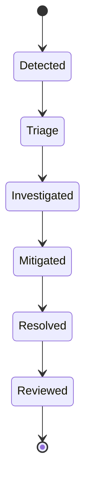

# Incident Management

## 1. Overview

This document outlines the standard operating procedure for handling critical incidents in the Ultimate Portfolio production environment. Our goal is to restore service as quickly as possible, communicate effectively, and learn from every failure via blameless post-mortems.

## 2. Incident Roles

During a SEV-1 or SEV-2 incident, the following roles are established:

- **Incident Commander (IC)**: The single point of authority. They do NOT debug the code. Their job is to coordinate the response, make high-level decisions (e.g., "Roll back the deployment"), and keep the team focused.
- **Subject Matter Expert (SME) / Responder**: The engineers actively investigating logs, metrics, and code to mitigate the issue.
- **Communications Lead**: Responsible for internal stakeholder updates and external status page updates. (Often handled by the IC in smaller teams).

## 3. The Incident Lifecycle

### Phase 1: Detection & Declaration

1. An alert fires via PagerDuty, or a critical issue is reported by a user/stakeholder.
2. The on-call engineer assesses the severity using the definitions in `AlertingStrategy.md`.
3. If it is SEV-1 or SEV-2, the engineer declares an incident using the Slack bot: `/incident start "Title of issue"`.
4. This automatically creates a dedicated Slack channel (e.g., `#inc-123-db-outage`), starts a Google Meet bridge, and pages secondary on-call if needed.

### Phase 2: Response & Mitigation

1. **Join the Bridge**: All responders join the dedicated Slack channel and Meet bridge.
2. **Handoff**: The engineer who declared the incident gives a 30-second summary to the IC.
3. **Investigation**: SMEs consult Datadog, Sentry, and Runbooks to identify the root cause.
4. **Mitigation First**: The immediate goal is to restore service, NOT to write a permanent bug fix. Mitigation strategies include:
   - Rolling back the last deployment.
   - Flipping a feature flag to disable a broken feature.
   - Scaling up database capacity.
   - Blocking abusive IP addresses.

### Phase 3: Communication

- **Internal**: The IC posts a brief status update in the main `#engineering` channel every 30 minutes for SEV-1, and every 60 minutes for SEV-2.
- **External**: If user-facing, the Communications Lead updates the external Status Page (e.g., status.portfolio.com) with standard templates ("We are currently investigating reports of...", "A fix has been implemented and we are monitoring the results...").

### Phase 4: Resolution

1. Once metrics return to normal baseline and the system is stable for at least 15 minutes, the IC declares the incident resolved.
2. Status pages are updated to "Resolved".
3. The Slack channel is archived, and the Post-Incident Review phase begins.

## 5. Incident Lifecycle Diagram

## 4. Post-Incident Review (PIR)

Within 48 hours of a SEV-1 or SEV-2 incident, a **Blameless Post-Mortem** meeting is held.

**Principles of a Blameless PIR:**

- We assume everyone did the best they could with the information they had at the time.
- We focus on systemic failures, tooling gaps, and process improvements, NOT individual mistakes.

**PIR Document Structure:**

1. **Summary**: High-level overview of what happened.
2. **Timeline**: Exact chronological sequence of events (detection, mitigation steps, resolution). Include timezone.
3. **Impact**: How many users were affected? What features were broken?
4. **Root Cause Analysis (5 Whys)**: Drill down into the technical cause.
5. **Action Items**: Jira tickets created to prevent recurrence. Must be assigned to a specific person with a deadline. Categories include:
   - _Fix_: Permanent code fix for the bug.
   - _Detect_: Improve alerting so we catch it sooner next time.
   - _Mitigate_: Automate the mitigation or update the Runbook.

## Cross-References

- [MASTER-INDEX.md](../MASTER-INDEX.md) — Documentation master index
- [CROSS-REFERENCE-INDEX.md](../26-reference/CROSS-REFERENCE-INDEX.md) — Cross-reference system
