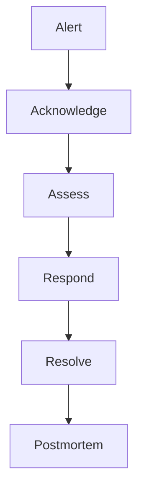

# Incident Response Plan

## 1. Purpose

This Incident Response (IR) Plan establishes the procedures and responsibilities for responding to security incidents within the Ultimate Portfolio infrastructure. The goal is to detect, contain, eradicate, and recover from security breaches rapidly to minimize impact.

## 2. Roles and Responsibilities

- **Incident Commander (IC):** Leads the response effort, makes critical decisions, and coordinates the team.
- **Lead Investigator:** Directs technical analysis, forensics, and remediation efforts (typically the Lead Backend/Security Engineer).
- **Communications Lead:** Manages internal and external communications regarding the incident.

## 3. Incident Severity Levels

- **Severity 1 (Critical):** Active exploitation resulting in major data breach, complete system unavailability, or compromise of admin accounts. (Response: Immediate, 24/7).
- **Severity 2 (High):** Targeted attacks, leakage of non-critical data, or degradation of critical services (e.g., API offline). (Response: < 1 hour).
- **Severity 3 (Medium):** Isolated security events, such as excessive failed logins or minor vulnerabilities discovered. (Response: Next business day).
- **Severity 4 (Low):** Anomalous activity, port scans, or general security queries.

## 4. Phases of Incident Response

### Phase 1: Preparation

- Maintain updated architectural diagrams and threat models.
- Ensure audit logging is active and accessible.
- Regularly review and practice this IR plan.

### Phase 2: Identification

- Detect anomalies via monitoring tools, alerts, or user reports.
- The Lead Investigator validates whether the event constitutes a security incident and assigns a Severity Level.
- Open a dedicated secure communication channel (e.g., a specific Slack channel or war room).

### Phase 3: Containment

_Stop the bleeding._

- **Short-term:** Isolate compromised systems (e.g., block offending IP addresses at the WAF, revoke compromised JWTs, disable the affected API endpoint).
- **Long-term:** Apply temporary patches, rotate potentially compromised secrets (Supabase keys, LLM API keys), and rebuild compromised infrastructure from known-good IaC templates.

### Phase 4: Eradication

- Identify the root cause (e.g., vulnerable dependency, misconfigured RLS policy).
- Remove the vulnerability (deploy patch, update configuration).
- Scan systems to ensure all traces of the threat actor are removed.

### Phase 5: Recovery

- Restore services to normal operation.
- Monitor the network closely for 48 hours for any signs of recurrence.
- Verify data integrity if the database was targeted.

### Phase 6: Lessons Learned (Post-Mortem)

- Within 5 days of incident closure, hold a blameless post-mortem meeting.
- Document what happened, what was done well, and what failed.
- Create actionable tasks (Jira/Linear tickets) to improve defenses and update the Risk Register.

## 6. Response Workflow Diagram

## 5. Specific Playbooks

### 5.1 Credential / Secret Leak Playbook

1. Identify the leaked secret.
2. Immediately revoke the secret at the source (e.g., regenerate Supabase JWT secret, roll OpenAI API keys).
3. Update the Secrets Manager with the new secret.
4. Restart Next.js, NestJS, and FastAPI services to pick up the new secret.
5. Review logs to determine if the leaked secret was actively exploited.

### 5.2 Ransomware / Data Destruction Playbook

1. Disconnect the database from external access.
2. Verify the integrity of the latest Supabase Point-in-Time Recovery (PITR) backup.
3. Assess the extent of the damage.
4. Restore the database to the most recent clean state.
5. Identify and patch the vulnerability that allowed unauthorized write access.

## Cross-References

- [MASTER-INDEX.md](../MASTER-INDEX.md) — Documentation master index
- [CROSS-REFERENCE-INDEX.md](../26-reference/CROSS-REFERENCE-INDEX.md) — Cross-reference system
