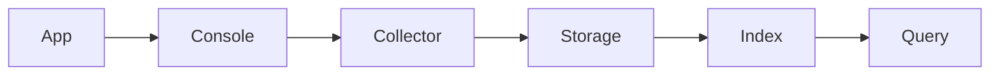

# Logging Architecture — FAANG Enterprise Centralized Telemetry

> **Document:** `Logging.md` | **Version:** 5.0 (Enterprise Upgrade) | **Last Updated:** July 2026  
> **Status:** ✅ Active | **Owner:** Principal DevOps Architect | **Review Cadence:** Quarterly

## 1. Executive Summary
The Logging Strategy for the Ultimate Portfolio project defines the FAANG-grade approach for generating, collecting, storing, and analyzing log data across the entire distributed architecture. This ensures high observability, faster debugging, and comprehensive audit trails while maintaining security, compliance, and performance, with deep integration for AI telemetry and LLM transaction logging.

## 2. Architecture & Tooling
We employ a centralized logging architecture to aggregate logs from our polyglot services:

* **Next.js 14 Frontend & Admin Dashboard**: Client-side logs are captured via Datadog RUM (Real User Monitoring) and Sentry. Server-side rendering (SSR) logs are outputted to the standard stream and aggregated.
* **NestJS Backend**: Uses `nestjs-pino` for highly performant, structured JSON logging.
* **FastAPI AI Service**: Utilizes Python's standard `logging` library configured with `pythonjsonlogger` for structured JSON output.
* **Log Aggregation**: All logs are shipped to **Datadog** for centralized indexing, alerting, and analysis.

## 3. Structured Logging
All services MUST output logs in structured JSON format. This allows for efficient querying and dashboarding in Datadog.

### 3.1 Standard Log Schema
Every log entry must contain the following standard fields:
* `timestamp`: ISO 8601 formatted timestamp (e.g., `2024-03-15T12:00:00.000Z`)
* `level`: Log level string (e.g., `INFO`, `ERROR`)
* `service`: Name of the service (e.g., `portfolio-web`, `portfolio-api`, `portfolio-ai`)
* `environment`: Deployment environment (`production`, `staging`, `development`)
* `trace_id`: Distributed trace identifier (W3C Trace Context) to link logs to traces.
* `span_id`: The specific operation span identifier.
* `message`: Human-readable description of the event.

### 3.2 Contextual Fields (When Applicable)
* `user_id`: Authenticated user's ID (anonymized/hashed if required).
* `req_id`: HTTP Request ID.
* `path`: HTTP Request Path.
* `method`: HTTP Method.
* `duration_ms`: Duration of the operation in milliseconds.

## 4. Log Levels
We adhere to standard log levels. Developers must use the appropriate level to avoid log noise and ensure critical issues are highlighted.

* **FATAL**: System is completely unusable (e.g., Database connection permanently lost). Triggers immediate SEV-1 alerts.
* **ERROR**: A specific operation failed, but the system remains up (e.g., Third-party API failure, unhandled exception). Triggers alerts.
* **WARN**: Expected anomalies or degraded performance (e.g., API rate limit approaching, deprecated endpoint accessed).
* **INFO**: Normal operational events (e.g., Service started, user logged in, cron job completed).
* **DEBUG**: Detailed information for troubleshooting (e.g., specific branching logic taken). Disabled in production by default.
* **TRACE**: Extremely detailed flow tracking. Used only in local development.

## 5. Security & Data Privacy
Protecting user data is paramount.
* **PII/PHI Redaction**: Personally Identifiable Information (emails, passwords, API keys, tokens) MUST be redacted before the log is written. We use Pino's redaction features in NestJS and custom formatters in FastAPI.
* **No Secrets in Logs**: Credentials, JWTs, and Supabase service keys must never be logged.

## 6. Log Retention Policy
To balance cost and compliance, log retention in Datadog is configured as follows:
* **Production Logs**: 15 days indexed (for immediate troubleshooting), 13 months archived in cold storage (AWS S3/GCS) for compliance and auditing.
* **Staging/Dev Logs**: 7 days indexed, no long-term archival.

## 8. Log Pipeline Diagram

## 7. Developer Guidelines
* **Do not use `console.log` in production code.** Use the provided logger instance.
* **Log the "Why", not just the "What".** Include relevant state variables in the JSON payload, not concatenated into the message string.
* **Catch and Log:** Always log errors in `catch` blocks with the original error object attached to preserve stack traces.

## Cross-References
- [MASTER-INDEX.md](../MASTER-INDEX.md) — Documentation master index
- [CROSS-REFERENCE-INDEX.md](../26-reference/CROSS-REFERENCE-INDEX.md) — Cross-reference system
