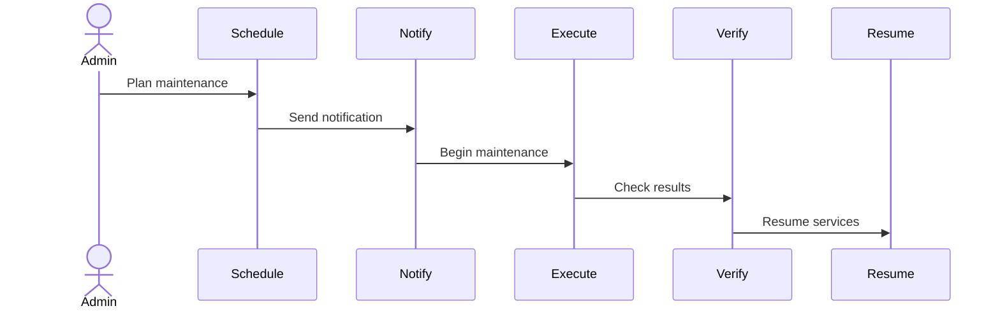

# Maintenance Guide — FAANG Enterprise Operations Runbook

> **Document:** `MaintenanceGuide.md` | **Version:** 5.0 (Enterprise Upgrade) | **Last Updated:** July 2026  
> **Status:** ✅ Active | **Owner:** Principal SRE Architect | **Review Cadence:** Quarterly  

## 1. Executive Summary
This document provides the standard operating procedures (SOPs) for maintaining the Ultimate Portfolio. It outlines daily, weekly, and monthly maintenance routines required to ensure 99.99% uptime, security compliance, and optimal performance across all services.

## 2. Routine Maintenance Schedule

### Daily
- **Log Review:** Check Datadog dashboards for unusual spikes in error rates or latency.
- **Security Scans:** Review automated Dependabot/Snyk alerts for high or critical vulnerabilities.

### Weekly
- **Dependency Updates:** Run `npm outdated` and update non-breaking minor/patch versions.
- **Database Vacuum:** Verify Supabase PostgreSQL autovacuum is performing optimally and check for index bloat.
- **Performance Profiling:** Review Vercel Analytics for Core Web Vitals regressions.

### Monthly
- **Disaster Recovery Drill:** Perform a dry-run restoration of the production database to a staging environment.
- **Access Audit:** Review and revoke stale IAM permissions or Admin dashboard access tokens.
- **Tech Debt Review:** Prioritize items from the [Backlog](../docs/product/Backlog.md) for the upcoming sprint.

## 3. Incident Response & Troubleshooting
Refer to the [Monitoring Architecture](../docs/operations/21-MONITORING.md) for detailed incident response protocols, alert tiers, and on-call escalation paths.

## 5. Maintenance Workflow Diagram

## 4. Environment Refresh
- Staging databases must be scrubbed of any PII (if applicable) and refreshed from production backups bi-weekly to ensure testing accuracy.

## Cross-References
- [MASTER-INDEX.md](../MASTER-INDEX.md) — Documentation master index
- [CROSS-REFERENCE-INDEX.md](../26-reference/CROSS-REFERENCE-INDEX.md) — Cross-reference system
