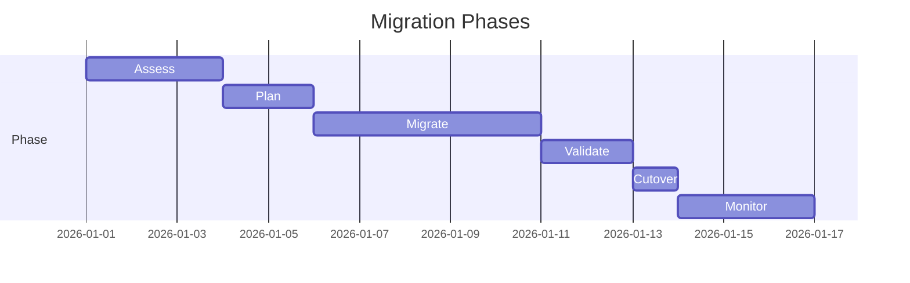

# Database Migration Strategy

## Migration Phases Diagram




This document outlines the lifecycle of database schema changes using Prisma within our CI/CD pipelines, ensuring zero-downtime and data integrity.

## Tooling
- **ORM & Migrations**: Prisma (`apps/api/prisma`)
- **Schema File**: `apps/api/prisma/schema.prisma`
- **Migration Scripts**: Generated SQL in `apps/api/prisma/migrations/`

## Development Workflow

1. **Schema Modification**: Developers edit the `schema.prisma` file in their local environment.
2. **Generate Migration**: Run `npx prisma migrate dev --name <descriptive_name>`.
   - This creates a new SQL migration file.
   - Applies the migration to the local development database.
   - Regenerates the Prisma Client at the custom output path (`apps/api/generated/prisma`).
3. **Commit**: The `schema.prisma` and the newly generated `migrations/` folder are committed to version control.

## Deployment Workflow (CI/CD)

The project utilizes Turborepo and automated deployment platforms (e.g., Vercel for Web, Render/Railway for API & AI). Migrations are applied automatically during the CI/CD build phase for the `api` app.

### Build Phase Execution
Before the NestJS API application starts in production, the pipeline executes:
```bash
npx prisma migrate deploy
```
- This command resolves the current state of the database and applies pending SQL files from the `migrations/` folder in order.
- It operates using the session connection pool URL (`DIRECT_URL`) to bypass transaction pooling issues during DDL operations.

## Zero-Downtime Migration Principles

To achieve zero-downtime deployments, schema changes must be backward compatible.

### Safe Operations
- Adding new tables or columns (nullable or with default values).
- Creating indexes.

### Unsafe Operations (Require Multi-Step Deployments)
- **Renaming Columns**:
  1. Add the new column.
  2. Deploy application code that writes to both old and new columns, and reads from the new.
  3. Backfill data via an administration script or Prisma seed script.
  4. Deploy application code that removes reliance on the old column.
  5. Drop the old column in a subsequent migration.
- **Making a Nullable Column Required**:
  1. Add a default value or backfill existing records.
  2. Alter the column to `NOT NULL`.

## Data Seeding
For fresh environments (e.g., new developers or temporary PR review environments), the database is seeded with baseline data.
- **Command**: `npx prisma db seed`
- **Script**: Located at `apps/api/prisma/seed.ts`.
- **Contents**: Creates default admin users, sample projects, and base taxonomy (skills, tags).

## Rollback Plan
Prisma does not natively support `migrate down`. In the event of a faulty production migration:
1. Revert the code commit containing the faulty `schema.prisma` and migration files.
2. Manually craft a reverse SQL migration or utilize Supabase PITR (Point-in-Time Recovery) if data corruption occurred.
3. Deploy the reverted state.

## Cross-References
- [MASTER-INDEX.md](../MASTER-INDEX.md) — Documentation master index
- [CROSS-REFERENCE-INDEX.md](../26-reference/CROSS-REFERENCE-INDEX.md) — Cross-reference system
